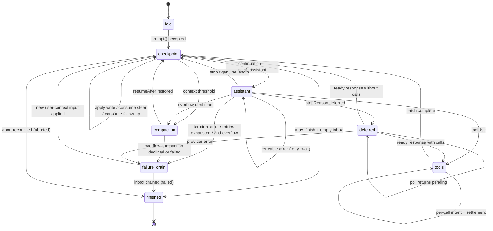

# AgentHarness — implementation specification

**Status:** supersedes `harness-v2.md` in full. Where the two disagree, this document wins. Appendix B lists the substantive changes and why.

**Audience:** an engineer who has never seen this system and has to build it from this document and the existing source tree. Part 0 explains what it is. Parts 1–5 specify it. Part 6 is the build order. Part 7 is what must be true when you are done. Types owned by this design are defined here; existing agent, provider, compaction, and telemetry types are named with their source paths in §0.7.

---

# Part 0 — Orientation

## 0.1 What this is

A durable runtime for agent conversations. You hand it a prompt; it talks to a language model, runs tools, and produces a response. The difference from an ordinary agent loop is that **the process can die at any instant** — mid-stream, between a tool call and its result, halfway through a summary — and a new process picks up exactly where the old one stopped, without repeating durable work and without losing anything that had committed.

It is a library, not a server. One process owns one session at a time.

## 0.2 Three concepts

### Session — the conversation

A session is one conversation, stored as a **tree** rather than a list.

```
a ── b ── c ── d
      └── e ── f
```

A tree, because three features need history that does not move: branching (explore an approach, back out, keep the record), compaction (replace a long prefix with a summary while the original stays queryable), and forking (copy a prefix into a new session). Nodes are appended and never modified or deleted.

A session also holds **facts** (session name, node labels, application key-value state — latest write wins, not part of the tree) and a **usage ledger** (every token and cost event, append-only).

### Lane — a cursor into the conversation

A lane is a **name plus a leaf**: the node that new work extends. Every session has `main`. Applications create more.

A lane owns its leaf, its configuration (model, thinking level, active tools), its queues, and at most one operation in flight. Lanes run in parallel and share nothing except the tree beneath them.

Why lanes exist: a Slack channel is one session, and each thread is a lane. Threads share the channel's history but take turns independently. Two lanes can sit on the same node and diverge on their next append — the tree handles that, and no coordination is needed.

**Lane vs fork:** a lane *shares* history; a fork *copies* it for isolation. Use a lane for a thread in a shared conversation, a fork for a subagent, an export, or a what-if.

### Harness — what runs a lane

The harness is the API surface. Per lane: `prompt`, `steer`, `followUp`, `nextRun`, `abort`, `resume`, `compact`, `navigateTree`, plus configuration getters and setters and a tree view. Harness-wide: lane management, tool and resource registries, hooks, events.

An **operation** is one accepted unit of work on a lane — a `run` (prompt to final answer, including all tool calls), a `compaction`, or a `navigation`. One per lane at a time.

## 0.3 Worked example — a Slack thread

A user posts in a channel that already has 400 nodes of history. The application creates a lane for the thread, anchored at the channel's current leaf.

```
harness.createLane("slack:1719432.0021", at: "n_400")
lane.prompt("what changed in auth last week?")
```

What happens, in order:

1. **Acceptance.** The harness validates, runs the `before_run` hook, and commits one transaction: the user message, the operation, and the operation's first state — *"I am at a checkpoint, and I need an assistant response."*
2. **Intent.** It commits a second transaction: *"I am about to make a provider request. The response will be node `n_401` and the usage record will be `u_1`."* Nothing has been sent yet.
3. **The request.** Streaming happens. This is the only part that is not durable.
4. **Settlement.** One transaction commits the response, its usage, and the next state: *"the response has tool calls; here is the batch plan, with result ids already assigned."*
5. Tool calls follow the same intent → effect → settlement shape, one pair of commits each.
6. When the model stops without tool calls, a final transaction records the terminal state and clears the lane's current operation.

Kill the process between any two of those transactions and restart. The harness reads the lane's state, sees exactly which of those sentences was the last one committed, and continues. If it died in step 3, it knows a request may have been billed and may or may not have produced output — that is the one genuinely uncertain window in the whole system, and there is a stated policy for it.

Meanwhile a second thread in the same channel is running its own lane, over the same 400 nodes of shared history, with no coordination between them.

## 0.4 Worked example — a crash mid-tool

```
lane.prompt("delete the stale migrations and run the test suite")
```

The model returns two tool calls. The harness commits the batch plan, then commits `call 0 is about to execute, with these exact arguments, and it declares itself unsafe to replay`. The tool starts deleting files. The process is killed.

On restart the harness reads one value and finds `calls[0].status = "effect_pending", replay = "never"`. It does not re-run the deletion. It appends a synthetic error result under the result id that was reserved before the effect started, marks the call complete, and continues to call 1. The conversation stays coherent — every tool call has a result — and nothing ran twice.

Had the tool declared `replay: "safe"` (a read, a query), the harness would have re-executed it with the persisted arguments instead.

## 0.5 The four ideas

Everything in Parts 1–5 follows from these.

**1. Write-once values and nodes, mutable slots.** Every durable value and node is created once and never modified. A **slot** is a namespaced key whose target is a value id, node id, or null. `lane.leaf/main` is a slot. Moving a lane updates that slot. Recovery reads three slots.

**2. Atomic transactions.** A transaction is a set of value/node creations plus slot updates, committed all-or-none with consecutive sequence numbers. There is no crash state inside a transaction. This is the only write primitive.

**3. The durable program counter.** After every step, the harness writes one value holding the *complete* current state of the operation, and points `op.state/{id}` at it. Recovery does not replay a journal or infer position from what is missing; it reads the state and switches on it. The state is *total* — it never depends on a previous state — but its fields are mostly **ids**, not copied payloads.

**4. The effect sandwich.** Provider requests and real tool calls are wrapped in two commits:

```
commit:  "about to do X; its output will use ids R and U"     ← intent
         do X                                                  ← the uncertain part
commit:  output + usage + next state                           ← settlement
```

Hooks follow their replay contract instead: a result becomes durable in the transaction that consumes it, and a crash before that transaction may rerun the hook. Thus every external effect can still happen without durable settlement. Provider/tool intents make that uncertainty explicit where replay policy depends on it; idempotent hooks accept it as a non-goal.

## 0.6 Non-goals

- **Exactly-once external effects.** See above. Hooks with their own side effects must be idempotent, keyed by operation id.
- **Provider stream resumption.** Partial streams are process-local, never persisted. A settled response is persisted *completely* before anything classifies it.
- **Multiple writers.** One process per session. The serving layer routes accordingly, and the SQLite backend enforces it with a fenced lease (§1.6). Lanes cover the workload that looks like multi-writer.
- **Replication.** A session lives in one place.

## 0.7 Notation

- `TX[ a, b, c ]` — one atomic commit containing writes `a`, `b`, `c` in that order.
- `v_*` value ids (internal), `n_*` node ids (public), `u_*` usage ids.
- `S(next)` — write the new operation-state value and update `op.state`. `L(next)` — the same for lane state.
- **must / must not** are normative. Everything else is explanation.

Source type provenance:

- `AgentMessage`, `AgentTool`, `AgentToolResult`, `AgentEventSink`, `QueueMode`, and `ThinkingLevel`: `packages/agent/src/types.ts`.
- `Skill`, `PromptTemplate`, `AgentHarnessResources` (`Resources` below), `AgentHarnessTool`, `AgentHarnessStreamOptions`, and `AgentHarnessStreamOptionsPatch`: `packages/agent/src/harness/types.ts`.
- `Model`, `Models`, `Usage`, `RetryPolicy`, `StopReason`, `AssistantMessage`, `ImageContent`, provider messages, stream options, and deferred handles: `packages/ai`.
- `CompactionSettings`, `CompactionPreparation`, `CompactResult`, `BranchPreparation`, and `BranchSummaryResult`: `packages/agent/src/harness/compaction/`. Existing preparation and split-turn algorithms remain the implementation starting point unless this document explicitly changes them.
- `TelemetryContext` and typed schema helpers: `packages/telemetry`; the agent-owned schemas remain in `packages/agent/src/harness/telemetry.ts`.
- `TSchema` for durable custom-message registration: `typebox`.

The public `QueueMode` remains `"all" | "one-at-a-time"`. Public `RetryPolicy` remains the pi-ai shape `{ enabled, maxRetries, baseDelayMs }`; operation state stores its normalized `{ maxAttempts, baseDelayMs }` equivalent. `maxRetries` and `baseDelayMs` must be finite non-negative safe integers and `maxRetries + 1` must remain safe; disabled retry normalizes to one attempt. Exponential delay and `notBefore` arithmetic saturate at `Number.MAX_SAFE_INTEGER`. Public `CompactionSettings` remains `{ enabled, reserveTokens, keepRecentTokens }`; both token counts must be finite non-negative safe integers. Constructors and setters reject invalid settings before publication. This design adds `deferred?: boolean | { window?: "15m" | "1h" | "24h" }` to `AgentHarnessStreamOptions` and its patch type; structural requests always force it to false.

```ts
type SettledAssistantMessage = AssistantMessage & {
  stopReason: Exclude<StopReason, "pending">;
};

/** Added to packages/ai: a synchronous registry lease that captures the exact
    provider/model and Models auth resolver without resolving auth yet. */
interface ModelRequestLease {
  readonly model: Model;
  stream(context: Context, options?: ModelsApiStreamOptions<Api>):
    AssistantMessageEventStream;
  streamSimple(context: Context, options?: ModelsSimpleStreamOptions):
    AssistantMessageEventStream;
  fetchDeferred(handle: DeferredHandle, options?: ModelsDeferredFetchOptions):
    Promise<AssistantMessage>;
  cancelDeferred(handle: DeferredHandle, options?: ModelsDeferredCancelOptions):
    Promise<void>;
}
// Models.lease(provider: string, modelId: string): ModelRequestLease | undefined
```

There are no orchestration "records" in this system. Every durable thing is a **value**, a **node**, or a **slot**.

---

# Part 1 — Storage substrate

Storage knows nothing about agents, lanes, or conversations. It stores values and nodes, updates slots, and answers a small fixed set of queries. Parts 2–4 are built entirely on this.

## 1.1 The model

```ts
type JsonValue = null | boolean | number | string | JsonValue[] | { [k: string]: JsonValue };

/** Write-once. Created in exactly one transaction, never modified or deleted. */
type StoredValue<K extends ValueKind = ValueKind> = {
  [P in K]: {
    id: string;              // globally unique within the session
    kind: P;
    seq: number;             // storage-assigned at commit
    payload: ValuePayloads[P];
  }
}[K];

/** An unmaterialized conversation-tree node. Write-once, like every value. */
interface StoredNode {
  id: string;                // the public "node id"
  parentId: string | null;
  seq: number;               // storage-assigned at commit
  type: NodeType;
  customType?: string;       // when type === "custom"
  valueId: string | null;    // the content; null for a custom node with no data
  timestamp: number;         // Unix ms, storage-assigned
}

type NodeType = "message" | "compaction" | "branch_summary" | "custom";

/** The only mutable thing. A namespaced key whose target can change. */
interface Slot<N extends SlotNamespace = SlotNamespace> {
  namespace: N;
  key: string;
  targetId: string | null;   // null = explicitly unbound (a tombstone)
  seq: number;
}
```

**Why nodes and values are separate.** Content and placement have different birth times. A queued message has content at enqueue and placement much later. An assistant response needs its id fixed *before* the content exists. Splitting them lets both be write-once: a value is created when its content exists; a node is created when placement happens; neither is ever updated. Reserving an id costs nothing, because a reserved id is just a string in a state value — there is no placeholder row.

## 1.2 Value kinds

```ts
interface ValuePayloads {
  message:         { message: AgentMessage; terminate?: true };
  compaction:      CompactionPayload;
  branch_summary:  BranchSummaryPayload;
  custom_data:     JsonValue;
  lane_config:     LaneConfiguration;
  lane_state:      LaneState;
  operation:       Operation;
  operation_state: OperationState;
  usage:           UsageValue;
  tool_args:       Record<string, JsonValue>;
  structural_preparation: DurableStructuralPreparation;
  queue_disposition: { nodeId: string; disposition: "cancelled" | "cleared_by_abort" };
  fact_value:      { value: JsonValue };
}
type ValueKind = keyof ValuePayloads;

interface CompactionPayload {
  summary: string; retainedTail: AgentMessage[]; tokensBefore: number;
  details?: JsonValue; usage?: Usage; fromHook: boolean;
}
interface BranchSummaryPayload {
  fromId: string; summary: string;
  details?: JsonValue; usage?: Usage; fromHook: boolean;
}
interface DurableFileOperations {
  read: string[]; written: string[]; edited: string[];
}
type DurableStructuralPreparation =
  | { kind: "compaction"; messagesToSummarize: AgentMessage[];
      turnPrefixMessages: AgentMessage[]; retainedTail: AgentMessage[];
      isSplitTurn: boolean; tokensBefore: number; previousSummary?: string;
      fileOps: DurableFileOperations; settings: CompactionSettings }
  | { kind: "branch_summary"; messages: AgentMessage[];
      fileOps: DurableFileOperations; totalTokens: number };

interface UsageValue {
  usage: Usage;
  nodeId?: string;            // the node this cost belongs to, when there is one
  adjustment: boolean;        // true = caller-supplied reconciliation, not a provider report
  details?: JsonValue;
}
```

## 1.3 Transactions

```ts
type Write =
  | { kind: "value"; id: string; valueKind: ValueKind; payload: JsonValue }
  | { kind: "node"; id: string; parentId: string | null; type: NodeType;
      customType?: string; valueId: string | null }
  | { kind: "slot"; namespace: SlotNamespace; key: string; targetId: string | null };

interface Transaction { writes: Write[] }

interface CommitResult { firstSeq: number; seqs: number[]; timestamp: number }
```

Rules:

1. A transaction commits **all-or-none**. There is no observable state in which some of its writes exist and others do not.
2. Writes receive **consecutive** `seq` values in the order given. `seq` is monotonic session-wide across all lanes and all write kinds.
3. Within a transaction, writes apply in order: a node may reference a value created earlier in the same transaction; a slot may target a value or node created earlier in the same transaction.
4. Value and node ids share one session-wide namespace. Writing either kind under any existing value/node id is **corruption**, not an update.
5. A slot write with the same `(namespace, key)` replaces the current target. History is retained for `getLog`, but only the latest slot value is live.
6. Transactions on one session are **serialized**. There is one writer and one queue.

Session validates the complete transaction, including JSON serialization and runtime schemas, before storage admission. A failed admitted commit **faults the harness**: all effects stop, all calls reject, and the process must be restarted. A partially applied transaction is not tolerated.

## 1.4 Queries

One `Storage` instance serves one session. Repository discovery and lifecycle are outside this interface (§2.8).

```ts
interface Storage {
  commit(tx: Transaction): Promise<CommitResult>;

  getValues(ids: string[]): Promise<ReadonlyMap<string, StoredValue>>;
  /** Stored node joined to its value. */
  getNodes(ids: string[]): Promise<ReadonlyMap<string, Node>>;

  getSlot<N extends SlotNamespace>(namespace: N, key: string): Promise<Slot<N> | undefined>;
  listSlots<N extends SlotNamespace>(namespace: N): Promise<Slot<N>[]>;

  scanBranch(q: BranchScan): Promise<Node[]>;
  scanBranchStructure(q: BranchScan): Promise<StoredNode[]>;
  scanNodes(q: NodeScan): Promise<Node[]>;       // session-wide tree inventory
  getStats(): Promise<SessionStats>;                 // maintained projection

  /** Debug/audit history. Hot-path recovery never calls this. */
  getLog(fromSeq?: number, limit?: number): Promise<LogItem[]>;
  close(): Promise<void>;
}

interface NodeScan {
  type?: NodeType; customType?: string;
  fromSeq?: number; toSeq?: number;
  order?: "asc" | "desc"; limit?: number;
}

type LogItem =
  | { kind: "value"; seq: number; value: StoredValue }
  | { kind: "node";  seq: number; node: StoredNode }
  | { kind: "slot";  seq: number; slot: Slot };
```

There is deliberately no value scan and no denormalized lane/operation ownership on values. Restore, facts, forks, and execution follow exact ids; node inventory uses `scanNodes`; stats use their projection; debugging uses `getLog`.

Recovery and execution reads must be index-driven and bounded. They may not fold history or infer state from an absent value. Exact dereference is allowed: one current state may name a bounded set of immutable payload values, fetched in one batch without order-dependent reduction. Public inventory and debugging APIs may intentionally read more than a hot path; their `limit`/pagination behavior is explicit at the `SessionTree` layer.

`close()` is idempotent. It seals admission, rejects later reads/commits on that instance, drains commits admitted before the seal, then releases resources and the writer claim. Durable data is reopened through the repository.

## 1.5 Slot namespaces

```ts
type SlotNamespace =
  | "lane.leaf" | "lane.config" | "lane.state"
  | "op.state" | "queue.disposition"
  | "fact.name" | "fact.label" | "fact.custom";
```

| Namespace | Key | Target | Meaning |
|---|---|---|---|
| `lane.leaf` | lane name | node id or null | where this lane appends next |
| `lane.config` | lane name | value id | total `LaneConfiguration` |
| `lane.state` | lane name | value id | total `LaneState` (§3.3) |
| `op.state` | operation id | value id | total `OperationState` (§3.2) — **the program counter** |
| `queue.disposition` | queued node id | value id | terminal cancellation/abort disposition; never used by restore |
| `fact.name` | `""` | value id or null | session name |
| `fact.label` | node id | value id or null | node label |
| `fact.custom` | application key | value id or null | application state |

That is the complete set. A slot bound to `null` is a **tombstone**: explicitly absent, which differs from never bound. Deleting a label sets a tombstone. `queue.disposition` is written only when a pending item is cancelled or cleared by abort; it is an exact public-API lookup, not current orchestration state.

## 1.6 Backends

Three encodings of one model. All three pass the same conformance suite (§7.3).

### Memory

```ts
values:  Map<string, StoredValue>
nodes:    Map<string, StoredNode>
slots:   Map<string, Slot>          // key: `${namespace}\u0000${key}`
children: Map<string, string[]>     // parentId → node ids, for tree walks
log:      LogItem[]
```

One queue serializes commits. A commit validates and applies writes to temporary transactional state, then publishes the maps and log together. Reads are map lookups; `scanBranch` walks `parentId` and joins in RAM. `getLog` returns a slice of `log`.

### JSONL

One physical line per `commit()`. Storage assigns sequence/timestamp fields first, then encodes one committed log item as a JSON object line or several as one **array line**.

```jsonl
{"v":4,"kind":"header","id":"s_1","createdAt":1700000000000,"cwd":"..."}
[{"kind":"value","seq":1,"id":"v_7","valueKind":"message","payload":{"message":{"role":"user","content":[...]}}},
 {"kind":"value","seq":2,"id":"op_1","valueKind":"operation","payload":{...}},
 {"kind":"node","seq":3,"timestamp":1700000000000,"id":"n_1","parentId":null,"type":"message","valueId":"v_7"},
 {"kind":"value","seq":4,"id":"v_9","valueKind":"operation_state","payload":{...}},
 {"kind":"slot","seq":5,"namespace":"lane.leaf","key":"main","targetId":"n_1"},
 {"kind":"slot","seq":6,"namespace":"op.state","key":"op_1","targetId":"v_9"}]
```

- This is format 4. The incompatible format-4 code currently in the source tree is unfinished and is replaced in place; no migration for it is required. Coding-agent format 3 remains supported (Appendix C).
- Open verifies persisted sequence continuity and timestamps while replaying into the Memory projections above. It never regenerates committed timestamps. All queries then run in RAM.
- **A torn final line is discarded whole**, including every element of an array, and is truncated before new writes are admitted. This is what makes "no crash prefix inside a transaction" true here.
- A malformed *interior* line, or a complete-but-invalid transaction, is corruption.
- Durability is process-crash level: a resolved `commit()` survives process death. No fsync promise.
- `getLog` reproduces the file's logical order, expanding arrays.
- Optional: retain `(offset, length)` per value and load payloads lazily, keeping only node/slot structure resident. Do this only if profiling demands it.

### SQLite

```sql
-- `values` is a SQLite keyword; the physical table is `stored_values`.
stored_values(session_id, id TEXT, kind TEXT, seq INTEGER, payload TEXT,
              PRIMARY KEY (session_id, id)) WITHOUT ROWID;
CREATE INDEX ix_value_seq ON stored_values(session_id, seq);

nodes(session_id, id TEXT, parent_id TEXT, seq INTEGER, type TEXT, custom_type TEXT,
      value_id TEXT, timestamp INTEGER, PRIMARY KEY (session_id, id)) WITHOUT ROWID;
CREATE INDEX ix_node_parent ON nodes(session_id, parent_id);
CREATE INDEX ix_node_seq ON nodes(session_id, seq, type);

slots(session_id, namespace TEXT, key TEXT, target_id TEXT, seq INTEGER,
     PRIMARY KEY (session_id, namespace, key));
slot_history(session_id, seq INTEGER, namespace, key, target_id,
            PRIMARY KEY (session_id, seq));

-- Private branch index (§2.6). Not slots; no equivalent in the other backends.
branch_nodes(session_id, branch_id TEXT, node_id TEXT, node_seq INTEGER, node_type TEXT,
             PRIMARY KEY (session_id, branch_id, node_id)) WITHOUT ROWID;
-- Ordered scans. node_seq must follow branch_id directly or ORDER BY needs a
-- temp b-tree; node_id and node_type trail so the index covers id-only reads.
CREATE INDEX ix_bn_seq  ON branch_nodes(session_id, branch_id, node_seq, node_id, node_type);
-- Type-filtered scans.
CREATE INDEX ix_bn_type ON branch_nodes(session_id, branch_id, node_type, node_seq, node_id);
CREATE INDEX ix_bn_node ON branch_nodes(session_id, node_id);
branch_meta(session_id, branch_id TEXT, tip_node_id TEXT, tip_seq INTEGER,
            base_branch_id TEXT, base_seq INTEGER,
            PRIMARY KEY (session_id, branch_id));
CREATE UNIQUE INDEX ix_bm_tip ON branch_meta(session_id, tip_node_id);

sessions(session_id, created_at, parent_session_id, metadata);
session_stats(session_id, message_count, usage_payload);
session_sequences(session_id, next_seq);
writer_leases(session_id, owner_id TEXT, fence INTEGER, expires_at_ms INTEGER);
```

One `commit()` is one SQL transaction: insert values, insert nodes, upsert slots plus append `slot_history`, maintain the branch index, bump `session_stats`. Never an UPDATE to a value or node row.

**Every transaction must open with `BEGIN IMMEDIATE`.** A deferred `BEGIN` that
reads before it writes takes a read snapshot and must later upgrade to the write
lock; if another writer committed in between, SQLite fails that upgrade — and
`busy_timeout` does **not** rescue it, because no amount of waiting can refresh a
stale snapshot. The only recovery is rollback and full retry.

Every commit has this shape, not just a few. Allocating the sequence range reads
`session_sequences.next_seq` and then writes it, so a read precedes a write in every
transaction the system performs. Branch creation (§2.6) adds a second instance,
reading the newest compaction before inserting. `BEGIN IMMEDIATE` takes the write
lock up front and avoids an unrecoverable stale-snapshot upgrade, so there is no case
where a deferred `BEGIN` is the right choice here.

**`writer_leases` enforces the single-writer rule.** Expiring fenced ownership:
`open()` acquires the claim, storage renews it on appends and while idle, and close
stops renewal after the queue drains and deletes only its matching `(owner_id,
fence)` pair — so a stale owner cannot release the replacement that succeeded it.
This is what makes "one process owns one session" an enforced property rather than
a convention the serving layer is trusted to uphold. Memory and JSONL have no
equivalent and rely on process ownership; a JSONL session opened twice is corrupt
and undetected.

**Writer scope is per database file, not per session.** WAL mode permits exactly one
writer per file. Because these tables are keyed by `session_id`, several sessions may
share a file, and the design's one-writer-per-session rule does not by itself make
writes uncontended. Choose deliberately:

- *One file per session* — the single-writer claim becomes literally true, and there
  is no cross-session contention. Preferred unless something forces otherwise.
- *One file for many sessions* — correct, but all sessions share SQLite's one-writer queue. Use only when that contention is acceptable.

Atomicity itself needs no special handling. A multi-write transaction is all-or-none
by the file format: WAL frames become visible only when the commit record lands, so a
concurrent reader observes either none of a transaction's writes or all of them.

Each physical segment of `scanBranch` uses one JOIN; §2.6 combines segment ranges:

```sql
SELECT n.id, n.parent_id, n.seq, n.type, n.custom_type, n.value_id, n.timestamp, v.kind AS value_kind, v.payload
FROM branch_nodes b
CROSS JOIN nodes n ON n.session_id = b.session_id AND n.id = b.node_id
LEFT JOIN stored_values v ON v.session_id = n.session_id AND v.id = n.value_id
WHERE b.session_id = ? AND b.branch_id = ? AND b.node_seq > ? AND b.node_seq <= ?
ORDER BY b.node_seq;
```

`CROSS JOIN` is load-bearing: it forces `branch_nodes` to be the outer loop. Left
to itself the planner may drive from `nodes`, scan the table, and sort through a
temporary b-tree. Assert the plan in a test:

```
SEARCH b USING COVERING INDEX ix_bn_seq (session_id=? AND branch_id=? AND node_seq>?)
SEARCH n USING PRIMARY KEY (session_id=? AND id=?)
SEARCH v USING PRIMARY KEY (session_id=? AND id=?) LEFT-JOIN
```

Any plan containing `USE TEMP B-TREE FOR ORDER BY` or a scan of `nodes` is a
regression.

`scanBranchStructure` is the same without the `stored_values` join. `getNodes` is the same JOIN keyed by `n.id IN (...)`. `getLog` is a three-way `UNION ALL` over `stored_values`, `nodes`, and `slot_history`, ordered by `seq` — which is the whole reason `slot_history` exists.

The repository's existing `SessionSearch` surface remains. SQLite replaces its rowid-dependent node index with an FTS projection keyed by stored `session_id` and `node_id`; searchable text is the JSON serialization of the materialized node, matching the scanning fallback. The transaction that places a node also inserts its projection after validating the node/value pair. Queued values are not searchable before placement. Fork import populates the same projection, and session deletion removes its rows. Search never depends on `nodes.rowid`.

## 1.7 Why write-once is worth the discipline

- **Recovery is a read.** Three slots, then point lookups. No reducer exists to have a bug.
- **Crash states are enumerable.** Between transactions, never inside one.
- **No repair-by-rewrite.** Recovery only ever *appends*, so recovery is itself crash-safe: interrupt it and rerun it and you get the same result.
- **Concurrency is trivial.** Readers never see partial state; there is nothing to lock.
- **Content is stored once.** A queued message is serialized at enqueue and referenced thereafter.

---

# Part 2 — The conversation tree

## 2.1 Nodes

A **node** is what the application sees: a stored node joined to its value.

```ts
interface NodeBase { id: string; seq: number; parentId: string | null; timestamp: number }

interface MessageNode       extends NodeBase { type: "message"; message: AgentMessage;
                                                 terminate?: true }
interface CompactionNode    extends NodeBase { type: "compaction"; summary: string;
                                                 retainedTail: AgentMessage[]; tokensBefore: number;
                                                 details?: JsonValue; usage?: Usage; fromHook: boolean }
interface BranchSummaryNode extends NodeBase { type: "branch_summary"; fromId: string;
                                                 summary: string; details?: JsonValue;
                                                 usage?: Usage; fromHook: boolean }
interface CustomNode        extends NodeBase { type: "custom"; customType: string; data?: JsonValue }

type Node = MessageNode | CompactionNode | BranchSummaryNode | CustomNode;
```

Materialization is mechanical, and happens inside storage:

```ts
function toNode(node: StoredNode, value: StoredValue | undefined): Node {
  const base = { id: node.id, seq: node.seq, parentId: node.parentId,
                 timestamp: node.timestamp };
  switch (node.type) {
    case "message":        return { ...base, type: "message", ...value!.payload };
    case "compaction":     return { ...base, type: "compaction", ...value!.payload };
    case "branch_summary": return { ...base, type: "branch_summary", ...value!.payload };
    case "custom":         return { ...base, type: "custom", customType: node.customType!,
                                    data: value?.payload };
  }
}
```

Rules:

- `type` and `customType` live on the **stored node**, not the value, because they are structural filters used by branch queries and denormalized into the branch index.
- Node/value compatibility is exact: `message → message`, `compaction → compaction`, `branch_summary → branch_summary`, and `custom → custom_data | null`. Every other pairing is corruption.
- Assistant nodes always contain a `SettledAssistantMessage`. Reject `pending` before writing.
- Tool-result nodes carry `terminate?: true` on the message value. It is orchestration state that `ToolResultMessage` has no field for.
- Every compaction and branch summary carries `fromHook`: `true` for hook output, `false` for generated.
- Every compaction stores a complete `retainedTail` (`[]` when empty). **Context never reads past a compaction.** This is what makes a compaction a self-contained checkpoint rather than a pointer into history.
- Values are never shared between nodes by the harness. Content-hash dedup is possible under this model and explicitly not built (Appendix D).

## 2.2 Placement

The tree's central rule:

> A **value** is created when its content exists. A **stored node** is created when placement happens. They may land in the same transaction or in two, and neither is ever modified.

Three cases, all mechanical:

**Born placed** — assistant responses, tool results, direct appends to an idle lane. One transaction:

```
TX[ put v_8 = <message>,
    put node n_a4 = { parent: n_q1, type: "message", value: v_8 },
    setSlot lane.leaf/main → n_a4 ]
```

**Content first, placement later** — queued input (`steer`, `followUp`, `nextRun`) and deferred writes. Two transactions, possibly far apart:

```
t0  TX[ put v_7 = <200KB message>,
        S(next){ ...inbox.steer += { nodeId: "n_q1", valueId: "v_7" } } ]

t1  TX[ put node n_q1 = { parent: n_a3, type: "message", value: v_7 },
        setSlot lane.leaf/main → n_q1,
        S(next){ ...inbox.steer -= that item } ]
```

The content is serialized **once**. The node references it.

**Id reserved before content exists** — assistant responses and tool results. The id is a string in a state value; no row exists until settlement. Reserving costs nothing.

Consequences to rely on:

- A pending write is **invisible to tree queries** (no node) but **visible in snapshots** (the operation state names it, and its content can be dereferenced).
- "Has this been placed yet?" is answered by the operation state, which lists it as pending — never by the absence of a node.
- A node whose `valueId` names a nonexistent value is corruption.

## 2.3 Lanes

A configured lane is three slots and nothing else. Fresh or normalized-v3 `main` may temporarily lack `lane.config` until first harness attachment:

```
lane.leaf/{name}    → node id or null
lane.config/{name}  → value id (LaneConfiguration)   // absent only for unconfigured main
lane.state/{name}   → value id (LaneState)
```

```ts
interface LaneConfiguration {
  model: { provider: string; modelId: string };
  thinkingLevel: ThinkingLevel;
  activeToolNames: string[];
}
```

- A lane's leaf moves in exactly two ways: the lane appends a node (leaf becomes that node), or the lane navigates (leaf jumps to an existing node).
- `LaneConfiguration` is **total**. A setter writes a whole new value and updates the slot; it is never a patch and never a tree node.
- Creating a lane copies no tree content, no history, and no configuration from its anchor:

```
TX[ put v_cfg = <seed configuration>,
    put v_ls  = { currentOperationId: null, pendingNextRun: [] },
    setSlot lane.config/{name} → v_cfg,
    setSlot lane.leaf/{name}   → anchorNodeId,
    setSlot lane.state/{name}  → v_ls ]
```

- Lanes are never deleted or renamed. Names are permanent application keys.
- `main` exists in every session.
- Two lanes at the same leaf simply diverge on their next append.

## 2.4 Facts

Session-scoped, latest-wins, not part of the tree.

```
fact.name/""         → value id | null
fact.label/{nodeId}  → value id | null
fact.custom/{key}    → value id | null
```

Setting a value to `undefined` binds `null` (a tombstone). JSON `null` is a legitimate custom value, stored as `{ value: null }`. The built-in and custom namespaces never overlap. Fact writes commit immediately and never move a leaf.

## 2.5 Branch queries and context

```ts
interface BranchScan {
  start?: string;               // default: the view's lane leaf
  stopAtType?: NodeType;       // scan ends after the first match, inclusive
  stopAtId?: string;
  type?: NodeType;
  customType?: string;
  order?: "newestFirst" | "oldestFirst";   // default newestFirst
  limit?: number;
  cursor?: NodeCursor;
}
type NodeCursor = { seq: number };
```

Semantics: take the path from `start` toward the root, order it (default `newestFirst`), stop **inclusively** at the first `stopAt` match, filter by `type`/`customType`, apply the exclusive cursor, then apply `limit`. For `newestFirst`, a cursor retains `seq < cursor.seq`; for `oldestFirst`, it retains `seq > cursor.seq`. A `stopAt` node is returned only if it also passes the filter.

**Context projection** — how a provider request is built:

1. `scanBranch({ start: leaf, order: "newestFirst", stopAtType: "compaction" })`.
2. Reverse to oldest-first. If a compaction terminated the scan, the context is: its `summary`, then its `retainedTail`, then every node after it. **Nothing earlier is read.**
3. Drop assistant responses whose stop reason is `error`, `aborted`, or `deferred`. Retain genuine output-limit `length`.
4. Run custom nodes through `nodeProjectors`. An unprojected custom node never enters context.
5. Run `transform_context`, then `toProviderMessages`.

There is no rule for omitting an overflow response, and no link anywhere pointing at one. An overflow response is committed with stop reason `error` (§3.7) and is therefore dropped by rule 3 like any other error, and by any downstream `transformMessages` that filters the same way.

**Append-only context invariant.** Across the requests of one lane, provider context must only grow at the tail. An insertion before the previous request's tail invalidates the provider's KV cache and multiplies cost. This is *why* mid-run writes defer to checkpoints, where they append at the tail. Compaction is the one deliberate cache invalidation, and it trades that for a smaller context.

## 2.6 The branch index — SQLite only

Memory and JSONL walk parent pointers in RAM. SQLite maintains a private segmented branch cache so a diverging append does not copy an unbounded root prefix.

`branch_nodes` stores the nodes physically present in one segment. `branch_meta` stores its tip and optional `{ baseBranchId, baseSeq }`. A segment logically contains its own rows above `baseSeq` plus the referenced base prefix through `baseSeq`.

Append:

1. If a branch tip equals the lane leaf, append one row and move that tip.
2. Otherwise resolve a branch that actually covers the leaf, find the newest compaction at or below the leaf through the complete segment chain, copy only rows after that compaction through the leaf, and set the older prefix as the new segment's base.
3. Append the new node and make it the new segment tip.

Read newest segment first. If the requested range crosses `baseSeq`, continue through the base chain with the upper bound capped at that boundary. Merge segment results into the requested order before filtering/limiting.

Two correctness rules are mandatory:

- The base branch must itself cover the leaf within its logical range; merely containing the leaf in an ancestor is insufficient.
- The newest compaction search must traverse the base chain; checking only the newest physical segment can miss it.

The cache must preserve:

- following a segment chain yields the exact root path with no gaps or duplicates;
- all chains containing a node agree below it;
- runtime reads never fall back to a table scan or parent walk;
- stale branches remain valid cache history;
- only an explicit repair operation rebuilds the cache from nodes.

Tests assert these invariants and the required query plans. No wall-clock threshold is normative.

## 2.7 Forks

A fork is a repository operation over one coherent source-session snapshot. It copies selected nodes and values, latest facts, lane pointers, and total configuration; it never copies open operation state or usage ledger values.

```ts
type ForkOptions =
  | { scope?: "branch"; nodeId?: string; position?: "before" | "at" }
  | { scope: "tree" };
```

- Memory and JSONL obtain the snapshot as one job on the source storage queue. SQLite uses one read transaction.
- Branch scope copies one path and creates only destination `main`. Tree scope copies the whole tree and every lane pointer/configuration.
- The destination is idle and its token/cost ledger starts at zero. Node-local display usage remains on copied nodes.
- Facts follow the selected scope: name/custom facts always copy; labels copy only when their target copies unless tree scope copies all targets.
- Any message may be the fork point. Request construction heals orphaned tool calls.
- The destination metadata records `parentSessionId`.

A source with only fresh/unconfigured `main`—new format 4 or read-only normalized v3—may have no configuration. Either fork scope then creates one unconfigured destination `main`, which first harness attachment seeds normally. Every configured format-4 lane copied by a fork keeps its current total configuration.

## 2.8 Session and repository boundary

`Storage` is deliberately one-session only. `Session` supplies typed validation, lane-bound views, and value/node/slot materialization. `SessionRepo` owns discovery and storage-instance lifecycle:

```ts
interface SessionMetadata {
  id: string;
  createdAt: number;
  parentSessionId?: string;
  /** Only when a v3 parent path cannot be resolved to an available header id. */
  legacyParentSessionPath?: string;
}

interface SessionCodecOptions {
  /** Built-in provider-message roles are registered by default. */
  customMessageSchemas?: Record<string, TSchema>;  // keyed by custom `role`
}

interface SessionSearchOptions { text: string; cwd?: string }
interface SessionSearchHit<M extends SessionMetadata = SessionMetadata> {
  metadata: M; nodeId: string; timestamp: string; snippet?: string; score?: number;
}
interface SessionSearch<M extends SessionMetadata = SessionMetadata> {
  search(options: SessionSearchOptions): Promise<SessionSearchHit<M>[]>;
}

interface SessionRepo<M extends SessionMetadata = SessionMetadata,
                      C extends { id?: string; parentSessionId?: string } =
                        { id?: string; parentSessionId?: string },
                      L = void> {
  create(options: C): Promise<Session<M>>;
  open(metadata: M): Promise<Session<M>>;
  list(options?: L): Promise<M[]>;
  delete(metadata: M): Promise<void>;
  fork(source: M, options: ForkOptions & C): Promise<Session<M>>;
}

interface Session<M extends SessionMetadata = SessionMetadata> extends SessionTree {
  readonly metadata: M;
  readonly idGenerator: { next(): string };
  view(lane: string): SessionTree;

  /** Package-internal harness substrate; validates before delegating to Storage. */
  commit(tx: Transaction): Promise<CommitResult>;
  getValues(ids: string[]): Promise<ReadonlyMap<string, StoredValue>>;
  getNodes(ids: string[]): Promise<ReadonlyMap<string, Node>>;
  getSlot<N extends SlotNamespace>(namespace: N, key: string): Promise<Slot<N> | undefined>;
  listSlots<N extends SlotNamespace>(namespace: N): Promise<Slot<N>[]>;
  getLog(fromSeq?: number, limit?: number): Promise<LogItem[]>;

  close(): Promise<void>;
}
```

Repository constructors accept `SessionCodecOptions`. Every declaration-merged custom `AgentMessage` must have a string `role` and a registered runtime schema; unknown custom roles are rejected before persistence and on decode. A new repository session creates `main` with null leaf and an empty `LaneState`, but no configuration; first harness attachment writes its seed configuration. Repository implementations resolve `fork(source, ...)` to the source's serialized snapshot boundary: an active Memory/JSONL storage queues the snapshot with commits; an inactive JSONL file is read as one immutable prefix; SQLite uses one read transaction. Repositories may keep an active-storage registry by session id for this purpose. This is repository coordination, not part of the one-session `Storage` contract.

# Part 3 — The operation state machine

## 3.1 Operations

```ts
interface Operation {
  operationId: string;
  lane: string;
  sourceLeafId: string | null;
  startedAt: number;
  intent:
    | { kind: "run"; promptValueIds: string[];
        systemPromptOverride?: string; resumeData?: Record<string, JsonValue> }
    | { kind: "compaction"; customInstructions?: string }
    | { kind: "navigation"; targetId: string | null; summarize: boolean;
        label?: string; customInstructions?: string };
}
```

The operation value's stored id is exactly `operationId`. It is written once at acceptance.

## 3.2 Operation state — the program counter

`op.state/{operationId}` points at one total `operation_state` value:

```ts
type OperationState = RunState | CompactionState | NavigationState | FinishedState;

type Control =
  | { status: "running" }
  | { status: "cancel_requested"; requestedAt: number;
      drainedSteer: QueuedInput[]; drainedFollowUp: QueuedInput[] };

interface RunState {
  kind: "run";
  control: Control;
  /** Captured atomically at acceptance; setters affect later operations. */
  settings: {
    compaction: CompactionSettings;
    steeringMode: QueueMode;
    followUpMode: QueueMode;
    toolExecution: "sequential" | "parallel";
  };
  phase: RunPhase;
  inbox: Inbox;
  /** Newest durable assistant generation/fetch response in this operation. */
  latestAssistantNodeId: string | null;
}

interface CheckpointPhase {
  kind: "checkpoint";
  continuation: Continuation;
  /** Durable correlation source for the next generation step. */
  triggerNodeId: string;
  /** Threshold compaction is attempted at most once per trigger boundary. */
  thresholdCheckedTriggerNodeId?: string;
  /** Generate before draining another queued input after one-at-a-time drain. */
  skipInboxOnce?: boolean;
}

type RunPhase =
  | CheckpointPhase
  | { kind: "assistant"; generation: Generation }
  | { kind: "tools"; batch: ToolBatch }
  | { kind: "compaction"; reason: "threshold" | "overflow";
      structural: StructuralDecision; resumeAfter: CheckpointPhase }
  | { kind: "deferred"; deferred: Deferred }
  | { kind: "failure_drain"; error: OperationError; provenance:
      | { kind: "response"; nodeId: string }
      | { kind: "structural"; taskId: string } };

type Continuation =
  | { kind: "need_assistant"; overflowRecoveryUsed: boolean }
  | { kind: "may_finish"; includeFinalAssistant: boolean };

interface Inbox {
  steer: QueuedInput[];
  followUp: QueuedInput[];
  writes: PendingWrite[];
}

interface QueuedInput { nodeId: string; valueId: string }
interface PendingWrite { nodeId: string; valueId: string | null;
                         type: NodeType; customType?: string }
interface OperationError { code: string; message: string; details?: JsonValue }
```

`latestAssistantNodeId` updates in the same settlement transaction as every assistant generation or deferred-fetch response. It lets finish and resume construct results/events without a branch scan. A tool batch retains its producing turn id while tool work remains active.

Any transition that appends conversational input or tool results and requires another assistant writes a checkpoint with `need_assistant(false)` and the appended node as `triggerNodeId`. An unprojected custom write preserves the current checkpoint, including trigger and overflow flag. Entering threshold compaction first copies the checkpoint to `resumeAfter` with `thresholdCheckedTriggerNodeId = triggerNodeId`; decline, empty preparation, success, and crash therefore cannot recheck the same boundary.

### Generation

```ts
interface NormalizedRetryPolicy { maxAttempts: number; baseDelayMs: number }

interface GenerationContext {
  stepId: string;
  triggerNodeId: string;
  configurationValueId: string;
  streamOptions: AgentHarnessStreamOptions;
  retryPolicy: NormalizedRetryPolicy;
}

type Generation =
  | { status: "ready"; context: GenerationContext; nextAttempt: number }
  | { status: "effect_pending"; context: GenerationContext; attempt: number;
      responseNodeId: string; responseValueId: string; usageValueId: string;
      intendedOutputLimit: number; contextWindow: number }
  | { status: "retry_wait"; context: GenerationContext; nextAttempt: number;
      notBefore: number; errorMessage: string };
```

For each attempt, `before_request` runs from generation `ready` (an elapsed retry wait first returns to `ready`). Its curated patch is composed with the context's captured base stream options, then `intendedOutputLimit` and `contextWindow` are calculated and persisted in the `effect_pending` intent before dispatch. A pre-intent crash may rerun the hook. Harness-owned `before_payload`/`after_response` callbacks are mounted only after intent and cannot be replaced through stream options.

### Tool batch

```ts
interface ToolBatch {
  assistantNodeId: string;
  /** Producing generation/fetch snapshot; active tool names come from here. */
  configurationValueId: string;
  /** The assistant generation step id; recovered tool events use it as turnId. */
  turnId: string;
  calls: ToolCall[];
}

type ToolCall =
  | { status: "planned"; sourceIndex: number; resultNodeId: string }
  | { status: "effect_pending"; sourceIndex: number; resultNodeId: string;
      /** Always the effective post-prepare/post-hook arguments. */
      argsValueId: string; replay: "never" | "safe" }
  | { status: "completed"; sourceIndex: number; resultNodeId: string;
      terminate: boolean };
```

The source call comes from `assistantNodeId` plus `sourceIndex`; large effective arguments live once in `tool_args`. Persist them unconditionally because `prepareArguments`, not only `before_tool`, may change them. Parallel calls may be effect-pending together; result nodes commit in source order.

### Deferred

```ts
type Deferred =
  | { status: "suspended"; stepId: string; sourceNodeId: string; poll: number;
      configurationValueId: string; streamOptions: AgentHarnessStreamOptions }
  | { status: "effect_pending"; stepId: string; sourceNodeId: string; poll: number;
      responseNodeId: string; responseValueId: string; usageValueId: string;
      configurationValueId: string; streamOptions: AgentHarnessStreamOptions };
```

One `resume()` performs at most one `fetchDeferred(handle, { wait: 0 })`. Suspended `poll` is the number of completed polls; a fresh intent uses `poll + 1`, and that 1-based value is `before_request.attempt` and the poll turn-id suffix. A poll starts from the original generation's copied base stream options, forces `deferred:false`, runs `before_request`, mounts `before_payload`/`after_response`, then commits its fresh intent and dispatches like assistant generation. Current global stream settings do not affect it. There is no polling retry cap, backoff, or internal loop. A pending response must have a completely equal handle and becomes the next source. A mismatched pending handle is normalized to a durable `error` response explaining the mismatch; response, usage, `latestAssistantNodeId`, and response-provenance `failure_drain` commit atomically.

### Structural work

```ts
type StructuralDecision = { taskId: string; preparationValueId: string } & (
  | { status: "deciding" }
  | { status: "generating"; generation: SummaryGeneration }
);

interface SummaryContext {
  taskId: string;
  resultNodeId: string;
  kind: "compaction" | "branch_summary";
  configurationValueId: string;
  streamOptions: AgentHarnessStreamOptions;
  retryPolicy: NormalizedRetryPolicy;
  reason?: "manual" | "threshold" | "overflow";
}

type SummaryGeneration =
  | { status: "ready"; context: SummaryContext; nextAttempt: number }
  | { status: "effect_pending"; context: SummaryContext; attempt: number;
      /** Current nested request intent; absent between requests. */
      request?: { index: number; usageValueId: string };
      usageValueIds: string[] }
  | { status: "retry_wait"; context: SummaryContext; nextAttempt: number;
      notBefore: number; errorMessage: string };

interface CompactionState {
  kind: "compaction";
  control: Control;
  customInstructions?: string;
  structural: StructuralDecision;
}

type NavigationState =
  | { kind: "navigation"; control: Control; targetId: string | null; label?: string;
      summarize: false; phase: { kind: "ready_to_commit" } }
  | { kind: "navigation"; control: Control; targetId: string; label?: string;
      customInstructions?: string; summarize: true;
      phase: { kind: "summary"; structural: StructuralDecision } };

type FinishedState = {
  kind: "finished";
  control: Control;
  leafId: string | null;
  finalAssistantNodeId?: string;
} & (
  | { outcome: "failed"; error: OperationError; runCompletion?: never }
  | { outcome: "completed"; error?: never;
      runCompletion?: "assistant" | "terminated_tools" }
  | { outcome: "declined" | "aborted"; error?: never; runCompletion?: never }
);
```

Structural preparation is built from the reserved source leaf and settings snapshot, normalized (`Set<string>` file-operation fields become sorted arrays), and written once as `structural_preparation` before the decision hook. State carries only `preparationValueId`; hooks/generators hydrate arrays back to the source preparation types. Reopen never rebuilds it from current settings, so the provider sees the same summary input the hook approved.

A normal run finish copies `RunState.latestAssistantNodeId` and records `runCompletion: "assistant"` when `may_finish.includeFinalAssistant` is true. An all-terminating tool batch records `runCompletion: "terminated_tools"` and omits the final assistant. Failed and aborted run outcomes always include the newest settled assistant when non-null and omit both final fields otherwise. Structural operations omit `runCompletion` and final assistant. One structural attempt may make one or two provider requests using the existing compaction implementation. Its request callback first commits `request:{index,usageValueId}`, then performs that provider request through a nested Effects action, then atomically writes usage and clears/advances the request field. Intermediate content remains process-local; any restored `effect_pending` attempt is treated as wholly uncertain and starts a later attempt under the captured policy rather than continuing request two. A durable `generating` decision prevents its decision hook from rerunning.

## 3.3 Lane state and current-state validity

```ts
interface LaneState {
  currentOperationId: string | null;
  pendingNextRun: QueuedInput[];
}
```

Restore validates only current materialized state and values it directly names; it never audits historical states. Required checks:

- `lane.state/{lane}` targets a `LaneState`; when it names operation O, value O is an `Operation` for that lane, and `op.state/O` targets an `OperationState` compatible with O's intent kind;
- every slot targets an existing value/node of its namespace's required kind;
- every referenced queue/configuration/args/assistant/preparation value exists and has the expected kind and valid JSON DTO;
- finished outcome/error/control combinations are valid for the operation kind, finished state is paired atomically with a cleared lane operation, and a completed run omits its final assistant only with `runCompletion:"terminated_tools"`;
- tool source indices are complete, ordered, unique, in range, and use unique result ids; completed result nodes match their source calls;
- reserved response/result/usage ids, if materialized, contain the intended kind and identity;
- cancellation, navigation source/target, and structural-source combinations satisfy the state discriminants.

Runtime schemas validate every decoded value/state before publication. These bounded checks reject corrupted/imported state that TypeScript transition functions could not have produced.

## 3.4 The atomic transition rule

> Compute the next total state in memory, then atomically commit every value, node, and slot update that makes that state true.

A transaction writing total `LaneState` rereads its latest value inside the lane mutation line and changes only the fields owned by that transition. In particular, finish clears `currentOperationId` while preserving concurrently accepted `pendingNextRun`. Every edge below is exactly one `commit()`.

## 3.5 The graph



Standalone operations:

```
compaction:  deciding ──hook declines───────────→ finished(declined)
                      ──hook supplies result────→ finished(completed)
                      ──hook selects generation─→ generating ──→ finished(completed|failed)

navigation:  ready_to_commit ───────────────────→ finished(completed)
             summary.deciding ──→ generating ───→ finished(completed)
```

## 3.6 Acceptance

| From | Trigger | Transaction |
|---|---|---|
| idle lane | `prompt()` after `before_run` | `TX[ put new message values (caller prompt and hook injections), put nodes for captured nextRun values and new messages in order, setSlot lane.leaf, put Operation, S(run{captured settings, checkpoint need_assistant(false), trigger=newest node, skipInboxOnce, empty inbox}), L({currentOperationId: O, captured nextRun removed}) ]` |
| reserved idle lane | `compact()` with non-empty preparation | `TX[ put preparation P, put Operation, S(compaction{deciding, preparationValueId:P}), L({currentOperationId: O}) ]` |
| idle lane | unsummarized `navigateTree()` after validation | `TX[ put Operation, S(navigation{ready_to_commit}), L ]` |
| reserved idle lane | summarized `navigateTree()` with preparation | `TX[ put preparation P, put Operation, S(navigation{summary.deciding, preparationValueId:P}), L ]` |

Captured `nextRun` items already have values; acceptance places their nodes and removes them from `pendingNextRun`. Their content is not re-serialized.

Manual compaction first allocates its operation id and takes a process-local lane admission reservation, then reads preparation. Summarized navigation uses the same reservation while collecting/building branch preparation; unsummarized navigation needs none because validation and acceptance share one lane-line job. While reserved, competing operations receive `LaneBusy` naming that provisional id/kind and idle tree writes wait; `nextRun` and configuration changes may still commit because they do not move the leaf. Empty compaction preparation releases the reservation and returns `NothingToCompact` with no operation write. Non-empty preparation is accepted only against the unchanged reserved source leaf. Process death drops the reservation and leaves the lane idle.

Pre-acceptance rejections write **nothing**: `LaneBusy`, `NothingToCompact`, `InvalidNavigation` (target is the current leaf, label on the root target, or summarize from root), `UnknownTarget` (non-null target missing), `MissingIdentities` (model, provider, or an active tool name does not resolve). Prompt allocates its operation id before `before_run` so hook idempotency keys are stable. The hook still runs before acceptance; if a concurrent caller wins the lane, its output and provisional id are discarded and no operation exists.

**Acceptance must observe `currentOperationId === null`.** Because acceptance is on the lane mutation line, this is validation, not compare-and-swap.

## 3.7 Assistant generation

| From | Trigger | Transaction | To |
|---|---|---|---|
| checkpoint `need_assistant` | drive | conditionally snapshot current lane config and normalized retry policy in `TX[ S(assistant{ready, nextAttempt:1}) ]` | ready |
| assistant `ready` | `before_request` aggregate completes | `TX[ S(assistant{effect_pending, attempt=nextAttempt, reserved R/U, intendedOutputLimit, contextWindow}) ]` | effect_pending |
| effect_pending | settles with tool calls | `TX[ put response value, put node R, setSlot lane.leaf, put usage U, S(latestAssistantNodeId=R, tools{plan with reserved result ids}) ]` | tools |
| effect_pending | retryable error, attempts remain | `TX[ put response, put node R, setSlot lane.leaf, put usage U, S(latestAssistantNodeId=R, assistant{retry_wait, nextAttempt k+1, notBefore}) ]` | retry_wait |
| effect_pending | first overflow, preparation non-empty | `TX[ put response **normalized to error**, node R, leaf slot, usage U, put preparation P, S(latestAssistantNodeId=R, compaction{reason:overflow, structural:{deciding, taskId, preparationValueId:P}, resumeAfter:{checkpoint, prior trigger, need_assistant(true)}}) ]` | compaction |
| effect_pending | first overflow, preparation empty | `TX[ put normalized response, node R, leaf slot, usage U, S(latestAssistantNodeId=R, failure_drain{error, provenance:response R}) ]` | failure_drain |
| effect_pending | `stopReason: "deferred"` | `TX[ put response, put node R, setSlot lane.leaf, put usage U, S(latestAssistantNodeId=R, deferred{suspended, sourceNodeId R, poll 0, config/options copied}) ]` | deferred |
| effect_pending | `stop` or genuine `length` | `TX[ put response, put node R, setSlot lane.leaf, put usage U, S(latestAssistantNodeId=R, checkpoint{may_finish, includeFinalAssistant:true}) ]` | checkpoint |
| effect_pending | terminal error, retries exhausted, or 2nd overflow | `TX[ put response, put node R, setSlot lane.leaf, put usage U, S(latestAssistantNodeId=R, failure_drain{error, provenance:response R}) ]` | failure_drain |
| retry_wait | `notBefore` elapsed | `TX[ S(assistant{ready, nextAttempt:k+1}) ]` | ready |

**There is never a durable "response without usage" or "response and usage without a decision."** All three land together or none do.

### Classification order

Pure, computed in memory before the settlement transaction. First match wins.

| Condition | Result |
|---|---|
| `control.status === "cancel_requested"` | normalize stop reason to `aborted`; commit `checkpoint{may_finish, includeFinalAssistant:true}` under cancelled control, then reconcile writes/finish |
| overflow: adapter-reported, or `error` whose message matches the context-limit patterns, or `length` with output below `intendedOutputLimit` | **normalize stop reason to `error`**; compact (first time) or `failure_drain` (second) |
| `deferred` with a valid handle | deferred suspended |
| retryable `error`, attempts remain / otherwise | retry_wait / failure_drain |
| `toolUse`, or an accepted response carrying calls | tools |
| `stop` or genuine output-limit `length` | checkpoint `may_finish` |

Two normalizations happen at commit, and both are deliberate. A cancelled response commits as `aborted`. An overflow-classified response commits as `error`. In both cases the original stop reason is overwritten and the reason is preserved in human-readable form in `errorMessage`.

The overflow normalization is what removes every link from this design. Because the committed response is `error`, §2.5 rule 3 drops it from context automatically — no superseded-response id on the compaction, none in the operation state, and no omission rule of its own. The response stays in the tree as durable history, because a provider request happened and was billed.

**Overflow detection is a heuristic and must be labelled as one.** Three sources, in decreasing reliability:

1. **Adapter-reported.** A provider adapter that can compute `usage.input + usage.cacheRead > contextWindow` at settlement sets `stopReason: "error"` with a message matching the context-limit patterns. This requires no new stop reason and no change to any adapter's stop-reason mapping, which matters because those mappings typically throw on unknown values. An adapter doing this should also require negligible output, so a substantive answer that merely trips a counter is not discarded.
2. **Error-message matching.** Providers usually return a context-limit failure as an HTTP error, which arrives as `error` with a message. Matching it is string matching, and it is brittle wherever it lives.
3. **`length` below `intendedOutputLimit`.** Harness-side only. An adapter must not apply this rule, because it cannot distinguish an oversized request from a response truncated mid-thinking — and those need opposite treatment, since a genuine truncation must stay in context.

Overflow is checked before retryable error, so an oversized request compacts rather than retrying unchanged.

**`aborted` is not a classification input.** It means the harness's own abort signal fired (§4.6), and `abort()` commits `control` before signalling — so a settled `aborted` response always has `control.status === "cancel_requested"` and is caught by the first row. An `aborted` response with `control.status === "running"` is unreachable and is corruption (invariant 17).

An overflow classification never produces a tool plan. A *genuine* `length` that carries tool calls does produce the full plan, executes nothing, and appends one `isError: true` result per call explaining that truncation may have corrupted the arguments — those results then require another assistant turn.

## 3.8 Tools

| From | Trigger | Transaction | To |
|---|---|---|---|
| call *i* `planned` | clearance passed (`before_tool`, lookup, arg validation) | `TX[ put effective tool_args value, S(call i = effect_pending, argsValueId, replay) ]` | dispatch |
| call *i* `effect_pending` | effect settled, `after_tool` applied | `TX[ put result value, put node, setSlot lane.leaf, put tool usage (if reported), S(call i = completed, terminate) ]` | tools or checkpoint |
| call *i* `planned` | unknown tool / invalid args / `before_tool` blocks or throws / control cancelled | `TX[ put synthetic error result value, put node, setSlot lane.leaf, S(call i = completed, terminate from an intentional block, otherwise false) ]` | tools |
| all calls completed | — | folded into the last settlement | checkpoint |

The batch's completion transition is:

- **every** completed call set `terminate: true` → `checkpoint{may_finish, includeFinalAssistant: false}`
- otherwise → `checkpoint{need_assistant(overflowRecoveryUsed: false)}`

`terminate` exists so a tool can end the run without another provider turn. The motivating case is a "submit final result" tool used in place of structured output: the model calls it, the harness commits the result, and the run finishes with those tool results as its final nodes — `run_end` then carries no `finalMessage`. Without this, every such run would pay for one more model turn whose only job is to stop.

Modes:

- **Sequential** (option, or any called tool declares `executionMode: "sequential"`): clear → intent → execute → finalize → commit, one call at a time.
- **Parallel** (default): clearance and intent commits happen in source order; dispatch does not await earlier calls; effects settle concurrently; phase 3, result-message lifecycle, and result commits are awaited and finalized in source order.

Blocked and invalid calls skip the intent commit and the effect, but still commit a result at their source position.

Calls are tracked internally by `sourceIndex`. Hooks, events, and tool context see the provider `toolCallId` and tool name — never the index.

## 3.9 Summary generation — compaction and navigation summaries

Both operations generate a summary through the same `deciding → generating → result` machinery, which is why they are specified together. The axes:

| | compaction | navigation |
|---|---|---|
| **standalone operation** | `lane.compact()` — reason `manual` | `lane.navigateTree(target)` |
| **phase inside a run** | reasons `threshold`, `overflow` | — |

| reason | who asked | on hook decline |
|---|---|---|
| `manual` | the caller | operation finishes `declined` |
| `threshold` | context-size check at a checkpoint | back to the stored `resumeAfter` |
| `overflow` | a request that did not fit | `failure_drain` |

"Auto compaction" is the in-run row: `threshold` and `overflow`. Non-empty preparation and the transition into `deciding` commit together (`put preparation P` plus the structural state and, for threshold, marked `resumeAfter`). Preparation returning `undefined` never creates `StructuralDecision`: threshold atomically marks the checkpoint checked and continues; overflow atomically enters response-provenance `failure_drain` using the normalized overflow response. Neither path emits structural lifecycle. Empty standalone preparation is rejected before acceptance.

| From | Trigger | Transaction |
|---|---|---|
| deciding | hook declines | standalone: `TX[ S(finished{declined}), L({currentOperationId: null}) ]` · threshold: `TX[ S(restore marked resumeAfter) ]` · overflow: `TX[ S(failure_drain{error, provenance:structural taskId}) ]` |
| deciding | hook supplies compaction | standalone: `TX[ hook usage?, result value, node, leaf slot, S(finished), L(currentOperationId:null) ]`; in-run: same result-publication writes plus `S(resumeAfter)` |
| deciding | hook supplies navigation summary | use §3.10's final transaction with the hook usage/result |
| deciding | hook selects generation | conditionally snapshot current config/policy in `TX[ S(generating{ready}) ]` — **the decision hook will never run again** |
| generating ready / retry elapsed | drive | `TX[ S(effect_pending, attempt k) ]` |
| generating effect_pending | one nested request returns | `TX[ put usage under request.usageValueId, S(effect_pending, request cleared, usageValueIds += id) ]`; commit another request intent before request two |
| generating effect_pending | retryable attempt outcome | usage is already durable; `TX[ S(retry_wait) ]` |
| generating effect_pending | terminal or attempts exhausted | standalone: `TX[ S(finished{failed}), L ]` · in-run: `TX[ S(failure_drain{provenance:structural taskId}) ]` |
| generating effect_pending | compaction succeeded | standalone: `TX[ result value, node, leaf slot, S(finished), L(currentOperationId:null) ]`; in-run: result-publication writes plus `S(resumeAfter)` |

Structural provider streams are internal: they emit **no** public assistant-message lifecycle. The existing summary generator is retained, but its one/two request callback uses the nested request intent/effect/usage boundaries from §3.2 and §4.2. Intermediate content is not persisted; a crash before the final transaction makes the whole attempt unknown, and a later numbered attempt starts only under the captured retry policy. Failed-attempt usage stays in the ledger regardless.

### Worked example — overflow

`n_40` is a tool result awaiting an assistant turn. The request does not fit.

```
… n_38 ── n_39 ── n_40                     phase: assistant, effect_pending
                                           continuation was need_assistant(false)
```

**1. Settlement.** Classification says overflow. Preparation is built against the would-be branch; because the known response is normalized to `error`, ordinary projection excludes it. Response and preparation then commit together:

```
TX[ put response value { stopReason: "error", errorMessage: "context window exceeded: …" },
    put node n_41, setSlot lane.leaf → n_41, put usage u_41,
    put structural_preparation p_41,
    S(compaction{ reason: overflow,
                  structural: { deciding, taskId, preparationValueId: p_41 },
                  resumeAfter: { checkpoint, triggerNodeId: n_40,
                                 continuation: need_assistant(true) } }) ]

… n_38 ── n_39 ── n_40 ── n_41
```

**2. Compaction.** The durable preparation was built by the ordinary rules in §2.5. `n_41` is an `error` response, so rule 3 dropped it — from the summary input and from `retainedTail` alike, with no special case:

```
… n_40 ── n_41 ── n_42 (compaction)
                  retainedTail: [n_39, n_40]        ← n_41 absent by rule 3
```

The tail ends on `n_40`, a tool result, which is the correct shape for a request that is about to ask for an assistant turn.

**3. Resume.** `resumeAfter` restores `need_assistant(overflowRecoveryUsed: true)`. Context is now summary + tail + anything after `n_42`, which is small:

```
… n_41 ── n_42 ── n_43        the answer to n_40
   ✗ (error, out of context)
```

`n_41` remains in the tree forever as durable history — a request was made and billed. If the retry overflows *again*, `overflowRecoveryUsed` is already `true` and the run goes to `failure_drain` rather than compacting in a loop. Consuming new user input appends to the tree and resets the flag to `false`.

## 3.10 Navigation

Unsummarized and summarized both finish in **one** transaction:

```
TX[ put hook-reported usage (only for a hook-supplied summary),
    setSlot lane.leaf → target,
    put summary value + node with its display usage snapshot (when summarize; parent is target),
    setSlot lane.leaf → summary node (when summarize),
    put label fact value + setSlot fact.label (when a label is present),
    S(finished{completed, leafId}),
    L({currentOperationId: null}) ]
```

Writes apply in order inside the transaction. Generated provider usage was already written per request in §3.9 and is not written again here; the summary payload only snapshots its producing attempt's usage. The summary node explicitly names the target as parent, and the following slot write makes that summary the completed lane leaf. A crash sees either an untouched navigation still at its source, or a fully completed one. **No prepared-summary state and no post-move recovery state exist.** Abort before this transaction finishes `aborted` with no node; abort after it means the operation completed.

## 3.11 Inbox, queues, deferred writes

| Public input | Admitted when | Transaction |
|---|---|---|
| `nextRun(msg)` | any state, including idle | `TX[ put message value, L(pendingNextRun += {nodeId, valueId}) ]` — never starts a run |
| `steer(msg)` | active running run | `TX[ put message value, S(inbox.steer += item) ]` |
| `followUp(msg)` | active running run | `TX[ put message value, S(inbox.followUp += item) ]` |
| tree write, run active | including suspended and cancelling | `TX[ put value, S(inbox.writes += item) ]` — survives abort |
| tree write, lane idle | idle | `TX[ put value, put node, setSlot lane.leaf ]` |
| tree write, structural op open | — | wait for the operation to end, then re-evaluate |
| `cancelQueued(id)` | item still pending | `TX[ S or L with the item removed, put queue disposition, setSlot queue.disposition/{id} ]` |
| checkpoint consumes input | eligible | `TX[ put node(s), setSlot lane.leaf, S(items removed, continuation → need_assistant(false), triggerNodeId = newest node, skipInboxOnce = true) ]` |
| first `abort()` | run active | `TX[ S(control = cancel_requested, requestedAt, drainedSteer, drainedFollowUp, steer/followUp emptied), dispositions for every drained item ]` |
| finish | inbox empty, no required continuation | `TX[ S(finished), L({currentOperationId: null}) ]` |

`cancelQueued` outcomes: pending → cancel and write its disposition; node exists → `already_consumed`; disposition slot exists → `already_cleared`; none of those → `UnknownQueueItem`. Dispositions are queried only by this exact public lookup and never participate in restore.

Because acceptance, cancellation, consumption, abort, and finish all serialize on the lane mutation line, every race has exactly two possible histories, and **no item can be both pending and applied** in durable state.

## 3.12 The checkpoint procedure

Order matters. At each queue drain point, `"all"` consumes every currently eligible item in acceptance order; `"one-at-a-time"` consumes only the oldest and leaves the rest pending. Any projecting drain sets durable `skipInboxOnce`; on that next pass the planner skips steps 1–2, starts generation, and clears the flag in the ready-state transition. Thus a crash cannot turn one-at-a-time into an all-item drain.

1. Unless `skipInboxOnce`, atomically apply accepted deferred writes.
2. Unless `skipInboxOnce`, atomically consume eligible steering, per the steering mode.
3. Run threshold compaction only when `thresholdCheckedTriggerNodeId !== triggerNodeId`, preserving the marked checkpoint in `resumeAfter`.
4. If the continuation is `need_assistant`, start generation and clear `skipInboxOnce`.
5. Once assistant and tool continuation are exhausted, atomically consume eligible follow-up.
6. If the continuation is `may_finish` and the inbox is empty, invoke `before_run_end`.
7. Conditionally finish.

Consumed steer/follow-up and projecting message writes enter `need_assistant(false)`, set `triggerNodeId` to the newest appended node, and set `skipInboxOnce`. Tool results do the same unless every result terminates. An unprojected custom write is appended and removed from the inbox but preserves the prior continuation, failure provenance, and overflow flag. Under cancelled control, every deferred write is appended and removed without changing phase/continuation or starting work; reconciliation finishes aborted after writes drain.

`before_run_end` may return a follow-up. It commits **only** if control is still running and the operation is still at the same finish boundary; otherwise the stale hook result is dropped. Its value, node, and the `need_assistant` state commit together.

`failure_drain` applies accepted writes, then eligible steer and follow-up input in the same order. Projecting user-context input atomically enters `checkpoint{need_assistant(false)}` and clears the failure. Unprojected custom writes do not. With no such input, it finishes failed without `before_run_end` or another provider request.

---

# Part 4 — Execution, recovery, abort, close

## 4.1 The interpreter

The runtime plans from total durable state plus a small process-local scheduler. Immutable payloads and context named by the state are batch-loaded before planning. The driver also snapshots current settings revision and registry leases (`Models.lease` and active tool definitions) into `RuntimeSnapshot`; this performs no provider request. When a tool batch first becomes current, the driver resolves `toolContext` once, binds the batch's definitions, and retains them in `DriveState.toolBatches` for every sequential/parallel call in that batch. `nextAction` is then pure over those inputs. Pre-intent hook plans retain the exact lease used for lookup, preparation, schema validation, and eventual dispatch.

```ts
interface CurrentOperation {
  operation: Operation;
  operationStateValueId: string;
  state: OperationState;
  laneStateValueId: string;
  laneState: LaneState;
  leafId: string | null;
  configurationValueId: string;
}

type EffectKey = string; // deterministic from durable step/attempt or assistant/sourceIndex

/** Process-local leases captured before intent; never persisted or exposed. */
type RuntimeProviderLease = ModelRequestLease;
interface RuntimeToolLease { tool: AgentTool }
interface RuntimeAssistantLease {
  provider: RuntimeProviderLease;
  activeTools: AgentTool[];
}

interface LiveEffect { plan: EffectPlan; promise: Promise<EffectOutput> }

interface DriveState {
  deferredPollsRemaining: 0 | 1;
  running: Map<EffectKey, LiveEffect>;
  /** One context/tool-definition snapshot per live or restored batch. */
  toolBatches: Map<string, ReadonlyMap<string, RuntimeToolLease>>;
  /** Process-local best-effort attempts; reopen may attempt again. */
  deferredCancellations: Set<string>;
}

type EffectPlan = { telemetryContext: TelemetryContext } & (
  | { kind: "assistant"; key: EffectKey;
      generation: Extract<Generation, { status: "effect_pending" }>;
      streamOptions: AgentHarnessStreamOptions; identity: RuntimeAssistantLease }
  | { kind: "summary"; key: EffectKey;
      generation: Extract<SummaryGeneration, { status: "effect_pending" }>;
      identity: RuntimeProviderLease }
  | { kind: "tool"; key: EffectKey; assistantNodeId: string;
      sourceIndex: number; argsValueId: string; identity: RuntimeToolLease }
  | { kind: "deferred"; key: EffectKey;
      deferred: Extract<Deferred, { status: "effect_pending" }>;
      streamOptions: AgentHarnessStreamOptions; identity: RuntimeProviderLease }
  | { kind: "cancel_deferred"; key: EffectKey; sourceNodeId: string;
      handle: DeferredHandle; identity: RuntimeProviderLease }
  | { kind: "hook"; key: EffectKey; name: keyof HookMap; event: unknown;
      /** Pre-intent hooks carry the exact lease used to prepare their event. */
      identity?: RuntimeProviderLease | RuntimeAssistantLease | RuntimeToolLease }
);

type SummaryAttemptOutcome =
  | { kind: "success"; result: CompactResult | BranchSummaryResult }
  | { kind: "retry" | "failure"; error: OperationError };

type EffectOutput =
  | { kind: "not_started"; key: EffectKey }
  | { kind: "assistant" | "deferred"; key: EffectKey;
      message: SettledAssistantMessage }
  | { kind: "summary"; key: EffectKey; outcome: SummaryAttemptOutcome }
  | { kind: "tool_raw"; key: EffectKey;
      result: AgentToolResult<unknown>; isError: boolean }
  | { kind: "hook"; key: EffectKey; result: unknown }
  | { kind: "cancel_deferred"; key: EffectKey };

type SettlementOutput = Exclude<EffectOutput, { kind: "tool_raw" }> |
  { kind: "tool"; key: EffectKey; result: AgentToolResult<unknown>;
    isError: boolean; terminate: boolean };

interface SettlementResult {
  current: CurrentOperation;
  /** Immediate live dispatch prepared by a successful pre-intent hook. */
  dispatch?: EffectPlan;
  /** Identity resolution failed while durable state was still safely dispatchable. */
  suspend?: OperationResult;
  /** Poll intent committed; consume this resume invocation's sole permit. */
  consumeDeferredPoll?: true;
}

interface RuntimeSnapshot {
  settingsRevision: number;
  streamOptions: AgentHarnessStreamOptions;
  retryPolicy: NormalizedRetryPolicy;
  providerLeases: ReadonlyMap<string, RuntimeProviderLease>;
  toolLeases: ReadonlyMap<string, RuntimeToolLease>;
}

type PlannerInputs = {
  /** Exact process-local plans; never reconstruct a live plan from durable ids. */
  running: ReadonlyMap<EffectKey, EffectPlan>;
  deferredPollsRemaining: 0 | 1;
  deferredCancellations: ReadonlySet<string>;
  immutable: ReadonlyMap<string, StoredValue | Node>;
  runtime: RuntimeSnapshot;
  context?: AgentMessage[];
  now: number;
};

type OperationResult = RunOutcome | CompactionOutcome | NavigationOutcome;

type Action =
  | { kind: "transition"; next: OperationState; telemetryContext: TelemetryContext;
      /** Required when this transition snapshots current mutable request state. */
      expectedConfigurationValueId?: string;
      expectedSettingsRevision?: number }
  | { kind: "dispatch"; intent?: OperationState; effect: EffectPlan;
      consumeDeferredPoll?: true }
  | { kind: "await_effect"; key: EffectKey }
  | { kind: "wait"; until: number; telemetryContext: TelemetryContext }
  | { kind: "suspend"; result: OperationResult }
  | { kind: "done"; result: OperationResult };

async function drive(current: CurrentOperation, live: DriveState): Promise<OperationResult> {
  while (true) {
    const inputs = await loadPlannerInputs(current, live); // bounded immutable reads
    const action = nextAction(current.state, inputs);       // pure and exhaustive

    switch (action.kind) {
      case "transition": {
        const committed = await commitTransitionIfCurrent(
          current, action.next, action.telemetryContext,
          action.expectedConfigurationValueId, action.expectedSettingsRevision);
        current = committed ?? await reloadCurrent(current.operation.operationId);
        break;
      }

      case "dispatch": {
        if (action.intent) {
          const committed = await commitTransitionIfCurrent(
            current, action.intent, action.effect.telemetryContext);
          if (!committed) {
            current = await reloadCurrent(current.operation.operationId);
            break;                         // a lane mutation won; do not dispatch
          }
          current = committed;
        }
        if (action.consumeDeferredPoll) live.deferredPollsRemaining = 0;
        if (action.effect.kind === "cancel_deferred")
          live.deferredCancellations.add(action.effect.sourceNodeId);
        live.running.set(action.effect.key,
          { plan: action.effect, promise: fx.run(action.effect) });
        break;                             // permits source-ordered parallel dispatch
      }

      case "await_effect": {
        const liveEffect = live.running.get(action.key);
        if (!liveEffect) throw new Error("planned effect is not running");
        const { plan } = liveEffect;
        const output = await liveEffect.promise;
        live.running.delete(action.key);
        if (plan.kind === "cancel_deferred") {
          current = await reloadCurrent(current.operation.operationId); // no durable write
          break;
        }
        let settlement: SettlementOutput;
        if (output.kind === "tool_raw") {
          if (plan.kind !== "tool") throw new Error("tool output/plan mismatch");
          settlement = await fx.finalizeTool(plan, output); // source-ordered after_tool
        } else {
          settlement = output; // not_started settles synthetically without hooks
        }
        const settled = await commitEffectSettlement(
          current, plan, settlement, plan.telemetryContext);
        current = settled.current;
        if (settled.suspend) return settled.suspend;
        if (settled.consumeDeferredPoll) live.deferredPollsRemaining = 0;
        if (settled.dispatch)
          live.running.set(settled.dispatch.key,
            { plan: settled.dispatch, promise: fx.run(settled.dispatch) });
        break;
      }

      case "wait":
        await fx.sleep(
          Math.max(0, action.until - Date.now()), action.telemetryContext);
        current = await reloadCurrent(current.operation.operationId);
        break;

      case "suspend":
      case "done":
        return action.result;
    }
  }
}
```

An intent/ordinary transition requires `op.state` still to target its expected source state value; otherwise it returns `undefined` and the loop replans without dispatch. A successful `before_request`/`before_tool` hook settlement uses its retained identities, atomically commits the effect intent (and effective tool args), and returns the complete process-local dispatch plan; the drive installs that promise immediately. A crash in the remaining process-only gap is conservatively the ordinary unknown-effect case. A transition that creates a generation/summary `ready` state also supplies the lane-config slot and harness-settings revision it read; the settings/lane commit requires both still match, giving setter-first or step-start-first ordering. The resulting context durably captures normalized retry and base stream options. Immediately before ordinary external execution, `fx.run` enters the lane mutation line once more: cancellation-first returns `not_started`, while start-first registers the live effect/controller so a later abort signals it. This check uses the already captured identity lease and never re-resolves the registry. Thus no effect starts in the gap after intent without belonging to one of the two serialized orders. Settlement reloads latest total state, verifies the same effect key remains pending, merges the output into that state, and applies current cancellation control. Thus steer/write acceptance, abort, and other parallel-tool intents cannot erase a live result or overwrite newer inbox/control state.

Parallel tool calls dispatch phase two in source order into `DriveState.running`. The planner may dispatch later calls while earlier promises run, but it emits `await_effect` only for the first incomplete source position. That raw result then crosses source-ordered `fx.finalizeTool`/`after_tool` before settlement. A later settled raw promise remains process-local until its turn. After restart `running` is empty, so durable `effect_pending` follows recovery policy rather than being mistaken for a live effect.

Recovery rules:

- `not_started` under cancelled control settles assistant/fetch under reserved ids as `aborted`, settles a tool with its planned aborted result without `after_tool`, drops an uncommitted hook decision, discards structural work before finishing aborted, and drops a stale deferred-cancel action without settlement;
- ready generation/summary and cleared tools commit `effect_pending` before `dispatch`;
- restored generation/summary pending with no live key advances under captured retry policy or settles synthetically at the cap;
- restored tools replay only when persisted and current declarations are `safe`, otherwise settle interrupted;
- restored deferred pending normally suspends until an application `resume()` replaces it with one fresh poll intent; cancelled control instead settles the existing reserved response/usage ids synthetically as `aborted` before finishing;
- committing a deferred intent through its `before_request` settlement returns `consumeDeferredPoll:true`; the drive clears the invocation's sole permit before installing dispatch, so a pending response re-suspends rather than polling again;
- retry wait crosses `fx.sleep`, which is visible to manual drive and reloads cancellation afterward;
- structural decision hooks run from `deciding`; their consumer transaction either finishes the structure or records `generating`, so only a pre-commit crash reruns them.

A fresh operation drive starts with zero deferred permits; `resume()` starts with one. Repairs and non-poll work do not consume it.

## 4.2 The effects boundary

Every operation-procedure commit, provider request, tool invocation, hook call, and timer crosses exactly one injected `Effects` (`fx`) method. Procedures receive `fx`, their telemetry context, and a read-only runtime view — never `Session`, `Models`, the tool registry, or the hook runner directly. Ungated lane-surface commits—acceptance, queue/configuration calls, facts, lane creation, and idle writes—use the same lane mutation line and typed `Session` transaction API directly.

```ts
type SummaryRequestOutput =
  | { kind: "response"; message: SettledAssistantMessage }
  | { kind: "not_started" };

interface Effects {
  commitTransition(current: CurrentOperation, next: OperationState,
                   telemetry: TelemetryContext,
                   expectedConfigurationValueId?: string,
                   expectedSettingsRevision?: number):
    Promise<CurrentOperation | undefined>;
  commitEffectSettlement(current: CurrentOperation, plan: EffectPlan,
                         output: SettlementOutput, telemetry: TelemetryContext):
    Promise<SettlementResult>;
  /** Runs after_tool for the raw phase-two result selected in source order. */
  finalizeTool(plan: Extract<EffectPlan, { kind: "tool" }>,
               output: Extract<EffectOutput, { kind: "tool_raw" }>):
    Promise<Extract<SettlementOutput, { kind: "tool" }>>;
  /** Composite summary plans use this reentrantly for each provider request. */
  runSummaryRequest(plan: { taskId: string; attempt: number; requestIndex: number;
                            usageValueId: string; configurationValueId: string;
                            messages: AgentMessage[]; identity: RuntimeProviderLease;
                            telemetryContext: TelemetryContext }):
    Promise<SummaryRequestOutput>;
  settleSummaryRequest(current: CurrentOperation,
                       plan: { taskId: string; attempt: number; requestIndex: number;
                               usageValueId: string },
                       response: SettledAssistantMessage,
                       telemetry: TelemetryContext): Promise<CurrentOperation>;
  /** Revalidates/registers effect start on the lane mutation line before execution. */
  run(plan: EffectPlan): Promise<EffectOutput>;
  sleep(delayMs: number, telemetry: TelemetryContext): Promise<void>;
}
```

The commit helpers shown in §4.1 delegate to these methods. Expected provider, tool, structural, and deferred-cancel failures return in-band `EffectOutput` variants; `run` rejects only for close, harness fault, or invariant defects. `cancel_deferred` is the explicit exception to ordinary start/settlement: its start check requires the same open cancelled operation and the process-local source target registered by `abort()` (the durable phase may already have advanced), uses a close-only signal rather than the already-pulled operation signal, and its awaited output bypasses `commitEffectSettlement` with no durable write. Automatic effects execute directly; manual effects gate the same calls. Passive event-listener delivery is observation, not an interpreter effect: it is isolated and telemetry-wrapped after publication but never parked by manual drive. `sleep` resolves early when the harness signal is pulled, after which the loop reloads cancellation control. For split-turn summary work, request-intent `commitTransition`, `runSummaryRequest`, and usage/state `settleSummaryRequest` are three distinct nested gated actions. `runSummaryRequest` performs the same serialized start check as `run`; abort-first returns `not_started`, leaves no usage, and makes the outer summary plan return its own `not_started` settlement, which discards structural work under cancelled control. The outer summary orchestration action is only process-local composition; manual drive and crash tests still stop between each nested boundary. These methods are the complete procedure crash-site catalog; ungated public mutations are the race boundaries in §7.2.

**The provider signal is harness-owned.** `fx` supplies the `AbortSignal` passed to every provider request. No caller can supply one: `signal` is absent from the options type at every public surface (§5.2), and the harness strips any signal from a `streamOptions` patch before dispatch. Only `abort()` and `close()` can pull it. This is what makes §4.6's guarantee hold.

**Manual drive.** With `drive: "manual"` the harness parks before each effect and exposes one JSON-safe action at a time:

```ts
peekAction(): Promise<ActionInfo | undefined>;      // stable, side-effect free
executeAction(): Promise<ActionInfo | undefined>;   // release exactly one
runToCompletion(): Promise<void>;
```

Lane-surface calls—including operation acceptance, `steer`, `abort`, config setters, and tree writes—stay **ungated**, so a test can drive both orders of any race. In manual mode a `before_run` handler parks before acceptance; with no handler, acceptance commits immediately and the first parked action is the run's first procedure transition. The gate is reentrant: nested `fx` calls (notably request hooks inside a stream) park independently, and the driver releases them before their parent continues. Closing while an action is parked rejects it unexecuted; durable state is exactly the committed prefix.

Enforced by construction and by a test: an operation driven in manual mode performs zero storage writes and zero provider or tool calls while parked.

## 4.3 The lane mutation line

Every state-dependent mutation on a lane is linearized: validate, at most one atomic commit, and the in-memory update complete before the next mutation starts. Provider, tool, hook, and retry work never occupies the line.

What serializes here: operation acceptance, queue enqueue and cancel, queue consumption, deferred-write acceptance and application, abort, lane-configuration setters, finish, lane creation. Harness-global stream/retry/compaction/queue settings use a second mutation line with a monotonically increasing process revision. Operation acceptance and generation/summary starts snapshot settings by taking the settings line before the lane line and conditionally committing both expected tokens; global setters take only the settings line. No code acquires them in the reverse order.

Consequence: every race between two public calls has exactly **two** possible durable histories, and both must be tested (§7.2).

## 4.4 Restore

```ts
async function restore(lane: string): Promise<
  { kind: "idle"; lane: string } | { kind: "suspended"; current: CurrentOperation }
> {
  const configSlot = await storage.getSlot("lane.config", lane);
  const stateSlot  = await storage.getSlot("lane.state", lane);
  const leafSlot   = await storage.getSlot("lane.leaf", lane);
  const slots = { configSlot, stateSlot, leafSlot };

  const laneRoots = await storage.getValues([configSlot.targetId, stateSlot.targetId]);
  const laneState = laneRoots.get(stateSlot.targetId)!.payload;

  let opRoots = new Map<string, StoredValue>();
  if (laneState.currentOperationId) {
    const opStateSlot = await storage.getSlot("op.state", laneState.currentOperationId);
    opRoots = await storage.getValues([
      laneState.currentOperationId, opStateSlot.targetId
    ]);
  }

  const roots = merge(laneRoots, opRoots);
  const valueIds = directValueIds(roots); // includes pendingNextRun content
  const nodeIds = directMaterializedNodeIds(roots, leafSlot.targetId);
  const [values, nodes] = await Promise.all([
    storage.getValues(valueIds), storage.getNodes(nodeIds)
  ]);
  validateCurrent(slots, roots, values, nodes);

  if (!laneState.currentOperationId) return idle(lane, laneRoots, nodes, laneState);
  return suspended({ operation: ..., state: ... });   // drive() resumes it
}
```

That is the entire current-state restore path: three lane slots, the operation-state slot, root value lookup, then bounded batched value/node lookups for exactly the immutable values and nodes directly named by current lane/operation state. Restore performs §3.3's bounded validation over that set. It does not fold history, build provider context, probe for missing planned nodes, or audit completed operations.

Restore already fetched directly referenced immutable values for validation. The driver reuses/caches them and lazily builds only derived provider context or additional branch projections needed by the next action; `nextAction` itself switches on scalars and supplied immutable maps.

Admission resolves configured identities and returns `Err(MissingIdentities)` before writing when any are absent. Each later assistant, deferred, tool, or whole-summary-attempt preparation snapshots process-local provider/tool leases before its pre-intent hook. That registry/settings-line snapshot is the step-start order: lookup, `prepareArguments`, schema validation, hook event, intent, and dispatch all retain the same lease even if the registry is replaced while the hook runs. Both split-summary requests share the attempt's lease. If resolution fails while state is still safely dispatchable (`ready`, `planned`, or between summary requests), the accepted call resolves `Ok({kind:"suspended", reason:"missing_identities", ...})`; state is unchanged and the operation stays open. A later `resume()` precheck returns `Err(MissingIdentities)` on the same condition. Registering missing pieces does not auto-drive. Restored `effect_pending` has no lease and follows unknown-effect recovery rather than claiming the effect never started. Synthetic settlement, usage repair, queue application, finish, and non-replay reconciliation need no identities.

## 4.5 Crash positions and recovery policy

Atomic transactions have no internal prefix, so for any repeat-sensitive effect there are exactly these durable positions:

| Crash point | What is durable | Recovery |
|---|---|---|
| before the intent commit | the previous state | plan the effect normally, as if nothing happened |
| after intent, before dispatch | `effect_pending`; the effect did not run, or you cannot tell | apply the policy below |
| during or after the effect, before settlement | `effect_pending`; the outcome is unknown | same |
| after the settlement commit | output + usage + next state | continue; never re-settle |
| before / after a queue-application commit | the item is fully pending / the node exists and the item is gone | apply later / never apply twice |
| before the final structural commit | source leaf intact, generated work uncommitted | recompute per the current state and policy |
| after the final structural commit | move + node + label + usage + finished state | done |
| after the first abort commit | cancellation and drained payloads durable | start no new ordinary effects; reconcile |
| after the terminal commit | finished state and cleared lane pointer | the lane is idle |

**The one uncertain interval in the entire system is: intent durable, settlement absent.** Three policies cover it:

| Restored state | Policy |
|---|---|
| generation `effect_pending` | start a later numbered attempt only if the **captured** retry policy allows. Otherwise persist a synthetic error under the already-reserved response id. If cancellation is durable, persist synthetic `aborted` under that id instead, and never retry. |
| tool `effect_pending` | re-execute the persisted `argsValueId` only if the stored declaration **and** the current tool declaration both say `safe`. Otherwise append a synthetic `interrupted` error under the reserved result id. |
| deferred `effect_pending` | with running control, wait for the application's next `resume()`, which reserves fresh poll/response/usage ids; with cancelled control, synthetically settle the existing reserved response/usage ids as `aborted`. No cap. |

## 4.6 Abort

Abort is not a phase. It is `control`.

- **First `abort()`**: one commit sets `control = cancel_requested`, records `requestedAt`, stores the exact drained steer and follow-up payloads, and leaves `phase` untouched. After it commits, the harness pulls the signal and cancels unreleased gated effects. The call resolves once the marker is durable; reconciliation runs in the background (automatic drive) or parks at its next action (manual drive).
- **Later `abort()`** while the operation is open: appends nothing, signals nothing, returns the same drained payloads. After the terminal state: `NoActiveOperation`.
- **Still allowed after cancellation**: settling effects that were already intended, writing their usage, applying accepted deferred writes, committing configuration changes, and completing the cancellation.
- **Forbidden**: starting any new provider request, tool, decision hook, or retry.
- **Post-effect hooks**: abort and a not-yet-started `after_response`/`after_tool` serialize on the effect-start check. Abort-first skips the hook; assistant/fetch settlement uses the raw response then normalizes it to `aborted`, while a live tool keeps its raw result with `terminate:false`. Hook-first lets it finish and uses its transformed value. A hook already running is not forcibly interrupted.
- **Per-output reconciliation**: planned tool calls get an aborted error result; restored started calls get `interrupted`; live started calls keep their finalized or raw result as above; an assistant or fetch settlement after cancellation is stored under the reserved response id with stop reason `aborted` and moves to cancelled checkpoint state.

**Signal ownership makes `aborted` unambiguous.** Provider implementations must set `stopReason: "aborted"` if and only if the signal they were given was pulled, and the harness owns that signal exclusively (§4.2). Since `abort()` commits `control` before pulling it, a settled `aborted` response always has cancellation already durable. Timeouts, transport failures, malformed streams, and provider-side refusals all settle as `error` and take the ordinary retry path — which is correct, because those should retry and a user abort should not. An `aborted` response with `control.status === "running"` is unreachable; if one exists, the session is corrupt (invariant 17).

On a deferred source, the `abort()` lane job registers the newest persisted handle/lease as a process-local cancellation target and immediately installs `EffectPlan{kind:"cancel_deferred"}` in `DriveState.running`, even when the drive is awaiting a live fetch. It is the one external action permitted to start under cancelled control, remains valid if fetch settlement advances the durable phase, crosses normal manual gating and `pi.ai.request`, calls the leased `cancelDeferred`, converts success/failure to an in-band output, and never writes operation state. Cancellation reconciliation awaits/removes that live plan before terminal finish. Failure is telemetry only and never blocks finish. `deferredCancellations` prevents repetition in one process; crash/reopen during reconciliation may retry. Missing provider identity skips cancellation but not durable reconciliation.

There is no universal assistant closure. The harness never starts a request or appends an assistant message solely to manufacture one. An abort between steps, during tool work, or while suspended can therefore produce no abort-specific assistant event at all.

For structural operations the commit point decides the race: a marker committed first discards in-memory generated work and finishes `aborted`; if the structural commit won, the procedure completes that already-committed compaction or navigation and finishes `completed`.

## 4.7 Close — a controlled crash

**Close is not abort.** Close writes nothing: no cancellation, no terminal state, no settlement.

```
close()
  → stop admitting new work
  → pull the signal, so in-flight provider requests and cooperative tools stop
  → reject parked manual actions and unresolved local promises
  → let commits already accepted by storage drain
  → close storage, release the writer lease (§1.6)
```

A harness-wide admission barrier linearizes close against every operation and surface commit. A commit that acquires admission first is allowed to finish and close waits for it; close that seals admission first prevents the commit from entering storage. A stream cut after sealing settles locally as `aborted`, but its settlement transaction is never admitted. Durable state therefore stops at `effect_pending`, exactly as after process death.

So close needs no recovery machinery of its own: reopening finds `effect_pending` and applies the §4.5 policy — a later numbered attempt under the captured retry policy, or a synthetic error at the cap. Open operations remain open and resumable.

This also keeps invariant 17 true. Close pulls the same signal as abort, but the sealed admission barrier prevents that locally aborted response from committing with running control.

## 4.8 Faults

A failed storage commit faults the whole harness. A faulted harness stops all effects and rejects pending and future calls with `HarnessFault`; it is never an `Err` result. `faulted: true` appears in snapshots obtained before the fault closes observation. After the cause is fixed, reopening restores each lane from its slots. Close likewise rejects already-accepted local operation promises with `HarnessClosed`; calls not yet accepted return `Err(Closed)`. Provider, tool, and isolated hook failures remain per-lane and in-band. A throw/rejection from a trusted deterministic application computation (`systemPrompt`, `toolContext`, `toProviderMessages`, or a `nodeProjector`) is an application defect and faults the harness; it never escapes as an undeclared operation error. `AgentTool.prepareArguments` is the deliberate exception handled by the tool pipeline as a synthetic tool error.

---

# Part 5 — Public surface

## 5.1 The lane surface

Expected rejection returns `Result.err`. Accepted operations return `Result.ok`, including failed, aborted, and suspended outcomes. Storage faults, close during accepted work, and invariant defects reject the promise.

```ts
interface AgentLane {
  readonly name: string;
  getLeafId(): Promise<string | null>;

  prompt(text: string, images?: ImageContent[]): Promise<RunResult>;
  prompt(message: AgentMessage | AgentMessage[]): Promise<RunResult>;
  skill(name: string, additionalInstructions?: string): Promise<RunResult>;
  promptFromTemplate(name: string, args?: string[]): Promise<RunResult>;
  compact(options?: { customInstructions?: string }): Promise<CompactionResult>;
  navigateTree(targetId: string | null, options?: NavigateOptions): Promise<NavigationResult>;
  resume(): Promise<ResumeResult>;
  abort(): Promise<AbortResult>;

  steer(message: string | AgentMessage, images?: ImageContent[]): Promise<QueueResult>;
  followUp(message: string | AgentMessage, images?: ImageContent[]): Promise<QueueResult>;
  nextRun(message: string | AgentMessage, images?: ImageContent[]): Promise<NextRunResult>;
  cancelQueued(nodeId: string): Promise<CancelQueuedResult>;

  recordUsage(usage: Usage, options?: { nodeId?: string; details?: JsonValue }):
    Promise<RecordUsageResult>;
  waitForIdle(): Promise<void>;
  runWhenIdle(callback: () => void | Promise<void>): Promise<void>;

  peekAction(): Promise<ActionInfo | undefined>;
  executeAction(): Promise<ActionInfo | undefined>;
  runToCompletion(): Promise<void>;

  /** Undefined when the durable provider/model identity is not registered. */
  getModel(): Promise<Model | undefined>;
  setModel(model: Model): Promise<void>;
  getThinkingLevel(): Promise<ThinkingLevel>; setThinkingLevel(l: ThinkingLevel): Promise<void>;
  getActiveTools(): Promise<string[]>;        setActiveTools(names: string[]): Promise<void>;

  session: SessionTree;
  watch(): Promise<WatchHandle<LaneSnapshot>>;
}

interface NavigateOptions { summarize?: boolean; label?: string; customInstructions?: string }
interface ActionInfo { kind: string; description: string; details?: JsonValue }
interface WatchHandle<T> { snapshot: T; start(listener: EventListener): void; unsubscribe(): void }
```

Skill/template expansion precedes storage. Prompt intent names only normalized caller messages, excluding captured `nextRun` and hook injections.

`waitForIdle()` registers on the lane mutation line and resolves when all earlier admitted lane jobs have settled, `currentOperationId` is null, and no process-local operation/admission reservation is held. Later operations may start immediately after it resolves. Multiple waiters resolve together; close/fault rejects pending waiters.

`runWhenIdle(callback)` waits by the same rule, then takes a process-local lane admission reservation for the callback. The reservation is released on return or throw; callback rejection propagates. The callback must not invoke a state-mutating method on the same lane, which would deadlock behind its own reservation. Close rejects callbacks not yet started and waits for an already-running callback, which cannot be forcibly interrupted.

### Results and errors

```ts
type Result<T, E> = { ok: true; value: T } | { ok: false; error: E };
type Tagged<Tag extends string, P extends object = Record<never, never>> =
  Error & { readonly _tag: Tag } & Readonly<P>;

type OptionalFinalAssistant =
  | { finalNodeId: string; finalMessage: AssistantMessage }
  | { finalNodeId?: never; finalMessage?: never };

type MissingIdentitySuspension = {
  kind: "suspended"; reason: "missing_identities";
  missing: { tools: string[]; models: string[] };
};

type RunOutcome =
  | ({ kind: "completed"; leafId: string } & OptionalFinalAssistant)
  | ({ kind: "aborted"; leafId: string } & OptionalFinalAssistant)
  | ({ kind: "failed"; leafId: string; error: OperationError } & OptionalFinalAssistant)
  | { kind: "suspended"; reason: "deferred"; leafId: string;
      finalNodeId: string; deferred: DeferredHandle }
  | (MissingIdentitySuspension & { leafId: string });

type CompactionOutcome =
  | { kind: "completed"; leafId: string; node: CompactionNode }
  | { kind: "declined" | "aborted"; leafId: string }
  | { kind: "failed"; leafId: string; error: OperationError }
  | (MissingIdentitySuspension & { leafId: string });

type NavigationOutcome =
  | { kind: "completed"; oldLeafId: string | null; newLeafId: string | null;
      summaryNode?: BranchSummaryNode }
  | { kind: "declined" | "aborted"; leafId: string | null }
  | { kind: "failed"; leafId: string | null; error: OperationError }
  | (MissingIdentitySuspension & { leafId: string | null });

type ResumeOutcome =
  | ({ operation: "run"; runId: string } & RunOutcome)
  | ({ operation: "compaction"; runId: string } & CompactionOutcome)
  | ({ operation: "navigation"; runId: string } & NavigationOutcome);
```

A completed run may omit final assistant fields when every finalized tool result terminates. The two fields are always both present or both absent.

Expected errors use the existing `TaggedError` implementation in `harness/result.ts`:

| tag | fields beyond `message` |
|---|---|
| `LaneBusy` | `lane`, `operationId`, `operationKind` |
| `MissingIdentities` | `lane`, `tools`, `models` |
| `NoActiveRun`, `NoActiveOperation`, `NothingToResume`, `NothingToCompact` | `lane` |
| `InvalidMessage`, `InvalidNavigation` | `lane`, `reason` |
| `UnknownSkill`, `UnknownTemplate` | `name` |
| `UnknownTarget` | `targetId` |
| `UnknownQueueItem` | `lane`, `nodeId` |
| `LaneExists`, `InvalidLane` | `lane` (`InvalidLane` also has `reason`) |
| `Closed` | none |

```ts
type RunResult = Result<{ runId: string } & RunOutcome,
  LaneBusy | MissingIdentities | InvalidMessage | UnknownSkill | UnknownTemplate | Closed>;
type CompactionResult = Result<{ runId: string } & CompactionOutcome,
  LaneBusy | MissingIdentities | NothingToCompact | Closed>;
type NavigationResult = Result<{ runId: string } & NavigationOutcome,
  LaneBusy | MissingIdentities | InvalidNavigation | UnknownTarget | Closed>;
type ResumeResult = Result<ResumeOutcome,
  LaneBusy | NothingToResume | MissingIdentities | Closed>;
type QueueResult = Result<{ nodeId: string }, NoActiveRun | InvalidMessage | Closed>;
type NextRunResult = Result<{ nodeId: string }, InvalidMessage | Closed>;
type CancelQueuedResult = Result<
  { kind: "cancelled" | "already_consumed" | "already_cleared" }, UnknownQueueItem | Closed>;
type AbortResult = Result<{ runId: string; steer: AgentMessage[]; followUp: AgentMessage[] },
  NoActiveOperation | Closed>;
type RecordUsageResult = Result<{ valueId: string }, Closed>;

class HarnessFault extends Error {
  readonly cause: unknown;
  constructor(message: string, cause: unknown) { super(message); this.cause = cause; }
}
class HarnessClosed extends Error {}
```

`runId` is the operation's durable `operationId`; the public name remains for compatibility. `HarnessFault` and `HarnessClosed` reject promises; they are not tagged expected errors and not members of these unions.

## 5.2 The harness

```ts
class AgentHarness<TContext extends object | undefined = object | undefined>
  implements AgentLane {
  /** Initializes an unconfigured main when needed, then restores every lane
      without starting provider, tool, hook, or timer effects. One suspension
      descriptor per lane with an open operation. */
  static create<TContext extends object | undefined>(options: AgentHarnessOptions<TContext>): Promise<{
    harness: AgentHarness<TContext>;
    suspended: SuspendedOperation[];
  }>;

  lane(name: string): Promise<AgentLane | undefined>;      // lookup, never creates
  createLane(name: string, at: string | null): Promise<Result<AgentLane, LaneExists | InvalidLane | UnknownTarget | Closed>>;
  lanes(): Promise<LaneInfo[]>;                            // always includes "main"

  // Harness-global. Tool implementations are code and cannot persist; active
  // names live in each lane's configuration. setTools replaces only the registry.
  getTools(): Promise<AgentHarnessTool<TContext>[]>;
  setTools(t: AgentHarnessTool<TContext>[]): Promise<void>;
  getResources(): Promise<Resources>;            setResources(r: Resources): Promise<void>;
  getStreamOptions(): Promise<AgentHarnessStreamOptions>;
  setStreamOptions(o: AgentHarnessStreamOptions): Promise<void>;
  getRetryPolicy(): Promise<RetryPolicy>;        setRetryPolicy(p: RetryPolicy): Promise<void>;
  getCompactionSettings(): Promise<CompactionSettings>;
                                                 setCompactionSettings(s: CompactionSettings): Promise<void>;
  getSteeringMode(): Promise<QueueMode>;         setSteeringMode(m: QueueMode): Promise<void>;
  getFollowUpMode(): Promise<QueueMode>;         setFollowUpMode(m: QueueMode): Promise<void>;

  watchSession(): Promise<{ snapshot: SessionSnapshot;
                            start: (l: EventListener) => void; unsubscribe: () => void }>;

  hooks: Hooks;
  events: Events;

  /** Detach cleanly (§4.7). Open operations stay resumable. */
  close(): Promise<void>;
}

interface LaneInfo {
  name: string;
  leafId: string | null;
  operation: null | { id: string; kind: "run" | "compaction" | "navigation";
                      status: "running" | "suspended" | "aborting" };
}

interface SuspendedOperation {
  lane: string; operationId: string;
  kind: "run" | "compaction" | "navigation";
  reason: "crash" | "deferred" | "missing_identities";
  startedAt: number;
  prompt?: AgentMessage[];
  deferred?: DeferredHandle;
  aborting?: { steer: AgentMessage[]; followUp: AgentMessage[] };
  missing: { tools: string[]; models: string[] };
}

// QueueMode, RetryPolicy, and CompactionSettings use the source types named in §0.7.
```

### Options

```ts
/** AgentHarnessStreamOptions is the curated source type from §0.7. It excludes
    signal and provider lifecycle callbacks, which the harness owns. */
interface AgentHarnessOptions<TContext extends object | undefined = object | undefined> {
  session: Session;
  models: Models;

  // Immutable lane seed captured at create(). Initializes main when the session
  // is first attached, and every lane later created by this harness. Never a
  // fallback for a lane that already has a configuration.
  model: Model;
  thinkingLevel?: ThinkingLevel;          // default "off"
  activeToolNames?: string[];             // default: initial tool names

  tools?: AgentHarnessTool<TContext>[];
  toolContext?: TContext | (() => TContext | Promise<TContext>);
  systemPrompt?: string | ((ctx: TContext) => string | Promise<string>);  // per request
  resources?: Resources;                  // skills, prompt templates

  streamOptions?: AgentHarnessStreamOptions;
  retry?: RetryPolicy;
  compaction?: CompactionSettings;
  steeringMode?: QueueMode;
  followUpMode?: QueueMode;
  toolExecution?: "sequential" | "parallel";   // default parallel
  drive?: "automatic" | "manual";              // default automatic

  toProviderMessages?: (m: AgentMessage[]) => Message[] | Promise<Message[]>;
  nodeProjectors?: Record<string, NodeProjector>;
  /** Existing typed telemetry contract; defaults to no-op. */
  telemetryContext?: TelemetryContext;
}

type Resources = AgentHarnessResources<Skill, PromptTemplate>;
type NodeProjector = (node: CustomNode) =>
  AgentMessage[] | undefined | Promise<AgentMessage[] | undefined>;
```

`create()` copies the three seed fields into one immutable `LaneConfiguration`, storing the model as `{ provider, modelId }`. Before restore, it commits that seed as the first `lane.config` for a fresh or normalized-v3 `main`. Existing lanes use only their current config; the seed never overrides them. A configuration-less lane in a format-4 session is corrupt.

`createLane(name, at)` atomically writes its pointer and the original captured seed, regardless of later changes. Setters replace only their lane's value. Reopen options can seed new lanes but cannot alter existing ones without a setter. Applications opt into deferred generation through `setStreamOptions({ deferred: ... })` or initial `streamOptions`; `before_request` may patch the same curated field per attempt.

Initial, replacement, and hook-patched stream options are normalized to detached JSON-safe values before publication because ready states persist them. Functions, symbols, bigint values, cycles, non-finite numbers, and unsupported prototypes in metadata reject construction/the setter without changing settings; an invalid hook patch is isolated as `handler_error` and ignored without changing operation state. Patch deletion semantics are applied before this validation.

`systemPrompt`, `toolContext`, `toProviderMessages`, and `nodeProjectors` are deterministic/idempotent computation callbacks and may repeat after a crash; effectful interception belongs in hooks. `before_run` receives one preview evaluation of `systemPrompt`. A hook override is fixed in `Operation`; without one, the callback is evaluated again per provider request.

## 5.3 SessionTree

```ts
interface SessionTree {
  getLeafId(): Promise<string | null>;
  getNode(id: string): Promise<Node | undefined>;
  getStats(): Promise<SessionStats>;

  // Global facts. Latest wins; not branch-scoped. undefined deletes; JSON null
  // is a legitimate custom value. Custom keys cannot collide with name or labels.
  getName(): Promise<string | undefined>;
  setName(name: string | undefined): Promise<void>;
  getLabel(targetId: string): Promise<string | undefined>;
  setLabel(targetId: string, label: string | undefined): Promise<void>;
  getCustomFact(key: string): Promise<JsonValue | undefined>;
  setCustomFact(key: string, value: JsonValue | undefined): Promise<void>;

  /** Session-wide, all branches, sequence order. */
  findNodes(query?: NodeQuery): Promise<Node[]>;
  findNode(query?: NodeQuery): Promise<Node | undefined>;

  /** Branch-scoped: the path from start toward root (§2.5). */
  findNodesOnBranch(query?: BranchScan): Promise<Node[]>;
  findNodeOnBranch(query?: BranchScan): Promise<Node | undefined>;

  // Writes resolve on durable acceptance; the returned id is the node id,
  // reserved when the write defers.
  appendMessage(message: AgentMessage): Promise<string>;
  appendCustomNode(customType: string, data?: JsonValue): Promise<string>;
}

interface NodeQuery { type?: NodeType; customType?: string;
                       order?: "asc" | "desc"; limit?: number; cursor?: NodeCursor }
interface SessionStats { messageCount: number; usage: Usage }
```

Global queries filter first, then apply the exclusive cursor, then `limit`; default order is `"desc"`. A descending cursor retains `seq < cursor.seq`, and an ascending cursor retains `seq > cursor.seq`.

Useful patterns: effective extension state is `findNodeOnBranch({ type: "custom", customType })`; a collection is `findNodesOnBranch(...)`; a global inventory is `findNodes(...)`. Note that extension-state lookups have **no** `stopAt` and therefore walk past compactions — which is exactly why §2.6 segments rather than truncates.

`SessionTree` has no navigation; moving a lane is `navigateTree()` on the lane. Finders and `getNode` return only committed nodes: a deferred write is invisible here until applied, but appears in snapshots by its reserved id.

## 5.4 Snapshots and subscription

```ts
const { snapshot, start, unsubscribe } = await lane.watch();
await send(client, { kind: "snapshot", snapshot });   // snapshot on the wire first
start((event) => send(client, event));                // flush buffer in order, then live
```

`watch()` atomically snapshots and begins buffering. `start(listener)` flushes in order, then delivers live; each event arrives once, in order, without sequence numbers or registration races. `unsubscribe()` drops the watcher and its buffer. A never-started watcher buffers without bound.

```ts
interface QueuedItem { nodeId: string; message: AgentMessage }

interface LaneSnapshot {
  lane: string;
  transcript: Node[];        // this lane's context window plus its compaction node
  leafId: string | null;

  operation: null | {
    id: string;
    kind: "run" | "compaction" | "navigation";
    status: "running" | "suspended" | "aborting";
    startedAt: number;
    suspended?: SuspendedOperation;
    streamingMessage?: AssistantMessage;     // message_start until node commit
    runningTools: { toolCallId: string; toolName: string; args: unknown;
                    partialResult?: AgentToolResult<unknown> }[];
    retry?: { attempt: number; maxAttempts: number; nextAttemptAt: number };
  };

  queues: { steer: QueuedItem[]; followUp: QueuedItem[]; nextRun: QueuedItem[] };
  pendingWrites: { nodeId: string; type: NodeType; customType?: string;
                   message?: AgentMessage; data?: JsonValue }[];
  faulted: boolean;
}

interface SessionSnapshot {
  lanes: (LaneInfo & { suspended?: SuspendedOperation })[];
  faulted: boolean;
}
```

`operation.status` derives from durable state plus a process-local suspension marker: `suspended` for deferred, restored, or missing-identity suspension; `aborting` when `control.status === "cancel_requested"`; otherwise `running`. The missing-identity marker stores the exact `SuspendedOperation`, survives until a successful resume attempt or abort in this process, and is reconstructed as `reason:"crash"` after reopen. It changes snapshots but never durable recovery state. `queues` and `pendingWrites` derive from `inbox` and `pendingNextRun`, with content dereferenced by value id. `streamingMessage` and `runningTools` are process-local extras layered on top.

Rules:

- Configuration is **not** in snapshots. Getters return current values; `config_update` events tell a UI when to re-read. One source of truth.
- `streamingMessage` is not part of `transcript`. `message_end` replaces it with the final post-hook value but does not clear it; the matching `node_added` confirms the append, adds the node to `transcript`, and clears the draft.
- Direct messages and finalized tool results use the same immediate `message_start` → `message_end` lifecycle and enter `transcript` only on `node_added`. They never populate `streamingMessage`.
- An `aborting` snapshot reports only state that actually exists. It never synthesizes a streaming assistant message.
- Reconnect means a new `watch()`. Only process death loses stream state; a restored harness shows the suspended operation instead. Every node in the durable transcript is complete — a lost draft was never a node.
- A lane watcher receives events whose `lane` matches, plus events with no lane. The harness-global `usage` event is the explicit exception: it carries its originating lane but reaches every watcher, because its totals are session-wide.

## 5.5 Events

One flat stream. `events.on(type, listener)` matches across the harness; lane watchers filter as above. Events are **passive**: listeners cannot mutate execution, payloads are isolated from procedure state, and a throw produces `handler_error` plus telemetry without affecting execution. Only hooks intercept.

Durable-fact events fire **after** commit — `node_added` means queryable. Multi-write events wait for full success, then follow mutation order. Process-local lifecycle events need not be durable: `message_end` precedes the node append.

```ts
type HarnessEventPayload =
  // Run lifecycle
  | { type: "run_start"; runId: string }
  | { type: "run_resume"; runId: string }
  | { type: "run_suspend"; runId: string; reason: "deferred";
      deferred: DeferredHandle }
  | { type: "run_suspend"; runId: string; reason: "missing_identities";
      missing: { tools: string[]; models: string[] } }
  | { type: "run_abort"; runId: string; steer: AgentMessage[]; followUp: AgentMessage[] }
  | ({ type: "run_end"; runId: string; leafId: string | null } & (
      | ({ outcome: "completed" | "aborted" } & OptionalFinalAssistant)
      | ({ outcome: "failed"; error: OperationError } & OptionalFinalAssistant)))
  | { type: "fault"; code: string; message: string }
  | ({ type: "handler_error"; error: string; stack?: string } &
     ({ kind: "hook"; hook: string } | { kind: "event"; event: string }))

  // Steps and retries. First-try success emits no retry events.
  | { type: "turn_start"; runId: string; turnId: string }
  | { type: "turn_end"; runId: string; turnId: string;
      message: AssistantMessage; toolResults: ToolResultMessage[] }
  | { type: "retry_scheduled"; runId: string; step: string; attempt: number;
      maxAttempts: number; delayMs: number; errorMessage: string }
  | { type: "retry_start"; runId: string; step: string; attempt: number }
  | { type: "retry_end"; runId: string; step: string; attempt: number;
      success: boolean; finalError?: string }

  // Messages
  | { type: "message_start"; runId?: string; message: AgentMessage }
  | { type: "message_update"; runId: string; message: AgentMessage;
      event: AssistantMessageEvent }
  | { type: "message_end"; runId?: string; message: AgentMessage; nodeId?: string }

  // Tools
  | { type: "tool_start"; runId: string; turnId: string; toolCallId: string;
      toolName: string; args: unknown }
  | { type: "tool_update"; runId: string; turnId: string; toolCallId: string;
      toolName: string; partialResult: AgentToolResult<unknown> }
  | { type: "tool_end"; runId: string; turnId: string; toolCallId: string;
      toolName: string; result: AgentToolResult<unknown>; isError: boolean; terminate: boolean }

  // Tree, queues, facts
  | { type: "node_added"; node: Node }
  | { type: "write_pending"; runId: string; nodeId: string; type: NodeType }
  | { type: "queue_update"; steer: QueuedItem[]; followUp: QueuedItem[];
      nextRun: QueuedItem[] }
  | ({ type: "fact_update" } & (
      | { fact: "name"; name: string | undefined }
      | { fact: "label"; targetId: string; label: string | undefined }
      | { fact: "custom"; key: string; value: JsonValue | undefined }))

  // Configuration
  | ({ type: "config_update" } & (
      | { property: "model"; value: { provider: string; modelId: string }; previous: unknown }
      | { property: "thinkingLevel"; value: ThinkingLevel; previous: ThinkingLevel }
      | { property: "activeTools"; value: string[]; previous: string[] }
      | { property: "tools" | "resources" | "streamOptions" | "retryPolicy"
                  | "compactionSettings" | "steeringMode" | "followUpMode" }))

  // Structural
  | { type: "compaction_start"; runId: string; reason: "manual" | "threshold" | "overflow" }
  | ({ type: "compaction_end"; runId: string; reason: "manual" | "threshold" | "overflow" } & (
      | { outcome: "completed"; node: CompactionNode; fromHook: boolean }
      | { outcome: "declined" | "aborted" }
      | { outcome: "failed"; error: OperationError }))
  | { type: "navigation_start"; runId: string; targetId: string | null }
  | ({ type: "navigation_end"; runId: string;
       oldLeafId: string | null; newLeafId: string | null } & (
      | { outcome: "completed"; summaryNode?: BranchSummaryNode }
      | { outcome: "declined" | "aborted"; summaryNode?: never; error?: never }
      | { outcome: "failed"; error: OperationError; summaryNode?: never }))

  // Lanes and cost
  | { type: "lane_created"; at: string | null }
  | { type: "usage"; lane: string; seq: number; value: UsageValue; totals: Usage };

type SpecialEventPayload = Extract<HarnessEventPayload,
  { type: "fault" | "fact_update" | "usage" | "config_update" | "handler_error" }>;
type LaneEventPayload = Exclude<HarnessEventPayload, SpecialEventPayload>;
type ConfigEventPayload = Extract<HarnessEventPayload, { type: "config_update" }>;
type LaneConfigEventPayload = Extract<ConfigEventPayload,
  { property: "model" | "thinkingLevel" | "activeTools" }>;
type GlobalConfigEventPayload = Exclude<ConfigEventPayload, LaneConfigEventPayload>;
type HandlerErrorPayload = Extract<HarnessEventPayload, { type: "handler_error" }>;

type HarnessEvent =
  | (LaneEventPayload & { lane: string; recovery?: true })
  | (LaneConfigEventPayload & { lane: string; recovery?: true })
  | (Extract<HarnessEventPayload, { type: "fault" | "fact_update" }> &
      { lane?: never; recovery?: never })
  | (Extract<HarnessEventPayload, { type: "usage" }> & { recovery?: never })
  | (GlobalConfigEventPayload & { lane?: never; recovery?: never })
  | (HandlerErrorPayload & (
      | { lane: string; recovery?: true }
      | { lane?: never; recovery?: never }
    ));

type HarnessEventType = HarnessEvent["type"];
type EventListener<E extends HarnessEvent = HarnessEvent> =
  (event: E) => void | Promise<void>;

interface Events {
  on<T extends HarnessEventType>(
    type: T,
    listener: EventListener<Extract<HarnessEvent, { type: T }>>,
  ): () => void;
}
```

`lane` is required on run/turn/retry/message/tool, node/write/queue, lane model/thinking/active-tool configuration, structural, and lane-created events. It is absent on facts, faults, and harness-global configuration. `handler_error` follows the failed handler's scope. `usage` is the global-delivery exception: base `lane` is absent, while its payload carries origin lane and durable `seq`. `recovery: true` appears on process-local lifecycle re-emitted by `resume()`, never on events for already-existing durable nodes. Cross-lane events are process ordered, not globally sequence ordered. A totals consumer keeps the greatest usage `seq` it has applied, preventing a late older event from regressing totals.

Ordering for a streamed assistant response, asserted exactly by the conformance tests:

```
message_start → message_update* → after_response hook → message_end (final value,
optional reserved id) → atomic response + usage + classified-state commit
→ node_added → usage
```

Only `node_added` proves durability. Classification is computed before the transaction and becomes durable with it; it is not a separate event. Abort and overflow classification may normalize the committed response after `message_end`, so `node_added` is authoritative for those two cases. A synthetic settlement performs no provider effect, update, or response hook: `message_start → message_end → atomic commit → node_added → usage`.

Nesting:

```
run_start
  message_start / message_end / node_added          consumed prompt and queue messages
  turn_start
    message_start / message_update* / message_end    assistant stream finished
    node_added                                      response committed
    tool_start / tool_update* / tool_end             per real call
    message_start / message_end                      tool results, source order
    node_added                                      each result committed
  turn_end
  compaction_start … node_added … compaction_end    auto, at a checkpoint
  turn_start … turn_end                              until nothing is pending
run_end
```

Deferred and recovery brackets are deterministic:

- initial assistant generation uses `turnId = stepId`; a durable deferred response ends that turn, then emits `run_suspend`;
- every application `resume()` emits `run_resume`; `recovery:true` is present only when this harness restored the operation after process loss, not for same-process deferred resume;
- one deferred poll opens a turn whose durable id is `${stepId}:poll:${poll}`. Pending/error/ready settlement and any ready tool batch complete inside that turn, followed by `turn_end` and then suspend/failure/checkpoint;
- restored unresolved tools re-open their persisted `ToolBatch.turnId` with `recovery:true`, emit only new replay/interruption tool lifecycle, then close that recovery turn. Existing message/node events are never replayed;
- resumed structural work re-emits its structural start with `recovery:true`; structural streams emit no message lifecycle and their typed result alone emits `node_added`.

Deferred polls emit no retry lifecycle. Events may contain sensitive conversation and tool content. Serving layers own authorization and redaction. Event payloads are isolated from mutable procedure state. Telemetry alone is content- and secret-free by default.

## 5.6 Hooks

Hooks are awaited interception points. Registration is harness-global; every payload carries `lane`.

```ts
type BeforeResumePrepared =
  | { kind: "run"; prompt: AgentMessage[]; systemPromptOverride?: string }
  | { kind: "compaction"; sourceLeafId: string | null;
      customInstructions?: string }
  | { kind: "navigation"; sourceLeafId: string | null; targetId: string | null;
      summarize: boolean; label?: string; customInstructions?: string };

interface HookMap {
  before_run: {
    event: { prompt: AgentMessage[]; systemPrompt: string; resources: Resources };
    result: { messages?: AgentMessage[]; systemPrompt?: string; resumeData?: JsonValue } | undefined;
  };
  before_resume: {
    event: BeforeResumePrepared & { resumeData?: JsonValue };
    result: void;
  };
  before_run_end: {
    event: { runId: string; messages: AgentMessage[] };
    result: { followUp?: string } | undefined;
  };
  transform_context: {
    event: { messages: AgentMessage[] };
    result: { messages: AgentMessage[] } | undefined;
  };
  before_request: {
    event: { model: Model;
             step: "assistant" | "deferred" | "compaction" | "branch_summary";
             attempt: number; streamOptions: AgentHarnessStreamOptions };
    result: { streamOptions?: AgentHarnessStreamOptionsPatch } | undefined;
  };
  before_payload: {
    event: { model: Model; payload: unknown };
    result: { payload: unknown } | undefined;
  };
  after_response: {
    event: { status?: number; headers?: Record<string, string>;
             message: SettledAssistantMessage };
    result: { message?: SettledAssistantMessage } | undefined;
  };
  before_tool: {
    event: { toolCallId: string; toolName: string; args: Record<string, JsonValue> };
    result: { args?: Record<string, JsonValue>;
              block?: { reason: string; terminate?: boolean } } | undefined;
  };
  after_tool: {
    event: { toolCallId: string; toolName: string; args: Record<string, JsonValue>;
             content: AgentToolResult<unknown>["content"]; details?: JsonValue;
             isError: boolean; usage?: Usage };
    result: { content?: AgentToolResult<unknown>["content"]; details?: JsonValue;
              isError?: boolean; usage?: Usage; terminate?: boolean } | undefined;
  };
  before_compaction: {
    event: { reason: "manual" | "threshold" | "overflow";
             preparation: CompactionPreparation; customInstructions?: string };
    result: { decline?: boolean; compaction?: CompactResult } | undefined;
  };
  before_navigation: {
    event: { targetId: string; preparation: BranchPreparation;
             customInstructions?: string };
    result: { decline?: boolean; summary?: BranchSummaryResult } | undefined;
  };
}

type HookName = keyof HookMap;
type HookInvocation<K extends HookName> = HookMap[K]["event"] & {
  lane: string;
  /** Durable operation id, provisional for pre-acceptance before_run. */
  runId: string;
};
type HookHandler<K extends HookName> =
  (event: HookInvocation<K>) => Promise<HookMap[K]["result"]> | HookMap[K]["result"];

interface Hooks {
  on<K extends HookName>(name: K, handler: HookHandler<K>,
                         options?: { id?: string }): () => void;
}
```

Uniform semantics:

- `before_run` and `before_resume` require a stable `id`, unique within each hook name; duplicates reject synchronously. An extension reuses its id across both hooks and across restarts; the runner stores `resumeData` by id and gives each resume handler only its own value.
- Handlers run in registration order, each seeing the prior output. `messages` append; `systemPrompt` replaces.
- A throw emits `handler_error`, skips that handler, and lets the rest continue. **`before_tool` instead fails closed and blocks the tool.**
- Durable hook outputs commit before execution continues. A return alone is not durable; a pre-commit crash may rerun the hook.
- Events expose post-hook values. Passive listeners cannot transform them.

One `EffectPlan{kind:"hook"}` runs the complete registered pipeline for that hook name and returns its final aggregate; individual handlers are not separate durable/manual actions. The runner still isolates and telemetry-wraps each handler internally. Aggregation is deterministic:

- `before_run` appends messages and lets the latest defined system prompt replace the prior one; resume data is stored under each handler id.
- context/request/payload/response and `after_tool` transformations run in registration order, each seeing the prior transformed value; option/result patches merge field by field.
- `before_tool` argument replacements chain and are revalidated; the first block is terminal and later handlers do not run.
- `before_compaction`/`before_navigation` stop at the first decline or supplied result; if all handlers return neither, generation is selected. Returning decline plus a result is a handler error and is ignored like a throw.
- `before_run_end` uses the latest defined follow-up.

| Hook | When | Event | Result |
|---|---|---|---|
| `before_run` | once, before acceptance, outside the mutation line | `{ prompt, systemPrompt, resources }` | `{ messages?, systemPrompt?, resumeData? }` |
| `before_resume` | on `resume()`, before any effect; must be idempotent | `BeforeResumePrepared + { lane, runId, resumeData? }` | `void` |
| `before_run_end` | at a normal finish boundary | `{ runId, messages }` | `{ followUp? }` |
| `transform_context` | per request, `AgentMessage` level, before `toProviderMessages` | `{ messages }` | `{ messages }` |
| `before_request` | per request, provider-neutral options | `{ model, step, attempt, streamOptions }` | `{ streamOptions? }` |
| `before_payload` | per request, provider-specific wire payload | `{ model, payload }` | `{ payload }` |
| `after_response` | per response, after streaming settles, before `message_end` and the commit | `{ status, headers, message }` | `{ message? }` (must keep role) |
| `before_tool` | after validation, before execution | `{ toolCallId, toolName, args }` | `{ args?, block?: { reason: string; terminate?: boolean } }` |
| `after_tool` | after execution, before the result commits; patch semantics | `{ toolCallId, toolName, args, content, details, isError, usage? }` | `{ content?, details?, isError?, usage?, terminate? }` |
| `before_compaction` | in `deciding` | `{ reason, preparation, customInstructions? }` | `{ decline?, compaction? }` |
| `before_navigation` | in `deciding` | `{ targetId, preparation, customInstructions? }` | `{ decline?, summary? }` |

`before_request` receives `AgentHarnessStreamOptions` and returns `AgentHarnessStreamOptionsPatch`; neither can contain a signal or provider lifecycle callback. `after_response` must preserve the assistant role and may return `aborted` only when the harness signal is already aborted. `before_navigation` runs only for summarized navigation; unsummarized navigation cannot decline.

Replay across retry and resume:

| Hook | fresh | retry | resume |
|---|---|---|---|
| `before_run` | once | no | no (persisted in `Operation`) |
| `before_resume` | no | no | yes, idempotent |
| `transform_context`, `before_request`, `before_payload` | per request | yes | yes |
| `after_response` | per response unless abort wins before it starts | per response | same rule |
| `before_tool` | per call | — | not when the call is already `effect_pending` |
| `after_tool` | per executed result unless abort wins before it starts | — | on safe replay only, with the same abort rule |
| `before_compaction`, `before_navigation` | once, until a structural source commits | no | never once `generating` is durable |
| `before_run_end` | per normal finish boundary | — | at the boundary resume reaches (may repeat); never for abort, terminal failure, or exhausted auto-compaction |

`before_run_end` may fire again after a crash at the same boundary. Handlers that must not double-fire keep their own durable marker. This is the exactly-once non-goal (§0.6) surfacing in the hook layer.

## 5.7 Agent-loop building blocks

The existing `agent-loop.ts` remains behavior-compatible and is refactored into these exported phases. Existing fields on `AgentTool`, `AgentToolResult`, and provider messages are retained. Add recovery declaration `replay?: "never" | "safe"` to `AgentTool`; omission means `"never"`. `AgentHarnessTool` inherits it. The `AgentEventSink` below is the existing agent-loop sink, not the harness event listener; the harness adapts agent events into §5.5 events.

```ts
interface StreamAssistantConfig {
  model: Model;
  thinkingLevel: ThinkingLevel;
  systemPrompt?: string;
  tools?: AgentTool[];
  transformContext?: (messages: AgentMessage[], signal: AbortSignal) =>
    Promise<AgentMessage[]>;
  toProviderMessages: (messages: AgentMessage[]) => Message[] | Promise<Message[]>;
  requests: ModelRequestLease;              // no registry re-resolution
  streamOptions?: AgentHarnessStreamOptions;
  /** Harness-owned before_payload adapter; undefined keeps the payload. */
  transformPayload?: (payload: unknown, model: Model) =>
    unknown | undefined | Promise<unknown | undefined>;
  /** Final settled-message transform used by after_response, before message_end. */
  transformResponse?: (message: SettledAssistantMessage,
                       metadata: { status?: number; headers?: Record<string, string> }) =>
    Promise<SettledAssistantMessage>;
  telemetryContext: TelemetryContext;
  signal: AbortSignal;
}

function streamAssistant(messages: AgentMessage[], config: StreamAssistantConfig,
                         emit: AgentEventSink): Promise<SettledAssistantMessage>;
// The implementation converts curated streamOptions to provider options and
// installs harness-owned payload/response callbacks; callers cannot replace them.
// Existing summary helpers gain ModelRequestLease overloads and use the same
// bound request path for every split request.

type PreparedToolCall = { kind: "prepared"; toolCall: AgentToolCall;
  tool: AgentTool; args: Record<string, JsonValue> };
type ImmediateOutcome = { kind: "immediate"; result: AgentToolResult<unknown>;
  isError: true; terminate: boolean };
type FinalizedToolCall = { toolCall: AgentToolCall; result: AgentToolResult<unknown>;
  isError: boolean; terminate: boolean };

interface ToolCallbacks {
  beforeToolCall?(call: AgentToolCall, args: Record<string, JsonValue>):
    Promise<HookMap["before_tool"]["result"]>;
  afterToolCall?(call: AgentToolCall, args: Record<string, JsonValue>,
                 result: AgentToolResult<unknown>, isError: boolean):
    Promise<HookMap["after_tool"]["result"]>;
  executeTool?(call: PreparedToolCall):
    Promise<{ result: AgentToolResult<unknown>; isError: boolean }>;
  onToolStart?(call: AgentToolCall, effectiveArgs: Record<string, JsonValue>): Promise<void>;
  onToolResult?(call: AgentToolCall, message: ToolResultMessage,
                terminate: boolean): Promise<void>;
}

function prepareToolCall(call: AgentToolCall, tools: AgentTool[], callbacks: ToolCallbacks,
                         telemetry: TelemetryContext, signal: AbortSignal):
  Promise<PreparedToolCall | ImmediateOutcome>;
function executeToolCall(call: PreparedToolCall, emit: AgentEventSink,
                         telemetry: TelemetryContext, signal: AbortSignal):
  Promise<{ result: AgentToolResult<unknown>; isError: boolean }>;
function finalizeToolCall(call: PreparedToolCall,
                          executed: { result: AgentToolResult<unknown>; isError: boolean },
                          callbacks: ToolCallbacks, telemetry: TelemetryContext,
                          signal: AbortSignal): Promise<FinalizedToolCall>;
```

External output that violates durable JSON/schema contracts is converted before settlement: an invalid provider message becomes a synthetic assistant `error` under the reserved response id; an invalid tool result becomes a synthetic error under its planned result id. Valid reported usage is retained when it can be validated independently, otherwise the synthetic node reports zero. Invalid hook output is handled like a throwing handler (`before_tool` still fails closed); invalid caller input returns `InvalidMessage` before acceptance. No invalid value reaches `Storage.commit()`.

`AgentTool.prepareArguments` is deterministic/idempotent computation and may repeat before intent; effectful policy belongs in `before_tool`. `ToolCallbacks` contains the existing before/after callbacks plus `executeTool`, `onToolStart`, and `onToolResult` durability callbacks described in §3.8. `onToolStart` receives effective arguments after `prepareArguments`, validation, and `before_tool`; `onToolResult` receives the finalized message and terminate decision. Blocked calls may terminate when `before_tool.block.terminate` is true. Replacement arguments are validated again.

For each live tool batch, the harness resolves `toolContext` exactly once, caches bound `AgentHarnessTool<TContext>` adapters in `DriveState.toolBatches`, and passes that same context as the fifth execute argument for every call. Safe replay after restart creates one new batch snapshot; context is environmental and never persisted.

`executeToolBatch` preserves the existing sequential/parallel behavior: source-ordered preparation and dispatch, concurrent effects in parallel mode, source-ordered finalization/results, no effect for blocked/invalid/genuine-length calls, and `terminate: true` only when every finalized outcome terminates. Compatibility wrappers keep existing public loop signatures and events.

## 5.8 Telemetry

Use the existing callback-based `TelemetryContext`, no-op/reference implementations, typed schema machinery, and agent-owned schemas. Do not invent a second contract. Context is passed explicitly; no core `AsyncLocalStorage` or global active span.

Required spans remain:

```text
pi.harness.run | compaction | navigation
pi.harness.checkpoint | turn | step | tool | hook | sleep | event_handler
pi.session.write
pi.ai.request
```

Operation, step, tool, hook, event, and write parents follow the actual interpreter/effect nesting. Sleep spans permit run, compaction, navigation, turn, and checkpoint parents. `stepId`/`taskId` correlate retries and recovery. Every provider request/fetch/cancel uses `pi.ai.request`; each real or safely replayed phase-two tool effect uses one tool span.

Every storage transaction uses one `pi.session.write`. Its start attributes include `pi.session.item_count` and `pi.session.item_kinds` (`value`, `node`, `slot`). A calling procedure may supply its lane/operation ids; storage never infers them from values. End attributes include first and last committed sequence. Update the existing schema from old single-mutation vocabulary to this transaction shape; no span is emitted for a conditional no-write result. Synthetic settlements and blocked/invalid tools emit no provider/tool-effect span.

Telemetry attributes may contain declared ids, names, counts, durations, statuses, and usage. They must never contain prompts, completions, tool arguments/results, file contents, provider payloads, headers, handles, or credentials. Events and hooks may contain such content. The existing generated schema document and adapter/runtime conformance tests remain authoritative; implementation slices extend instrumentation only through those schemas.

# Part 6 — Build order

Build the following vertical slices in order, except SQLite work may proceed after the tree contract stabilizes. Each slice implements the named behavior end to end and adds focused tests for its normal path, every state it introduces, every owned crash boundary, and both orders of owned races. Passing those tests and `npm run check` is its acceptance criterion.

The current source tree is a work-in-progress implementation of the superseded record-log design. Replace its durable shapes rather than supporting both. Each slice updates or removes incompatible consumers/tests immediately so the repository compiles and `npm run check` passes after every merge; there is no compile-only legacy quarantine. Reuse existing behavior and tests where still valid: compaction preparation/split-turn generation, agent-loop streaming/tool behavior, event buffering, telemetry contracts, repository lifecycle, `BEGIN IMMEDIATE`, and fenced SQLite leases.

If implementation exposes a design contradiction, missing transition, or materially simpler design, stop and send it to the user for review. Do not silently improvise a new durable contract inside a slice.

| # | Slice | Implement | Required focused tests |
|---|---|---|---|
| 1 | **Single-session substrate** | Write-once values/nodes, slots/history, atomic transactions, runtime value/custom-message schemas, stats, Memory backend, and shared conformance helpers. | Rollback, sequence order, duplicate ids, target-kind/schema validation, unknown custom roles, tombstones, immutable reads, stats, close. |
| 2 | **JSONL v4 and v3** | Single-item/array transaction lines, projections, torn-tail handling, format-3 read normalization and first-write temp/rename conversion. Replace unfinished current v4 without migration. | Backend conformance, corrupt interior/final lines, whole-array tear, every v3 rule, resolved/unresolved parent paths, aggregate imported usage adjustment. |
| 3 | **Tree and repositories** | Node materialization, lane/config/state slots, facts, branch/global queries, context projection, `SessionTree`, repository lifecycle, coherent branch/tree forks. | Placement, divergence, filters/cursors/stops, custom null/tombstones, context, fork before first attachment, configured fork snapshots/facts/zero ledger. |
| 4 | **Runtime shell** | Lane/settings mutation lines, total-state validation/transitions, `Models.lease` and runtime snapshots, `Effects`, manual scheduler/gate, hook/event primitives, restore inventory, identity leases, fault/close plumbing. Public operations may still report not implemented. | State/action exhaustiveness, compatible-descendant settlement, parallel scheduler order, hook aggregation, event buffering, gate nesting, zero effects while parked, restore without history reads. |
| 5 | **Minimal no-tool run** | Prompt expansion, `before_run`, atomic acceptance, captured request lease/options/thinking, payload/response hooks, one generation intent/effect/settlement, usage, finish, results, basic events/telemetry. | Successful run with final assistant fields, invalid caller/provider/hook output, exact transaction/event order, automatic/manual identical state, close at every boundary. |
| 6 | **Generation recovery and retry** | Retry waits, unknown-effect recovery, synthetic cap settlement, ordinary stop/error/deferred classification, provider-compliant `aborted`, and failure-drain foundation. Overflow classification remains explicitly unimplemented until slice 12. | Every generation state before/after reopen, caps/backoff, stop/error/aborted/deferred classification, missing identities. |
| 7 | **Tools** | Refactor existing loop into three phases, bind `AgentHarnessTool` context, durable complete plans/effective args, replay, sequential/parallel modes, blocked terminate, genuine-length results, tool events/hooks/usage. | Existing loop compatibility plus a built-in context-bound tool, invalid args/results, every planned/pending/completed state, safe/unsafe replay, ordering, termination, abort-ready states. |
| 8 | **Inbox, configuration, and writes** | `nextRun`, steer/follow-up modes, dispositions/cancellation, durable drain markers, checkpoint consumption, immediate total config setters, deferred tree writes, adjustments. | Capture/cancel/consume races, repeated cancellation, one-at-a-time crash after one drain, custom-write continuation, config-step race, writes surviving reopen. |
| 9 | **Abort, close, and failure drain** | Orthogonal control, stable drained input, signalling, per-phase reconciliation, best-effort cancellation of the current deferred source, waiters/run-when-idle, controlled-crash close. | Abort at every existing state, repeated abort, deferred cancellation, live/restore tool outcomes, writes before finish, close races, failure revived only by projecting input. |
| 10 | **Deferred provider redemption** | One poll per resume, copied configuration/options, leased request hooks, exact source lineage/equality, fresh intent after unknown poll, mismatch-to-error, ready tools, and advancement of slice 9 cancellation to each newest source. | Repeated pending, ready/error/aborted/mismatch, crash positions, no cap/backoff/loop, newest-handle cancellation. |
| 11 | **Manual compaction** | Adapt existing compaction implementation to reserved-lane admission, JSON preparation DTO/value, total structural state, hook/generated sources, leased nested request intents/usage, retained tail, retry/recovery/abort. | Empty/reservation race, hook decline/result, crash after request one of split-turn generation, every state/crash, no public summary-stream messages. |
| 12 | **Threshold and overflow compaction** | In-run structural decision, durable once-per-trigger threshold marker, continuation preservation, all overflow predicates, atomic response/preparation publication, specified normalization/projection, one overflow recovery flag, bounded second failure. | Threshold decline/empty across reopen, all overflow classifier/preparation inputs, no overflow tool plan, genuine length, crash/reopen at every transition. |
| 13 | **Navigation** | Validation, summarized decision/generation, and one final move/summary/leaf/label/finish transaction; summary-only navigation hook. | Root/current/unknown rejection, summarized/unsummarized paths, final leaf at summary, abort race, exact atomic publication. |
| 14 | **SQLite** | Rework the current unfinished schema/backend directly to values/nodes/slots, transactions, stats, leases, repository operations, segmented branch cache, node-id-keyed FTS search projection, and explicit repair. No migration. | Shared conformance, `BEGIN IMMEDIATE`, fencing, query plans, segment-chain soundness, placed-only search, forks/search/stats/repair. |
| 15 | **Surface completion** | Complete snapshots/watch, event catalog/order/filtering, telemetry instrumentation/schema freshness, public exports, backend parity, and remove any remaining dead scaffold code. | Snapshot/event gap, attach during every live state, sensitive-event/content-free-telemetry assertions, full race/crash matrix on all backends. |

Existing source guidance:

- `packages/agent/src/harness/session/**` and the old record reducer/tests: slices 1–3. Remove incompatible reducer code as soon as slice 1 replaces its inputs; do not preserve both durable models.
- `packages/agent/src/harness/agent-harness.ts` and new small transition/effects modules: slices 4–13 and 15.
- `packages/agent/src/agent-loop.ts`: preserve behavior while slice 7 extracts phases.
- `packages/agent/src/harness/compaction/**`: adapt, do not rewrite gratuitously, in slices 11–13.
- `packages/session-backends/sqlite-node`: slice 14; retain working transaction and lease primitives.
- Existing tests are evidence, not authority. Keep those that assert unchanged behavior and replace those tied to the record-log format.

# Part 7 — Invariants and tests

## 7.1 Invariants

Storage:

1. Values and nodes are **write-once** and share one id namespace. Reusing an existing id for either kind is corruption.
2. Transactions are all-or-none, with consecutive `seq`. `seq` is monotonic session-wide.
3. Slots are the only mutable state. `null` is a tombstone and differs from unbound; every non-null target exists and matches its namespace's required kind.
4. No read on a hot path may fold history or depend on the absence of a record, and no query may be a table scan.

Tree:

5. A node's parent chain never changes. Branches share prefixes; nothing is copied.
6. A node whose `valueId` is missing or has a kind incompatible with §2.1 is corruption; only a custom node may use null.
7. Configuration and orchestration never enter the tree. Deleting every `operation` and `operation_state` value must leave a complete, valid conversation.
8. A lane's leaf moves only by append or navigation.
9. A branch segment chain, followed to its end, yields the full root path.

Operations:

10. `lane.state/{lane}` confers lane ownership, and `op.state/{operationId}` confers operation-state ownership. An open lane names operation O, immutable value O is that lane's compatible `Operation`, and `op.state/O` targets a compatible `OperationState`; state values carry no duplicate owner metadata.
11. A `finished` state and `currentOperationId = null` must land in the **same** transaction.
12. Acceptance must observe `currentOperationId === null`.
13. A reserved id (response, usage, tool result, structural result) may exist only with the content its intent state named.
14. Only transition functions construct `FinishedState`.
15. At most one operation is open per lane. Two is corruption.
16. `overflowRecoveryUsed` is `true` only after overflow compaction. A transition that adds projecting conversational input or tool results and requires an assistant writes `false`; an unprojected custom write preserves it.
17. **A committed response with `stopReason: "aborted"` must have `control.status === "cancel_requested"` in the same operation state.** Providers must comply with the harness-owned signal contract; violation is corruption.
18. Current-state validation in §3.3 runs on every decoded latest lane/operation state before execution. Queue dispositions are never recovery inputs.

Everything that used to require a bounded historical validity audit is now either unrepresentable in the types or covered by one of the above.

## 7.2 Race catalog

Each race has exactly two durable histories. Test both, in manual drive, in both orders.

| Race | Orders |
|---|---|
| `prompt` vs `prompt` on one lane | one accepts, one gets `LaneBusy` |
| `abort` vs response settlement | marker first → normalized `aborted`; response first → stop reason preserved |
| `abort` vs tool result commit | planned result synthesized; or the real result stands |
| `abort` vs `before_run_end` follow-up | follow-up dropped; or committed and the run continues |
| `cancelQueued` vs checkpoint consumption | `cancelled`; or `already_consumed` |
| `setModel` vs generation step start | old snapshot used; or new snapshot used |
| `abort` vs structural commit | `aborted` with no node; or `completed` |
| `nextRun` vs acceptance | captured by this run; or stays for the next |
| manual-compaction reservation vs idle tree write | reservation first → write waits; write first → preparation uses the new leaf |
| deferred write vs abort | write survives abort either way |
| `close` vs parked manual action | action rejected unexecuted; durable state is the committed prefix |
| `close` vs settlement | settlement abandoned, state stays `effect_pending`; or it committed before the flag was set |

## 7.3 Test tiers

**Tier A — state and resume.** For every state in Part 3, construct it durably, close, reopen, and assert the next action. Coverage must include: restore with no branch or configuration walk; assistant intent with no settlement, below and at the retry cap; settlement followed by each classification branch; every settled stop reason surviving except the two deliberate normalizations; a self-contained deferred step with copied configuration, consecutive polls, repeated equal-handle pending responses, ready and terminal responses, and handle-mismatch normalization into durable failure; every tool state including planned, effect_pending safe and unsafe, and completed; a batch where every call sets `terminate` finishing the run with no further request; genuine-`length` batches proving no execution and one explanatory result per call; every overflow crash position, including that the compacted `retainedTail` omits the normalized-`error` response by the ordinary projection rule; every navigation state with no post-move generation; abort at every position; missing identities on accept and on resume; and every half-completed recovery prefix.

For each recovery prefix: close, reopen, resume, and compare against uninterrupted recovery. Invoking recovery twice from the initial prefix is **not** sufficient.

One corruption assertion constructs an `aborted` response with running control directly and requires load rejection. Provider conformance separately proves implementations emit `aborted` only for the supplied signal.

**Tier B — writer conformance.** Run the public harness against an instrumented storage recording every value, node, slot, and hook. Assert exact order against the Part 3 transaction tables and the §5.5 ordering rules. This tier catches the critical regression classes: an effect starting before its intent commit, a response omitted for one stop reason, classification starting before usage is durable, or a result id reserved after clearance began.

**Tier C — deterministic interleavings.** Every race in §7.2, both orders, manual drive.

**Cross-cutting:**

- **Backend conformance.** One suite, three backends, identical results — including `getLog` ordering and torn-transaction handling.
- **Drive equivalence.** The same scenario in automatic and manual drive must produce byte-identical durable state.
- **Signal ownership.** No public surface accepts a signal; a `before_request` patch carrying one has it stripped. Assert by type and by test.
- **Ledger completeness.** Every settled attempt commits its response and its usage. Failed structural attempts retain their cost. `getStats()` equals the ledger sum after every commit. A fork starts at zero.
- **Query-plan guards.** `EXPLAIN QUERY PLAN` for `scanBranch` matches §1.6 exactly — no `nodes` scan or temporary ordering b-tree. Segment tests assert copied rows are bounded by the newest compaction interval.
- **Transaction discipline.** Assert every SQLite transaction opens with `BEGIN IMMEDIATE`. Add a regression test that reads, lets a second connection commit, then writes — it must succeed, and would fail with `database is locked` under a deferred `BEGIN`.
- **Segment chain soundness.** Build a chain by alternating branch-and-append across several compactions, then assert that a full-to-root scan through the chain returns exactly the nodes a flat branch would, with no duplicates and no gaps. Both §2.6 rules — resolve-through base, chain-searched `csq` — fail this test when violated, and fail silently without it.

---

# Appendix A — Glossary

| Term | Meaning |
|---|---|
| **Value** | Write-once payload with an id. Messages, state frames, configs, usage. |
| **Stored node** | Write-once tree position referencing a value. Stored in `nodes`. |
| **Node** | Stored node plus value, materialized for the application. Its id is the public node id. |
| **Slot** | Mutable namespaced key targeting a value id, node id, or null. |
| **Session** | One conversation: tree, facts, ledger, lanes. |
| **Lane** | Named cursor into the tree with its own config, queues, and one operation. |
| **Operation** | One accepted unit of work: run, compaction, or navigation. |
| **Effect** | Anything not pure computation: commit, provider request, tool, hook, timer. |
| **Repeat-sensitive effect** | One whose repetition is observable outside the harness. |
| **Operation state** | The complete state of one operation at one moment. The program counter. |
| **Reserved id** | An id fixed in an intent commit and used by the matching settlement. |
| **Lane mutation line** | Per-lane serialization point where all state-dependent mutations queue. |
| **Control** | Orthogonal cancellation flag: `running` or `cancel_requested`. |
| **Checkpoint** | The state between turns where queues, writes, and finishing are decided. |
| **Continuation** | Durable answer to "does this run still owe an assistant turn?" |
| **Segment** | A branch-index range that references an older branch instead of copying it. |

# Appendix B — Changes from harness-v2.md

| Change | Reason |
|---|---|
| Values and nodes replace single-row conversation items | Content and placement have different birth times; splitting makes both write-once and stops queued content being serialized twice |
| Slots replace four latest-wins mechanisms | One mechanism, one query |
| Durable operation state replaces journal-and-reduce recovery | Recovery is a read, not a fold; crash states are enumerable |
| Operation state holds **ids**, not payloads | Keeps immutable payload size out of repeated total state |
| Tool calls recovered from the assistant value, not repeated in state | Same |
| **Segmented** branch index replaces full prefix copy | Bounds copied rows by the compaction interval |
| Branch queries return materialized nodes | Callers receive the hydrated node they need; structure-only reads remain separate |
| Navigation completes in one transaction | Removes prepared-summary and post-move recovery states entirely |
| legacy `firstKeptEntryId` → self-contained `retainedTail` | Context never reads past a compaction |
| **Overflow responses commit with stop reason normalized to `error`** | The response describes itself, so §2.5 rule 3 excludes it. Deletes `supersededResponseNodeId`, the compaction link, and the omission rule |
| **`aborted` ⟺ the harness's own signal fired** | v2 claimed transport timeouts and provider cancellation could produce `aborted`; adapters show they produce `error`. Deletes the "unmarked aborted" retry path, its deferred source-tracking, and a test tier, and turns the case into invariant 17 |
| Provider `AbortSignal` removed from every public options type | Makes the above an invariant rather than a convention |
| Close specified as a controlled crash | No close-specific recovery machinery; reuses §4.5 |
| Retained queue dispositions; dropped state revision counters, `genuineLength`, `nextToFinalize`, and a separate adjustment kind | Dispositions preserve `already_cleared`; the remaining fields are derivable or represented directly |
| Historical validity audit replaced by bounded current-state validation | Restore validates one current materialized state and its exact immutable references, never completed history |

The hook/event behavior, agent-loop compatibility, telemetry policy, and v3 normalization are restated here so this specification is self-contained with the named source types.

# Appendix C — v3 compatibility

Old coding-agent v3 JSONL files must open unchanged and restore idle. Normalization on load:

- `custom_message` becomes a custom agent message.
- `label` and `session_info` become facts (latest by file position wins) and leave the tree. A label targets its nearest retained parent.
- Legacy `model_change`, `thinking_level_change`, and `active_tools_change` nodes disappear. They do **not** initialize or alter `LaneConfiguration`; a normalized `main` uses the immutable options seed.
- Each retained child of a discarded node is reparented to its nearest retained ancestor.
- `main`'s leaf is the final physical node resolved through discarded nodes to its nearest retained ancestor.
- An old compaction resolves its legacy `firstKeptEntryId` field against its own branch and materializes that range as `retainedTail`. Format 4 never exposes or persists that field.
- Existing `details`, `usage`, and `fromHook` are preserved; an absent `fromHook` normalizes to `false`.
- v3 ISO timestamps convert to Unix milliseconds.
- A v3 `parentSession` path resolves to an available parent header id; otherwise metadata and first-write conversion preserve it as `legacyParentSessionPath`.
- On first format-4 write, append one aggregate adjustment usage value with `details: { source: "v3-import" }`, summing v3 node usage so ledger-derived totals remain unchanged.

Read-only open leaves the file unchanged and computes stats from normalized node snapshots. The first format-4 write persists normalization through a temporary file and atomic rename over the original path, including the aggregate adjustment so subsequent stats are ledger-derived. A fork from an unconfigured read-only v3 session follows §2.7 and leaves destination `main` for first harness attachment to seed.

# Appendix D — Open questions

1. **Repairing a missing model captured inside an open operation.** Registering the same provider/model identity unblocks it without changing state. Replacing it with a different durable identity needs an explicit repair API and is not silently performed by `setModel`.
2. **Overflow detection remains heuristic.** The normalization specified in §3.7 is authoritative. Preserve the original reason in `errorMessage` for diagnosis.
3. **Value deduplication.** The value model permits an optional content-hash layer, but reserved ids remain canonical and no initial implementation includes deduplication.
4. **JSONL readability.** Value/node separation makes raw lines less self-contained. Implement a hydrating log/debug command only if ordinary inspection proves insufficient.
