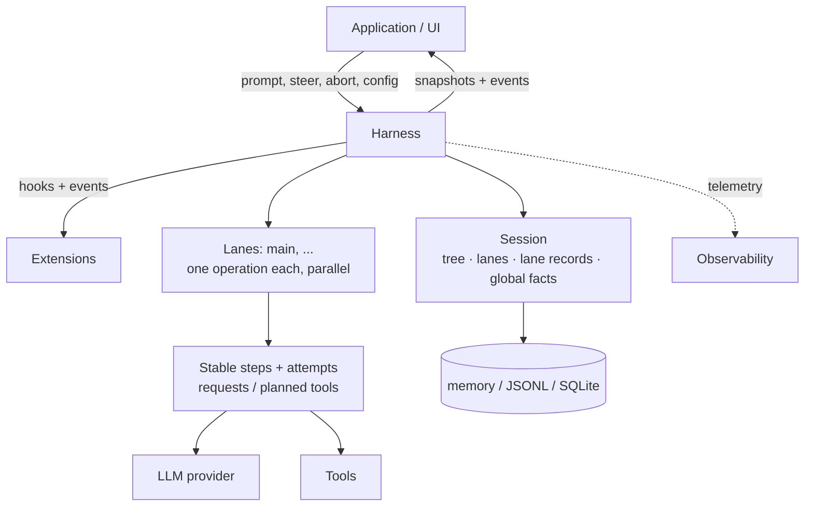
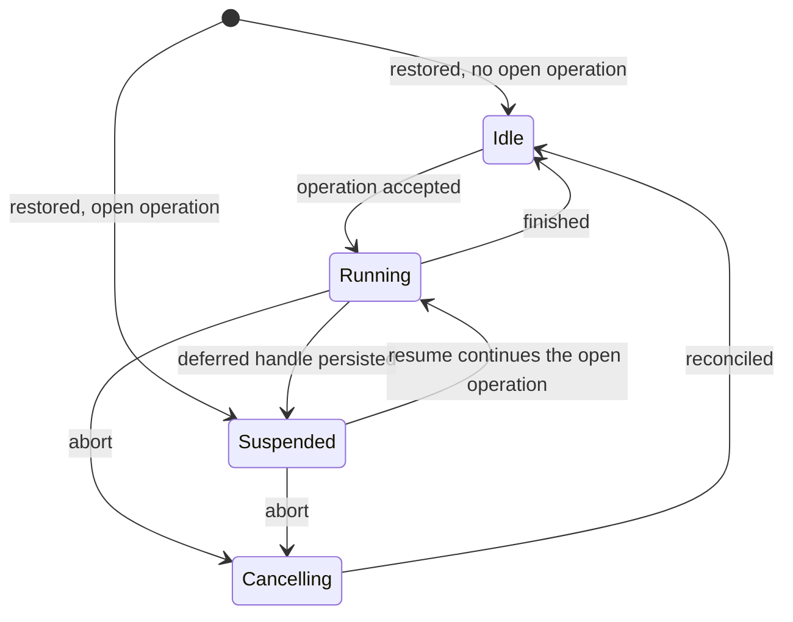

# Durable AgentHarness design

> **Compatibility policy.** Old coding-agent v3 JSONL sessions must open and restore idle. This is the only backward-compatibility requirement. All other formats and APIs in `packages/agent/src/harness` and `packages/session-backends/sqlite-node` (and their respective tests) may break. We do not write migrations, schema versioning, or conversion paths for anything else.



The harness executes runs against one session. The session holds four kinds of state (section 2). Lanes execute in parallel inside one harness (section 3). Storage backends encode the session (Part III).

# Part I — Concepts

## 1. Goals

- **Durable runs.** An accepted prompt is a durable operation. After a crash, a new process reconstructs the operation from its records and resumes from the last durable boundary. Every state that a crash can produce is recoverable.
- **Durable responses.** Partial stream state is process-local, but every settled assistant-generation and deferred-fetch response is appended completely before the harness decides what it means. Retryable errors, overflow responses, deferred responses, and aborted responses are durable outcomes of their attempts. An `aborted` response means operation abort only when an earlier `abort_requested` won its append race; without that marker it is an ordinary interrupted provider response.
- **Lanes.** A session hosts one or more lanes. A lane is a named position in the conversation tree. Each lane runs at most one operation at a time. Lanes run in parallel. A run and its queued messages belong to the lane that accepted them. Example: a Slack channel is a session; each thread is a lane. Interactive pi uses one lane and does not show the concept in its UI. Extensions get the full harness API, including lanes. Example: a subagent tool runs on a second lane of its parent's session.
- **No partial outcomes.** A crash inside any operation — run, compaction, navigation — leaves one of two states: the operation has not happened, or recovery can complete it. Nothing in between is observable.
- **Harness API.** Events observe execution and cannot change it. Hooks intercept execution and can change it: context, requests, tools, run boundaries. Extensions build on events and hooks.
- **Deterministic stepping.** Every effect — durable write, provider request, tool execution, hook, timer — crosses one injected boundary. In `drive: "manual"` the harness parks before each effect and a test drives it call by call: stop at any boundary, inject input, or close and reopen to simulate a crash. Production and tests run the same procedures; the drive mode only controls the boundary (section 15).
- **Observability.** All execution is instrumentable for logging and tracing, down to provider request and response internals. This channel is separate from the hook system.
- **UI model.** A client gets one atomic snapshot, then a live event stream. Events are not replayed. Reconnect means a new snapshot.
- **Single writer.** One harness writes a session at a time. The serving layer enforces this. All lanes of a session live in that one harness. Restore treats states that a single writer cannot produce as corruption.
- **v3 sessions load.** Old coding-agent v3 JSONL files open unchanged and restore idle.

## Non-goals

- **Exactly-once hook side effects.** A hook result becomes durable when the record or entry that consumes it commits. A crash before that commit can run the hook again (section 11 replay table). Side effects a hook makes on its own are invisible to the harness: HTTP calls, file writes. A hook that needs crash-safe external effects must be idempotent, for example keyed by operation id.
- **Provider stream resumption.** Partial streams are never persisted or resumed. If a process dies while streaming, the durable attempt intent has no response, so recovery treats the provider effect as unknown and starts a later numbered attempt only when policy permits. If an abort marker exists, it instead settles that attempt once as synthetic `aborted` under the already-provisioned id and never repeats the provider effect. A stream that settles is different: its complete response is persisted before retry, overflow, or abort classification. Deferred requests are also different and are in scope: the provider returns a handle at once and serves the result later (e.g. `background: true` on a Responses API, batch APIs). pi-ai returns an assistant message with stop reason `deferred` that carries the handle; it is persisted like any assistant message. Redemption of that original response and every later pending response returned while polling it uses one stable deferred-fetch step. The step copies the original generation step's total configuration and normalized retry policy once; later polls need no repeated lookup of that generation step. Each `resume()` makes at most one numbered, check-once poll attempt and persists the returned assistant message, including another `deferred` message when the work is still pending. Recovery polls the newest persisted source entry instead of starting a replacement generation request.
- **Multiple writers.** Two processes on one session are out of scope. The serving layer routes all traffic for a session to the process that holds its harness. Lanes cover the workloads that look like multi-writer: parallel threads over shared history.
- **Replication.** A session lives in one place. Coordination-free sync of diverging copies is a different design. Nothing forecloses it later.
- **Coding-agent migration.** Migrating coding-agent to `AgentHarness` is out of scope. Compatibility means the new JSONL repository can read supported coding-agent v3 files.

## 2. What a session is

A session is durable state with four parts:

1. **The tree** — the conversation. Entries with `parentId` links: messages, compaction summaries, branch summaries, custom entries. The tree is shared and passive. It belongs to no lane. It only grows; entries are never changed or deleted.
2. **Lanes** — where work happens. A lane is a name plus a leaf: the entry that future work extends. Every session has the lane `main`. Applications create more, keyed by external identity (a Slack thread id, an email thread id).
3. **Lane records** — the lane's current total configuration plus what happened and what must happen. One flat, chronological record sequence per lane contains total `lane_config` replacements and operation records such as operation started, step started, attempt started, tool batch planned, message queued, and operation finished. Commits update live state; after a crash, the same records are the authority for reconstructing it.
4. **Global facts** — session-scoped values where the latest write wins: the built-in session name and entry labels, plus string-keyed application facts in a separate custom namespace. They are not part of the tree and are kept as append-only history. Setting a name, label, or custom fact to `undefined` appends a deletion; JSON `null` remains a custom-fact value. The built-in and custom namespaces never overlap.

All writes across the four parts share one monotonic sequence number. The sequence orders global-fact history and lets a lane's records refer to tree positions.

```text
tree (shared, append-only)          lanes
a ── b ── c ── d                    main            → d   (total config; op log: …)
      └── e ── f                    slack:171943…   → f   (total config; op log: …)

global facts: name = "Refactor auth", label(b) = "checkpoint-1",
              custom("extension.example/state") = { "reviewed": true }
```

### Active and passive

The tree and the global facts are passive: shared data, readable by anything.

A lane is active. It owns its leaf, current total configuration, operation log (at most one open operation), queues, and pending writes. Two lanes never share any of these. Every durable action of a lane produces entries chained to its leaf or records in its own record sequence.

### Invariants

- The tree is conversation only. No lane configuration, orchestration state, or pointers live in it.
- An entry's parent chain never changes. Branches share prefixes; nothing is copied.
- A lane's leaf moves in exactly two ways: the lane appends an entry (leaf becomes that entry), or the lane navigates (leaf jumps to an existing entry).
- Configuration and operation records never enter the tree. Deleting every operation log leaves a complete, valid conversation.
- At most one operation is open per lane. A state where one lane has two open operations is corruption.
- Entries are shared; lane records are not. Two lanes may have the same entry on their paths. A record belongs to exactly one lane.

Lane records describe configuration or execution, not conversation. They never enter model context, transcripts, or branch queries, and source records are not copied into forks. Within one lane their order is already their meaning, so parent links would add nothing.

## 3. Lanes

A lane is a named position in the tree plus the work serialized on it. The closest existing concept is a git branch checked out in its own worktree: a name attached to a position, advanced by new work, movable to any entry without rewriting history, and never checked out twice. One difference to git intuition: navigation moves a lane to any entry, not only forward.

Every session has the lane `main`. Applications create further lanes with a name and an anchor entry. Lane names are permanent application keys: a Slack thread id, an email thread id. No UI lists lanes in the abstract; the platform's own UI (the thread list) plays that role.

A lane owns:

- **Its leaf.** New entries chain to it and move it. Navigation jumps it.
- **Its operation log.** At most one open operation. A second operation on a busy lane is rejected; other lanes are unaffected.
- **Its queues.** Steering, follow-ups, and next-run messages target one lane.
- **Its total configuration.** One value contains the model reference, thinking level, and active tool names. A `lane_config` record always replaces the whole value; it is never a patch or a tree entry. `main` and every new lane start from the same immutable seed captured from `AgentHarnessOptions`, not from their anchor or another lane. A setter immediately appends a total replacement on the lane's mutation line, even while an operation is open, and that replacement survives abort. Every generation step snapshots the current total configuration when its `step_started` record commits; all attempts of that step use the snapshot. Tool implementations, resources, and stream options are harness-global; only tool activation is per-lane.

Rules:

- Lanes run operations in parallel. The harness stays the single writer; lane records and entries interleave in the shared sequence.
- Creating a lane copies no tree content, operation history, or configuration from its anchor. Creation atomically establishes the pointer and the seed total configuration. Lanes are not deleted or renamed.
- State-dependent mutations on one lane are linearized on that lane's mutation line: validation, at most one atomic storage append, and the in-memory update complete before the next mutation starts (section 15). Provider, tool, hook, and retry work never occupies the mutation line.
- Two lanes at the same leaf diverge on their next append. The tree handles this; no coordination exists between lanes.
- A lane with an unfinished operation restores as suspended, independently of its siblings. Suspension has a reason: crash, or a deferred provider request (section 1).

## 4. How work executes

### Operations

An operation is the unit of durable work on a lane. Three kinds:

- **Run** — an accepted prompt, through all automatic continuations: tool calls, steering, follow-ups, auto-compaction. Ends when nothing is pending.
- **Compaction** — replaces old context with a summary entry.
- **Navigation** — moves the lane's leaf to an existing entry, optionally with a branch summary.

An operation is accepted before it executes. Acceptance is durable: after a crash, an accepted operation is either completed by recovery or explicitly closed. When an operation finishes, exactly one `operation_finished` record is its terminal durable state; no separate tree entry is universal. Every accepted run finishes `completed`, `failed`, or `aborted` (stopped by abort). Compaction and navigation may additionally finish `declined` when their decision hook vetoes the accepted structural operation before its effect.

### Runs, turns, and steps

A run is a sequence of turns. A turn is one assistant generation step plus the complete tool batch requested by the accepted assistant response.

A **step** is a durable logical unit of work inside an operation. A **generation step** is a step whose task starts a new LLM generation request: produce an assistant response, a compaction summary, or a branch summary. Committing its `step_started` record assigns a stable `stepId` and snapshots the values shared by all its attempts: the lane's total configuration and the normalized retry policy. Provider executions are numbered attempts of that same step, and the durable count survives restarts. A deferred-fetch step is not a generation step because it polls provider work that already exists; it still has one stable `stepId` and numbered poll attempts, and copies the original generation step's total configuration and normalized retry policy once so interrupted polls are self-contained.

Structural decision hooks create a step without generation when they supply the result themselves. That `step_started` stores the complete provisioned compaction or branch-summary entry and optional hook-usage intent, so recovery never reruns the decision. A generated compaction commits by appending its result entry directly; it has no prepared-result record. A generated branch summary must survive a later navigation move, so its complete payload becomes a dedicated durable prepared record before the move. Structural provider streams are internal and never appear as public assistant-message events.

Before an assistant-generation or deferred-fetch attempt starts its provider effect, it provisions the id of its response entry. Once the stream settles, the complete response is appended under that id for every stop reason, before later orchestration. Classification may decide to retry, compact, suspend, fail, abort, or accept the response, but it does not erase it. If a crash leaves an attempt without its response, the external effect is unknown: without abort, recovery starts the next numbered attempt when policy permits or appends a synthetic interruption response under the already-provisioned id at the cap; with an abort marker, it appends a synthetic aborted response under that same id and never retries.

For an assistant generation, `triggerMessageId` is the id of the newest consumed message that projects as user context and caused that generation. A prompt, consumed steer or follow-up, or another run-owned user-context message can supply it. It bounds overflow recovery to one compaction for that user input:

```text
consume user message U1
start assistant step A1, triggerMessageId = U1
persist recoverable-overflow response R1
compact once, linked to R1 and U1
start assistant step A2, triggerMessageId = U1
persist recoverable-overflow response R2 → fail; no second compaction
consume steering message U2
start assistant step A3, triggerMessageId = U2 → one new overflow compaction is allowed
```

An accepted assistant response with tool calls gets one durable planned tool batch before call clearance — tool lookup, argument validation, and `before_tool` — or execution. The provider contract requires `toolCallId` to be unique within one assistant response. The plan assigns a result entry id to every source call index, including calls later blocked, invalid, interrupted, or aborted. The index exists only to preserve source ordering and locate that planned result; it is not exposed publicly. A real call then writes `tool_started` immediately before its individual effect. Parallel effects may settle concurrently, but results finalize and append in source order (section 14).

### Queues and deferred writes

Two mechanisms carry input into a running lane. They differ in abort behavior:

- **Queues** carry conversational intent: `steer` corrects the current work, `followUp` adds work for when the model would stop, `nextRun` seeds the lane's next run. Steering and follow-ups die on abort; their payloads are returned to the caller. Next-run messages survive.
- **Deferred writes** carry tree additions requested while a step is in flight. They survive abort and are applied even during cancellation.

Both are durable at acceptance: the accepting call writes a record with the full payload to the lane's operation log, then resolves. The tree entry is written later, when the item is applied or consumed — the position where the model first sees it. If the process dies between acceptance and the tree write, recovery reads the record and performs the append. Accepted input is never lost.

Lane configuration updates do not use deferred writes. A setter commits an immediate total `lane_config` replacement on the mutation line, so later generation steps see it while an already-started step and all its retries retain their captured configuration.

### Checkpoints

Between turns, the lane passes a checkpoint:

1. Apply pending deferred writes.
2. Consume queued steering messages.
3. Compact if the next request would not fit.

Compaction has a reactive trigger too: a durable provider response can reveal that its request did not fit — an explicit context-limit error, reported input plus cache-read tokens greater than the attempt's captured window, or a recoverable `length` stop. A response classified as recoverable overflow starts no tool batch. The run may start one overflow compaction linked to that exact response entry and its `triggerMessageId`; compaction preparation omits the linked response. A second recoverable overflow with the same trigger fails instead. Consuming a newer user-context message supplies a new trigger and permits one new compaction (section 6, "Context overflow at an assistant step").

A turn with tool calls forces another turn so the model sees its results — with one exception: a batch in which every finalized tool result persisted `terminate: true` suppresses automatic tool continuation (steering or follow-up input can still start another turn). Follow-up messages are consumed only when tool continuation and steering are exhausted. The run ends when a checkpoint finds nothing pending.

### Append-only context

> Across the requests of a lane, provider context only grows at the tail. An insertion before the previous request's tail invalidates the provider's KV cache from that point on and multiplies token cost.

This invariant is why mid-turn writes defer to checkpoints: checkpoint application appends at the tail. Persistence and provider-context projection are separate. Assistant responses with stop reason `error`, `aborted`, or `deferred` project to no provider message. A genuine output-limit `length` response remains in context; a response classified as overflow is omitted through its exact compaction link. Compaction is the one deliberate cache invalidation; it trades that invalidation for a smaller context.

### Lane lifecycle



- States are per lane. One exception: a failed storage write faults the whole harness. A faulted harness stops all effects and rejects all calls; after the cause is fixed, reopening restores each lane from its records.
- **Suspended** means: an operation is open, nothing executes. Reached by restore after a crash, or deliberately when a deferred handle is persisted. `resume()` continues the operation; `abort()` starts cancellation reconciliation instead of ordinary continuation.
- **Abort** first records the cancellation durably; that marker is the authority. It then signals running effects and returns. Reconciliation completes missing accepted initial messages, required planned tool results, and accepted deferred writes. There is no universal assistant closure, and the harness never starts a request or appends an assistant message solely to manufacture one. `operation_finished` with outcome `aborted` is the universal terminal marker. Repeating `abort()` while that marker is open returns the same drained steer/follow-up payloads without writing another marker or signaling again. Automatic drive reconciles in the background; manual drive leaves reconciliation parked at its next action.

### Resume

Resume continues the open operation. It never starts a new one and never relies on a persisted program counter. The harness reduces the lane's durable records and planned entry ids, then re-enters the ordinary operation procedure at the state they describe: settle an attempt whose response is missing, classify a durable response whose next transition is missing, reconcile a planned tool batch, perform at most one numbered deferred-fetch poll, or continue at the next checkpoint. Every deferred poll response is durable, including another pending `deferred` response, so a later resume polls from the newest persisted source entry. Queued messages and deferred writes accepted before the crash are still pending and apply normally.

For deferred polling, the **source lineage** is the response-entry chain that identifies what each poll redeems: the original deferred response is the first source, each pending poll response becomes the next source, and an interrupted or unknown poll retains its existing source. **Complete handle equality** means every required field, every optional field's presence and value, and the JSON value in `data` match; section 16 defines the field-level comparison.

# Part II — How execution is recorded

Part II is backend-neutral. It defines the records a lane writes, when it writes them, and how recovery reads them back. Part III maps this onto APIs and storage.

## 5. Records

### The durability rule

> Before an effect: write an intent record that names what will happen and every durable id settlement will use. After an assistant/fetch effect: append the complete response entry, then its preplanned usage record.

Each procedure boundary below uses a separate storage append unless the contract explicitly requires one atomic multi-write append: configured lane creation and labeled navigation completion. A single append may contain several logical mutations, which commit all-or-none with consecutive sequence positions; there is no crash prefix inside it. Assistant attempts, responses, and usage remain separate appends. A crash between an assistant/fetch attempt and its response therefore leaves the external effect unknown; without abort, recovery starts a later numbered attempt or closes at the cap under the existing response id. An abort marker instead closes that attempt as synthetic `aborted` under its existing response id. A crash between response and usage reconstructs the exact usage record before classification. A structural `step_started` provisions one typed result id. A generated compaction closes with its result entry or `step_failed`; a generated branch summary stops requesting once its complete `branch_summary_prepared` is durable and closes when that exact entry is appended or the step fails before preparation. A hook source stores its complete result on `step_started` and closes when that entry appends. An unknown generated attempt advances only under the captured policy. An assistant entry with `stopReason: "deferred"` fulfills its generation attempt and closes that generation step; what stays outstanding is the operation — the persisted handle awaits redemption (section 6). A provisioned id that exists with different content is corruption.

### Provisioned ids

Intent records carry the ids of entries that do not exist yet:

```ts
/** An entry payload with its id pre-allocated. parentId, seq, and timestamp
    are assigned by storage when the entry is appended: it chains to the
    lane's then-current leaf. */
type ProvisionedEntry<T extends Entry = Entry> =
  T extends Entry ? Omit<T, "parentId" | "seq" | "timestamp"> : never;
```

### Record catalog

Every record belongs to one lane's record sequence. Records that belong to an operation carry `runId`: the id of that operation's `operation_started` record. Total configuration records, next-run queue records (`queue_enqueued` and their `queue_cancelled`), and standalone `adjustment` usage records carry no `runId`.

```ts
interface RecordBase {
  id: string;
  seq: number;            // shared sequence, section 2
  lane: string;
  timestamp: number;      // Unix ms
}

interface ModelReference {
  provider: string;
  modelId: string;
}

/** The complete durable configuration of one lane. Arrays are copied on
    input and output. Tool implementations remain harness-global runtime
    capabilities; only their names persist here. */
interface LaneConfiguration {
  model: ModelReference;
  thinkingLevel: ThinkingLevel;
  activeToolNames: string[];
}

// A total replacement, never a patch. The newest record is the lane's
// current configuration. It is independent of operations and survives
// abort. Every configured format-4 lane has at least one such record.
interface LaneConfigRecord extends RecordBase {
  type: "lane_config";
  configuration: LaneConfiguration;
}

// Acceptance boundary of an operation. Everything decided before acceptance
// is persisted here. This record's own id IS the runId that all other
// records of the operation carry.
interface OperationStartedRecord extends RecordBase {
  type: "operation_started";
  sourceLeafId: string | null;        // the lane's leaf at acceptance
  intent:
    | {
        kind: "run";
        /** Normalized caller input after skill/template expansion, before
            before_run. Kept for SuspendedOperation and before_resume. */
        originalPrompt: AgentMessage[];
        /** Captured nextRun items, then the prompt, then before_run
            injections. Full payloads, provisioned ids. Capture happens in
            the acceptance mutation (section 15): items present when it runs
            belong to this run; later items belong to the next. */
        initialMessages: ProvisionedEntry<MessageEntry>[];
        /** Present only when a hook overrode the system prompt; fixed for the
            whole run. Absent: the systemPrompt callback runs per request. */
        systemPromptOverride?: string;
        /** Opaque state keyed by stable hook registration id. Each
            before_resume handler receives only the value under its id. */
        resumeData?: Record<string, JsonValue>;
      }
    | {
        kind: "compaction";
        customInstructions?: string;
        resultEntryId: string;          // provisioned compaction entry
      }
    | ({
        kind: "navigation";
        customInstructions?: string;
      } & (
        | { targetId: null; label?: never }       // root has no label fact
        | { targetId: string; label?: string }    // written at completion
      ) & (
        | { summarize: false; summaryEntryId?: never }
        | { summarize: true; summaryEntryId: string }  // provisioned branch-summary entry
      ));
}

// Operation acceptance does not copy lane configuration. A generation
// step captures it when that step starts; retries use that captured value.

// Written exactly once before the first abort() resolves. A request marker,
// not a terminal state: reconciliation follows, then operation_finished with
// outcome "aborted" unless a structural commit had already won. Kills this
// operation's steer/follow-up queue items; next-run items survive. Repeated
// abort() calls while the operation remains open return the same killed items
// without another record.
interface AbortRequestedRecord extends RecordBase {
  type: "abort_requested";
  runId: string;
}

// Closes the operation. failed = orderly durable failure (for example,
// retries exhausted). aborted = closed only by an earlier abort_requested.
// declined = vetoed by a hook before any effect.
type OperationFinishedRecord = RecordBase & {
  type: "operation_finished";
  runId: string;
} & (
  | { outcome: "failed"; error: { code: string; message: string } }
  | { outcome: "completed" | "aborted" | "declined"; error?: never }
);

// Starts one durable logical step. This record's own id IS the stepId.
// Generation sources copy configuration arrays and persist the normalized
// retry policy once, so every attempt, including one started after reopen,
// uses the same cap and backoff. A hook source instead persists the complete
// provisioned result; it has no provider attempts. hookUsageRecordId is
// present exactly when that result reports usage, so recovery can write the
// exact accounting record before the result entry without rerunning the hook.
type StructuralStepSource<T extends CompactionEntry | BranchSummaryEntry> =
  | { source: "generated";
      configuration: LaneConfiguration;
      retryPolicy: RetryPolicy;
      hookResult?: never;
      hookUsageRecordId?: never }
  | { source: "hook";
      configuration?: never;
      retryPolicy?: never;
      hookResult: ProvisionedEntry<T>;
      hookUsageRecordId?: string };

type StepStartedRecord = RecordBase & { type: "step_started"; runId: string } & (
  | { step: "assistant";
      configuration: LaneConfiguration;
      retryPolicy: RetryPolicy;        // normalized total value
      triggerMessageId: string }
  | { step: "deferred_fetch";
      /** Exact copies from the assistant generation step that persisted the
          original deferred response. Copied active tools govern a ready
          response's tool calls; the source handle supplies fetch identity. */
      configuration: LaneConfiguration;
      /** Normalized copy. maxAttempts applies to attempts naming one source;
          a successful pending response creates a new source. */
      retryPolicy: RetryPolicy }
  | ({ step: "compaction";
       resultEntryId: string;           // always a CompactionEntry
     } & StructuralStepSource<CompactionEntry> & (
       | { compactionReason: "manual" | "threshold";
           supersededResponseEntryId?: never; triggerMessageId?: never }
       | { compactionReason: "overflow";
           /** Exact durable assistant response omitted by this recovery. */
           supersededResponseEntryId: string;
           /** Copied from the assistant step that produced that response. */
           triggerMessageId: string }
     ))
  | ({ step: "branch_summary";
       resultEntryId: string }          // always a BranchSummaryEntry
     & StructuralStepSource<BranchSummaryEntry>)
);

// Written immediately before one attempt's provider work. attempt is 1-based
// and consecutive within stepId. Assistant and deferred-fetch attempts each
// contain one provider effect and provision both objects settlement must
// produce: first the complete response entry, then its usage record. Their
// response ids are fresh per attempt.
// Generated structural attempts use the one typed result id on step_started;
// an attempt may make several provider requests (split-turn compaction makes
// two). Hook structural sources have no attempts.
type StepAttemptRecord = RecordBase & {
  type: "step_attempt";
  runId: string;
  stepId: string;
  attempt: number;
} & (
  | { step: "assistant";
      responseEntryId: string;
      usageRecordId: string;
      /** Request-specific intended limit before context clamping. */
      intendedOutputLimit: number;
      /** Context-window size used by this request. */
      contextWindow: number }
  | { step: "deferred_fetch";
      /** Exact deferred response entry whose complete handle this poll
          redeems. Pending responses advance this lineage even when the
          complete handle is unchanged; interrupted responses do not. */
      sourceEntryId: string;
      responseEntryId: string;
      usageRecordId: string }
  | { step: "compaction" | "branch_summary" }
);

// A generated branch summary must be durable before navigation moves. This
// record stores the complete payload produced by one successful attempt. The
// later entry append uses it byte-for-byte; compaction has no corresponding
// prepared record because its result-entry append is its commit point.
interface BranchSummaryPreparedRecord extends RecordBase {
  type: "branch_summary_prepared";
  runId: string;
  stepId: string;
  attempt: number;
  result: ProvisionedEntry<BranchSummaryEntry>;
}

// Structural generation has no assistant error entry to represent terminal
// failure. After the durable attempt cap is exhausted, this record closes a
// generated step. Assistant and deferred-fetch failures are complete response
// entries; hook-sourced structural steps cannot fail after their start record.
interface StepFailedRecord extends RecordBase {
  type: "step_failed";
  runId: string;
  stepId: string;
  step: "compaction" | "branch_summary";
  error: { code: string; message: string };
}

// A resumed generation request uses the total configuration and retry policy
// captured by step_started, not the lane's current replacements. A deferred
// step copies both from the original generation step; each attempt additionally
// uses the provider/model carried by its exact source entry.

// Written once after an assistant response is accepted and before clearance
// of any call. The array has exactly one item per source tool call, in source
// order. toolIndex preserves that order and locates the call's planned result;
// resultEntryId is the one destination for every real or synthetic outcome.
interface ToolBatchStartedRecord extends RecordBase {
  type: "tool_batch_started";
  runId: string;
  assistantEntryId: string;
  calls: { toolIndex: number; resultEntryId: string }[];  // 0..tool-call count - 1
}

// Written after before_tool and validation pass, immediately before this
// call's individual effect. The result id is already fixed by the batch plan.
interface ToolStartedRecord extends RecordBase {
  type: "tool_started";
  runId: string;
  assistantEntryId: string;
  toolIndex: number;
  toolCallId: string;
  toolName: string;
  effectiveArgs: Record<string, unknown>;   // after before_tool
  /** The tool's declared replay safety, snapshotted at execution time.
      Recovery re-executes an unfinished call only when this field AND the
      current tool declaration both say "safe"; otherwise it writes a
      synthetic "interrupted" result. */
  replay: "never" | "safe";
}

// Queue acceptance. The payload travels here; the entry appears at the
// consumption point.
type QueueEnqueuedRecord = RecordBase & {
  type: "queue_enqueued";
  target: ProvisionedEntry<MessageEntry>;
} & (
  | { queue: "steer" | "followUp"; runId: string }
  | { queue: "nextRun"; runId?: never }
);

// Durable retraction of a pending queue item, before consumption. Without
// this record a crash would resurrect the item: recovery treats a
// queue_enqueued without its entry as pending.
interface QueueCancelledRecord extends RecordBase {
  type: "queue_cancelled";
  runId?: string;                      // matches the queue_enqueued it kills
  entryId: string;                     // the enqueued target's provisioned id
}

// Deferred-write acceptance: a tree entry requested while a step was in
// flight. Applied at the next checkpoint. Configuration never uses this
// record; its total replacement commits immediately.
interface WriteDeferredRecord extends RecordBase {
  type: "write_deferred";
  runId: string;
  target: ProvisionedEntry<MessageEntry | CustomEntry>;
}

// The cost ledger. Written whenever usage is reported or adjusted, whatever
// happens to later orchestration. Assistant and deferred-fetch settlement
// writes the complete response entry first, then the preplanned usage record;
// recovery checks that one presence bit and reconstructs a missing record from
// the immutable response usage before classification. Other usage remains pure
// accounting. A transport death mid-stream can still bill unreported tokens.
type UsageRecord = RecordBase & { type: "usage"; usage: Usage } & (
  // A provider request settled. Split-turn compaction writes two records
  // sharing one structural attempt and result entry id.
  | { cause: "assistant" | "compaction" | "branch_summary" | "deferred_fetch";
      runId: string; stepId: string; entryId: string; attempt: number;
      stopReason: TerminalStopReason }
  // A finalized tool result reported nested LLM work; skipped when it
  // reports none. A safe replay writes a second record for the second
  // execution: both were billed.
  | { cause: "tool"; runId: string; entryId: string; toolCallId: string }
  // A hook-supplied summary carried usage the hook measured itself.
  | { cause: "hook"; runId: string; entryId: string }
  // Application-supplied, anytime (lane.recordUsage): reconciliation,
  // estimates, corrections. Negative values are legal.
  | { cause: "adjustment"; runId?: string; entryId?: string; details?: JsonValue }
);

type LaneRecord = LaneConfigRecord | OperationStartedRecord | AbortRequestedRecord
  | OperationFinishedRecord | StepStartedRecord | StepAttemptRecord
  | BranchSummaryPreparedRecord | StepFailedRecord | ToolBatchStartedRecord
  | ToolStartedRecord | QueueEnqueuedRecord | QueueCancelledRecord
  | WriteDeferredRecord | UsageRecord;

type NewRecord<T extends LaneRecord = LaneRecord> =
  T extends LaneRecord ? Omit<T, "seq" | "timestamp"> : never;
```

The batch plan is the intent for every call outcome, including calls that never execute. Blocked and invalid calls write no `tool_started`; they append an `isError: true` tool-result entry under the id already assigned to their source index. A crash before that entry reruns clearance — including `before_tool` — against the same planned id. A genuine output-limit `length`, abort before a call starts, or recovery of an unsafe started call likewise appends its explanatory, aborted, or interrupted synthetic result under that id.

A tool batch needs no outcome record. Its result entries are its complete durable outcomes, including each finalized `terminate` decision (section 12). A real call that reports usage writes a `usage` record bound to its planned result id before appending the result entry. That real result keeps only the finalized execution's own `AgentToolResult.usage` as its immutable display snapshot. A crash after execution or after that usage record but before the result follows the replay policy (section 6); re-finalization runs `after_tool` again after a safe replay, which the section 1 non-goal explicitly permits, and another real execution may write another usage record. Earlier execution and replay records remain separate in the durable ledger and effective cost sums them. A synthetic result has no usage snapshot, even when an earlier lost execution left a usage record. Public hooks, events, snapshots, and tool execution context continue to use provider `toolCallId` and tool name. Source index remains internal and is used only for source ordering and planned-result lookup.

Cost is the one concern where settlement requires a second durable object: **cost durability must not depend on later classification**. Every settled assistant-generation and deferred-fetch response is first appended under its attempt's `responseEntryId`, then its preplanned `usage` record is appended before retry, overflow, suspension, failure, abort, or acceptance logic. A crash in between loses no cost: recovery rebuilds the exact record id and payload from the attempt and the response's immutable usage. Structural requests have no durable assistant response; each reported request usage is written immediately, before a generated compaction entry or `branch_summary_prepared`, and the provider-settle-to-usage-write crash window remains. A successful structural result's immutable usage snapshot is the sum of the successful attempt's request records; failed-attempt records remain ledger-only. Tool-reported usage is written before its planned result entry. A hook-reported structural usage record uses the id provisioned by the hook-sourced `step_started` and is repaired from its persisted result before that result entry commits, including when abort prevents the entry. Applications append `adjustment` records for anything the harness cannot see.

A harness-written `usage` record binds `entryId` to the entry its measurement belongs to. For assistant and deferred-fetch work that entry always exists before the usage record. Structural failed attempts can still bind usage to a typed result id that never materializes. Three layers separate cleanly: an entry's `usage` field is an **immutable display snapshot** of the response that produced that entry, written once at append and never touched again; the **effective cost of an entry** is a read-time query — the sum of all lanes' `usage` records bound to its id, base plus adjustments; the **session's cost** is the sum of all `usage` records. Recovery can honestly bill twice — a later numbered provider attempt or a replayed tool writes one record per execution. A real tool-result snapshot contains only its finalized execution's usage, not earlier lost executions or replays, while the ledger retains and sums every record bound to the planned result id. A synthetic tool result has no usage snapshot.

### Validity

These rules define valid writes and valid prefixes. Append-time validation applies the relationships available at each write. Restore applies them only to the indexed configuration, discovered open operation, independent next-run slice, and exact planned entries described in section 7; it never scans completed history merely to re-audit it. Within that bounded input, restore rejects corruption when:

- a configured format-4 lane has no `lane_config` record, or a `lane_config` payload is not total;
- more than one operation is open;
- a navigation operation targets its own `sourceLeafId`, or has `targetId: null` and a label; root has no label fact;
- append/replay observes a lane create without its immediately following first total config, or completed labeled navigation without its immediately preceding accepted label fact in the same atomic append;
- an `operation_finished: failed` lacks `error`, or any other finish outcome carries `error`;
- one operation has more than one `abort_requested`, an `operation_finished: aborted` has no earlier abort marker, or an assistant/fetch response appended after the marker kept another stop reason; an `aborted` response without an earlier marker is valid provider interruption, not corruption;
- a `step_started`, `step_attempt`, `branch_summary_prepared`, `step_failed`, `tool_batch_started`, or `tool_started` follows its operation's abort marker; reconciliation may append only settlements already intended before the marker, accepted initial/deferred writes, accounting, committed structural results, and the terminal record;
- a run with an abort marker finishes with an outcome other than `aborted`, or a compaction/navigation with a marker finishes non-aborted when its result-entry/move commit had not already won;
- a record references an operation that does not exist, or follows its finish;
- a `step_attempt`, `branch_summary_prepared`, or `step_failed` references no earlier `step_started`, names a different operation or step kind, or follows that step's failure;
- a generation `step_started` has a non-total configuration or non-normalized retry policy; a deferred-fetch step has non-total copied configuration or non-normalized copied retry policy, or a second fetch step appears before the original deferred response and its later pending responses settle; an assistant step has no `triggerMessageId`; a structural step has the wrong typed result id; a manual structural step's result id disagrees with its accepted operation intent; a generated structural source lacks total configuration or normalized policy; or a hook structural source carries either of those generation fields;
- a hook structural source's complete provisioned result has the wrong id or type, has `fromHook !== true`, omits required compaction preparation fields, or disagrees with its accepted navigation source; its `hookUsageRecordId` is present exactly when the result has usage, and the matching `cause: "hook"` record, when present, must reproduce that usage and precede any result entry;
- a structural attempt or `step_failed` belongs to a hook source; a generated branch-summary source has more than one `branch_summary_prepared`, or its prepared record names a nonexistent/non-latest attempt, has the wrong result id/type or `fromHook !== false`, or follows the navigation move; a generated compaction has any prepared-result record;
- a generated structural result entry or prepared branch-summary payload with a usage snapshot has no matching successful-attempt usage records before it, or their sum differs from that snapshot; failed-attempt usage remains valid ledger history;
- a non-overflow compaction step carries overflow-link fields, or an overflow compaction step does not name both `supersededResponseEntryId` and `triggerMessageId`; the named entry must be the complete, accounted response of an earlier assistant attempt in the same run, its assistant step must carry the same trigger, and the durable response plus attempt fields must satisfy the overflow predicate;
- two overflow compaction steps use the same `triggerMessageId`; live execution gives a generation after newly consumed user-context input that newer message's id instead;
- attempt numbers are not consecutive within a `stepId`;
- two assistant/fetch attempts reuse a response or usage id, or their request-specific limits/source entry are invalid; a deferred-fetch source must be the original deferred response, the newest equal-handle pending response, or the unchanged source of a below-cap interrupted or unknown poll, as applicable; a pending response without an abort marker whose complete handle differs from its source is invalid, and no fetch attempt may follow a ready, terminal, or capped interrupted response while redeeming that original deferred response;
- an assistant/fetch response id exists as anything other than its complete `MessageEntry`, its usage record exists before that response, or the preplanned usage id exists with fields that do not match the attempt and immutable response usage;
- a `step_failed` belongs to assistant/fetch or hook-sourced work, or a structural result entry or prepared branch-summary payload coexists with `step_failed` for one step;
- a steer or follow-up `queue_enqueued` for a run follows its `abort_requested`;
- a `queue_cancelled` targets an id with no `queue_enqueued`, or one whose entry exists;
- a `tool_batch_started` does not name a complete, accounted, accepted assistant response in the same run, more than one plan names the same response, or a recoverable-overflow response owns a plan;
- a batch plan's `calls` are not exactly the source response's tool calls by zero-based source index and order, its result ids are not unique, or a result id is reused by another provisioned object;
- a `tool_started` has no earlier batch plan for its assistant entry and source index, does not identify the stored `toolCallId` and `toolName` at that index, or duplicates a start for that planned source position; the started record never supplies or changes the planned result id;
- planned tool-result entries do not form a source-order prefix, a planned id exists as a non-tool-result entry, or a tool `usage` record does not bind a planned started call and its stored provider call id; when a real result's finalized execution reports usage, that record must precede the result and match its `AgentToolResult.usage`, while a synthetic result has no usage snapshot;
- a provisioned id exists with different content.

For navigation, bounded validity also compares the current leaf with the accepted source, target, and summary id. Without summarization, only source-before-move and target-after-move are valid. With summarization, the move requires a durable payload first: a hook result on `step_started` or a generated `branch_summary_prepared`. The valid sequence is source with no payload, source with payload, target with payload and no result entry, then summary-entry leaf with that exact result. A target leaf without a payload, a result entry while the leaf is not its id, or any unrelated leaf is corruption. No branch walk is needed.

## 6. What each action writes

Traces at the storage level. All traces show one already-configured lane; its initial `lane_config` precedes the shown operation. Legend:

```text
E   entry appended to the tree (chained to the lane's leaf)
R   record appended to the lane's record sequence
L   lane pointer move
G   global fact written
A   one atomic append containing the bracketed logical mutations
H   hook (awaited; hooks are Part I concepts, their API is Part III)
X   crash site
```

### Run with one tool call

```text
    prompt("fix the bug")
H   before_run                        may inject entries, override system prompt
R   operation_started                 kind run; initial messages with provisioned ids
E   user message                      the provisioned id from the intent
R   step_started                      assistant; config, retry policy, trigger = user id
R   step_attempt                      attempt 1; provisioned response and usage ids
E   assistant message [tool call]     complete settled response, every stop reason
R   usage                             preplanned id; before classification
R   tool_batch_started                c1 source index and provisioned result id
H   before_tool                       may change args or block
R   tool_started                      c1 effective args and replay; result id already planned
    execute tool                      c1's individually gated phase-two effect
H   after_tool                        may patch result, usage, and terminate
R   usage                             c1 tool usage, only when reported; before result
E   tool result                       c1's planned result id; persists the terminate decision
R   step_started                      next assistant step; new stable id and trigger
R   step_attempt                      attempt 1; fresh response and usage ids
E   assistant message "done"
R   usage
H   before_run_end                    nothing pending, returns nothing
R   operation_finished                completed
```

A crash between any two lines is recoverable. An assistant/fetch attempt without its response is an unknown effect and never reuses that attempt's id; absent abort it advances under policy, while an abort marker settles it as synthetic `aborted` under that id. A response without usage gets its exact preplanned record before classification. A generated compaction without its typed result and a generated branch summary without its prepared payload continue under captured policy or close with `step_failed`; a hook source already contains its complete result. A provider response or generated structural result without its planning step/attempt cannot exist.

### Retry

```text
R   step_started                      assistant S; captured config and retry policy
R   step_attempt                      S attempt 1; response R1, usage U1
E   assistant message R1              retryable error, complete and durable
R   usage U1                          reconstructed from R1 if this write was interrupted
    retry delay
R   step_attempt                      S attempt 2; fresh response R2, usage U2
E   assistant message R2              successful response
R   usage U2
```

Every settled assistant-generation and deferred-fetch response is appended before its usage record and before classification; the other traces omit those paired writes only where stated. Per-request hooks (`transform_context`, `before_request`, `after_response`) run inside every request and are omitted everywhere; Tier B records them (section 19).

Crash during the first backoff: restore reads the response and usage for attempt 1, classifies that same durable response, and starts attempt 2 if the captured policy permits. The count never resets, and every attempt has a distinct response id. A retryable response at the cap — or a non-retryable terminal error — is already the durable assistant error that leads to `operation_finished` failed:

```text
E   assistant message                 stop reason error; the failure is durable
R   usage                             exact preplanned record
X   crash                             operation still open
R   operation_finished                recovery writes failed — never completed
```

The error entry is the terminal-failure marker. Recovery that finds it drains accepted writes and queued input; unless consumed steering or follow-up input starts new work, it closes the run failed (section 7). The same rule applies to an unmarked `aborted` response at its captured cap: a run whose newest own message is either terminal form can never be completed by recovery.

Two settlement prefixes require explicit recovery:

```text
R   step_attempt N                    response RN, usage UN
X   provider effect unknown           RN absent
```

If `N` is below the persisted cap, recovery commits attempt `N+1` before repeating the provider effect; it never reuses `RN`. At the cap it appends a synthetic interruption error under `RN`, then appends `UN` from that response's zero usage. No id is invented after the attempt.

```text
R   step_attempt N
E   assistant message RN
X   usage UN missing
R   usage UN                          recovery reconstructs it from RN before classification
```

An existing response without its preplanned usage record is a valid crash prefix, not usage loss. An existing usage record without its response is corruption because live settlement cannot produce that order.

A transport timeout, harness-close signal, provider-side cancellation, or similar interruption can settle as `aborted` without `abort_requested`. That response follows the durable retry boundary rather than the abort path:

```text
R   step_started                      assistant S; captured policy
R   step_attempt                      S attempt 1; response R1, usage U1
E   assistant message R1              stop reason aborted; no abort marker
R   usage U1
    retry delay
R   step_attempt                      S attempt 2; fresh response and usage ids
```

At the captured cap, that attempt's `aborted` response is the durable terminal interruption response and the run finishes failed after its normal drain. It remains omitted from provider context. It never produces `operation_finished: aborted` or `run_abort`.

### Post-persistence assistant-response classification

Classification begins only after both durable settlement objects exist: the complete `MessageEntry`, then its preplanned `usage` record. It is a pure, process-local decision, not another record. Its inputs are the immutable response, the assistant `step_started` and `step_attempt`, the current abort marker, and linked later records. It returns retry, overflow recovery, suspension, failure, abort, or acceptance. It never changes or deletes the response and needs no general attempt-outcome metadata.

A linked later record means that an ordinary transition already won: a newer attempt of the same step represents retry, an overflow compaction must name this exact response and trigger, a durable tool-batch plan represents accepted tool calls, and `operation_finished` is terminal. Absent an abort marker, resume continues that represented transition instead of classifying into a second one. A deferred response is itself the durable suspension fact, so reclassification simply parks again.

Every prefix around settlement and transition has one interpretation:

| durable prefix | recovery before ordinary orchestration |
|---|---|
| `step_started`, no attempt | append attempt 1 before the provider effect |
| `step_attempt`, response absent, no abort | effect unknown; start a fresh numbered attempt below the cap, or append the synthetic interruption response under the provisioned id at the cap |
| `step_attempt`, response absent, abort present | append synthetic `aborted` under the provisioned response id and its preplanned usage; never retry |
| response present, usage absent | reconstruct the exact preplanned usage record from the response; then abort wins if its marker exists |
| usage present, response absent | corruption; live settlement cannot write in this order |
| response and usage present, no linked transition | run the pure classifier on that same response; an abort marker selects reconciliation |
| response and usage present, linked transition present | absent abort, resume the represented retry, overflow compaction, tool batch, suspension, or finish; with abort, preserve the response and reconcile instead |

An existing abort marker selects abort before following or creating an ordinary transition, whatever stop reason a response that committed first retained. Otherwise overflow classification runs before interruption and retryable-error classification; a context-limit error must compact rather than retry the same oversized request. `deferred` suspends. An unmarked `aborted` response is an ordinary provider interruption: below the captured cap it retries, and at the cap it fails the run. A retryable `error` below the cap retries, any other `error` fails, and `stop`, `toolUse`, or a genuine output-limit `length` is accepted. The same function and ordering run live and after reopen.

### Context overflow at an assistant step

Overflow classification has three explicit inputs, all durable on the response and attempt:

1. **Explicit provider context-limit error.** The response has `stopReason: "error"`, and its durable `errorMessage` matches pi-ai's existing provider context-limit patterns after known non-overflow patterns such as throttling and rate limits are excluded. Examples include "prompt is too long", "exceeds the context window", and DashScope/Qwen's "Range of input length should be". No transient exception or HTTP object is needed after reopen.
2. **Reported input exceeds the captured window.** The response has `stopReason: "stop"`, `attempt.contextWindow > 0`, and `message.usage.input + message.usage.cacheRead > attempt.contextWindow`. This preserves the existing successful-response check without introducing a separate named condition or durable outcome.
3. **A recoverable `length`.** The response either matches the existing Xiaomi MiMo-compatible context-pressure signal — zero output and reported input plus cache-read tokens at least 99% of the captured non-zero window — or ended below the request's persisted intended output limit:

```ts
function isRecoverableLength(message: AssistantMessage, intendedOutputLimit: number): boolean {
  return message.stopReason === "length"
    && intendedOutputLimit > 0
    && message.usage.output < intendedOutputLimit;
}
```

`usage.output` already includes reported reasoning tokens. `intendedOutputLimit` is the caller-supplied `maxTokens` when set, else `model.maxTokens`, captured before any context clamping. The value actually sent cannot be the reference: some providers reject an explicit output cap outright (the OpenAI Codex backend returns HTTP 400 for `max_output_tokens`), and pi clamps others to the remaining context. This covers a context-clamped request that returns 16 reasoning tokens against a 128k intent, a zero-output Xiaomi/Qwen-style response, and an explicit 1,024 cap fully used as a genuine stop. The Xiaomi compatibility signal is the only percentage check; there is no general context-percentage heuristic.

A recoverable response remains a complete transcript entry. After its usage record commits, classification chooses overflow recovery and starts no tool-batch plan, even if the response contains tool calls. The exact response is then named by the overflow compaction and omitted from both summary preparation and retained-tail construction. **Compaction preparation** is the summary input and proposed retained tail given to `before_compaction` and, if needed, the structural provider request; the final `CompactionEntry.retainedTail` is built from that same filtered preparation. The response remains queryable in the tree; omission affects model and compaction context, not history.

```text
R   step_started                      assistant S1; trigger U; captured policy/config
R   step_attempt                      S1 attempt 1; response R1, usage U1; request limits
E   assistant message R1              recoverable length, context-limit error, or reported input > window
R   usage U1                          before overflow classification
H   before_compaction                 reason overflow; preparation omits R1
R   step_started                      compaction C1; reason overflow; supersedes R1; trigger U
R   step_attempt                      C1 attempt 1
E   compaction entry                  C1's stable result id; retained tail omits R1
R   step_started                      assistant S2; same trigger U, new stable step
R   step_attempt                      S2 attempt 1; fresh response and usage ids
E   assistant message
R   usage
```

**One recovery per conversational input.** An overflow compaction may commit only when no earlier overflow compaction in the run carries the same `triggerMessageId`. A second recoverable response with that trigger remains durable and accounted, starts no tool batch, and fails through the drain path. A `length` response never resets the guard. Consuming a newer prompt, steer, follow-up, or other user-context message gives the next assistant step a new trigger and permits one new overflow compaction. A `before_compaction` decline or an empty overflow preparation is equally terminal because the request cannot fit without compaction.

Per crash site:

| crash after | durable state | recovery |
|---|---|---|
| assistant `step_started` | no attempt | commit attempt 1 before the provider effect |
| assistant `step_attempt` | response absent; provider effect unknown | start the next numbered attempt below the cap; at the cap append the synthetic interruption response under the attempt's id |
| assistant response entry | preplanned usage may be absent | append missing usage, then classify the durable response |
| assistant usage | response settled and accounted; no linked compaction yet | classify that response; if recoverable, run the omission-aware compaction decision before any new request or tool plan |
| overflow compaction `step_started` | exact response and trigger linked; stable typed result absent | continue that same compaction with preparation and retained tail omitting the linked response |
| compaction `step_attempt` | structural effect unknown | start the next numbered attempt below the cap; otherwise append `step_failed` |
| compaction entry | structural step closed by its typed result | checkpoint path; a fresh assistant step with the same trigger follows |

A genuine output-limit `length` response follows the accepted-response path and remains in transcript **and provider context**. If it has no tool calls, the run reaches its normal checkpoint. If it has tool calls, the harness commits the ordinary durable tool-batch plan, executes none of them, and appends one planned `isError: true` result per source call in source order. Each result explains that the call was not executed because the response was truncated before completion and its arguments may be incomplete. These synthetic results do not terminate the batch, so another assistant turn follows and sees both the genuine `length` response and the explanatory results. A crash before the plan reclassifies the durable response and creates the plan; a crash after the plan resumes its missing planned results without executing tools.

### Steering while a tool runs

```text
E   assistant message [tool call]
R   usage
R   tool_batch_started                all result ids planned
R   tool_started                      immediately before this call's effect
    steer("focus on the tests")       caller resolves here
R   queue_enqueued                    steer, full payload, provisioned id
E   tool result
E   user message                      checkpoint consumes the queue item; provisioned id
R   step_started                      next assistant step; trigger = steering message id
R   step_attempt                      attempt 1; response and usage ids
```

Crash before `queue_enqueued`: the steer never happened; the caller's promise never resolved. Crash after: recovery finds the record without its entry and appends it at the same point the checkpoint would have.

A queued item can be durably retracted before consumption:

```text
R   queue_enqueued                    steer, full payload, provisioned id
    cancelQueued(entryId)             caller resolves here
R   queue_cancelled                   the entry will never be appended
```

Crash between the two records: the item is still pending; the cancel promise never resolved. Cancellation and consumption are jobs on the lane mutation line, so `[cancel, consume]` and `[consume, cancel]` are the only histories (section 15).

### Configuration update during a generation step

A setter changes one public property but writes the resulting total value. It never changes a generation step that already started:

```text
R   step_started S1                      captures C1
R   lane_config                           setter commits total C2 and resolves
    retry of S1                           still uses C1
R   step_started S2                      captures C2
```

The setter and generation-step start are jobs on the lane mutation line, so the snapshot is either wholly before or wholly after the total replacement. The record survives abort. Tool activation follows the same rule: a tool batch from S1 uses S1's captured active names, resolved against the current harness-global tool implementations.

### Input at the finish boundary

Same-lane decisions have one order: the lane mutation line (section 15). The final pending-work check and the terminal append are one `tryFinishRun` mutation, so a concurrent steer has exactly two histories:

```text
steer first                         finish first
R   queue_enqueued                  R   operation_finished
    tryFinishRun → continue             steer() → NoActiveRun
E   user message
... run continues
R   operation_finished
```

Deferred writes and abort use the same ordering. A deferred write accepted before finish must be applied before the run can close; one accepted after finish observes an idle lane and appends directly. `abort_requested` before finish selects abort reconciliation; abort after finish returns `NoActiveOperation`. There is no third history — that is the entire mechanism.

### Deferred write mid-turn

```text
R   step_started                      assistant; trigger U
R   step_attempt                      response A and usage id; request in flight
    session.appendMessage(M)          caller resolves here
R   write_deferred                    full payload, provisioned id
E   assistant message A               provider cached [.., U, A]
R   usage                             before classification
E   message M                         checkpoint applies the write; tail append
```

Appending M directly would produce [.., U, M, A]: a valid provider sequence that invalidates the KV cache from M on, and a transcript claiming A saw M when it did not. The checkpoint prevents both (append-only context, section 4).

### Abort

The abort marker and an active assistant response append race on the lane mutation line. The marker wins in this trace:

```text
R   step_started                      assistant S
R   step_attempt                      S attempt 1; response R1, usage U1
    provider stream active
    abort()                           first call resolves after the next record
R   abort_requested                   queues drain; stream is signalled
E   assistant message R1              same attempt id; stop reason normalized to aborted
R   usage U1                          measured usage from the settled stream
E   pending deferred writes           accepted run-owned writes still apply
R   operation_finished                aborted; no separate tree closure
```

Response settlement is one mutation-line job. If `abort_requested` commits first, that job keeps the settled message and usage but normalizes its stop reason to `aborted`, clearing any deferred-only handle field, before appending it under the attempt's existing `responseEntryId`. If a crash leaves that response absent, recovery appends a synthetic zero-usage `aborted` response under that same id, then the attempt's preplanned usage record. It never retries the attempt and never allocates another assistant id. If the response entry commits first, a later abort preserves its original stop reason; recovery repairs missing usage and the marker prevents retry, overflow recovery, tool planning, or any other ordinary transition. The stop reason alone is not abort authority: without an earlier marker, an `aborted` response follows ordinary interruption retry/failure classification and never finishes the operation aborted.

An abort between assistant steps has no response id to settle and appends no assistant message. An abort during retry delay cancels the sleep and starts no later attempt; already-emitted retry events are not followed by events for an attempt that never starts. Repeating `abort()` while reconciliation is open writes no second marker, does not signal again, emits no second `run_abort`, and returns copies of the same drained steer/follow-up payloads. If `operation_finished` won first, the later call instead returns `NoActiveOperation`.

During a planned tool batch, effects that already started are signalled and allowed to settle. Their real or error results, including `after_tool` finalization and reported usage, keep their planned ids. Calls whose effects never started get planned synthetic `aborted` results. After a crash, a started call with no result is an unknown effect and gets its planned synthetic `interrupted` result; abort-only recovery never replays it. For example:

```text
E   assistant message [tool calls c1, c2]
R   usage
R   tool_batch_started                planned result ids for c1 and c2
R   tool_started(c1)                  immediately before c1's effect
    abort()
R   abort_requested                   steer/follow-up queues die; payloads returned
    signal c1
E   tool result c1                    real/error result from the started effect
E   tool result c2                    planned synthetic aborted; c2 never started
E   pending deferred writes
R   operation_finished                aborted; no assistant request is started
```

Crash after `abort_requested`: recovery completes the same planned results and pending deferred writes, then appends the terminal record. Queued steer/follow-up items are not applied. A response whose tool calls had not yet received a batch plan gets no plan after abort, so there are no promised tool results to manufacture.

On a suspended deferred response, abort best-effort cancels the newest persisted handle, retains every deferred response entry, applies pending writes, and finishes aborted without another assistant message. A live deferred-fetch attempt follows the same existing-response-id settlement rule as an active assistant attempt. Cancellation failure is telemetry only and cannot block reconciliation; a crash may repeat the best-effort cancellation, but repeated `abort()` in one process does not.

Compaction and navigation never write an assistant response for abort. Their commit points decide the race: the compaction result entry and the navigation lane move, respectively. A marker committed first signals any structural provider effect, discards an in-memory generated result, and finishes aborted without `step_failed`; persisted hook-result usage is still repaired from its `step_started`. If the structural commit happened first, the procedure completes that already-committed compaction or navigation, including the exact prepared summary and label writes, and finishes completed. All provider usage reported before cancellation remains in the ledger. Navigation never needs provider or hook work after its move because its complete summary payload is durable first.

### Tool-batch ordering and crash sites

The assistant response and its usage are durable before this trace begins. Planning is one record for the complete batch, before lookup, argument preparation, validation, or `before_tool` for any call:

```text
X1  accepted response; no batch plan
R   tool_batch_started                c1 and c2, one result id per source index
X2  before clearance of c1            plan exists; no result or start for c1
H   before_tool(c1)
X3  clearance decided, nothing else   same durable state as X2
R   tool_started(c1)                  effective args and replay declaration
X4  immediately before/during effect  effect outcome unknown after a crash
    execute tool c1                   crosses fx.executeTool by itself
H   after_tool(c1)
X5  finalized result only in memory   same durable state as X4
R   usage for c1                      only when finalized result reports usage
X6  usage durable, result absent
E   tool result c1                    c1's planned id
X7  result durable                    c1 complete
```

| crash site | durable state | recovery |
|---|---|---|
| X1 | accepted, accounted assistant response; no plan | append one complete `tool_batch_started` with fresh ids, then continue; no clearance or effect can have occurred |
| X2, X3 | plan exists; this call has no `tool_started` and no result | ordinary call: rerun lookup, validation, and `before_tool`; blocked or invalid outcome uses the planned id. Genuine `length` skips clearance and writes its planned explanatory result. Aborting reconciliation writes the planned `aborted` result for a call that never started |
| X4, X5 | `tool_started`, no result | the effect is unknown. Without an abort marker, re-execute persisted args only when the record and current declaration both say `safe`, then run `after_tool`; otherwise append a planned synthetic `interrupted` result with no hooks. With an abort marker, never replay; append the interrupted result |
| X6 | `tool_started` and one or more tool-usage records, no result | keep all billed usage in the ledger, then take the same replay-or-interrupt action as X4. Without abort, a replay is another effect and may add another usage record; its real result snapshots only that replay's usage. An interrupted synthetic has no usage snapshot |
| X7 | planned result entry exists | skip the call; if its message reports usage, the matching usage record must already exist |

Blocked and invalid calls go directly from X2/X3 to their planned error result and never write `tool_started`. Genuine output-limit `length` does the same for every source call without running clearance. During live abort, a started effect that settles keeps its real/error result; after a crash, any unresolved started call gets an `interrupted` result without replay. A planned call that never started gets an `aborted` result. Every synthetic result has `isError: true` and `terminate: false`.

Preparation is sequential in source order in both execution modes. Sequential mode then writes `tool_started`, executes, finalizes, writes usage when present, and appends the result before preparing the next call. Parallel mode prepares each call, writes `tool_started` for a real call, and dispatches its individual `fx.executeTool` call in source order without awaiting earlier effects. Effects may settle concurrently. Finalization, optional usage writes, and result appends await those dispatched effects in source order, so durable results always form a source-order prefix. Started records can be ahead of that prefix and can skip source positions occupied by blocked or invalid calls. Recovery reduces each planned call independently and settles missing results in source order.

### Auto-compaction at a checkpoint

```text
E   tool result                       step ends
    checkpoint: next request would not fit
H   before_compaction                 may decline or supply the summary
R   step_started                      generated source; stable typed result id
R   step_attempt                      attempt 1 — generated source only
R   usage (one or two)               successful request usage, before result
E   compaction entry                  the generated commit point
R   step_started                      assistant; config, policy, trigger snapshot
R   step_attempt                      attempt 1; run continues on compacted context
```

When the hook supplies the compaction, `step_started` instead stores the complete provisioned `CompactionEntry` with `fromHook: true` and no generation configuration or attempts. Its preplanned hook usage record, when present, is written next, then the exact stored entry commits. A crash after that start never reruns `before_compaction`. Generated compaction has no prepared-result record: a crash after provider settlement but before the result entry treats the attempt as unknown and advances under its captured policy.

Auto-compaction writes no `operation_started`; it belongs to the run. Manual `compact()` is its own operation: `operation_started` (kind compaction, provisioned result id) → hook → hook- or generated-source `step_started` → optional numbered attempts → compaction entry → `operation_finished`.

Structural terminal failure has no assistant message to carry it and applies only to generated sources:

```text
R   step_started                      generated compaction or branch_summary; stable typed result id
R   step_attempt                      final allowed attempt
R   usage (zero or more)             any reported request cost
R   step_failed                       terminal error; typed result id remains absent
R   operation_finished                failed (standalone structural operation)
```

For auto-compaction, `step_failed` instead enters the enclosing run's failure-drain path. A crash after `step_failed` never starts another structural provider request. A retryable generated failure below the captured cap uses the existing `retry_scheduled` → `retry_start` → `retry_end` lifecycle around the later numbered attempt; terminal failure closes with `step_failed`. Hook sources have no retry lifecycle. Structural provider streams are internal: none of these requests emits public `message_start`, `message_update`, or `message_end` events.

### Navigation

```text
    navigateTree(target, { summarize: true, label: "before-refactor",
                           customInstructions: "focus on API changes" })
R   operation_started                 kind navigation; target, summary id, label, instructions
H   before_navigation                 receives preparation and custom instructions
R   step_started                      generated source; stable typed result id
R   step_attempt                      attempt 1 — generated source only
R   usage (zero or more)             reported request cost
R   branch_summary_prepared           complete generated BranchSummaryEntry payload
L   lane move → target                one storage write; the commit point
E   branch summary entry              exact prepared payload; appends from target
A   [G label, R operation_finished]   one append; consecutive seq, completed
```

When the hook supplies a summary, `step_started` stores the complete provisioned `BranchSummaryEntry` with `fromHook: true` and its optional preplanned hook-usage id; there is no `step_attempt` or `branch_summary_prepared`. Both sources therefore have one durable complete payload before the move. Generated payloads have `fromHook: false`. The move commits first among tree/fact effects, and the later entry append chains off the durable target. No multi-object atomic write exists.

Acceptance returns `InvalidNavigation` before writing `operation_started` when `target === sourceLeafId` or when `target === null` and a label is present. Root is not an entry and has no label fact. With `summarize: true`, the durable states and actions are exhaustive:

| current leaf and durable result state | action |
|---|---|
| source leaf, no structural step | run `before_navigation` again; decline, persist its complete result in `step_started`, or select generated work with `step_started` |
| source leaf, hook-source `step_started` | repair its preplanned usage when needed, then move using its stored payload |
| source leaf, generated step without `branch_summary_prepared` or `step_failed` | start or retry numbered attempts; on success write usage then the complete prepared record |
| source leaf, generated `step_failed` | finish failed; never move |
| source leaf, durable hook or generated payload | move to the target unless abort already won |
| target leaf, durable payload, summary entry absent | append that exact payload; never call the hook or provider |
| summary-entry leaf, exact summary entry present | atomically append the accepted label and completed finish when labeled; otherwise append only the finish |

A target leaf without a durable payload, a summary entry whose id is not the leaf, or any other leaf is corruption. With `summarize: false`, only source-before-move and target-after-move are valid; no structural step or summary entry exists. A pre-move abort finishes aborted and leaves any prepared payload only in records. Once the move commits, abort cannot undo it: recovery appends the durable summary when required, writes the label, and finishes completed without model or hook lookup.

The accepted label and `operation_finished` are consecutive logical mutations in one atomic append. No write can interleave, and no crash prefix exists between them. The accepted label therefore wins over every label write ordered before navigation completion, while a write ordered after the terminal record remains newer. No fact id or operation-specific fact identity is needed.

Between the move and `operation_finished`, readers see the target or summary leaf with an open navigation — a recoverable state, not an invalid one. The lane runs nothing else meanwhile; one operation per lane already guarantees that.

### Deferred provider request

```text
R   step_started                      assistant generation G
R   step_attempt                      G attempt 1; response D1, usage U1
E   assistant message D1              stop reason deferred, complete handle H
R   usage U1
    lane suspends; prompt() resolves with outcome "suspended"
    ... hours pass, maybe a different process ...
    resume() #1                       D1 is the newest unredeemed source
R   step_started                      stable deferred-fetch step F; copies G config and policy once
R   step_attempt                      F poll 1; source D1, response D2, usage U2
    fetchDeferred(model, H, wait: 0)  provider/model and complete handle from D1
E   assistant message D2              still deferred; distinct entry, complete handle H unchanged
R   usage U2
    lane suspends
    resume() #2                       D2, not D1, is now the newest source
R   step_attempt                      F poll 2; source D2, response D3, usage U3
    fetchDeferred(model, H, wait: 0)
E   assistant message D3              still deferred; another distinct entry with handle H
R   usage U3
    lane suspends
    resume() #3                       the same stable step continues from D3
R   step_attempt                      F poll 3; source D3, response D4, usage U4
    fetchDeferred(model, H, wait: 0)
E   assistant message D4              ready, interrupted, or terminal; always durable
R   usage U4
    ready continues; interrupted suspends; terminal fails
```

The suspended lane is indistinguishable from a crashed one in storage: an open operation with an unredeemed deferred source. Restore lists it as suspended. The first `resume()` for this provider work creates one stable `deferred_fetch` step and copies the total configuration and normalized retry policy from G, the assistant generation step that persisted D1. Later polls read those copies from F and never look up G again. The exact source handle supplies the provider and model for each fetch. If a ready response contains tool calls, F's copied active tool names select the environmental implementations even when the lane configuration changed while suspended.

Every poll attempt records its exact source entry plus fresh response and usage ids before fetching. Attempts are numbered consecutively across F. A pending response advances the source lineage to its own distinct entry even when its complete handle is unchanged; an unmarked interrupted response leaves its named source unredeemed. A committed response prevents the same attempt from fetching again.

Each `resume()` performs at most one fetch and always calls `fetchDeferred` with `wait: 0`; it checks once rather than long-polling. A caller schedules later resumes, using `pollAfterMs` when present. Deferred polling emits no `retry_scheduled`, `retry_start`, or `retry_end` events. Four outcomes:

- **pending** — the provider returns stop reason `deferred` again. The complete response entry and its usage record are appended, its complete handle must equal the source handle, and the lane re-suspends on this new source entry. Repeated pending answers therefore produce durable D2, D3, and so on, and each later poll names the newest one instead of D1.
- **interrupted** — the provider returns stop reason `aborted` and no earlier `abort_requested` exists. The complete response and usage are durable and omitted from context. Count provider attempts that name this same `sourceEntryId`; below the copied policy cap, re-suspend on that exact source handle and let the next `resume()` wait the captured backoff before making one later numbered attempt. An intervening pending response creates a new source entry and resets this per-source attempt count. At the cap, fail the run.
- **ready** — a normal assistant message. It and its usage record are appended, then the run continues. Tool calls use the active names copied onto F; provider/model fetch identity still comes from the exact source handle.
- **terminal** — the provider returns stop reason `error` (expired, unknown, consumed), or the fetch itself rejects; the harness converts a rejection to the same durable error-message form. The response entry and usage record are appended, then the run finishes failed. Redemption failure never starts an automatic replacement generation request; steering or follow-up input already accepted for this run can still start a later turn.

`abort()` on a suspended lane writes `abort_requested`, best-effort cancels the newest handle at the provider, applies accepted deferred writes, then writes `operation_finished` aborted. Existing deferred entries stay in the transcript and no assistant closure is added. Missing provider/model implementations do not block this abort-only path: cancellation is best effort and the persisted handle identifies it when the capability exists.

Deferred assistant messages carry a handle, not content; they project to nothing in provider context.

## 7. Recovery

### Restore

Opening a session restores every lane independently. After the one-time pre-restore initialization of an unconfigured `main` described in section 8, restore reads only; it never appends and never starts provider, tool, hook, or timer effects.

Recovery uses indexed, bounded reads. For each lane:

1. Read the newest total `lane_config` through its latest-value index. An already-configured format-4 lane without one is corruption; configuration never comes from tree entries or harness-option fallback.
2. Call `findOpenOperations(lane, { limit: 2 })`. Zero results means idle, one means suspended, and two means corruption. Backends answer from replayed or indexed open-operation state rather than by scanning starts and finishes.
3. Independently find the newest run-kind `operation_started`. From its `seq` exclusively, or from the start of the lane when no run has started, read only `queue_enqueued` and `queue_cancelled` records needed to reduce `nextRun`. This query runs for every lane, including when a newer compaction or navigation is open. Structural operations never consume or hide next-run input.
4. If an operation is open, read its records by exact `runId`, oldest first. The slice begins with the discovered `operation_started` and contains only that operation's records; completed operation history is not read.
5. Build the lane's complete **entry plan** from those record slices, then make one `getEntries(ids)` call for the plan. The plan contains every entry id whose presence can affect reduction: run initial-message ids; structural result ids from the operation intent, `step_started`, and `branch_summary_prepared`; assistant/fetch response ids from `step_attempt`; tool-result ids from `tool_batch_started`; operation queue and deferred-write target ids; and next-run queue target ids. A hook result and generated prepared branch summary are inline record payloads, not extra entry reads. Source handles, overflow links, and queue cancellations must refer to ids already supplied by those records and add no unplanned lookup. Existing entries are returned in one immutable map; absent ids remain legitimate crash-prefix state.
6. Pass the lane pointer, indexed configuration, bounded records, plan, and returned entries to the pure reducer.

The planner performs only record-local checks needed to construct a safe exact-id query: discriminants agree, referenced plans exist, and provisioned ids are unique in the roles that require uniqueness. The reducer then applies the relevant section 5 relationships to the bounded prefix and returned entries. Restore does not walk from the lane leaf to `sourceLeafId`, read the operation's conversation branch, inspect a completed operation, scan unrelated adjustment records, or read another lane's traffic. Ordinary context or structural preparation may perform a branch query later, when the resumed procedure actually reaches that work; that is execution, not restore.

Next-run reduction is deliberately separate from the open-operation slice. A pending next-run item is an enqueue after the newest run-start boundary whose target entry is absent and which no matching cancellation retracts. Items before that boundary belong to the newest run's captured `initialMessages`, even if a later compaction or navigation is now open. This gives the structural-open trace one interpretation:

```text
R   operation_started                  run A captures all earlier nextRun items
R   operation_finished                 run A completes
R   queue_enqueued                     nextRun N, target entry absent
R   operation_started                  manual compaction B remains open at crash
X   crash
    restore                            B is suspended; N is still pending for the next run
```

### Entry-plan reduction

Entry-plan construction and lane reduction are pure functions: they perform no storage reads, writes, effects, id allocation, or runtime model/tool lookup. Equal inputs produce equal outputs. Existing planned entries are indexed by id and ordered by their storage `seq` only where chronology matters; reduction never infers operation ownership from a tree path.

The reducer derives:

- **configuration and next-run state** — the newest indexed total replacement becomes the lane configuration. The independent next-run slice becomes `pendingNextRun`, whether the lane is idle or has any operation kind open.
- **abort request** — the sole `abort_requested` record, when present, plus the steer/follow-up items it killed. The killed payloads are derived from queue records before the marker and are stable across repeated `abort()` calls and restore.
- **steps and attempts** — each `step_started.id` defines one stable `stepId`; attempts group by that id and are consecutive. The start supplies captured configuration, policy, trigger, reason, and structural result id as applicable. A generated structural source has numbered attempts; a hook source instead contains the complete result and optional usage-record id and has none. A compaction step closes when its result entry or `step_failed` exists. A generated branch-summary step stops provider work when `branch_summary_prepared` exists and closes when its exact result entry appears; a hook branch-summary already has its payload on the start.
- **assistant/fetch settlement** — each attempt identifies its exact planned response and usage ids. The valid newest-attempt prefixes are attempt absent, attempt with response absent, response present with usage absent, and response plus usage. Usage without response is corruption. A durable response remains represented when a later attempt or transition exists.
- **post-response transition** — no general outcome record exists. A newer attempt of the same step, an overflow compaction naming the exact response and matching trigger, durable tool-plan/start/result state, deferred suspension implied by a pending response or below-cap unmarked fetch interruption, or `operation_finished` shows that the corresponding branch advanced. An unrelated later step cannot supersede a response. Response plus usage without a linked transition must be classified again.
- **overflow recovery used** — a compaction `step_started` with reason `overflow` carries the current assistant trigger and names the exact response omitted by that recovery. A compaction for an older trigger does not consume the current trigger's allowance.
- **tool batch** — `tool_batch_started` fixes one result id for every source call. The planned assistant response supplies each source-indexed call. An existing planned result is complete; a missing result with `tool_started` is an unknown real effect; a missing result without `tool_started` has not durably selected a real effect. Existing tool-usage records remain billed but do not complete a call. Stored result `terminate` values determine continuation.
- **deferred handle** — the newest unredeemed deferred response is the source. Before a fetch step exists, the original response's assistant step supplies the values that will be copied; after it exists, only the fetch step's copies are used. An equal-handle pending response advances the source to its own entry. A below-cap unmarked `aborted` fetch response retains its exact source, and attempts naming that source determine its cap.
- **pending operation input** — absent planned initial-message, queue-target, and deferred-write entries become `missingInitialMessages`, pending steer/follow-up, and pending writes after cancellation and abort rules are applied.
- **structural state** — source kind, complete hook result, generated `branch_summary_prepared`, planned result presence, `step_failed`, and lane-pointer equality determine compaction completion and every pre-move/post-move navigation prefix. For summarized navigation, source leaf means not moved, target leaf means moved but summary not appended, and summary-entry leaf means moved and appended. The reducer rejects a move without a durable payload. No branch content is required and no post-move generation state exists.
- **newest own entry and terminal failure** — the highest-`seq` existing entry in the open operation's plan is its newest own entry. Only a step-produced assistant error or an unmarked `aborted` response at its applicable captured cap becomes terminal-failure provenance; an arbitrary deferred-write message cannot.

Section 5 validity is enforced only for the discovered open operation, the independent still-relevant next-run slice, and the planned entries needed to interpret or repeat them. Restore does not re-audit completed records, unrelated tree entries, historical facts, or another lane. Append-time validation and focused conformance tests enforce the full write contract; bounded restore asks only whether its current prefix is safe and unambiguous.

Live execution installs the same state transitions in memory after each commit. Fresh reduction of that durable prefix must equal live state, but this fixed-point comparison is a test invariant. Production does not reread storage after settlement, suspension, or finish.

### Ordinary procedure re-entry

`resume()` does not dispatch to recovery-only continuations and no program counter is persisted. It invokes the same run, compaction, or navigation procedure as live execution. Each procedure reads the reduced state and reaches the first unfinished ordinary transition:

| reduced prefix | ordinary re-entry |
|---|---|
| missing accepted initial messages | append the missing planned entries before other operation work, including while aborting |
| assistant `step_started`, no attempt | `assistantStep` commits attempt 1, then makes the provider request |
| assistant attempt, response absent | `assistantStep` treats the effect as unknown: start the next numbered attempt below the captured cap, or settle the missing planned response as synthetic interruption at the cap |
| assistant/fetch response present, usage absent | `persistMissingResponseUsage` reconstructs the preplanned usage record before classification or abort completion |
| accounted assistant response, no linked transition | `assistantStep` runs the ordinary pure classifier; retry, linked overflow, suspension, terminal failure, tool planning, or checkpoint follows normally |
| accepted tool-call response, no batch plan | `runToolBatch` commits the complete plan before clearance |
| tool plan with missing results | `reconcileToolBatch` proceeds in source order: rerun clearance for no-start calls, replay only safe started calls, or append the required interrupted, genuine-length, or abort synthetic under the planned id |
| original or pending deferred source, no fetch attempt awaiting settlement | `redeemDeferred` creates the fetch step once if needed, commits one attempt for the exact source, and performs at most one check-once fetch for this `resume()` |
| fetch attempt, response absent | `redeemDeferred` treats the poll as unknown: use a later numbered attempt below the copied per-source cap, or settle the missing id as terminal interruption at the cap |
| accounted fetch response | ordinary deferred classification advances an equal-handle pending source, retains an interrupted source below cap, accepts a ready response, or enters terminal-failure drain |
| compaction operation or auto-compaction before a durable step | the ordinary compaction procedure runs its decision hook and persists either the complete hook result or a generated source before continuing |
| hook structural source, result absent | repair its preplanned hook usage when present, then commit the stored result if abort has not won |
| generated compaction with no attempt, unknown final attempt, result, or `step_failed` | `summaryStep` respectively starts attempt 1, starts a later numbered attempt below cap, commits its typed result directly, or enters the ordinary structural failure path; no prepared-result record exists |
| generated branch summary without prepared result or `step_failed` | `summaryStep` starts or retries attempts; success writes reported usage and `branch_summary_prepared` before navigation can move |
| navigation at source with a durable hook/prepared payload | `navigationProcedure` conditionally commits the move without another hook or provider effect |
| navigation at target with summary absent | append the exact durable payload; never regenerate it |
| navigation at its summary-entry leaf, or unsummarized navigation at target | atomically append the label and finish when labeled; otherwise append the finish |
| pending writes or conversational queues | the ordinary checkpoint applies writes, consumes eligible input, and re-evaluates assistant need |
| terminal assistant/fetch failure | the ordinary failure-drain checkpoint applies writes and consumes eligible input; absent new work it finishes failed |
| no unfinished transition | the ordinary checkpoint or structural finish boundary conditionally appends `operation_finished` |

An abort marker takes priority after missing initial messages and response accounting are repaired. If a compaction result or navigation move already committed, the ordinary structural procedure completes that committed structure. Otherwise `abortPath` settles a missing active assistant/fetch response under its existing id, completes planned tool results without replay, best-effort cancels a deferred handle, applies pending writes, and finishes aborted. No unrelated assistant entry is appended.

Recovery appends use the planned-entry presence already returned by the single batched lookup. The in-memory state is updated after each recovery write, so re-entry skips an entry that now exists and verifies that existing planned content is compatible. A crash during recovery therefore leaves a shorter prefix for the same ordinary procedure; a second recovery is safe. No recovery write occurs during restore itself.

Runtime identities are checked only immediately before the ordinary effect that needs them: the exact captured/source model before a provider request or required fetch, and the relevant tool implementation before an invocation or safe replay. Synthetic settlement, usage repair, persisted hook-result commit, prepared-summary append, queue/write application, finish, and non-replay tool reconciliation do not require those identities. Abort-only reconciliation bypasses model/tool checks entirely; best-effort deferred cancellation runs only when its capability can be resolved. Navigation performs every provider or hook effect before its move, so completing a committed move never needs runtime model identity. `SuspendedOperation.missing` is the forecast for the next required effect, not the union of every name present in lane configuration.

Interrupted hook handlers follow the section 11 replay table. Old v3 sessions contain no durable operation records, so restore reports normalized `main` idle at its final retained logical entry; legacy configuration entries never initialize the v4 lane configuration.

# Part III — API and implementation

## 8. Public API

### The lane surface

`AgentLane` is the operation surface of one lane. `AgentHarness` implements it for `main`: `harness.prompt(...)` is main's prompt. Every method is async, including getters an in-process implementation answers from memory: the interface must be implementable by a remote proxy, so no signature may promise synchronicity that only the local implementation can keep. Sync exceptions: `name`, and listener registration (`hooks.on`, `events.on`) — a server bridges events over its own transport, not registrations.

```ts
interface AgentLane {
  readonly name: string;                 // "main" on the harness itself
  getLeafId(): Promise<string | null>;

  // Operations. Never throw; every call resolves with a result (see below).
  // At most one operation per lane; other lanes are unaffected.
  prompt(text: string, images?: ImageContent[]): Promise<RunResult>;
  prompt(message: AgentMessage | AgentMessage[]): Promise<RunResult>;
  skill(name: string, additionalInstructions?: string): Promise<RunResult>;
  promptFromTemplate(name: string, args?: string[]): Promise<RunResult>;
  compact(options?: { customInstructions?: string }): Promise<CompactionResult>;
  navigateTree(targetId: string | null, options?: NavigateOptions): Promise<NavigationResult>;
  resume(): Promise<ResumeResult>;       // continue this lane's open operation
  abort(): Promise<AbortResult>;         // first call is durable on resolve; reconciliation runs in background
                                         // repeated calls while aborting return the same drained input

  // Queues. Durable on resolve (queue_enqueued record); the returned
  // entryId identifies the item until consumption. steer/followUp require
  // an active run. nextRun works while idle or during any operation and
  // only queues input; it never starts a run. cancelQueued works anytime.
  steer(text: string, images?: ImageContent[]): Promise<QueueResult>;
  steer(message: AgentMessage): Promise<QueueResult>;
  followUp(text: string, images?: ImageContent[]): Promise<QueueResult>;
  followUp(message: AgentMessage): Promise<QueueResult>;
  nextRun(text: string, images?: ImageContent[]): Promise<NextRunResult>;
  nextRun(message: AgentMessage): Promise<NextRunResult>;
  /** Durably retract a pending queue item (queue_cancelled record). */
  cancelQueued(entryId: string): Promise<CancelQueuedResult>;
  /** Append an adjustment usage record (section 5): reconciliation,
      estimates, corrections. Allowed anytime; records are not context. */
  recordUsage(usage: Usage, options?: { entryId?: string; details?: JsonValue }):
    Promise<RecordUsageResult>;

  waitForIdle(): Promise<void>;
  runWhenIdle(callback: () => void | Promise<void>): Promise<void>;   // runtime-only

  // Manual drive controls. Section 15 defines their exact behavior; they
  // are usable only with AgentHarnessOptions.drive === "manual".
  peekAction(): Promise<ActionInfo | undefined>;
  executeAction(): Promise<ActionInfo | undefined>;
  runToCompletion(): Promise<void>;

  // Persisted total configuration. Getters read the newest lane_config;
  // getModel resolves its durable reference through Models. Each setter
  // commits an immediate total replacement on this lane's mutation line,
  // including while an operation is open.
  getModel(): Promise<Model>;                 setModel(model: Model): Promise<void>;
  getThinkingLevel(): Promise<ThinkingLevel>; setThinkingLevel(level: ThinkingLevel): Promise<void>;
  getActiveTools(): Promise<string[]>;        setActiveTools(names: string[]): Promise<void>;

  /** This lane's view of the tree: reads default to this lane's leaf;
      appends defer while a run is open and otherwise chain to the leaf
      (section 12). */
  session: SessionTree;

  /** Scoped: this lane's transcript, state, queues, and events (section 9). */
  watch(): Promise<{ snapshot: LaneSnapshot; start: (listener) => void; unsubscribe: () => void }>;
}
```

All prompt overloads normalize to `AgentMessage[]`. Text plus images becomes one user message; an input message array keeps its order after validation. Skill and template expansion happens before normalization is stored. This normalized array is `OperationStartedRecord.intent.originalPrompt`; it excludes captured `nextRun` items and hook injections.

### The harness

```ts
class AgentHarness implements AgentLane {
  /** Initializes an unconfigured main when needed, then restores every
      lane without starting provider, tool, hook, or timer effects. One
      suspended entry per lane with an open operation. */
  static create(options: AgentHarnessOptions): Promise<{
    harness: AgentHarness;
    suspended: SuspendedOperation[];
  }>;

  // Lane management. Names are permanent application keys
  // ("slack:1719432.0021"). Handles are stateless facades bound to the
  // name: any number may exist, all equivalent; identity is the name,
  // never the object. Lanes are not deleted or renamed.
  lane(name: string): Promise<AgentLane | undefined>;    // lookup, never creates
  createLane(name: string, at: string | null): Promise<CreateLaneResult>;
  /** Inventory. Always includes "main". */
  lanes(): Promise<LaneInfo[]>;

  // Harness-global configuration: registries and runtime capabilities.
  // Tool implementations are code and cannot persist; active names live
  // only in each lane's total configuration. setTools replaces only the
  // global registry; use a lane's setActiveTools to change activation.
  getTools(): Promise<AgentTool[]>;      setTools(tools: AgentTool[]): Promise<void>;
  getResources(): Promise<Resources>;    setResources(r: Resources): Promise<void>;
  getStreamOptions(): Promise<StreamOptions>;  setStreamOptions(o: StreamOptions): Promise<void>;
  getRetryPolicy(): Promise<RetryPolicy>;      setRetryPolicy(p: RetryPolicy): Promise<void>;
  getCompactionSettings(): Promise<CompactionSettings>; setCompactionSettings(s): Promise<void>;
  getSteeringMode(): Promise<QueueMode>;       setSteeringMode(m: QueueMode): Promise<void>;
  getFollowUpMode(): Promise<QueueMode>;       setFollowUpMode(m: QueueMode): Promise<void>;

  /** Session-wide observer: lane inventory snapshot plus the unfiltered
      event stream. No transcripts; compose with lane.watch(). */
  watchSession(): Promise<{ snapshot: SessionSnapshot; start; unsubscribe }>;

  // Registries are harness-global. Every hook payload carries `lane`;
  // events are either lane-scoped or harness-global as section 10 defines.
  hooks: Hooks;
  events: Events;

  /** Detach cleanly. Stops admission, signals in-flight effects, rejects
      parked manual actions, drains appends already accepted by Session, then
      closes Session and releases its writer claim. Open operations stay
      resumable; no shutdown record is needed. */
  close(): Promise<void>;
}

interface LaneInfo {
  name: string;
  leafId: string | null;
  operation: null | { id: string; kind: "run" | "compaction" | "navigation";
                      status: "running" | "suspended" | "aborting" };
}

```

### Options

```ts
interface AgentHarnessOptions {
  // Identity and providers
  session: Session;
  models: Models;                        // provider collection for all requests

  // Immutable lane seed captured at create(). It initializes main when the
  // session is first attached and every lane later created by this harness;
  // it is never a fallback for a configured lane.
  model: Model;
  thinkingLevel?: ThinkingLevel;              // seed default: "off"
  activeToolNames?: string[];                  // seed default: initial tool names

  // Runtime capabilities — harness-global, reconstructed at create()
  tools?: AgentTool[];
  toolContext?: TContext | (() => TContext | Promise<TContext>);
  systemPrompt?: string | ((ctx) => string | Promise<string>);   // evaluated per request
  resources?: Resources;                 // skills, prompt templates

  // Execution policy
  streamOptions?: StreamOptions;         // transport, headers, timeouts, deferred
  retry?: RetryPolicy;                   // step attempt cap; the durable count
  compaction?: CompactionSettings;
  steeringMode?: QueueMode;
  followUpMode?: QueueMode;
  /** Batch default; a called tool declaring executionMode "sequential"
      forces sequential regardless (section 14). */
  toolExecution?: "sequential" | "parallel";   // default parallel
  /** automatic: operation methods drive their procedures to completion.
      manual: the operation's effects park at the gate; peekAction() /
      executeAction() / runToCompletion() drive them. Deterministic tests
      and debuggers. Section 15. */
  drive?: "automatic" | "manual";       // default automatic

  // Projection
  /** AgentMessage → provider messages, before each request. Default handles
      bash executions, custom messages, summaries; validates at acceptance
      that queued/prompted messages convert to user messages. */
  toProviderMessages?: (messages: AgentMessage[]) => Message[] | Promise<Message[]>;
  /** Custom entry → context messages, at context build. Entries without a
      projector never enter provider context. */
  entryProjectors?: Record<string, EntryProjector>;

  // Telemetry. The default context is a no-op. Section 18.
  telemetryContext?: TelemetryContext;
}
```

`AgentHarness.create()` normalizes the three option fields into one immutable `LaneConfiguration`, copying the active-name array and storing the model as `{ provider, modelId }`. A fresh session and a normalized v3 session have an unconfigured `main`; before the restore phase, the harness appends the seed as `main`'s first `lane_config`. Every already-configured format-4 lane is read only from its newest `lane_config`; the options seed never overrides it. Any additional format-4 lane without a configuration record is corruption.

`createLane(name, at)` uses the same captured seed even if `main` or another lane has since changed. Its one storage commit creates the pointer and first `lane_config` atomically. Later setters replace only the targeted lane's total value and do not mutate the seed. Therefore reopening with different options can affect lanes created by that new harness instance, but cannot change an existing lane without a setter.

### Results and tagged errors

The public API uses a small vendored subset of the `better-result` v3 pattern. `packages/agent` does not take a runtime dependency on `better-result`.

The subset contains only:

- serializable `Result.ok()` and `Result.err()` values;
- `Result.isOk()` and `Result.isErr()` guards;
- `TaggedError` with a literal `_tag`, readonly payload, normal `Error` behavior, `.toJSON()`, and class-level `.is()`;
- exhaustive `matchError()`.

```ts
export type Result<T, E> =
  | { ok: true; value: T }
  | { ok: false; error: E };

export const Result = {
  ok<T>(value: T): Result<T, never> {
    return { ok: true, value };
  },
  err<E>(error: E): Result<never, E> {
    return { ok: false, error };
  },
  isOk<T, E>(result: Result<T, E>): result is { ok: true; value: T } {
    return result.ok;
  },
  isErr<T, E>(result: Result<T, E>): result is { ok: false; error: E } {
    return !result.ok;
  },
};

export interface TaggedErrorValue<Tag extends string> extends Error {
  readonly _tag: Tag;
  toJSON(): { _tag: Tag; message: string } & Record<string, unknown>;
}

export interface TaggedErrorFactory<Tag extends string> {
  new <Props extends { message: string }>(
    props: Props,
  ): TaggedErrorValue<Tag> & Readonly<Props>;
  is(value: unknown): value is TaggedErrorValue<Tag>;
}

export declare function TaggedError<Tag extends string>(tag: Tag): TaggedErrorFactory<Tag>;

export type ErrorMatchers<E extends TaggedErrorValue<string>, R> = {
  [Tag in E["_tag"]]: (error: Extract<E, { _tag: Tag }>) => R;
};

export declare function matchError<E extends TaggedErrorValue<string>, R>(
  error: E,
  matchers: ErrorMatchers<E, R>,
): R;
```

The implementation is expected to stay under about 80 lines, excluding tests. It has no mapping combinators, generator composition, promise wrappers, retry helpers, collection helpers, or `Panic` class. Promise remains the async boundary. `HarnessFault` uses native throwing and promise rejection for defects.

Each expected rejection is one class. Its tag is a string literal. Its fields carry the data a caller needs. Use the v3 class form shown below; do not add a trailing `()` after the property type:

```ts
class LaneBusy extends TaggedError("LaneBusy")<{
  lane: string;
  operationId: string;
  operationKind: "run" | "compaction" | "navigation";
  message: string;
}> {}

class MissingIdentities extends TaggedError("MissingIdentities")<{
  lane: string;
  tools: string[];
  models: string[];
  message: string;
}> {}
```

The remaining classes use the same base:

| class | payload besides `message` |
|---|---|
| `NoActiveRun` | `lane` |
| `NoActiveOperation` | `lane` |
| `NothingToResume` | `lane` |
| `InvalidMessage` | `lane`, `reason` |
| `InvalidNavigation` | `lane`, `reason` |
| `UnknownSkill` | `name` |
| `UnknownTemplate` | `name` |
| `UnknownTarget` | `targetId` |
| `UnknownQueueItem` | `lane`, `entryId` |
| `LaneExists` | `lane` |
| `InvalidLane` | `lane`, `reason` |
| `NothingToCompact` | `lane` |
| `Closed` | none |

A transport serializes an error as `{ _tag, message, ...payload }` and reconstructs the class at the proxy boundary. Adding a rejection class changes the corresponding error union. An exhaustive `matchError` call then fails to type-check until its caller handles the new tag.

An `Err` means the call did not create or accept the requested work. While the harness remains open and writable, every accepted operation resolves with `Ok`, including `aborted`, `failed`, and `suspended`:

```ts
interface OperationError {
  code: string;
  message: string;
}

type OptionalFinalAssistant =
  | { finalEntryId: string; finalMessage: AssistantMessage }
  | { finalEntryId?: never; finalMessage?: never };

type RunOutcome =
  | { kind: "completed"; leafId: string; finalEntryId: string; finalMessage: AssistantMessage }
  | ({ kind: "aborted"; leafId: string } & OptionalFinalAssistant)
  | ({ kind: "failed"; leafId: string; error: OperationError } & OptionalFinalAssistant)
  | { kind: "suspended"; leafId: string; finalEntryId: string; deferred: DeferredHandle };

type CompactionOutcome =
  | { kind: "completed"; leafId: string; entry: CompactionEntry }
  | { kind: "declined";  leafId: string }
  | { kind: "aborted";   leafId: string }
  | { kind: "failed";    leafId: string; error: OperationError };

type NavigationOutcome =
  | { kind: "completed"; newLeafId: string | null; summaryEntry?: BranchSummaryEntry }
  | { kind: "declined";  leafId: string | null }
  | { kind: "aborted";   leafId: string | null }
  | { kind: "failed";    leafId: string | null; error: OperationError };

type RunRejected = LaneBusy | InvalidMessage | UnknownSkill | UnknownTemplate | Closed;
type CompactionRejected = LaneBusy | NothingToCompact | Closed;
type NavigationRejected = LaneBusy | InvalidNavigation | UnknownTarget | Closed;
type ResumeRejected = LaneBusy | NothingToResume | MissingIdentities | Closed;
type QueueRejected = NoActiveRun | InvalidMessage | Closed;
type NextRunRejected = InvalidMessage | Closed;
type CancelQueuedRejected = UnknownQueueItem | Closed;
type AbortRejected = NoActiveOperation | Closed;

type RunResult = Result<{ runId: string } & RunOutcome, RunRejected>;
type CompactionResult = Result<{ runId: string } & CompactionOutcome, CompactionRejected>;
type NavigationResult = Result<{ runId: string } & NavigationOutcome, NavigationRejected>;
type QueueResult = Result<{ entryId: string }, QueueRejected>;
type NextRunResult = Result<{ entryId: string }, NextRunRejected>;
type CancelQueuedResult = Result<{
  outcome: "cancelled" | "already_consumed" | "already_cleared";
}, CancelQueuedRejected>;
type RecordUsageResult = Result<void, Closed>;
type AbortResult = Result<{
  runId: string;
  steer: AgentMessage[];
  followUp: AgentMessage[];
}, AbortRejected>;

type ResumeOutcome =
  | ({ operation: "run"; runId: string } & RunOutcome)
  | ({ operation: "compaction"; runId: string } & CompactionOutcome)
  | ({ operation: "navigation"; runId: string } & NavigationOutcome);

type ResumeResult = Result<ResumeOutcome, ResumeRejected>;

type CreateLaneResult = Result<AgentLane, LaneExists | InvalidLane | UnknownTarget | Closed>;
```

`QueueResult` is the active-run contract for `steer` and `followUp`; `NoActiveRun` belongs only to that contract. `NextRunResult` has no active-operation rejection: while the harness is open, valid input is accepted while idle or during a run, compaction, or navigation. Acceptance appends only the operation-independent queue record. It does not accept or start a run; the next run acceptance captures the item.

`navigateTree()` returns `InvalidNavigation` before its decision hook or any durable write when the target is the current leaf, or when a label is supplied for the `null` root target. A non-null unknown entry instead returns `UnknownTarget`. Root-label facts are not added.

`cancelQueued` outcomes mirror the mutation-line histories: `cancelled` means the entry will never be appended; `already_consumed` means the entry exists (the model saw or will see it); `already_cleared` means abort drained the item or an earlier cancel won.

A storage write failure is not an `Err`. It faults the harness and rejects the promise with `HarnessFault`:

```ts
class HarnessFault extends Error {
  readonly cause: unknown;

  constructor(message: string, cause: unknown) {
    super(message);
    this.name = "HarnessFault";
    this.cause = cause;
  }
}

class HarnessClosed extends Error {
  constructor() {
    super("AgentHarness was closed while the operation was active");
    this.name = "HarnessClosed";
  }
}
```

Calls on a faulted harness reject with the same `HarnessFault` instance until the session is reopened. `close()` rejects process-local promises for accepted operations with `HarnessClosed`; their durable operations remain open and resumable. Result-returning calls made after `close()` return `Err(new Closed(...))`; other calls reject with `HarnessClosed`. An invariant violation also rejects. Promise rejection therefore means a defect or a dead harness, not an expected operation outcome. These errors do not belong to public `Result` error unions.

`finalMessage` is the run's newest durable assistant response and `finalEntryId` is that response entry's id. On an aborted or failed run both fields are absent when no assistant attempt settled; otherwise both refer to the newest existing response, which need not have stop reason `aborted`. `leafId` is the lane's leaf when the operation finished — the race-free anchor for branch queries (`findEntriesOnBranch({ start: leafId })`). It can differ from `finalEntryId` when a deferred write or required tool result was appended later. Full transcripts are not duplicated into results; they are in the session and were delivered as events.

**Type provenance.** Core conversation and tool types (`AgentMessage`, `AgentTool`, `AgentToolResult`, `QueueMode`, `ThinkingLevel`) come from `packages/agent/src/types.ts`. Provider types (`Model`, `Models`, `Usage`, `RetryPolicy`, stream options, deferred handles) come from `packages/ai`. The generic telemetry contract and schema machinery come from `packages/telemetry`; the AI-request and harness span schemas come from `packages/agent/src/harness/telemetry.ts`. Session, harness, hook, event, result, snapshot, navigation, and durable-record types are defined under `packages/agent/src/harness/`. Lowercase helpers in section 15 pseudocode without a definition (`preparation`, `runPlannedToolCall`, and request/option bags such as `AssistantRequest`) are constructive implementation detail, not contract.

### Suspended operations

```ts
interface SuspendedOperation {
  lane: string;
  kind: "run" | "compaction" | "navigation";
  id: string;
  startedAt: number;                             // Unix ms, from the operation_started record
  reason: "crash" | "deferred";
  prompt?: AgentMessage[];                       // runs: normalized original prompt
  deferred?: DeferredHandle;                     // reason "deferred": pending response or
                                                 // below-cap unmarked fetch interruption
  aborting?: { steer: AgentMessage[]; followUp: AgentMessage[] };  // abort accepted pre-crash;
                                                 // stable cleared payloads returned by repeated abort,
                                                 // offered for requeue
  /** Identities required by the next ordinary effect, not every name in the
      lane configuration. Recomputed as reduction advances; abort-only
      reconciliation never reports or blocks on these. */
  missing: { tools: string[]; models: string[] };
}
```

### Examples

```ts
// Interactive pi. suspended has 0 or 1 entries, always "main".
const { harness, suspended } = await AgentHarness.create({
  session,
  models,
  model,
  thinkingLevel: "off",
  activeToolNames: tools.map((tool) => tool.name),
  tools,
});
for (const s of suspended) await (await harness.lane(s.lane))!.resume();
await harness.nextRun("focus on the tests");  // legal while idle; queues input but starts no run
await harness.prompt("fix the bug");           // captures the queued item, then starts the run
await harness.setModel(opus);

// Slack bot. Channel = session + main; thread = lane, keyed by thread id.
const key = `slack:${threadTs}`;
let thread = await harness.lane(key);
if (!thread) {
  const created = await harness.createLane(key, pingedEntryId);
  if (!created.ok) return handleLaneError(created.error);
  thread = created.value;
}
// The new lane has the immutable options seed, not configuration from
// pingedEntryId, main, or another lane.
await thread.prompt("summarize this thread");   // parallel to main and other threads
await thread.setModel(haiku);                   // immediate total replacement; this thread only
await thread.session.appendMessage(msg);        // this thread's branch

// Thread renderer: this lane only.
const { snapshot, start } = await thread.watch();
render(snapshot.transcript);
start((event) => update(event));

// Deferred run (batch pricing). prompt() parks; a webhook or timer resumes.
const result = await thread.prompt("analyze this mailbox");
if (result.ok && result.value.kind === "suspended") schedulePoll(thread);
// later: await thread.resume();

// Dashboard: inventory + firehose, no transcripts.
const s = await harness.watchSession();
for (const lane of s.snapshot.lanes) {
  if (lane.operation?.status === "suspended") await (await harness.lane(lane.name))!.resume();
}
```

## 9. Snapshots and subscription

A UI needs current state plus every change after it, with no gap. This includes the transport gap: a server that proxies a harness must deliver the snapshot to its client before any event reaches the wire. `watch()` buffers until the consumer arms delivery:

```ts
const { snapshot, start, unsubscribe } = await lane.watch();   // harness.watch() = main's

await send(client, { kind: "snapshot", snapshot });   // snapshot is on the wire
start((event) => send(client, event));                // flush buffer in order, then live
```

`watch()` captures the snapshot and starts buffering in one step. `start(listener)` flushes the buffer in order and switches to live delivery. Each event arrives exactly once, in order. No sequence numbers, no registration race. `unsubscribe()` drops the subscription and its buffer; a watcher that never calls `start()` buffers without bound.

`watch()` is lane-scoped: this lane's transcript, operation state, queues, and pending writes, plus this lane's events and the harness-global events defined below. A Slack thread renderer sees no other lane's transcript or lane-scoped activity. `watchSession()` is the session-wide observer: lane inventory, no transcripts, unfiltered event stream. A dashboard composes both: `watchSession()` for the overview, `lane.watch()` per opened thread.

```ts
interface QueuedItem {
  entryId: string;                     // QueueResult/NextRunResult and cancelQueued correlation
  message: AgentMessage;
}

interface LaneSnapshot {
  lane: string;
  /** This lane's branch, oldest first: the context window plus its
      compaction entry. Older history is paged via session queries. */
  transcript: Entry[];
  leafId: string | null;

  operation: null | {
    id: string;
    kind: "run" | "compaction" | "navigation";
    status: "running" | "suspended" | "aborting";
    startedAt: number;                   // Unix ms
    /** status "suspended": everything a client needs to offer resume/abort.
        The same data create() returned; a remote UI only sees snapshots. */
    suspended?: SuspendedOperation;
    /** The current assistant/fetch response draft. It remains present from
        message_start until the matching response entry commits. After
        message_end it is final but still non-durable until entry_added. */
    streamingMessage?: AssistantMessage;
    runningTools: {
      toolCallId: string;
      toolName: string;
      args: unknown;
      partialResult?: AgentToolResult;
    }[];
    retry?: { attempt: number; maxAttempts: number; nextAttemptAt: number };
  };

  queues: { steer: QueuedItem[]; followUp: QueuedItem[]; nextRun: QueuedItem[] };
  pendingWrites: { id: string; entry: ProvisionedEntry<MessageEntry | CustomEntry> }[];

  faulted: boolean;                      // harness-wide, mirrored into every snapshot
}

interface SessionSnapshot {
  lanes: (LaneInfo & { suspended?: SuspendedOperation })[];
  faulted: boolean;
}
```

Rules:

- Configuration is not in snapshots. Getters return the current value; `config_update` events (section 10) tell a UI when to re-read. One source of truth.
- `streamingMessage` and `runningTools` let a client that attaches mid-turn render immediately, without replaying events. `streamingMessage` is not part of `transcript`: `message_end` replaces it with the final post-hook value but does not clear it; the matching `entry_added` confirms the append, adds the entry to `transcript`, and clears the draft. A fault or process death can remove a draft that never committed.
- Direct messages and finalized tool-result messages use the same immediate `message_start` → `message_end` lifecycle, then enter `transcript` only on `entry_added`. They never populate `streamingMessage`, whose type is assistant-only. `runningTools` follows `tool_start` through `tool_end`; durable tool-result visibility still comes from `entry_added`.
- An `aborting` snapshot reports only durable/live state that actually exists. It does not synthesize a streaming assistant message. After reconciliation, the operation disappears; the transcript may be unchanged by abort except for required planned tool results and accepted deferred writes.
- Reconnect means a new `watch()`. Against a living harness the new snapshot includes live progress. Only process death loses stream state: a restored harness has no partial streams to report, and the snapshot shows the suspended operation instead. Every entry in the durable transcript is complete; a lost draft was never an entry. Surviving transport drops is the serving layer's job.
- A lane watcher receives events whose `lane` matches, plus events with no lane. The harness-global `usage` event is the explicit exception: it carries the originating lane but is delivered to every lane watcher because its totals are session-wide. `watchSession()` receives the unfiltered stream, and `events.on(type, listener)` observes matching events across the whole harness. `events.on` is live-only — no snapshot, no buffer.
- Watchers are independent; each has its own buffer and its own `start()` gate.

## 10. Events

One flat stream. `events.on(type, listener)` receives matching events across the harness; lane watchers apply the lane/global filter in section 9.

Guarantees:

- Passive. Listeners cannot replace or mutate execution values; event payloads are isolated from the objects retained by the procedure. A throwing listener is caught and reported as a `handler_error` event plus telemetry; it never affects execution. A listener that throws while handling `handler_error` goes to telemetry only. Hooks are the only interception surface.
- Ordered. Delivery follows process order, identical for watchers and `events.on`. Concurrent lanes do not promise `seq`-ordered passive delivery; durable consumers use `getLog()`.
- Not persisted, not replayed. Reconnect means a new `watch()`.
- Events whose contracts announce durable facts fire after commit. In particular, `entry_added` means its entry is queryable. For a multi-write append, no commit event fires until the whole append succeeds; events then follow logical mutation order. Labeled navigation therefore emits its `fact_update` before its operation-end event, with both durable before either event. Lifecycle events describe process-local work and need not be durable: `message_end` explicitly precedes the attempted entry append.
- Completion events report final values after the relevant transformation hook. Streaming updates are intermediate; `after_response` produces the final streamed response before `message_end`, and `after_tool` produces the final tool result before `tool_end` and its tool-result message lifecycle. If an abort marker wins after `message_end` but before response append, the later `entry_added` carries the required normalized `aborted` response and is authoritative.
- Payloads are JSON-serializable and secret-free; a server can proxy them verbatim. Live objects (models, tools) are referenced by name, never embedded.
- Lane-scoped events carry `lane: string` (omitted below); harness-global events omit it — except `usage`, which is delivered harness-globally and carries the record's lane in its payload. Operation-scoped events carry `runId`; turn-scoped events carry `turnId`; recovered work carries `recovery: true`.

### Catalog

```ts
// Run lifecycle
{ type: "run_start";   runId }
{ type: "run_resume";  runId }                       // resume() entered (any operation kind)
{ type: "run_suspend"; runId; deferred: DeferredHandle }   // lane parked
{ type: "run_abort";   runId; steer: AgentMessage[]; followUp: AgentMessage[] }  // first abort accepted; emitted once
({ type: "run_end"; runId; leafId } & (
  | { outcome: "completed"; finalEntryId: string; finalMessage: AssistantMessage; error?: never }
  | ({ outcome: "aborted"; error?: never } & OptionalFinalAssistant)
  | ({ outcome: "failed"; error: OperationError } & OptionalFinalAssistant)
))
{ type: "fault";       code; message }               // harness-wide
{ type: "handler_error"; error; stack? } & ({ kind: "hook"; hook } | { kind: "event"; event })

// Steps and retries. First-try success emits no retry events.
{ type: "turn_start"; runId; turnId }
{ type: "turn_end";   runId; turnId; message: AssistantMessage; toolResults: ToolResultMessage[] }
{ type: "retry_scheduled"; runId; step; attempt; maxAttempts; delayMs; errorMessage }
{ type: "retry_start";     runId; step; attempt }
{ type: "retry_end";       runId; step; attempt; success: boolean; finalError? }

// Messages. Every produced user, assistant, and tool-result message keeps
// the existing lifecycle. Direct and tool-result messages emit start/end
// back-to-back; only assistant/fetch streams emit updates. after_response
// has already produced the final response seen by message_end. message_end
// means the message stream ended, not that an entry committed; a direct
// message has a zero-update stream. entryId, when present, is the provisioned
// intended id and is not proof of append.
{ type: "message_start";  runId?; message: AgentMessage }
{ type: "message_update"; runId; message: AgentMessage; event: AssistantMessageEvent }  // streaming only
{ type: "message_end";    runId?; message: AgentMessage; entryId?: string }

// Tools
{ type: "tool_start";  runId; turnId; toolCallId; toolName; args }      // effective args
{ type: "tool_update"; runId; turnId; toolCallId; toolName; partialResult }
{ type: "tool_end";    runId; turnId; toolCallId; toolName; result; isError; terminate }

// Tree, queues, facts
{ type: "entry_added";   entry: Entry }              // every committed entry, including messages
{ type: "write_pending"; runId; entryId; entry }     // deferred write accepted; message lifecycle may
                                                     // occur later, but entry_added confirms commit
{ type: "queue_update";  steer: QueuedItem[]; followUp: QueuedItem[]; nextRun: QueuedItem[] }
{ type: "fact_update" } & (
  | { fact: "name";   name: string | undefined }
  | { fact: "label";  targetId: string; label: string | undefined }
  | { fact: "custom"; key: string; value: JsonValue | undefined })

// Configuration. A lane setter has committed one total lane_config before
// this compact property event fires; clients re-read via getters.
{ type: "config_update" } & (
  | { property: "model"; value: { provider; modelId }; previous }
  | { property: "thinkingLevel"; value; previous }
  | { property: "activeTools"; value: string[]; previous: string[] }
  | { property: "tools" | "resources" | "streamOptions" | "retryPolicy"
              | "compactionSettings" | "steeringMode" | "followUpMode" })

// Structural operations. End events mirror operation outcomes.
{ type: "compaction_start"; runId; reason: "manual" | "threshold" | "overflow" }
{ type: "compaction_end";   runId; reason; outcome: "completed" | "declined" | "aborted" | "failed";
                            entry?: CompactionEntry; fromHook: boolean; error? }
{ type: "navigation_start"; runId; targetId }
{ type: "navigation_end";   runId; outcome: "completed" | "declined" | "aborted" | "failed";
                            oldLeafId; newLeafId; summaryEntry?; error? }

// Lanes
{ type: "lane_created"; at: string | null }             // pointer and seed lane_config committed

// Cost. Harness-global delivery — every watcher receives it — with the
// record's lane in the payload. totals is the session-wide ledger sum as
// of this commit: stateless consumers render it (seed once via getStats());
// provenance consumers read the record. Cross-lane delivery is
// process-ordered, not seq-ordered; a rare inversion self-heals on the
// next event.
{ type: "usage"; lane: string; record: UsageRecord; totals: Usage }
```

### Nesting

```text
run_start
  message_start / message_end / entry_added           consumed prompt/queue messages
  turn_start
    message_start / message_update* / message_end     assistant/fetch stream finished
    entry_added                                       response committed
    tool_start / tool_update* / tool_end              per real call
    message_start / message_end                       tool results, source order
    entry_added                                       each tool-result entry committed
  turn_end
  compaction_start ... entry_added ... compaction_end auto, at a checkpoint, when needed
  turn_start ... turn_end                             until nothing is pending
run_end
```

A UI's busy indicator spans `run_start`..`run_end`, and the `compaction_start`/`navigation_start` brackets for standalone operations. Resumed structural operations re-emit their start event (`recovery: true`) so brackets always balance. Compaction and branch-summary provider streams are internal and emit no public `message_start`, `message_update`, or `message_end`; their committed typed result emits `entry_added`, and structural start/end plus retry events describe their orchestration.

For a streamed assistant-generation or deferred-fetch response, the exact order is: `message_start`, zero or more `message_update`, `after_response`, `message_end` with the final transformed stream value and optional intended id, response-entry append, `entry_added`, preplanned usage commit, then classification. Thus `message_end` can be the last response event even when the append later faults; only `entry_added` proves durability. If `abort_requested` wins between end and append, settlement normalizes the committed response as section 6 requires, and `entry_added` reports that durable value. A direct message, synthetic response, or finalized tool result has no updates but keeps the same immediate `message_start` → `message_end` before its append, followed by `entry_added` only if that append commits. Existing entries skipped during recovery emit nothing because events are not replayed.

A durable retryable assistant response below the captured cap — including an unmarked `aborted` provider interruption — emits `retry_scheduled`, then `retry_start`, then `retry_end` when the later numbered attempt resolves either way. An abort during the delay starts no later attempt and therefore emits no lifecycle events for one. Deferred-fetch polls never emit those retry lifecycle events: a pending poll emits `run_suspend` with its new equal-handle source, and an interrupted poll emits `run_suspend` with its retained source; a later `run_resume` may make the next poll.

Abort emits `run_abort` once and eventually `run_end`. Assistant message events occur only when an already-intended assistant/fetch attempt settles or is synthetically settled under its provisioned id. An abort between steps, during tool work, or while suspended can therefore have no abort-specific assistant event; `run_end.finalMessage`/`finalEntryId` then refer to the newest response that already exists or are both absent. Planned tool-result message lifecycles, their `entry_added` confirmations, and accepted deferred-write events still precede `run_end` when reconciliation appends those entries. Structural operations emit no assistant-message lifecycle for abort: `compaction_end` / `navigation_end` reports `aborted` when the marker won before the commit point and `completed` when the structural commit won first.

## 11. Hooks

Hooks are awaited interception points. Registration mirrors events, with an optional stable registration id:

```ts
const off = harness.hooks.on("before_tool", async (event) => {
  if (event.toolName === "bash") return { block: { reason: "not allowed" } };
});

harness.hooks.on("before_run", async () => ({
  resumeData: { version: 1 },
}), { id: "extension.example" });
```

Semantics, uniform across all hooks:

- Registration is harness-global. Every hook event carries `lane` (omitted below); a handler scopes itself.
- `before_run` and `before_resume` registrations require a stable `id`. An id is unique within one hook name; duplicate registration rejects synchronously. The same extension uses the same id for both hooks across restarts. The runner stores each `before_run` handler's `resumeData` under its id and hands each `before_resume` handler only the value under the same id.
- `before_run` runs on the normalized caller prompt, outside the lane mutation line, before acceptance. It does not see captured nextRun items; the acceptance mutation captures those afterwards (section 15). A rejected acceptance (busy lane) discards the hook output.
- Handlers run sequentially in registration order. Each transformation handler sees the output of the previous one; returned `messages` append and a returned `systemPrompt` replaces the current value.
- A throwing handler does not fail the run: it is skipped, reported via `handler_error`, and the remaining handlers run. One exception: `before_tool` fails closed — a throwing handler blocks the tool. A skipped policy handler must not allow a tool it might have blocked.
- Hook results that feed durable state are persisted before execution proceeds: `before_run` output lands in the `operation_started` record, `before_tool` effective arguments in the `tool_started` record, and the finalized `after_tool` result plus `terminate` decision in the tool-result entry. The hook's return alone is not durable; a crash before that commit can run it again.
- Events report post-hook values; observers never see pre-hook state. Event listeners are passive and cannot transform those values. An extension that needs to replace a response uses `after_response`, not `message_end`.

### Catalog

```ts
// Run boundaries ------------------------------------------------------

// Once per run, before acceptance. Not re-run on retry or resume; its
// output is persisted in the operation_started record.
before_run: {
  event:  { prompt: AgentMessage[]; systemPrompt: string; resources };
  result: {
    messages?: AgentMessage[];       // persisted as entries after the prompt
    systemPrompt?: string;           // persisted override, fixed for the run
    resumeData?: JsonValue;          // stored under this handler's registration id
  } | undefined;
}

// On resume(), before any effect. Rebuilds process-local extension state.
// Must be idempotent: a crash can rerun it. Cannot rewrite the prompt.
before_resume: {
  event:
    | { runId; kind: "run"; prepared: { prompt: AgentMessage[]; systemPromptOverride? };
        resumeData?: JsonValue }
    | { runId; kind: "compaction" | "navigation"; resumeData?: JsonValue };
  result: void;
}

// At a normal finish boundary: no tool continuation, no queued messages.
// Returned follow-ups continue the same run; the runner commits them
// conditionally — an abort that wins while the hook runs drops the
// follow-up (section 15). Does not run for abort, terminal failure, or
// exhausted auto-compaction. May fire again after a crash at the same
// boundary; handlers that must not double-fire keep their own durable
// marker.
before_run_end: {
  event:  { runId; messages: AgentMessage[] };
  result: { followUp?: string } | undefined;
}

// Request pipeline ----------------------------------------------------

// Per request. AgentMessage level, before toProviderMessages. Pruning,
// injection, custom-message handling. Ephemeral: shapes what the provider
// sees, never what the session contains.
transform_context: {
  event:  { messages: AgentMessage[] };
  result: { messages: AgentMessage[] } | undefined;
}

// Per request. Provider-neutral request options.
before_request: {
  event:  { model: Model; step: "assistant" | "compaction" | "branch_summary"; attempt; streamOptions };
  result: { streamOptions?: StreamOptionsPatch } | undefined;
}

// Per request. Provider-specific wire payload. Last stop.
before_payload: {
  event:  { model: Model; payload: unknown };
  result: { payload: unknown } | undefined;
}

// Per response, after provider streaming settles but before message_end and
// before the assistant entry append. Its returned message is the final stream
// value seen by message_end and is the input to settlement. If abort wins
// before append, settlement may still normalize the durable copy to aborted;
// entry_added and the session expose that authoritative committed value.
after_response: {
  event:  { status: number; headers: Record<string, string>; message: AssistantMessage };
  result: { message?: AssistantMessage } | undefined;   // must keep role
}

// Tools ---------------------------------------------------------------

// After validation, before execution. Effective args are persisted in the
// tool_started record. Not re-run for a call whose tool_started exists.
before_tool: {
  event:  { toolCallId; toolName; args: Record<string, unknown> };
  result: { args?: Record<string, unknown>; block?: { reason: string } } | undefined;
}

// After execution, before the result entry is committed. Patch semantics,
// field by field. Runs on safe replay; not on synthetic results.
after_tool: {
  event:  { toolCallId; toolName; args; content; details; isError; usage? };
  result: { content?; details?; isError?; usage?; terminate?: boolean } | undefined;
}

// Structural operations ------------------------------------------------

// Decline, adjust, or supply the summary. Runs after operation_started.
// If it supplies output, the harness first constructs the complete typed
// provisioned entry and persists it on step_started; if it selects provider
// generation, step_started persists that choice and policy. Either source
// record prevents this decision hook from running again.
before_compaction: {
  /** For reason "overflow", preparation already omits the exact response
      named by the pending or durable overflow link. */
  event:  { reason: "manual" | "threshold" | "overflow"; preparation: CompactionPreparation; customInstructions? };
  /** A supplied compaction is materialized completely on step_started, then
      appended exactly as a CompactionEntry with fromHook: true. */
  result: { decline?: boolean; compaction?: CompactResult } | undefined;
}

before_navigation: {
  event:  { targetId; preparation: NavigationPreparation; customInstructions? };
  /** A supplied summary persists completely on step_started, then as the
      exact BranchSummaryEntry with fromHook: true after the move. */
  result: { decline?: boolean; summary?: { summary: string; details?; usage? } } | undefined;
}
```

### Replay across retry and resume

Hooks re-run only where the work itself re-runs. Persisted outputs are never recomputed.

| hook | fresh | retry | resume |
|---|---|---|---|
| `before_run` | once | no | no (persisted) |
| `before_resume` | no | no | yes, idempotent |
| `transform_context`, `before_request`, `before_payload` | per request | yes | yes |
| `after_response` | per response | per response | per response |
| `before_tool` | per call | — | not when `tool_started` exists |
| `after_tool` | per executed result | — | on safe replay only |
| `before_compaction`, `before_navigation` | once until a structural source commits | no | not when any structural `step_started` for this work exists; hook output is persisted there |
| `before_run_end` | per normal finish boundary | — | at the boundary resume reaches (may repeat); never for abort, terminal failure, or exhausted auto-compaction |

## 12. Session and SessionTree

### Entries

The tree content. No other entry types exist; pointers and global facts are not entries (section 2).

```ts
interface EntryBase {
  type: string;
  id: string;
  seq: number;                 // shared sequence; read-side, storage-assigned
  parentId: string | null;     // storage-assigned: the appending lane's leaf
  timestamp: number;           // Unix ms, storage-assigned
}

interface MessageEntry           extends EntryBase { type: "message"; message: AgentMessage;
                                                     terminate?: true }
interface CompactionEntry        extends EntryBase { type: "compaction"; summary: string;
                                                     retainedTail: AgentMessage[];
                                                     tokensBefore: number; details?; usage?; fromHook: boolean }
interface BranchSummaryEntry     extends EntryBase { type: "branch_summary"; fromId: string; summary: string;
                                                     details?; usage?; fromHook: boolean }
interface CustomEntry            extends EntryBase { type: "custom"; customType: string; data? }

type Entry = MessageEntry | CompactionEntry | BranchSummaryEntry | CustomEntry;
```

A harness-written assistant `MessageEntry` always contains a `SettledAssistantMessage`; `pending` is rejected before any durable write. A v4 tool-result `MessageEntry` additionally persists the finalized batch-control decision as `terminate?: true` beside `message`. It is orchestration state for the reduction (section 7), never model context; the projection to provider messages ignores it. `AgentToolResult.terminate` exists at the tool API level but `ToolResultMessage` does not carry it, so the entry field is the durable form.

For compaction and branch-summary entries, `fromHook: true` means the summary was supplied by `before_compaction` or `before_navigation`; `false` means the harness generated it. The field is required on every v4 entry. This durable provenance is also an ownership boundary for `details`: harness-generated summaries may use a harness-owned shape that later summary preparation can interpret (for example, cumulative file tracking), while hook-supplied details are opaque and must never be interpreted by the harness.

Every v4 compaction — generated or hook-supplied — stores the complete `retainedTail`; an empty tail is `[]`, never omission. The compaction entry is a self-contained checkpoint: context builds never read past it. For an overflow compaction, both summary preparation and this stored tail omit the exact `supersededResponseEntryId` named by its `step_started`; the response remains a separate tree entry. Entry `usage` fields — on assistant messages, tool results, compactions, and branch summaries — are immutable display snapshots of the response that produced that entry: an assistant/fetch message entry supplies the payload for its attempt's preplanned usage record; a real planned tool result keeps only that finalized execution's own `AgentToolResult.usage`, while a synthetic result has none; a compaction or branch-summary entry carries its successful attempt's request(s), never failed attempts. The durable ledger separately retains every execution and replay `usage` record; effective cost including later adjustments is a read-time ledger query by `entryId` (sections 5, 13).

v3 files additionally contain `custom_message`, `label`, `session_info`, `model_change`, `thinking_level_change`, and `active_tools_change` entries, plus old compaction entries that use `firstKeptEntryId`. These names are decoder vocabulary only; format 4 exposes no configuration entry type. Load normalizes them before exposing the v4 tree:

- `custom_message` becomes a custom agent message.
- `label` and `session_info` become global facts (latest by file position wins) and disappear from the logical tree. A label targets its nearest retained parent.
- Legacy model, thinking-level, and active-tool entries disappear. They do not initialize or alter `LaneConfiguration`; harness attachment uses the immutable options seed for an unconfigured normalized `main`.
- Each retained child of a discarded fact-like or legacy-configuration entry is reparented to that entry's nearest retained ancestor.
- `main`'s leaf is the final physical entry resolved through discarded entries to its nearest retained ancestor.
- An old compaction resolves `firstKeptEntryId` against its own branch and materializes that range as `retainedTail`. V4 never exposes or persists `firstKeptEntryId`.
- Existing `details` and `usage` on compaction and branch-summary entries are preserved unchanged. Existing `fromHook` provenance is preserved; an absent v3 value normalizes to `false`.
- v3 entry timestamps are ISO strings and convert to Unix milliseconds.

Read-only opens keep the physical v3 file unchanged; the first v4 write persists the normalized form (section 13).

### SessionTree

The tree-facing contract. Each lane exposes one view (`lane.session`); `Session` itself implements it for `main`. Reads pass through always. A tree-entry write through a lane view enters that lane's mutation line: while a run is open — including suspension and cancellation — it becomes a durable deferred write; during compaction or navigation it waits for the operation to end; on an idle lane it appends directly. Global-fact setters instead commit immediately as one semantic fact mutation through `Session.append()`; they neither enter a lane queue nor move a leaf. Writes on a standalone `Session` (no harness attached) apply immediately.

```ts
interface EntryQuery {
  type?: Entry["type"];
  customType?: string;                     // for type "custom"
  order?: "newestFirst" | "oldestFirst";   // default newestFirst
  limit?: number;
  cursor?: EntryCursor;
}

/** Bounds of a branch scan. Default: the whole path, leaf to root. */
interface BranchBounds {
  start?: string;              // default: the view's lane leaf
  stopAtType?: Entry["type"];  // scan ends after the first match, inclusive
  stopAtId?: string;
}

interface SessionTree {
  getLeafId(): Promise<string | null>;
  getEntry(id: string): Promise<Entry | undefined>;
  getStats(): Promise<SessionStats>;

  // Global facts. Latest wins; not branch-scoped. The application surface
  // says "set"; tree methods say "append". Low-level Session.append() is the
  // storage-mutation primitive, not application fact vocabulary. Keys live
  // only in the custom namespace and cannot collide with name or labels.
  // undefined deletes a label or custom fact; JSON null is a custom value.
  getName(): Promise<string | undefined>;
  setName(name: string | undefined): Promise<void>;
  getLabel(targetId: string): Promise<string | undefined>;
  setLabel(targetId: string, label: string | undefined): Promise<void>;
  getCustomFact(key: string): Promise<JsonValue | undefined>;
  setCustomFact(key: string, value: JsonValue | undefined): Promise<void>;

  /** Session-wide, all branches, sequence order. */
  findEntries(query?: EntryQuery): Promise<Entry[]>;
  findEntry(query?: EntryQuery): Promise<Entry | undefined>;

  /** Branch-scoped: the path from start toward root. */
  findEntriesOnBranch(query?: EntryQuery & BranchBounds): Promise<Entry[]>;
  findEntryOnBranch(query?: EntryQuery & BranchBounds): Promise<Entry | undefined>;

  // Writes. Resolve on durable acceptance; the returned id is the entry's
  // id (provisioned when the write defers).
  appendMessage(message: AgentMessage): Promise<string>;
  appendCustomEntry(customType: string, data?: unknown): Promise<string>;
}
```

Query semantics: a branch scan takes the path from `start` to root, walks it in `order` direction, stops after a `stopAt` match (inclusive), filters, then applies `limit` and `cursor`.

- `newestFirst` with `stopAtType: "compaction"` ends at the newest compaction: the context window.
- `type` and `customType` filter results; a `stopAt` entry is returned only if it passes the filter.
- Extension patterns: effective state = `findEntryOnBranch({ type: "custom", customType })`; collections = `findEntriesOnBranch(...)`; global inventory = `findEntries(...)`.
- Context build is a branch scan with `stopAtType: "compaction"`. Its base sequence is the compaction summary, the materialized `retainedTail`, then entries after the compaction; nothing before the compaction is read. Before `transform_context` and `toProviderMessages`, harness projection omits assistant messages whose stop reason is `error`, `aborted`, or `deferred`. A genuine output-limit `length` message projects normally. A response classified as overflow is not generically marked on its entry: the linked overflow compaction omits that exact entry from its preparation and materialized `retainedTail`. Custom entries then project through `entryProjectors`, and the resulting `AgentMessage[]` passes through `toProviderMessages`.
- `SessionTree` has no navigation; moving a lane is `navigateTree()` on the lane.

Read consistency: finders and `getEntry` return committed entries only. A deferred write is not in the tree until applied; a handler that appends and immediately queries does not see its own write. Pending writes are visible in the snapshot, correlated by provisioned id. When a `SessionTree` is attached to a harness, a direct or later-applied message write emits its immediate message lifecycle before the append and `entry_added` after commit; a standalone `Session` has no harness event stream.

### Session

`Session` adds the lane surface and the record log. It is usable standalone — no harness required. In production the harness writes records; recovery fixtures and Tier A tests prefill them through the same API. Lanes, entries, and facts are Session-level.

```ts
type FactWrite =
  | { fact: "name"; name: string | undefined }
  | { fact: "label"; targetId: string; label: string | undefined }
  | { fact: "custom"; key: string; value: JsonValue | undefined };

type SessionMutation =
  | { kind: "entry"; lane: string; entry: ProvisionedEntry }
  | { kind: "record"; record: NewRecord }
  | { kind: "fact"; fact: FactWrite }
  | { kind: "lane"; action: "create" | "move"; lane: string; leafId: string | null };

type NonEmptySessionMutations =
  readonly [SessionMutation, ...SessionMutation[]];

/** One committed logical mutation. Entry LogItems are lane-free: routing
    belongs only to the corresponding input SessionMutation. Facts and lane
    changes have no durable id. */
type LogItem =
  | { kind: "entry"; entry: Entry }
  | { kind: "record"; record: LaneRecord }
  | { kind: "fact"; seq: number; fact: FactWrite }
  | { kind: "lane"; seq: number; action: "create" | "move";
      lane: string; leafId: string | null };

class Session implements SessionTree {          // bound to "main"
  constructor(storage: SessionStorage, options?: { idGenerator?: IdGenerator });
  /** Process-local id provisioning used by Session and harness. Default
      UUIDv7; tests inject a deterministic generator. Sync by design. */
  readonly idGenerator: IdGenerator;

  /** Stops new calls, lets appends already admitted by Session settle, drains
      the storage queue, then releases backend resources. Reopen through the
      repository to use the durable session again. */
  close(): Promise<void>;

  /** SessionTree bound to a lane: reads default to its leaf, appends chain
      to it and advance it. The only write-binding mechanism; no SessionTree
      method takes a lane parameter. view("main") behaves like the Session. */
  view(lane: string): SessionTree;

  /** Batched exact-id lookup used by bounded reduction. The input ids must
      be unique. The immutable result contains only existing requested ids,
      keyed by id; missing ids are omitted and no unrequested entry appears. */
  getEntries(ids: readonly string[]): Promise<ReadonlyMap<string, Entry>>;

  // Lanes — permanent named pointers. Durable via storage (section 13).
  getLanes(): Promise<{ lane: string; leafId: string | null }[]>;
  /** Latest total replacement; undefined only for a fresh or normalized-v3
      main before its first harness attachment. */
  getLaneConfig(lane: string): Promise<LaneConfigRecord | undefined>;
  /** Atomically creates the pointer and first total configuration with
      [lane create, lane_config]. Session provisions the record id and returns
      the committed LaneConfigRecord. */
  createLane(lane: string, at: string | null,
             configuration: LaneConfiguration): Promise<LaneConfigRecord>;   // rejects existing names
  moveLane(lane: string, to: string | null): Promise<void>;

  /** Low-level atomic append for the harness, recovery, and test fixtures.
      Bypasses SessionTree deferral policy. Session validates the whole input
      before dispatch; a harness caller already holds the lane mutation line.
      Arrays are non-empty, apply in order, and return expanded logical items. */
  append(mutation: SessionMutation): Promise<LogItem>;
  append(mutations: NonEmptySessionMutations): Promise<LogItem[]>;

  // Harness and recovery append orchestration records through append().
  // Applications use recordUsage() rather than constructing records.
  findRecords<K extends LaneRecord["type"]>(
    query: RecordQuery & { type: K },
  ): Promise<Extract<LaneRecord, { type: K }>[]>;
  findRecords(query?: RecordQuery): Promise<LaneRecord[]>;
  /** Unfinished operation starts, newest first. limit: 2 distinguishes the
      valid zero/one states from multiple-open-operation corruption. */
  findOpenOperations(lane: string, options?: { limit?: number }): Promise<OperationStartedRecord[]>;
  /** Full chronological view: entries, records, facts, lane moves,
      merged by seq. Debugging and tests. */
  getLog(options?: { afterSeq?: number; limit?: number }): Promise<LogItem[]>;
}

interface IdGenerator { next(): string; }

interface RecordQuery {
  /** Exact lane match. Omit to query every lane. */
  lane?: string;
  /** Exact record discriminant match. Omit to query every record type. */
  type?: LaneRecord["type"];
  /**
   * Operation identity. Matches OperationStartedRecord.id and the runId
   * property of operation-owned records. Records without an operation
   * identity do not match.
   */
  runId?: string;
  /** Exact operation intent kind. Valid only with type "operation_started". */
  operationKind?: OperationStartedRecord["intent"]["kind"];
  /** Exclusive chronological lower bound: seq > afterSeq, regardless of order. */
  afterSeq?: number;
  /** Sequence order. Default: "newestFirst". */
  order?: "oldestFirst" | "newestFirst";
  /** Positive maximum number of matching records. */
  limit?: number;
}
```

Semantic Session and SessionTree methods construct mutations and inspect the returned `LogItem` discriminants. Array results correspond positionally to input mutations, so processing can retain an entry mutation's routing lane without copying it into the returned item. `createLane()` extracts the second array item as its `LaneConfigRecord`; entry/record Effects similarly recover their committed typed payloads while keeping their semantic return types. Storage itself exposes no parallel typed write methods.

`Session` exposes no `getStorage()` escape hatch: all writes flow through `Session`, which is the single writer the storage contract assumes.

**Ownership rule:** after an application passes a `Session` to `AgentHarness.create()`, it mutates that session only through the harness and its lane views until `close()` resolves. Concurrent writes through the original standalone reference are unsupported caller misuse; the harness adds no machinery for it. Harness close calls `Session.close()`, so the closed object is not reused; a later process or harness reopens the same durable session through its repository.

## 13. Storage

### Contract

One session per storage instance. Storage persists and answers queries; `Session` owns validation and view binding. Storage never executes operations, queues, or recovery. Record payloads are opaque except for indexed query columns, the latest lane-configuration projection, and the required open-operation recovery projection. Exact entry-plan lookup is by the entry id index and does not interpret entry payloads.

```ts
interface SessionStorage {
  getMetadata(): Promise<SessionMetadata>;
  /** Stops new calls, drains already-accepted writes, stops background
      renewal, and releases only this instance's writer claim. */
  close(): Promise<void>;

  /** The only storage write primitive. One call is one queued atomic storage
      mutation. A non-empty array applies in order with consecutive seq values.
      The result expands into one LogItem per logical mutation. */
  append(mutation: SessionMutation): Promise<LogItem>;
  append(mutations: NonEmptySessionMutations): Promise<LogItem[]>;

  // Reads
  getLanes(): Promise<{ lane: string; leafId: string | null }[]>;
  getLaneConfig(lane: string): Promise<LaneConfigRecord | undefined>;
  getEntry(id: string): Promise<Entry | undefined>;
  /** One exact batched lookup. Input ids are unique; missing ids are omitted.
      Returned map and entries are immutable and contain no unrequested id. */
  getEntries(ids: readonly string[]): Promise<ReadonlyMap<string, Entry>>;
  findEntries(query?: EntryQuery): Promise<Entry[]>;
  /** start is mandatory here; defaulting to a lane's leaf is view sugar. */
  findEntriesOnBranch(query: EntryQuery & BranchBounds & { start: string }): Promise<Entry[]>;
  findRecords<K extends LaneRecord["type"]>(
    query: RecordQuery & { type: K },
  ): Promise<Extract<LaneRecord, { type: K }>[]>;
  findRecords(query?: RecordQuery): Promise<LaneRecord[]>;
  findOpenOperations(lane: string, options?: { limit?: number }): Promise<OperationStartedRecord[]>;
  getLog(options?): Promise<LogItem[]>;

  // Global-fact reads. Writes use append({ kind: "fact", ... }).
  getName(): Promise<string | undefined>;
  getLabel(id: string): Promise<string | undefined>;
  getCustomFact(key: string): Promise<JsonValue | undefined>;
  getStats(): Promise<SessionStats>;
}
```

Contract rules, all backends:

- One monotonic `seq` across entries, records, facts, and lane changes.
- `append()` accepts one mutation or a non-empty array. Session validates and JSON-checks the complete input before dispatch. The backend then validates against transactional intermediate state, applies every logical mutation in array order, assigns consecutive `seq` values with no interleaving, and commits all or none. A later mutation in the same call observes earlier lane, entry, record, fact, open-operation, configuration, and statistics changes.
- An entry mutation's `lane` is routing envelope data, not part of `Entry` or its committed `LogItem`. Storage assigns `parentId`, `seq`, and `timestamp`; its parent is that lane's leaf after preceding mutations in the same append, and the entry becomes the new leaf. The returned item occupies the same position as its input mutation, which preserves routing correlation during append processing without persisting or returning lane ownership.
- A record mutation receives its assigned `seq` and `timestamp`. Fact and lane mutations receive sequence positions represented by their returned `LogItem`. `getLog()` expands every append into its logical items and applies ordering, cursor, and limit to those expanded items.
- A configured lane has at least one `lane_config`; the newest is its whole current value. A setter is one record mutation. A lane-create mutation is valid only when the next mutation in the same append is that lane's first total `lane_config`. `Session.createLane()` emits exactly `[lane create, initial lane_config record]`, with consecutive positions in that order, and returns the second item's committed record. Neither half can be observed alone.
- A completed navigation that accepted a label is valid only when its exact label fact immediately precedes `operation_finished` in the same append. `finishOperation()` emits `[label fact, operation_finished]`, with consecutive positions in that order. No other write can interleave, so the accepted label wins over every fact write ordered before completion. Unlabeled completion appends only the terminal record.
- A hook-sourced structural `step_started` stores its complete provisioned typed result and optional preplanned hook-usage id. A generated `branch_summary_prepared` stores its complete result payload before navigation moves; generated compaction has no prepared record. Both are ordinary record payloads and need no backend-specific transaction or index.
- A `tool_batch_started` is one ordinary atomic record whose payload contains the complete source-index/result-id plan. Tool starts and tool usage are later ordinary records; planned results are ordinary entry appends. Backends need no batch transaction or tool-specific backend index.
- Storage linearizes append calls from all lanes of the session; callers never read, reserve, or increment `seq`. Append promises resolve in commit order. The lane mutation line (section 15) serializes decisions; this rule serializes storage underneath them — both are needed, neither replaces the other.
- An append is durable when its promise resolves. Returned `LogItem`s and nested payloads are immutable. Session installs all returned items into live projections only after success, then emits commit events in logical mutation order. No observer sees part of a multi-write append. Process-local message/tool lifecycle events may still precede the entry mutation they announce.
- `Session` and the harness provision ids with `session.idGenerator`; storage enforces per-session uniqueness across the existing state and the full append input.
- Every durable payload must be JSON-serializable. `Session` validates the whole append before dispatch so Memory, JSONL, and SQLite accept the same values; Memory does not retain values JSONL would reject.
- Reads return immutable data. `getEntries(ids)` is one backend call for an exact unique-id set; a backend may chunk internally for parameter limits, but it returns one immutable map containing only existing requested entries.
- `findOpenOperations` is a required recovery projection: Memory maintains it with its record state, JSONL derives it while replaying the file, and SQLite answers it from the lane's current open-operation projection. It returns unfinished starts newest first and must expose a second result when a replayed/imported backend observes multiple open operations so recovery can reject corruption. Backends with conditional current-state projections may reject a second `operation_started` append instead of creating that corruption through their normal write API.
- No general conditional writes exist. Single-writer plus the lane mutation line make compare-and-set unnecessary for normal appends and pointer/fact updates. The lane open-operation projection is the narrow exception: starting an operation conditionally sets the lane's open operation from `null` to the run id, and a failed update means the lane is already busy.
- One writer per session, enforced by the serving layer; SQLite additionally rejects a second writer itself. Per session, not per backend: one SQLite database hosts many sessions, each with its own single writer.
- Any append failure faults the harness (section 4). Live state and events publish nothing from the failed call. Memory and SQLite roll it back; after a JSONL I/O failure or process death, reopen may observe either the preceding prefix or the whole append, but never only some logical mutations. Recovery treats that all-or-none storage outcome normally.
- Global-fact and lane-move history is kept, never rewritten: latest by `seq` wins. Built-in name and label facts use distinct kinds from application facts; an application key is interpreted only within the `custom` kind. A missing name/label/custom value is a deletion tombstone, while a present JSON `null` is a value. Facts have no ids and share no identity namespace with entries or records. History is the cheaper implementation (insert, never update), and lane-move history is a reflog if anyone ever wants one.
- `close()` first rejects new calls, then waits for every append already admitted to the backend's session-wide queue. Only after that queue drains does it stop renewal and release resources or a writer claim. Release is fenced: an instance may release only the owner/fence pair it acquired, so a stale close cannot release a newer writer. `Session.close()` first closes its own admission and lets already-admitted Session appends settle, then delegates to storage close; `AgentHarness.close()` first stops lane admission and signals process-local effects. No close method writes a session record, finishes an operation, or makes a durable open operation non-resumable.
- For format-4 sessions, the token and cost fields returned by `getStats()` are the sum of `usage` records across all lanes — one rule, no entry-derived billing, and no double counting by construction. `messageCount` counts all message entries in the session tree, including entries copied into a fork. A fork initializes the count from its copied entries, then increments it for newly appended message entries. Backends maintain both as running projections, so reads and the `usage` event's totals are O(1). Format-3 sessions have no records; their usage stats stay entry-derived. The one-time v4 conversion writes one aggregate `adjustment` record (`details: { source: "v3-import" }`) summing the v3 entries' usage, so totals survive conversion. Outside the ledger's claim: the settle-to-write crash window, unreported mid-stream billing, tools that die without reporting, and extension-private LLM calls (section 1 non-goal) — though `adjustment` records let an application close even those after the fact.

### Memory

Plain structures: entry map, record list, lane map, latest-config map, separate built-in/custom fact lists, running statistics, one seq counter, one session-wide mutation queue. Each `append()` is one queue job: clone transactional state, validate and apply its logical mutations in order with consecutive `seq`, then publish all changes together or none. The job resolves with its `LogItem`s only after success; Session then publishes live state and commit events. `getEntries` performs exact lookups in the entry map and returns one immutable map. Close rejects new calls and drains the queue. The reference implementation: the parity test suite runs against it first.

### JSONL

The concrete repository is `JsonlSessionRepo`. Its metadata and options extend the backend-neutral contracts:

```ts
interface JsonlSessionMetadata extends SessionMetadata {
  cwd: string;
  path: string;
  modifiedAt: number;                 // filesystem mtime used for listing order
  sourceFormat: 3 | 4;
  /** Present only when a v3 parent path could not yet be resolved to an id. */
  legacyParentSessionPath?: string;
}
interface JsonlSessionCreateOptions extends SessionCreateOptions {
  cwd: string;
  metadata?: Record<string, JsonValue>;
}
interface JsonlSessionListOptions { cwd?: string; }
```

A v3 `parentSession` path resolves to the parent header's id when that file is available. If it is unavailable, metadata retains `legacyParentSessionPath`; first-write conversion preserves that optional header field rather than silently dropping the relationship. Format-4 code uses `parentSessionId` for repository relationships. `modifiedAt` is read from the filesystem and is not a sequenced session mutation.

The repository layout matches coding-agent v3. Under `sessionsRoot`, each resolved cwd uses a directory named `--${resolvedCwd.replace(/^[/\\]/, "").replace(/[/\\:]/g, "-")}--`. New files are named `${createdAtIso.replace(/[:.]/g, "-")}_${sessionId}.jsonl`. `list({ cwd })` scans that cwd's directory; `list()` scans every direct child directory. Listing reads only each file's header and filesystem metadata; it does not open or replay the session. A file with a missing or malformed header is omitted from the result. First-write v3 conversion replaces the original file in place and never changes its directory or filename.

One file per session: a header line, then one physical JSON line per `SessionStorage.append()` call. One logical mutation, including a length-one array input, is written as its ordinary object. Two or more mutations are one non-empty JSON array line containing those same ordinary objects in order; there is no batch id, checksum, length, or other metadata. Physical lines are ordered by their first logical `seq`, and array elements occupy consecutive positions.

```text
{"kind":"header", "version":4, id, createdAt, cwd, parentSessionId?, legacyParentSessionPath?, metadata?}
{"kind":"entry",  "lane":"main", "entry":{id,parentId,type,timestamp,...}}  // append; advances main
{"kind":"entry",  "entry":{id,parentId,type,timestamp,...}}                 // repository-private fork import
{"kind":"record", "record":{lane,id,runId?,type,timestamp,...}}             // config, steps, plans, usage
{"kind":"lane",   "action":"move", "lane":"slack:t1", "leafId":"e57"}
{"kind":"fact",   "fact":{"fact":"name",   "name":"Refactor auth"}}
{"kind":"fact",   "fact":{"fact":"label",  "targetId":"e17", "label":"checkpoint"}}
{"kind":"fact",   "fact":{"fact":"custom", "key":"extension.example/state", "value":null}}
[{"kind":"lane","action":"create","lane":"slack:t1","leafId":"e42"},
 {"kind":"record","record":{lane:"slack:t1",id,type:"lane_config",timestamp,configuration:{...}}}]
```

The displayed configured-lane array is one physical line; it is wrapped above only for readability.

- Open reads the whole file into memory; all queries, including one exact-map `getEntries` lookup, run against that state. One session-wide queue serializes append calls from every lane. Each call allocates its consecutive logical positions, serializes one object or one array plus the trailing newline into one buffer, and issues one `appendFile` call. The array overload still returns `LogItem[]` for a length-one input even though its physical encoding is the ordinary object. Replay expands arrays in element order for projections and `getLog()`.
- A complete array line is one transaction. Replay validates every element and all cross-element relationships against temporary state before publishing any; an invalid element, empty array, or complete transaction that violates ordering or references is corruption. A custom fact with `value` omitted is a deletion; `"value": null` is retained as JSON null.
- The repository does not retain created or opened storage instances. It knows how to locate and load sessions, then transfers each storage and its append queue to the returned `Session`. `close()` prevents another enqueue, waits until every previously enqueued append has settled, then releases the storage; no acknowledged or already-accepted append is skipped. Reopening loads a fresh storage instance; the serving layer's single-writer ownership rule prevents concurrent opens for writing. Repository operations are not serialized, so callers await operations with ordering dependencies.
- The optional `lane` on an encoded entry object is routing envelope metadata and dies at decode. `SessionStorage.append()` always supplies it: replay requires the committed `parentId` to equal that lane's current leaf, then advances the lane. A lane-less entry object is reserved for repository-private fork construction and advances no lane; it is not a `SessionMutation` and cannot appear in an append array. Both forms produce the same lane-free entry `LogItem`; entries expose `seq` but no lane.
- Torn tail: a malformed final object or array line is the append that died mid-write. Open discards that whole physical line, so no element of a torn array survives. A malformed interior line, or a complete but invalid object/array transaction, is corruption and open rejects.
- Durability is process-crash level: a resolved append call. No fsync promise; if power-loss durability is ever needed, it becomes an explicit capability.
- v3 files: entries only, no `kind` tags. Open builds the normalized logical tree from section 12; every entry belongs to `main`, and `main`'s leaf is the final physical entry resolved through discarded entries to its nearest retained ancestor. Before the first format-4 mutation, the file is rewritten once with a v4 header (write temp, rename). This is the single conversion the compatibility policy allows. Read-only opens and close without mutation never rewrite.

### SQLite

SQLite uses a greenfield schema with one persisted leaf per lane.

```sql
sessions        (session_id, created_at, parent_session_id, metadata) -- repository catalog
session_stats   (session_id, message_count, usage_payload)     -- O(1) running projections
session_sequences (session_id, next_seq)                       -- atomic seq allocator
entries        (session_id, seq, id, parent_id, type, timestamp, payload)
records        (session_id, seq, id, lane, run_id, type, op_kind, timestamp, payload)
lanes          (session_id, lane, leaf_id, open_operation_id) -- current pointer + open op projection
lane_moves     (session_id, seq, lane, leaf_id)     -- history; getLog parity
facts          (session_id, seq, kind, key, is_deleted, value) -- name, labels, custom; latest by seq
branch_entries (session_id, branch_id, entry_id, entry_seq, entry_type, custom_type)
branch_tips    (session_id, branch_id, tip_id)      -- PRIMARY KEY (session_id, tip_id)
writer_leases (session_id, owner_id, fence, expires_at_ms)  -- writer claim

-- indexes
entries:        UNIQUE (session_id, id)              -- exact and batched entry lookup
records:        (session_id, lane, type, seq), (session_id, lane, type, op_kind, seq)
                (session_id, lane, run_id, seq)      -- bounded open-operation slice
facts:          (session_id, kind, key, seq)         -- latest built-in/custom value or tombstone
branch_entries: (session_id, branch_id, entry_type, entry_seq)
                (session_id, entry_id)              -- reverse lookup: entry → branches
```

`records.run_id` stores the effective operation identity used by `RecordQuery.runId`: an `operation_started` row stores its own `id`, an operation-owned row stores its payload `runId`, and an operation-independent row stores null. The `(session_id, lane, run_id, seq)` index therefore returns the whole open slice, including its start, without an `OR` scan.

`writer_leases` enforces one writer per session with expiring, fenced claims. Storage renews the claim inside every append transaction and while idle. After its admitted transaction queue drains, `close()` stops renewal and deletes the claim only with a matching `(session_id, owner_id, fence)` predicate. A stale owner therefore cannot release a replacement writer's claim. Each `append()` is one SQLite transaction: allocate one consecutive sequence range, validate and apply its logical mutations in order, update every projection, and commit all or none. Configured lane creation is therefore the ordinary `[lane create, lane_config record]` append, and the existing record index answers `getLaneConfig`. The facts index returns each latest built-in value, custom JSON value, or deletion tombstone without conflating SQL null with JSON null.

`open()` acquires that writer claim. `list()` never acquires or renews writer leases: it reads every matching session directly from the session catalog and projects the latest name fact into the top-level `SqliteSessionMetadata.name` field for server-side inventory. Application-owned `SqliteSessionMetadata.metadata` remains unchanged.

`branch_entries` and `branch_tips` are a private read cache. No interface exposes them; no other backend has them; rebuilding them from parent pointers is an explicit repair operation, never a runtime fallback.

Two invariants carry the whole design:

- **Every entry is in at least one branch.** Every append inserts its entry into a branch (extend or copy, below). A branch holds a full root path; below any entry it contains, it agrees with every other branch containing that entry, because parent chains are unique.
- **Tips are unique.** A branch only ever ends in the entry that was just created — extension and copy both place a brand-new entry at the end — so no two branches share a tip. `branch_tips` answers "does a branch end at X" with one point lookup, 0 or 1 rows.

**Read plan** — `findEntriesOnBranch({ start })`, any entry, tip or not:

1. Reverse index: look up `start` → any containing branch.
2. Range scan that branch, `entry_seq <= start.seq` (parent-before-child makes path order equal seq order), join entries, apply filters and stops.

**Entry-mutation plan** — applied whenever an `append()` transaction reaches `{ kind: "entry", lane, entry }`. The storage instance queues complete append calls before opening the transaction and reserves enough consecutive sequence values for the whole call, so concurrent lanes cannot interleave their logical mutations and promises resolve in commit order.

1. `leaf = lanes[lane].leaf_id`; use this mutation's assigned `seq`; insert the entry with `parent_id = leaf`.
2. `branch_tips` lookup: does a branch end at `leaf`?
   - Yes → insert one `branch_entries` row there; update that tip to the new entry.
   - No → new branch: copy rows `entry_seq <= leaf.seq` from any branch containing `leaf`, insert the new entry's row, insert its tip. (Empty lane: no copy, just the new branch.)
3. `lanes[lane].leaf_id = entry.id`. Update statistics and continue with the next logical mutation against this transactional state. After all mutations validate and apply, commit once; Session then installs the returned `LogItem`s and emits commit events in logical order.

The four cases, `Bn: [...]` are one branch's rows in seq order:

```text
Case 1 — plain append. The overwhelmingly common case: one lookup, one row.

  tree: a(1)─b(2)─c(3)      lanes: main→c       cache: B1:[a b c]
  main appends d(4):        a branch ends at c → extend
  tree: a─b─c─d             lanes: main→d       cache: B1:[a b c d]

Case 2 — two lanes, one leaf. First extends, second copies.

  lanes: main→c, t1→c                           cache: B1:[a b c]
  t1 appends u(4):          B1 ends at c → extend        B1:[a b c u]
    (B1 now runs past main's leaf — harmless: main's reads stop at seq ≤ 3)
  main appends d(5):        no branch ends at c → copy   B2:[a b c d]
  tree: a─b─c─u                                 lanes: main→d, t1→u
            └─d

Case 3 — lane parked mid-history. createLane("t2", at=b, configuration=Cseed), then append.

  lanes: main→d, t2→b                           cache: B1:[a b c u], B2:[a b c d]
  t2 reads:                 b found in B1 (or B2), scan seq ≤ 2 — nothing built
  t2 appends x(6):          no branch ends at b → copy   B3:[a b x]

Case 4 — a branch still ends at an entry that has children.

  From case 2: B1:[a b c u], B2:[a b c d]; t1 navigates away, main navigates to c.
  main appends e(7):        c has children (u, d) — but the tip test asks the
                            right question: does a branch END at c? No → copy.
  If instead a branch DID end there (its continuation had gone to another
  branch's copy), the tip test extends it — one row instead of a path copy.
  The has-children test would copy needlessly; the tip test never does.
```

Stale branches (no lane resolves through them) are kept.

Every restore query is an index seek plus a bounded scan or exact lookup: `lanes.open_operation_id` discovers the open operation, `(lane, type, op_kind, seq)` finds the newest run boundary, `(lane, type, seq)` reads still-relevant next-run queue records, `(lane, run_id, seq)` reads the open operation, and `(session_id, id)` serves its one batched entry-plan lookup. Restore does not use `branch_entries`; branch indexes remain for ordinary context and structural preparation. No query touches another lane's traffic.

SQLite implementation follow-ups:

- Finish search backend work now in progress.
- Add limit and cursor support to search results.
- Route `findEntries` through indexed/search-backed query paths where possible instead of decoding and filtering all session entries.
- Re-audit SQLite query plans after search and `findEntries` changes to see whether further index or query-shape improvements are warranted.

## 14. Agent-loop building blocks

`agent-loop.ts` exposes building blocks that own no durable state and know nothing about sessions, records, or lanes. The harness composes them and inserts durability writes between their phases.

### Streaming one assistant response

```ts
export interface StreamAssistantConfig {
  model: Model;
  systemPrompt?: string;
  tools?: AgentTool[];
  /** AgentMessage[] → AgentMessage[]. Pruning, injection. */
  transformContext?: (messages: AgentMessage[], signal?: AbortSignal) => Promise<AgentMessage[]>;
  /** AgentMessage[] → provider messages. */
  toProviderMessages: (messages: AgentMessage[]) => Message[] | Promise<Message[]>;
  /** Dispatch. models.streamSimple resolves auth per request (credential
      store, expiring tokens, header merge, env, baseUrl) — no auth surface
      on this config. streamFn overrides dispatch for tests. */
  models: Models;
  streamFn?: StreamFn;
  /** SimpleStreamOptions carries apiKey/headers/env overrides, transport,
      timeouts, metadata, deferred — and onPayload/onResponse, the mounting
      points for the before_payload and after_response hooks. */
  streamOptions?: SimpleStreamOptions;
  /** Explicit parent for request telemetry. Section 18. */
  telemetryContext: TelemetryContext;
  signal?: AbortSignal;
}

/** One provider request. Emits message_start / message_update, runs the
    after_response transform, then emits message_end with that final value;
    returns the same final assistant message. A harness sink may attach the
    attempt's provisioned entry id to message_end; compatibility callers may
    omit it. Provider errors are in-band: stopReason "error" | "aborted" |
    "deferred". Does not mutate its inputs — persistence happens later in
    the caller. */
export function streamAssistant(
  messages: AgentMessage[],
  config: StreamAssistantConfig,
  emit: AgentEventSink,
): Promise<SettledAssistantMessage>;
```

### Tool execution

Tools declare recovery safety. Omission means `"never"`:

```ts
interface AgentTool {
  replay?: "never" | "safe";
  // existing fields
}
```

Three phases per call are exposed separately because the harness writes `tool_started` between phases 1 and 2 and recovery needs phases 2 and 3 without phase 1. The batch driver owns no durable ids: before calling it, the harness commits one `tool_batch_started` for every source call. The driver keeps passing the original `AgentToolCall` object to its callbacks, letting the harness map it to the source index without adding an index to hooks, events, or tool context:

```ts
type PreparedToolCall  = { kind: "prepared"; toolCall: AgentToolCall; tool: AgentTool; args: unknown };
type ImmediateOutcome  = { kind: "immediate"; result: AgentToolResult; isError: true };
                         // unknown tool, invalid args, blocked, aborted
type FinalizedToolCall = { toolCall: AgentToolCall; result: AgentToolResult; isError: boolean };

/** Phase 1 — clearance. Tool lookup, prepareArguments, schema validation,
    beforeToolCall (may replace args or block), validation of replacement
    args, abort checks. No effect starts here. */
export function prepareToolCall(
  toolCall: AgentToolCall, tools: AgentTool[], callbacks: ToolCallbacks,
  telemetryContext: TelemetryContext, signal?: AbortSignal,
): Promise<PreparedToolCall | ImmediateOutcome>;

/** Phase 2 — the effect. Streams tool_execution_update via the sink and
    drains pending update events before resolving. Never throws; failures
    become error results. */
export function executeToolCall(
  prepared: PreparedToolCall, emit: AgentEventSink,
  telemetryContext: TelemetryContext, signal?: AbortSignal,
): Promise<{ result: AgentToolResult; isError: boolean }>;

/** Phase 3 — afterToolCall patch, field by field; a throwing callback
    becomes an error result. */
export function finalizeToolCall(
  prepared: PreparedToolCall, executed: { result; isError }, callbacks: ToolCallbacks,
  telemetryContext: TelemetryContext, signal?: AbortSignal,
): Promise<FinalizedToolCall>;

/** content ?? [] normalization, addedToolNames passthrough, timestamp. */
export function createToolResultMessage(finalized: FinalizedToolCall): ToolResultMessage;
export function createErrorToolResult(text: string): AgentToolResult;

export interface ToolCallbacks {
  beforeToolCall?(call, args, signal): Promise<{
    args?: Record<string, unknown>;
    block?: { reason: string };
  } | undefined>;
  afterToolCall?(call, args, result, isError, signal): Promise<ToolResultPatch | undefined>;
  /** Phase-two dispatch. Omission calls executeToolCall() directly. The
      harness supplies a function that delegates each invocation to
      fx.executeTool; this callback is internal orchestration, not tool context. */
  executeTool?(prepared: PreparedToolCall): Promise<{
    result: AgentToolResult;
    isError: boolean;
  }>;
  /** Between phases 1 and 2: the durability point. The batch plan already
      exists; the harness writes tool_started without another result id.
      Called in source order in both modes. */
  onToolStart?(call: AgentToolCall, effectiveArgs: Record<string, unknown>): Promise<void>;
  /** After phase 3 and the result message's start/end lifecycle; source
      order. The original call identifies its existing planned id. The
      harness writes usage first when present, then appends the result with
      terminate; entry_added follows that commit. */
  onToolResult?(call: AgentToolCall, message: ToolResultMessage,
                terminate: boolean): Promise<void>;
}

/** Batch-driver rules:
    - Provider toolCallId values are unique within the assistant response by
      contract. The driver assumes that invariant and adds no duplicate handling.
    - A stopReason "length" passed to this driver produces one explanatory
      immediate error per source call without lookup, hooks, onToolStart, or
      execution. The harness calls this only after classifying a genuine
      output-limit stop; an overflow-classified response gets no plan or batch.
    - Mode: sequential when options.toolExecution === "sequential" or when
      any called tool declares executionMode "sequential"; else parallel.
    - Preparation is source-ordered and sequential in both modes. Sequential
      mode completes phases 1–3, emits the result message lifecycle, and calls
      onToolResult for one call before the next.
    - Parallel mode invokes onToolStart and dispatches callbacks.executeTool
      in source order without awaiting earlier effects. Effects settle
      concurrently. Phase 3, result-message lifecycle emission, and
      onToolResult then await and finalize those outcomes in source order.
    - Blocked and invalid calls skip onToolStart and phase 2, but still call
      onToolResult at their source position with an immediate error.
    - Abort stops further preparation and lets already-dispatched effects
      settle. An internal durability callback may propagate abort before
      phase 2; the batch driver starts no effect
      for that call, awaits/finalizes earlier dispatched effects in source
      order, then propagates control. The harness's reconciliation fills every
      still-missing planned result.
    - terminate is true only when every finalized result sets terminate. */
export function executeToolBatch(
  assistant: AssistantMessage, tools: AgentTool[], callbacks: ToolCallbacks,
  options: { toolExecution?: "sequential" | "parallel" }, emit: AgentEventSink,
  telemetryContext: TelemetryContext, signal?: AbortSignal,
): Promise<{ messages: ToolResultMessage[]; terminate: boolean }>;
```

### Compatibility wrapper

The existing public interface of `agent-loop.ts` does not break. Every export keeps its signature and behavior: `agentLoop`, `agentLoopContinue`, `runAgentLoop`, `runAgentLoopContinue`, `AgentEventSink`, and the config surface they consume (`getSteeringMessages`, `getFollowUpMessages`, `prepareNextTurn`, `shouldStopAfterTurn`, `beforeToolCall`, `afterToolCall`, event order included). They compose `streamAssistant` and `executeToolBatch` with the no-op `TelemetryContext` and omit `ToolCallbacks.executeTool`, so phase 2 uses `executeToolCall()` directly. They add no durability and preserve existing event order and results. The existing `agent-loop` and `agent` test suites pass unchanged.

## 15. Harness internals

The code below is the specification of harness behavior, composed from the section 14 blocks. Live calls and resume run the same procedures: `prompt()` runs `runProcedure()` after acceptance; `resume()` runs it with the operation already recorded. Everything is lane-scoped; procedures of different lanes run concurrently and meet only at the storage append path.

Part III adds no new durability semantics over Part II. It adds two mechanisms: the **effects boundary**, which makes every crash site steppable, and the **lane mutation line**, which closes the check-then-act races between a running procedure and the public lane surface.

### The effects boundary

Every effect an operation procedure performs goes through one injected `Effects` handle, `fx`: every durable write, provider request or fetch, individual tool invocation, hook invocation, and timer. In `drive: "automatic"` the handle delegates to the session, provider/tool adapters, and hook runner. In `drive: "manual"` the same handle is wrapped in a gate (below). The effect methods are the complete procedure crash-site catalog: stopping before or after one of these calls is exactly a section 6 X state.

Explicit lane-surface mutations are the deliberate exception to gating. Acceptance, queue/configuration calls, lane-view writes, abort, and configured lane creation enqueue directly on the same lane FIFO used by `Effects`; otherwise a parked operation could not be steered or aborted. Pre-acceptance `before_run` still invokes `fx.runHook`, but the eventual acceptance mutation is ungated. In manual mode that hook can therefore be the lane's next action before an operation record exists.

Procedures also receive a read-only `ProcedureRuntime`: reduced `LaneState` and planned entries, branch/context readers, an injected id generator, environmental model/tool identity resolution, and the passive event sink. These operations do not write, wait on an external effect, invoke a provider/tool/hook, or enter the manual action queue. In particular, a procedure never receives `Session`, `Models`, a tool registry, or a hook runner and never calls one directly. Identity resolution happens immediately before the hook, provider, or tool path that needs it; abort-only and synthetic paths do not resolve identities.

```ts
type StructuralStepStartIntent<T extends CompactionEntry | BranchSummaryEntry> =
  | { source: "generated" }
  | { source: "hook"; hookResult: ProvisionedEntry<T>; hookUsageRecordId?: string };

type StepStartIntent = { id: string; runId: string } & (
  | { step: "assistant"; triggerMessageId: string }
  | { step: "deferred_fetch"; configuration: LaneConfiguration; retryPolicy: RetryPolicy }
  | ({ step: "compaction"; resultEntryId: string } &
      StructuralStepStartIntent<CompactionEntry> & (
        | { compactionReason: "manual" | "threshold" }
        | { compactionReason: "overflow";
            supersededResponseEntryId: string; triggerMessageId: string }
      ))
  | ({ step: "branch_summary"; resultEntryId: string } &
      StructuralStepStartIntent<BranchSummaryEntry>)
);

interface Effects {
  // Semantic durable writes. Implementations delegate to Session.append()
  // but retain typed validation, live-state, event, telemetry, and manual-gate
  // behavior. Each commits at the head of the lane mutation line, then updates
  // LaneState. Every successful entry commit emits entry_added after the
  // complete storage append and state update agree.
  appendEntry(entry: ProvisionedEntry, telemetryContext: TelemetryContext): Promise<Entry>;
  appendRecord<T extends LaneRecord>(record: NewRecord<T>, telemetryContext: TelemetryContext): Promise<T>;
  /** After the response's message_end, appends it under its attempt's
      provisioned id and emits entry_added. In the same mutation-line job, an
      earlier abort marker normalizes the settled message to stopReason
      "aborted" and clears deferred-only fields; an already-committed response
      is never changed. */
  settleAttemptResponse(
    attempt: Extract<StepAttemptRecord, { step: "assistant" | "deferred_fetch" }>,
    message: SettledAssistantMessage,
    telemetryContext: TelemetryContext,
  ): Promise<MessageEntry>;
  /** Effect-intent races. These append only when abort has not already won. */
  startAttempt(attempt: NewRecord<StepAttemptRecord>,
               telemetryContext: TelemetryContext): Promise<StepAttemptRecord | "aborted">;
  startToolBatch(plan: NewRecord<ToolBatchStartedRecord>,
                 telemetryContext: TelemetryContext): Promise<ToolBatchStartedRecord | "aborted">;
  startTool(start: NewRecord<ToolStartedRecord>,
            telemetryContext: TelemetryContext): Promise<ToolStartedRecord | "aborted">;
  /** Structural commit races. These write only when abort has not already
      won; an existing result/move remains committed when abort arrives later. */
  commitStructuralEntry(entry: ProvisionedEntry<CompactionEntry>,
                        telemetryContext: TelemetryContext): Promise<"committed" | "aborted">;
  /** A generated structural step can fail only while abort has not won. */
  failStructuralStep(record: NewRecord<StepFailedRecord>,
                     telemetryContext: TelemetryContext): Promise<StepFailedRecord | "aborted">;
  /** Persists one complete generated branch-summary payload before the move.
      Returns aborted instead of writing when the marker won. */
  prepareBranchSummary(record: NewRecord<BranchSummaryPreparedRecord>,
                       telemetryContext: TelemetryContext):
    Promise<BranchSummaryPreparedRecord | "aborted">;
  /** A summarized move additionally verifies that a complete hook or
      generated payload is already durable. */
  commitNavigationMove(to: string | null,
                       telemetryContext: TelemetryContext): Promise<"committed" | "aborted">;
  /** Commits step_started while atomically capturing the lane's current
      total configuration and normalized retry policy for generated sources.
      Hook sources instead persist the supplied complete result and usage id.
      Deferred-fetch configuration and policy are copied from its original
      generation step and supplied by its owning procedure. */
  startStep(start: StepStartIntent,
            telemetryContext: TelemetryContext): Promise<StepStartedRecord | "aborted">;
  moveLane(to: string | null, telemetryContext: TelemetryContext): Promise<void>;
  setFact(fact: FactWrite, telemetryContext: TelemetryContext): Promise<void>;

  // Conditional commits. Decision and write in one mutation-line job.
  tryFinishRun(runId: string, outcome: "completed" | "failed",
               telemetryContext: TelemetryContext,
               error?: OperationError): Promise<"finished" | "continue">;
  /** For completed navigation with an accepted label, the conditional
      commit uses one Session.append([label fact, operation_finished]). */
  finishOperation(runId: string, outcome: "completed" | "declined" | "failed" | "aborted",
                  telemetryContext: TelemetryContext,
                  error?: OperationError): Promise<"finished" | "continue">;
  commitRunEndFollowUp(runId: string, item: ProvisionedEntry<MessageEntry>,
                       telemetryContext: TelemetryContext): Promise<"committed" | "dropped">;
  consumeQueueItem(runId: string, queue: "steer" | "followUp", entryId: string,
                   telemetryContext: TelemetryContext): Promise<"consumed" | "skipped">;
  applyPendingWrite(runId: string, entryId: string,
                    telemetryContext: TelemetryContext): Promise<"applied" | "skipped">;

  // External effects.
  /** Exactly one provider generation request. Assistant/fetch public message
      lifecycle is emitted by the owning request adapter; structural callers
      supply a private sink. Nested request hooks call this same `fx` facade. */
  streamAssistant(request: AssistantRequest,
                  telemetryContext: TelemetryContext): Promise<SettledAssistantMessage>;
  executeTool(prepared: PreparedToolCall,
              telemetryContext: TelemetryContext): Promise<{ result: AgentToolResult; isError: boolean }>;
  /** The source entry supplies the exact provider/model and complete handle.
      Returned and rejection-converted responses complete their public
      message lifecycle before this method resolves. */
  fetchDeferred(source: MessageEntry, options: DeferredFetchOptions,
                telemetryContext: TelemetryContext): Promise<SettledAssistantMessage>;
  cancelDeferred(source: MessageEntry,
                 telemetryContext: TelemetryContext): Promise<void>;

  // Interception and time.
  runHook<K extends HookName>(name: K, event: HookEvent<K>,
                              telemetryContext: TelemetryContext): Promise<HookResult<K>>;
  sleep(delayMs: number, telemetryContext: TelemetryContext): Promise<"elapsed" | "aborted">;
}
```

Rules:

- Reads (`getEntry`, `findEntriesOnBranch`, context building, id allocation) are not effects and never gate.
- **Construction rule:** procedures receive `fx`, their current `TelemetryContext`, and the read-only `ProcedureRuntime` described above — never the session, models, tools, or hook runner directly. Every effect call receives that context as its final non-payload parameter; section 15 snippets omit repetitive context threading where it would obscure control flow. The harness supplies `ToolCallbacks.executeTool = prepared => fx.executeTool(prepared, currentContext)` to `executeToolBatch`, so every phase-two call crosses its own boundary; the other section 14 callbacks route each hook and durable write through `fx`. The rule is enforced by construction and by a test: any operation driven in manual mode performs zero storage writes and zero provider or tool calls while parked.
- `fx.streamAssistant` wraps exactly one section 14 `streamAssistant` request with authenticated dispatch. Its request-pipeline callbacks invoke `transform_context`, `before_payload`, and `after_response` through the same outer `fx.runHook`, so manual drive exposes them as nested hook actions. Assistant generation uses the lane event sink. Each request of structural generation calls `fx.streamAssistant` separately with a private sink, emits no public assistant-message lifecycle, and forces `deferred: false`; a deferred structural result is a defect.
- The `fx` implementation delegates deferred work through `Models`, resolves the provider/model from the exact source entry, and converts a rejected fetch into a `stopReason: "error"` assistant message, so expected provider failures stay in-band. Fetch settlement runs `after_response` through the same `fx` facade and completes `message_end` before returning to the redemption procedure. That procedure always supplies `{ wait: 0 }`; poll cadence stays with the caller. Unexpected rejections from durable appends fault the harness (section 4).

### The lane mutation line

Every race in this design has one shape: a decision is made from lane state, an `await` passes, then a durable write commits the stale decision. The fix is structural. Each lane has one process-local FIFO — a promise chain — and every state-dependent decision commits inside one job on it:

```ts
let tail: Promise<unknown> = Promise.resolve();

function mutateLane<T>(job: () => Promise<T>): Promise<T> {
  const result = tail.then(job);
  tail = result.then(() => undefined, () => undefined);
  return result;
}
```

A job is: validate against live `LaneState` → at most one `Session.append()` call → install every returned logical mutation in order → publish commit events in that order. The append normally contains one logical mutation; configured lane creation and labeled navigation completion contain two. Provider requests, tool executions, hooks, and backoff never run inside a job; they run between jobs, which is exactly why every commit revalidates inside its own job. Because jobs run one at a time, two concurrent operations on a lane have exactly two possible histories — `[A, B]` or `[B, A]` — and both are defined outcomes. No third, interleaved history exists.

The jobs, by caller:

- **Lane surface** (ungated, enqueue directly):
  - *Operation acceptance* — after pre-acceptance `fx.runHook("before_run", ...)` returns, validate idle, capture the pending `nextRun` items into `initialMessages`, write `operation_started`, set `state.operation`. The second of two concurrent acceptances sees the first and rejects `busy` with no write; its already-completed hook output is discarded. The hook ran outside the line on the prompt only, but still crossed `Effects` and is a manual action.
  - *Configured lane creation* — validate the name and anchor, then call `Session.createLane()`, which appends `[lane create, seed lane_config]`; publish the lane and `lane_created` only after both logical mutations commit.
  - *Queue acceptance* (`steer`, `followUp`) — validate an active, non-aborting run; write `queue_enqueued`. While the harness is open, `nextRun` validates its message but performs no active-operation check, writes its operation-independent enqueue, and starts no run.
  - *Queue cancellation* (`cancelQueued`) — no `queue_enqueued` for the id: `Err(UnknownQueueItem)`; target entry exists: `already_consumed`; not pending (abort-drained or already cancelled): `already_cleared`; else write `queue_cancelled` and remove the item from its pending set.
  - *Deferred-write acceptance* (lane-view tree writes) — run open: write `write_deferred`; structural operation open: wait for it to end, then re-enter; idle: append the entry directly.
  - *Configuration setter* — derive one total replacement from the lane's current value, append `lane_config`, then update the current value. This runs immediately during any operation and survives abort.
  - *Abort* — on the first call, write `abort_requested` and store the exact drained `pendingSteer`/`pendingFollowUp` payloads. After that job commits and leaves the line, emit `run_abort`, signal the active effect's `AbortController`, and cancel this lane's unreleased manual provider/tool/fetch/sleep actions without executing them. A call that finds the marker returns copies of those stored/derived payloads with the same run id and performs no write, event, signal, or gate cancellation. A call that finds the terminal record returns `NoActiveOperation`.
  - *Resume admission* — reserve the lane's single execution slot; no write.
- **Procedure via `fx`** (gated in manual mode):
  - `tryFinishRun` — if aborting or anything pending, write nothing and return `"continue"`; else write `operation_finished` and idle the lane.
  - `consumeQueueItem` — if the item is still pending and the run is not aborting, emit its immediate message start/end, append its entry, and remove it; else `"skipped"` with no events.
  - `applyPendingWrite` — same shape for deferred writes, including immediate message lifecycle when the target is a message; they apply even while aborting.
  - `commitRunEndFollowUp` — write `queue_enqueued` only while the run is active and non-aborting; else `"dropped"`.
  - `finishOperation` — terminal record unless preempted: a non-abort outcome returns `"continue"` when an abort marker exists before an uncommitted structural effect; a committed compaction result or navigation move instead completes. Completed navigation with an accepted label appends `[label fact, operation_finished]` atomically and publishes `fact_update` before the operation-end event after success. An `"aborted"` run outcome returns `"continue"` while deferred writes are still pending, so reconciliation applies them first.
  - `settleAttemptResponse` — append the attempt's response exactly once; if the abort marker is already present, normalize the message to `stopReason: "aborted"` in this job. This is the response-append side of race 10.
  - `startAttempt` / `startToolBatch` / `startTool` — append an external-effect intent only if abort has not already won; otherwise return `"aborted"`, and the procedure starts no provider/tool effect. Each still surfaces as an `append_record` action in manual drive.
  - `prepareBranchSummary` — append the complete generated payload only if abort has not won and the lane is still at the navigation source; otherwise return `"aborted"`. It is an `append_record` action.
  - `commitStructuralEntry` / `commitNavigationMove` — if abort already won, write nothing and return `"aborted"`; otherwise perform the compaction-entry append or navigation move that makes the structural operation irrevocably committed. A summarized move additionally requires its hook result or generated prepared record.
  - `failStructuralStep` — append `step_failed` only if the generated step is still open and abort has not won; otherwise return `"aborted"` without a write.
  - `startStep` — validate that no conflicting step transition or uncommitted-operation abort won. If abort won, return `"aborted"` without a write. Otherwise, for a generated source snapshot the required total configuration and normalized retry policy; for a hook source validate and persist the supplied complete typed result and optional usage id. Append one `step_started`, then install that exact record in state. This job is the generation-step side of race 9 only for generated sources.
  - Plain `appendEntry`/`appendRecord`/`moveLane`/`setFact` — unconditional semantic effects, each delegated to one-mutation `Session.append()` and still serialized by the line; operation procedures use the conditional methods above at abort races.

Two examples, both orders legal, nothing else possible:

```text
steer vs finish                          abort vs before_run_end follow-up
[steer, finish]:                         [abort, commit]:
  queue_enqueued; pendingSteer=[x]         abort_requested; queues drained
  tryFinishRun → "continue"                commitRunEndFollowUp → "dropped"
  run consumes the steer                   reconciliation; no record after abort
[finish, steer]:                         [commit, abort]:
  operation_finished; lane idle            queue_enqueued committed
  steer → NoActiveRun, no write            abort drains it; payload returned
```

### Race catalog

The complete list. Each row names the two legal histories and the jobs that force them. Tier C (section 19) tests both orders of every row.

| # | race | histories | mechanism |
|---|---|---|---|
| 1 | `prompt()` vs `prompt()` | one accepted; other `busy`, no write | acceptance job |
| 2 | `steer`/`followUp` vs run finish | consumed at a checkpoint · `NoActiveRun` | queue acceptance + `tryFinishRun` |
| 3 | deferred write vs run finish | applied before close · idle direct append | write acceptance + `tryFinishRun` |
| 4 | abort vs run finish | reconciliation, outcome `aborted` · `NoActiveOperation` | abort job + `tryFinishRun` |
| 5 | abort vs queue consumption | entry appended, not in abort payload · returned by abort, skipped | `consumeQueueItem` + abort drain |
| 6 | abort vs `before_run_end` follow-up | committed then drained by abort · dropped, nothing behind the marker | `commitRunEndFollowUp` |
| 7 | `nextRun` vs acceptance | captured by this run · belongs to the next | capture inside acceptance |
| 8 | deferred write vs abort finish | applied during reconciliation · applied before it | `finishOperation("aborted")` loops |
| 9 | config setter vs generation-step start | replacement captured by the new step · already-started step keeps its prior snapshot | config-setter job + generation-step start commit |
| 10 | abort vs in-flight provider/tool effect | response/result commits first and is preserved · marker commits first and settlement is normalized or synthetic | irreducible external race; marker precedes signal, response append revalidates, tool reconciliation owns missing planned results |
| 11 | cross-lane writes | any interleaving | storage `seq` linearization (section 13); lanes share no state |
| 12 | `cancelQueued` vs consumption | consumed first: `already_consumed` · cancelled first: consumption skips, the model never sees it | cancel job + `consumeQueueItem` |

Row 10 is the one race no ordering can remove: an external effect may have happened even though its result never arrived. The design's answer is the section 5 intent record plus the replay policy — the same answer as for a crash.

### Drive modes

`drive: "automatic"` passes `fx` through; zero overhead. `drive: "manual"` wraps the operation's `fx` in a gate: every method call parks before executing and surfaces a JSON-safe description.

```ts
type ActionInfo =
  | { kind: "append_entry";  entryType: Entry["type"]; entryId: string }
  | { kind: "append_record"; recordType: LaneRecord["type"] }
  | { kind: "move_lane"; to: string | null }
  | { kind: "set_fact"; fact: "name" | "label" | "custom" }
  | { kind: "try_finish_run"; outcome: "completed" | "failed" }
  | { kind: "finish_operation"; outcome: "completed" | "declined" | "failed" | "aborted" }
  | { kind: "commit_follow_up" }
  | { kind: "consume_queue_item"; queue: "steer" | "followUp"; entryId: string }
  | { kind: "apply_pending_write"; entryId: string }
  | { kind: "stream_assistant"; step: "assistant" | "compaction" | "branch_summary"; attempt: number }
  | { kind: "execute_tool"; toolCallId: string; toolName: string }
  | { kind: "fetch_deferred" | "cancel_deferred"; provider: string; id: string }
  | { kind: "hook"; name: HookName }
  | { kind: "sleep"; delayMs: number };
```

```ts
interface ParkedAction {
  info: ActionInfo;
  /** Starts the effect without awaiting it. A released parent can therefore
      park a nested action that the same driver must release. */
  start(): void;
  /** Present for an unreleased provider/tool/fetch/sleep action. Abort removes
      it without running the external effect; sleep resolves `"aborted"`, and
      the others reject to the procedure's internal Aborted path. */
  abortBeforeStart?(): void;
  settled: Promise<void>;
}

class GatedEffects implements Effects {
  private readonly queue: ParkedAction[] = [];

  private gate<T>(
    info: ActionInfo,
    run: () => Promise<T>,
    abortBeforeStart?: (resolve: (value: T) => void, reject: (error: unknown) => void) => void,
  ): Promise<T> {
    return new Promise<T>((resolve, reject) => {
      let started = false;
      let settle!: () => void;
      const settled = new Promise<void>((done) => { settle = done; });
      this.queue.push({
        info,
        start: () => {
          if (started) throw new Error("action released twice");
          started = true;
          void Promise.resolve().then(run).then(resolve, reject).finally(settle);
        },
        abortBeforeStart: abortBeforeStart ? () => {
          if (started) return;
          started = true;
          try { abortBeforeStart(resolve, reject); } finally { settle(); }
        } : undefined,
        settled,
      });
      this.arrived();          // wakes a pending driver, including a released parent
    });
  }

  appendRecord(record: NewRecord, telemetryContext: TelemetryContext) {
    return this.gate({ kind: "append_record", recordType: record.type },
                     () => this.inner.appendRecord(record, telemetryContext));
  }
  startStep(start: StepStartIntent, telemetryContext: TelemetryContext) {
    return this.gate({ kind: "append_record", recordType: "step_started" },
                     () => this.inner.startStep(start, telemetryContext));
  }
  // ... one wrapper per effect method. Conditional writes retain their
  // specific ActionInfo kind; start/settle/prepare/fail record methods are
  // individual append_record or append_entry actions, never one compound gate.
}
```

The public controls, on the lane (section 8):

- `peekAction()` resolves with the description of the next parked call. It also sees a pre-acceptance `before_run` hook, when no operation record exists yet. It returns `undefined` only when no call is parked and no admitted operation or pre-acceptance call can produce another action. No side effect; calling it twice returns the same action.
- `executeAction()` removes and starts exactly the parked call `peekAction()` describes; it does not await that call while hiding descendants. It waits until the released call settles, the local operation settles, or a nested action arrives, then returns the next parked action or `undefined`. It never releases two actions.
- `runToCompletion()` repeats that algorithm, releasing nested actions before waiting for their parents, until the operation or pre-acceptance call settles.
- Two concurrent drivers are a programmer defect, as is calling the controls in automatic mode.

Semantics that make tests deterministic:

- The gate is reentrant. A released action may call another `fx` method — notably `transform_context`, `before_payload`, and `after_response` hooks reached inside `stream_assistant`. The nested call parks as its own action. The driver observes and releases it before the outer action can continue; it never waits for the outer action while hiding the nested park. Every hook therefore remains an independent crash boundary without deadlocking manual drive.
- The gate serializes. Parallel tool batches issue phase-2 calls in source order (phase 1 is sequential, section 14); the gate parks them as separate `execute_tool` actions and manual mode runs them one at a time. Parallelism is a production optimization; source-ordered finalization already fixes the semantics, so automatic and manual modes produce the same durable log.
- The lane surface stays ungated. While the procedure is parked, a test calls `steer()`, `abort()`, `session.appendMessage()` — their jobs run on the mutation line immediately. Both orders of every race-catalog row are constructed by choosing whether to call the surface method before or after `executeAction()`.
- The first abort job also calls `abortBeforeStart()` on this lane's unreleased provider, fetch, tool, and sleep actions. None executes. Their existing attempt/tool intent remains for `abortPath` to settle; a parked sleep returns `"aborted"`. An external-effect wrapper enqueued after the marker observes the already-aborted signal and rejects/resolves the same way without parking, closing the small interval after a conditional intent commit. An already-released effect is not removed: it receives the ordinary abort signal and its real settlement races the marker. Hooks and durable writes are not discarded; their conditional follow-up commits revalidate the marker. Repeated abort performs no second gate cancellation.
- `close()` while parked: every parked call rejects with `HarnessClosed`, the local operation promise rejects, nothing else commits. The durable state is exactly the prefix of released effects — the definition of a crash site. Reopen the backend and `resume()` runs ordinary section 7 recovery. In automatic mode `close()` stops admission, signals the in-flight effect, lets the active Session write settle, drains the storage queue, and releases only its matching writer claim; open operations stay resumable either way.

### Live lane state

```ts
interface TerminalFailureState {
  entryId: string;
  source: "assistant" | "deferred_fetch";
  /** stopReason error, or unmarked aborted at the applicable captured cap. */
  message: AssistantMessage;
}

interface StepState {
  started: StepStartedRecord;
  attempts: StepAttemptRecord[];              // this stepId, source order
  newestAttempt?: {
    record: StepAttemptRecord;
    response?: MessageEntry;                  // assistant/fetch only
    usage?: UsageRecord;                      // exact preplanned id
  };
  /** Generated branch summary only; complete payload before navigation move. */
  preparedBranchSummary?: BranchSummaryPreparedRecord;
  /** Hook payload comes from started; this bit covers its preplanned usage. */
  hookUsageExists: boolean;
  resultExists: boolean;                      // structural typed result
  failure?: StepFailedRecord;                 // generated structural terminal failure
}

/** In-memory orchestration state per lane. Restore obtains it from the pure
    bounded reduction in section 7; live commits apply the same transitions.
    Tests, not production settlement, compare live state with fresh reduction. */
interface LaneState {
  lane: string;
  leafId: string | null;
  /** The newest total lane_config replacement. */
  configuration: LaneConfiguration;
  operation: null | {
    id: string;
    kind: "run" | "compaction" | "navigation";
    sourceLeafId: string | null;
    intent: OperationStartedRecord["intent"];
    /** Sole durable cancellation request and the queue payloads it killed.
        Null means ordinary execution may continue. */
    abort: null | {
      record: AbortRequestedRecord;
      steer: ProvisionedEntry<MessageEntry>[];
      followUp: ProvisionedEntry<MessageEntry>[];
    };
    /** Current durable step. Assistant/fetch responses remain here until
        their post-persistence transition is represented by later state. */
    step: StepState | null;
    toolBatch: null | ToolBatchState;
    missingInitialMessages: ProvisionedEntry<MessageEntry>[];
    pendingSteer: ProvisionedEntry<MessageEntry>[];
    pendingFollowUp: ProvisionedEntry<MessageEntry>[];
    pendingWrites: ProvisionedEntry<MessageEntry | CustomEntry>[];
    deferred: DeferredHandle | null;        // unredeemed handle
    overflowRecoveryUsed: boolean;          // overflow step exists for current trigger
    /** Newest entry this operation appended; pure predicates read it. */
    newestOwn: null | { entryId: string; type: Entry["type"];
                        role?: AgentMessage["role"]; stopReason?: TerminalStopReason };
    targets: { result?: boolean; summary?: boolean };   // structural ops
  };
  pendingNextRun: ProvisionedEntry<MessageEntry>[];
}

interface ToolBatchState {
  plan: ToolBatchStartedRecord;
  assistantEntryId: string;
  calls: {                                  // original source order
    toolIndex: number;                       // source ordering and planned-result lookup only
    toolCall: AgentToolCall;
    resultEntryId: string;                   // from plan, never tool_started
    started?: ToolStartedRecord;
    result?: MessageEntry;
    terminate?: boolean;                    // persisted on the result entry
  }[];
  genuineLength: boolean;                   // accepted output-limit length; no tool executes
  unresolved: boolean;                      // at least one planned result is absent
}

type NextRunRecord =
  | (QueueEnqueuedRecord & { queue: "nextRun"; runId?: never })
  | (QueueCancelledRecord & { runId?: never });

interface LaneRecordSlices {
  /** Empty when idle. When present, starts with this exact open operation and
      contains only records matching its runId, in chronological order. */
  openOperation: OperationStartedRecord | null;
  operationRecords: readonly LaneRecord[];
  /** Exclusive boundary used for the independent nextRun query. */
  newestRunStartSeq: number | null;
  nextRunRecords: readonly NextRunRecord[];
}

interface LaneEntryPlan {
  /** Unique exact ids for the one Session.getEntries() call. */
  ids: readonly string[];
  /** Subset provisioned by the open operation; chronology comes from entry seq. */
  operationEntryIds: ReadonlySet<string>;
  /** Targets from the independent nextRun slice. */
  nextRunEntryIds: ReadonlySet<string>;
}

interface LaneReductionInput {
  lane: string;
  leafId: string | null;
  /** The indexed newest total replacement. Required after main's one-time
      initialization and for every created format-4 lane. */
  laneConfig: LaneConfigRecord;
  records: LaneRecordSlices;
  plan: LaneEntryPlan;
  /** Immutable exact lookup result. Missing planned ids are omitted. */
  entries: ReadonlyMap<string, Entry>;
}

interface LaneReductionResult {
  laneState: LaneState;
  /** Existing planned entries retained beside LaneState so ordinary re-entry
      can skip already-completed appends without another storage read. Live
      entry commits update this map together with LaneState. */
  plannedEntries: ReadonlyMap<string, Entry>;
  /** Non-null only when newestOwn is an error response or an unmarked
      aborted response at its applicable captured cap, produced by an
      assistant or deferred-fetch attempt; never for an arbitrary deferred
      write or a structural step_failed record. */
  terminalFailure: TerminalFailureState | null;
}

function buildLaneEntryPlan(records: LaneRecordSlices): LaneEntryPlan;
function reduceLaneState(input: LaneReductionInput): LaneReductionResult;
```

Four control-flow signals travel by exception inside a procedure; none escapes to a caller. `RunFailed` carries a terminal failure into the drain-and-finish path. `Park` unwinds when a deferred handle remains unredeemed after a pending or interrupted poll; the lane suspends. `Aborted` unwinds only after the durable abort marker wins. `Overflow` routes a durable, fully accounted recoverable response (section 6) into the compact-and-retry path. Any other rejection faults the harness.

```ts
class RunFailed { constructor(readonly error: OperationError) {} }
class Park      { constructor(readonly handle: DeferredHandle) {} }
class Aborted   {}
class Overflow  {
  constructor(readonly responseEntryId: string, readonly triggerMessageId: string) {}
}

const newId = (): string => runtime.idGenerator.next();

/** Re-entry-safe everywhere: use the reducer's planned-entry presence, never
    a new storage lookup. fx.appendEntry installs the committed entry in
    plannedEntries and LaneState before it resolves. Existing entries emit no
    replayed events. Callers emit any process-local message lifecycle before
    invoking this helper for a missing message. */
async function appendIfMissing(target: ProvisionedEntry): Promise<void> {
  const existing = plannedEntries.get(target.id);
  if (existing) return verifyProvisionedContent(existing, target);
  await fx.appendEntry(target);
}

async function appendMessageIfMissing(target: ProvisionedEntry<MessageEntry>): Promise<void> {
  if (plannedEntries.has(target.id)) return appendIfMissing(target);
  emitImmediateMessageLifecycle(target.message, target.id);
  await appendIfMissing(target);
}

/** Synthetic assistant settlement follows the same public lifecycle and
    entry-before-usage order as a provider result, but performs no provider
    effect. settleAttemptResponse rechecks the abort race and emits entry_added
    after commit. */
async function settleSyntheticResponse(
  attempt: Extract<StepAttemptRecord, { step: "assistant" | "deferred_fetch" }>,
  message: SettledAssistantMessage,
): Promise<MessageEntry> {
  emitImmediateMessageLifecycle(message, attempt.responseEntryId);
  const response = await fx.settleAttemptResponse(attempt, message);
  await fx.appendRecord(preplannedUsageRecord(attempt, response.message));
  return response;
}
```

### Dispatch

```ts
async function resume(): Promise<ResumeResult> {
  await fx.runHook("before_resume", beforeResumeEvent(state));  // per registration id (section 11)
  emit({ type: "run_resume", runId: op.id, recovery: true });
  try {
    // tagResume re-tags an operation Result as a ResumeResult: Ok gains
    // { operation }, Err passes through unchanged. Provider/fetch/tool helpers
    // call requireIdentity immediately before only the effect they will run.
    switch (op.kind) {
      case "run":        return tagResume("run",        await runProcedure());
      case "compaction": return tagResume("compaction", await compactionProcedure());
      case "navigation": return tagResume("navigation", await navigationProcedure());
    }
  } catch (error) {
    if (MissingIdentities.is(error)) return Result.err(error);
    throw error;
  }
}

async function runProcedure(): Promise<RunResult> {
  try {
    for (const m of [...op.missingInitialMessages]) await appendMessageIfMissing(m); // never dropped
    await persistMissingResponseUsage(op.step);              // entry-before-usage crash prefix
    if (op.abort) return await abortPath();

    if (op.step?.started.step === "deferred_fetch" &&
        stepNeedsClassification(op.step, state)) {
      const source = sourceNamedByNewestFetchAttempt(op.step, state);
      const redeemed = routeDeferredClassification(
        classifyDurableDeferredResponse(op.step, state), source);
      // No fetch occurs before this already-persisted response is accounted
      // and classified. Response-step lookup below uses this deferred step's
      // copied active tool names.
      if (hasToolCalls(redeemed)) await runToolBatch(redeemed);
    } else if (op.deferred) {
      const redeemed = await redeemDeferred();               // may throw Park, RunFailed, Aborted
      if (hasToolCalls(redeemed)) await runToolBatch(redeemed); // copied fetch-step active names
    }
    if (op.toolBatch?.unresolved) await reconcileToolBatch(op.toolBatch);

    // A crash mid-step resumes that exact step before new checkpoint input
    // is consumed (section 7). Live retry and recovery consume identically.
    if (op.step?.failure) throw new RunFailed(op.step.failure.error);
    if (op.step?.started.step === "assistant" && stepNeedsClassification(op.step, state)) {
      const outcome = await runTurn();
      if (outcome) return outcome;
    } else if (op.step?.started.step === "compaction" && !op.step.resultExists) {
      await autoCompact(op.step.started.compactionReason,
                        overflowLinkFrom(op.step.started));  // exact link is recorded at step scope
    } else if (op.step?.started.step === "branch_summary" && !op.step.resultExists) {
      throw new Error("Run has a branch-summary step");      // corruption
    }

    if (newestOwnMessageIsTerminalFailure(state)) {          // error or capped interruption (section 7)
      return await handleRunFailed(existingFailure(state));
    }
    return await driverLoop();
  } catch (e) {
    return await handleRunSignal(e);
  }
}

async function handleRunSignal(e: unknown): Promise<RunResult> {
  if (e instanceof Park) {
    emit({ type: "run_suspend", runId: op.id, deferred: e.handle }); // exactly once per park
    return suspended(e.handle);                              // unwind invocation; lane parked
  }
  if (e instanceof Aborted)   return await abortPath();
  if (e instanceof RunFailed) return await handleRunFailed(e.error);
  throw e;                                                   // storage/defect → faulted harness
}
```


**Fixed-point test invariant.** Focused and manual-drive tests freshly execute the section 7 bounded reads and pure reduction after each durable boundary, suspension, and finish, then compare the result with live `LaneState`. Production does not perform this reread; live commits update state directly.

### The loop

```ts
async function driverLoop(): Promise<RunResult> {
  while (true) {
    // checkpoint — each consumption is a conditional mutation-line job
    for (const w of [...op.pendingWrites])            await fx.applyPendingWrite(op.id, w.id);
    for (const m of steeringForThisCheckpoint(op))    await fx.consumeQueueItem(op.id, "steer", m.id);
    if (op.abort) return await abortPath();
    if (await contextOverLimit()) {
      const compacted = await autoCompact("threshold");     // may throw RunFailed
      if (compacted) continue;                              // fresh checkpoint after a committed compaction
      // A threshold hook declined, or there was nothing useful to compact.
      // Threshold is proactive, so continue this checkpoint without looping.
    }

    if (needsAssistant()) {
      const outcome = await runTurn();
      if (outcome) return outcome;
      continue;                                              // fresh checkpoint
    }

    for (const m of followUpsForThisCheckpoint(op))   await fx.consumeQueueItem(op.id, "followUp", m.id);
    if (needsAssistant() || hasPendingWork()) continue;

    // finish boundary
    const r = await fx.runHook("before_run_end", { runId: op.id, messages: runMessages() });
    if (r?.followUp) {
      await fx.commitRunEndFollowUp(op.id, provisionUserMessage(newId(), r.followUp));
    }
    if (hasPendingWork()) continue;

    const done = await fx.tryFinishRun(op.id, "completed");
    if (done === "finished") return finished("completed");
    // "continue": accepted input or abort won the ordering — loop
  }
}

async function runTurn(): Promise<RunResult | undefined> {
  let assistant: AssistantMessage;
  try {
    assistant = await assistantStep();          // may throw Park, RunFailed, Aborted, Overflow
  } catch (e) {
    if (e instanceof Overflow) return await recoverOverflow(e);
    throw e;
  }
  if (op.abort) return await abortPath();
  if (hasToolCalls(assistant)) await runToolBatch(assistant);  // uses this generation step's captured active names
  return undefined;
}

async function recoverOverflow(overflow: Overflow): Promise<RunResult | undefined> {
  if (op.abort) return await abortPath();
  if (op.overflowRecoveryUsed) {                // a linked compaction already used this trigger
    // The second recoverable response is already durable and accounted.
    return await handleRunFailed(truncationError());
  }
  await autoCompact("overflow", {
    supersededResponseEntryId: overflow.responseEntryId,
    triggerMessageId: overflow.triggerMessageId,
  });                                           // decline or empty preparation → RunFailed
  return undefined;                             // driverLoop loops; needsAssistant is still true
}

async function handleRunFailed(error: OperationError): Promise<RunResult> {
  try {
    // Drain accepted input. No before_run_end, no further model work
    // unless consumed conversational input restarts the loop.
    while (true) {
      for (const w of [...op.pendingWrites]) await fx.applyPendingWrite(op.id, w.id);
      let consumed = 0;
      for (const m of steeringForThisCheckpoint(op)) {
        if (await fx.consumeQueueItem(op.id, "steer", m.id) === "consumed") consumed++;
      }
      if (consumed === 0) {
        for (const m of followUpsForThisCheckpoint(op)) {
          if (await fx.consumeQueueItem(op.id, "followUp", m.id) === "consumed") consumed++;
        }
      }
      if (op.abort) return await abortPath();
      if (consumed > 0) return await driverLoop();           // input clears the failure
      const done = await fx.tryFinishRun(op.id, "failed", error);
      if (done === "finished") return finished("failed", error);
    }
  } catch (e) {
    return await handleRunSignal(e);
  }
}
```

`needsAssistant()`: the newest own message is a user, steering, follow-up, or tool-result message — except a completed tool batch in which every result persisted `terminate: true`, which does not by itself force another turn (section 4). `hasPendingWork()`: pending writes, pending queue items, or `needsAssistant()`.

### Steps

Every settled assistant attempt appends exactly one complete response, including retryable errors, overflow responses, deferred handles, terminal errors, and aborted responses. The attempt's second provisioned object is its usage record. No general attempt-outcome or classification record exists.

```ts
async function persistMissingResponseUsage(step: StepState | null): Promise<void> {
  const a = step?.newestAttempt;
  if (a?.response && !a.usage) {
    await fx.appendRecord(preplannedUsageRecord(a.record, a.response.message));
  }
}

async function assistantStep(): Promise<SettledAssistantMessage> {
  let step = continuableAssistantStep(op.step, state);
  if (!step) {
    const started = await fx.startStep({
      id: newId(), runId: op.id, step: "assistant",
      triggerMessageId: newestConsumedUserContextId(state),
    });
    if (started === "aborted") throw new Aborted();
    step = installedStep(started);
  }

  let retryStartingHere: number | undefined;
  while (true) {
    if (op.abort) throw new Aborted();
    await persistMissingResponseUsage(step);
    let current = step.newestAttempt;

    if (current?.response) {
      const final = current.response.message;
      const classification = classifyDurableAssistantResponse({
        response: final,
        step: step.started,
        attempt: current.record,
        abortRequested: op.abort !== null,
        laterTransitions: transitionsLinkedTo(current.record.responseEntryId, state),
      });
      if (retryStartingHere === current.record.attempt) {
        emitRetryEnd(current.record, classification); // existing success/finalError contract
        retryStartingHere = undefined;
      }
      if (classification.kind === "advanced") {
        throw new Error("assistantStep entered after its response transition"); // dispatch defect
      }
      if (classification.kind === "abort") {
        if (!op.abort) throw new Error("abort classification without abort_requested");
        throw new Aborted();
      }
      if (classification.kind === "overflow") {
        throw new Overflow(current.record.responseEntryId, step.started.triggerMessageId);
      }
      if (classification.kind === "suspend") {
        throw new Park(final.deferred);
      }
      if (classification.kind === "failure") {
        throw new RunFailed(final.stopReason === "aborted"
          ? providerInterruptionError(final)
          : messageError(final));
      }
      if (classification.kind !== "retry") {
        return final;                          // accepted stop, toolUse, or genuine length
      }

      const nextAttempt = current.record.attempt + 1;
      emitRetryScheduled(step.started, nextAttempt, retryErrorMessage(final));
      const slept = await fx.sleep(retryDelay(step.started.retryPolicy, current.record.attempt));
      if (slept === "aborted" || op.abort) throw new Aborted();
      retryStartingHere = nextAttempt;
      current = undefined;
    } else if (current) {
      // The recorded provider effect may have happened. Never reuse its id
      // or repeat it under the same attempt number.
      if (current.record.attempt >= step.started.retryPolicy.maxAttempts) {
        const response = await settleSyntheticResponse(
          current.record, interruptedAssistantMessage());
        if (op.abort) throw new Aborted();
        throw new RunFailed(messageError(response.message));
      }
      const nextAttempt = current.record.attempt + 1;
      emitRetryScheduled(step.started, nextAttempt, "provider outcome unknown after interruption");
      const slept = await fx.sleep(retryDelay(step.started.retryPolicy, current.record.attempt));
      if (slept === "aborted" || op.abort) throw new Aborted();
      retryStartingHere = nextAttempt;
      current = undefined;
    }

    if (!current) {
      const attempt = step.attempts.length + 1;
      const model = runtime.identities.requireModel(step.started.configuration.model);
      const options = await fx.runHook("before_request",
        { model, step: "assistant", attempt, streamOptions });
      const limits = assistantRequestLimits(step.started, model, options);
      const record = stepAttempt({
        id: newId(), runId: op.id, stepId: step.started.id, step: "assistant", attempt,
        responseEntryId: newId(), usageRecordId: newId(),
        intendedOutputLimit: limits.intendedOutputLimit,
        contextWindow: limits.contextWindow,
      });
      const startedAttempt = await fx.startAttempt(record);
      if (startedAttempt === "aborted" || op.abort) throw new Aborted();
      if (retryStartingHere === attempt) emitRetryStart(step.started, attempt);

      // fx.streamAssistant emits message_start/update*, runs after_response,
      // and emits message_end. Only then may the response entry commit.
      const streamed = await fx.streamAssistant(
        assistantRequest(step.started, startedAttempt, model, options));
      const response = await fx.settleAttemptResponse(startedAttempt, streamed); // entry_added after commit
      await fx.appendRecord(preplannedUsageRecord(startedAttempt, response.message));
      installedAttempt(startedAttempt, response.message);
      // The next iteration performs the pure durable classifier. No hook,
      // tool plan, retry, overflow step, suspension, or finish can precede it.
    }
  }
}
```

`continuableAssistantStep` returns the existing assistant step only when its newest attempt still needs settlement, usage repair, classification, or a numbered retry. Once that response was accepted and a newer user/tool-result message now requires generation, it returns `undefined`, so `startStep` snapshots a new trigger/configuration instead of reclassifying the old response. This distinction is derived from reduced records and planned entries, not a persisted continuation flag.

The retry helpers preserve the public lifecycle exactly. A durable retryable response or unknown provider effect below the captured cap emits `retry_scheduled` for the next number, then the captured delay crosses `fx.sleep`. If abort cancels that delay, no event for an unstarted attempt follows. After `startAttempt` commits, the later attempt emits `retry_start` and stores only a process-local open-bracket bit; after its response entry and usage are durable and classified, it emits `retry_end` and clears that bit. If marker-backed abort instead settles or closes that started attempt, `emitRetryEndIfActive` closes the same bracket. A retryable later response ends its bracket unsuccessfully before scheduling the following number. First-attempt success emits none of these events. Resume may re-emit a schedule whose earlier process-local event was lost, but it never fabricates `retry_end` without a `retry_start` from that process.

`classifyDurableAssistantResponse` is the pure section 6 classifier. Its overflow predicate reads only the durable response plus `intendedOutputLimit` and `contextWindow` on the attempt: explicit context-limit error patterns, a `stop` response whose reported input plus cache-read tokens exceeds the captured window, the existing Xiaomi-compatible zero-output/full-window signal, and recoverable `length`. The classifier recognizes an abort marker and any already-linked transition before returning a new ordinary one. With no marker it evaluates overflow first, then treats `aborted` as a retryable provider interruption under the captured policy, then evaluates retryable errors. At the cap an unmarked `aborted` response returns failure, never abort. It creates no durable metadata. Provider-context projection independently omits every `error`, `aborted`, and `deferred` assistant response; genuine `length` remains, while exact overflow omission is materialized by the linked compaction.

Generated request construction reads the `LaneConfiguration` and normalized `RetryPolicy` on `step_started`, never newer harness or lane values. `summaryStep(kind, reason, resultEntryId, overflowLink?)` accepts only a generated structural source whose start has the typed result id, captured configuration and policy, and compaction reason when applicable. An overflow compaction requires the link, persists both fields on that start, and builds summary preparation and retained-tail data with `overflowLink.supersededResponseEntryId` omitted; other structural steps reject a link.

```ts
async function summaryStep(
  kind: "compaction" | "branch_summary",
  reason: "manual" | "threshold" | "overflow" | undefined,
  resultEntryId: string,
  overflowLink?: OverflowCompactionLink,
): Promise<GeneratedSummary> {
  const step = requireGeneratedStructuralStep(op.step, kind, reason,
    resultEntryId, overflowLink);
  let retryPrepared = false;

  while (true) {
    if (op.abort) throw new Aborted();
    const previous = step.newestAttempt;
    if (previous && !retryPrepared) {
      // The caller invokes summaryStep only while its result/prepared payload
      // is absent. Re-entry with an attempt therefore means unknown work.
      if (previous.record.attempt >= step.started.retryPolicy.maxAttempts) {
        const failed = await fx.failStructuralStep(stepFailedFromUnknown(previous.record));
        if (failed === "aborted") throw new Aborted();
        throw new RunFailed(failed.error);
      }
      const next = previous.record.attempt + 1;
      emitRetryScheduled(step.started, next, "structural provider outcome unknown after interruption");
      const slept = await fx.sleep(retryDelay(step.started.retryPolicy, previous.record.attempt));
      if (slept === "aborted" || op.abort) throw new Aborted();
    }
    retryPrepared = false;

    const attempt = step.attempts.length + 1;
    const record = stepAttempt({
      id: newId(), type: "step_attempt", runId: op.id,
      stepId: step.started.id, step: kind, attempt,
    });
    const started = await fx.startAttempt(record);
    if (started === "aborted" || op.abort) throw new Aborted();
    if (attempt > 1) emitRetryStart(step.started, attempt);

    // Split-turn compaction may invoke request() twice. Each invocation runs
    // before_request through fx, crosses one fx.streamAssistant action with a
    // private sink, and writes reported usage before request() resolves.
    const outcome = await runGeneratedSummaryAttempt(kind, preparationFor(step), {
      request: async (messages) => {
        const model = runtime.identities.requireModel(step.started.configuration.model);
        const options = await fx.runHook("before_request",
          { model, step: kind, attempt, streamOptions: structuralStreamOptions() });
        const response = await fx.streamAssistant(structuralRequest(
          messages, step.started, started, model, options, privateEventSink));
        if (hasReportedUsage(response)) {
          await fx.appendRecord(structuralUsageRecord(
            op.id, step.started.id, resultEntryId, attempt, kind, response));
        }
        return response;
      },
    });
    if (attempt > 1) emitRetryEnd(started,
      op.abort ? { kind: "abort" } : outcome);
    if (op.abort) throw new Aborted();                         // usage above remains billed

    if (outcome.kind === "success") {
      return outcome.result;                                  // durable commit is the caller's next action
    }
    if (outcome.kind === "retry" && attempt < step.started.retryPolicy.maxAttempts) {
      emitRetryScheduled(step.started, attempt + 1, outcome.error.message);
      const slept = await fx.sleep(retryDelay(step.started.retryPolicy, attempt));
      if (slept === "aborted" || op.abort) throw new Aborted();
      retryPrepared = true;
      continue;
    }

    const failed = await fx.failStructuralStep(stepFailedFromOutcome(started, outcome));
    if (failed === "aborted") throw new Aborted();
    throw new RunFailed(failed.error);
  }
}
```

The `step_attempt` is durable before the first provider request of an attempt. One attempt may make one or two non-deferred requests, and every individual request crosses `fx.streamAssistant`; each reported usage write immediately follows that request. Structural streams use a private event sink, so none emits public assistant-message lifecycle. A crash anywhere before the structural result boundary makes the whole attempt unknown and starts a later number only under the captured policy.

Generated compaction returns the complete result in memory and the caller immediately attempts its result-entry commit under `step_started.resultEntryId`; there is deliberately no prepared-result record. Generated branch summary instead calls `fx.prepareBranchSummary` with the complete provisioned `BranchSummaryEntry`, `fromHook: false`, and the successful attempt number before navigation may move. A crash after `branch_summary_prepared` never starts another provider request.

At the cap, or after a terminal provider failure, `failStructuralStep` conditionally appends `step_failed` and throws `RunFailed`. An abort marker that predates the compaction-entry/navigation-move commit makes that conditional return `"aborted"`, so no `step_failed` is written. The procedure never writes an assistant error into a compaction or branch-summary id. A hook-supplied result takes a separate source path: after the decision hook returns, the harness constructs the complete provisioned typed entry, including `fromHook: true`, preparation fields, details, and immutable usage snapshot, and conditionally commits it on `step_started` with a usage-record id exactly when usage exists. Re-entry repairs that exact `cause: "hook"` record before entry commit and never reruns the hook. For overflow, this hook-sourced compaction start also carries the exact response/trigger link, so it consumes the same-trigger allowance.

### Deferred redemption

```ts
function routeDeferredClassification(
  classification: DeferredResponseClassification,
  source: MessageEntry,
): SettledAssistantMessage {
  if (classification.kind === "abort") throw new Aborted();
  if (classification.kind === "pending") throw new Park(classification.handle);
  if (classification.kind === "interrupted") {
    throw new Park(source.message.deferred!);                  // exact source remains unredeemed
  }
  if (classification.kind === "failure") throw new RunFailed(classification.error);
  if (classification.kind === "advanced") {
    throw new Error("deferred response already has a later transition");
  }
  return classification.message;                              // ready
}

async function redeemDeferred(): Promise<SettledAssistantMessage> {
  let step = op.step?.started.step === "deferred_fetch" ? op.step : undefined;
  if (!step) {
    // This bounded reduced-state lookup happens only while creating F. Once
    // step_started commits, every later process reads F's copies.
    const original = generationStepForInitialDeferredResponse(state);
    const started = await fx.startStep({
      id: newId(), runId: op.id, step: "deferred_fetch",
      configuration: copyLaneConfiguration(original.configuration),
      retryPolicy: copyRetryPolicy(original.retryPolicy),
    });
    if (started === "aborted") throw new Aborted();
    step = installedStep(started);
  }

  await persistMissingResponseUsage(step);
  const source = newestDeferredSourceEntry(state);
  const sourceAttempts = attemptsForDeferredSource(step, source.id);
  const prior = sourceAttempts.at(-1);
  if (prior && !prior.response && sourceAttempts.length >= step.started.retryPolicy.maxAttempts) {
    const response = await settleSyntheticResponse(
      prior.record, interruptedDeferredMessage(source));
    if (op.abort) throw new Aborted();
    throw new RunFailed(providerInterruptionError(response.message));
  }
  if (prior && (!prior.response ||
                (prior.response.message.stopReason === "aborted" && !op.abort))) {
    const slept = await fx.sleep(retryDelay(step.started.retryPolicy, sourceAttempts.length));
    if (slept === "aborted" || op.abort) throw new Aborted();
  }

  const attempt = step.attempts.length + 1;                    // never reuse an unknown poll
  const record = stepAttempt({
    id: newId(), runId: op.id, stepId: step.started.id,
    step: "deferred_fetch", attempt, sourceEntryId: source.id,
    responseEntryId: newId(), usageRecordId: newId(),
  });
  const startedAttempt = await fx.startAttempt(record);
  if (startedAttempt === "aborted" || op.abort) throw new Aborted();

  // The exact source supplies identity. fx.fetchDeferred performs one wait:0
  // check, runs response hooks, and emits message_end before returning.
  const fetched = await fx.fetchDeferred(source, { wait: 0 });
  const response = await fx.settleAttemptResponse(startedAttempt, fetched);
  await fx.appendRecord(preplannedUsageRecord(startedAttempt, response.message));
  const settledStep = installedAttempt(startedAttempt, response.message);
  return routeDeferredClassification(
    classifyDurableDeferredResponse(settledStep, state), source);
}
```

`classifyDurableDeferredResponse` uses the configuration and policy copied onto F and the exact source lineage. It performs the same complete-handle check for a durable pending response before making that response the new source. A below-cap unmarked `aborted` response is itself the durable suspension transition but retains its source; a capped one is terminal failure. Neither becomes operation abort without the marker.

At most one fetch runs per `resume()`, and it is a check-once request with `wait: 0`. A pending poll appends its distinct response and usage before re-parking on that response, including when its handle equals the source handle. An unmarked interrupted poll does the same but retains its exact source; the next `resume()` applies captured backoff and may make one new attempt below the per-source attempt cap. Neither path emits retry lifecycle events. A ready response uses F's copied active tool names for clearance and execution. A terminal answer — returned or converted from a rejected fetch — lands as the error entry and fails the run through the normal drain path, which still honors input accepted before the failure (section 6). If a crash leaves a poll attempt without its response and no abort marker exists, a later resume provisions the next numbered attempt rather than reusing either preplanned id when below that cap; at the cap it settles the missing id with a synthetic interruption error and fails. With abort, recovery writes synthetic `aborted` under the missing poll's existing response id and does not fetch.

### Tools

The live path commits the complete batch plan before calling section 14 `executeToolBatch`; the batch itself is never one gated action. Provider `toolCallId` values are unique within the assistant response by contract. The helper still passes the original source call object to callbacks so `plannedCallFor` can locate its source-ordered planned result without adding an index to hooks, events, or tool context. For an ordinary batch, `runtime.identities.requireToolsForResponseStep` reads the durable step whose attempt provisioned the response and resolves only its captured active names: an assistant response uses its generation snapshot, while a fetched response uses the deferred step's copied active names. A genuine output-limit `length` batch resolves no tool implementations because it performs no clearance or invocation. Every durability callback, hook, and individual phase-two effect then routes through `fx`:

```ts
async function runToolBatch(assistant: AssistantMessage, telemetryContext: TelemetryContext): Promise<void> {
  const assistantEntryId = newestAssistantEntryId(state);
  let batch = op.toolBatch?.assistantEntryId === assistantEntryId ? op.toolBatch : undefined;
  if (!batch) {
    const sourceCalls = toolCallsWithSourceIndexes(assistant);
    const plan = await fx.startToolBatch({
      id: newId(), type: "tool_batch_started", runId: op.id, assistantEntryId,
      calls: sourceCalls.map(({ toolIndex }) => ({ toolIndex, resultEntryId: newId() })),
    }, telemetryContext);
    if (plan === "aborted") throw new Aborted();
    batch = installedToolBatch(plan, assistant);              // exact source-index mapping
  }

  const plannedCallFor = (call: AgentToolCall) =>
    batch!.calls.find((item) => item.toolCall === call)!;

  const tools = assistant.stopReason === "length"
    ? []
    : runtime.identities.requireToolsForResponseStep(assistant, state);
  await executeToolBatch(assistant, tools, {
    beforeToolCall: async (call, args) => {
      return await fx.runHook("before_tool",
        { toolCallId: call.id, toolName: call.name, args }, telemetryContext);
    },
    onToolStart: async (call, effectiveArgs) => {
      const planned = plannedCallFor(call);                    // id stays on the plan
      const started = await fx.startTool(toolStarted(op.id, {
        assistantEntryId, toolIndex: planned.toolIndex,
        toolCallId: call.id, toolName: call.name,
        effectiveArgs, replay: declaredReplay(call),
      }), telemetryContext);
      if (started === "aborted") throw new Aborted();
    },
    executeTool: (prepared) => {
      if (op.abort) throw new Aborted();
      return fx.executeTool(prepared, telemetryContext);
    },
    afterToolCall: (call, args, result, isError) =>
      fx.runHook("after_tool",
        { toolCallId: call.id, toolName: call.name, args, ...result, isError },
        telemetryContext),
    onToolResult: async (call, message, terminate) => {
      const planned = plannedCallFor(call);                    // blocked/invalid use this too
      if (message.usage) {
        await fx.appendRecord(toolUsageRecord(op.id, planned.resultEntryId,
          call.id, message.usage), telemetryContext);
      }
      await appendIfMissing(resultEntry(planned.resultEntryId, message, terminate));
    },
  }, { toolExecution: config.toolExecution }, emitLaneEvents, telemetryContext, abortSignal);
}
```

Ordinary `runProcedure` re-entry calls `reconcileToolBatch` for any reduced plan with missing results; there is no separate recovery dispatcher. It handles each planned call at its section 6 site in source order. `runPlannedToolCall` composes `prepareToolCall`, the `tool_started` append, `fx.executeTool`, `finalizeToolCall`, optional usage, immediate tool-result message lifecycle, and the planned result append for one call; it allocates no id. A real result keeps that finalized execution's own usage, while a synthetic has none; earlier usage records remain ledger-only. Thus a call with no start reruns clearance, while a started call never reruns clearance or derives arguments again:

```ts
async function appendReconciledToolResult(target: ProvisionedEntry<MessageEntry>): Promise<void> {
  if (plannedEntries.has(target.id)) return appendIfMissing(target);
  emitImmediateMessageLifecycle(target.message, target.id);
  await appendIfMissing(target);
}

async function reconcileToolBatch(batch: ToolBatchState,
                                  telemetryContext: TelemetryContext): Promise<void> {
  if (op.abort) throw new Aborted();                           // abortPath owns this state
  if (batch.genuineLength) {                                  // accepted length: never execute
    for (const call of batch.calls) {
      if (!call.result) {
        await appendReconciledToolResult(incompleteArgumentsToolResult(
          call.resultEntryId, call.toolCall));
      }
    }
    return;                                                   // planned errors force another turn
  }

  for (const call of batch.calls) {
    if (call.result) continue;

    if (!call.started) {                                      // X2/X3: full clearance path
      await runPlannedToolCall(call, telemetryContext);       // all hooks/effects/writes use fx
      continue;                                               // same plan; no fresh result id
    }

    // Missing current implementation means no safe replay and needs no
    // identity error because the synthetic path performs no tool effect.
    const currentReplay = runtime.identities.replayDeclaration(call.started.toolName);
    if (call.started.replay === "safe" && currentReplay === "safe") {
      const prepared = { kind: "prepared", toolCall: call.toolCall,
                         tool: runtime.identities.requireTool(call.started.toolName),
                         args: call.started.effectiveArgs };   // persisted, not re-derived
      const executed = await fx.executeTool(prepared, telemetryContext);
      const finalized = await finalizeToolCall(prepared, executed,
        { afterToolCall: fxWiredAfterTool(telemetryContext) },
        telemetryContext, abortSignal);
      if (finalized.result.usage) {
        await fx.appendRecord(toolUsageRecord(op.id, call.resultEntryId,
          call.toolCall.id, finalized.result.usage), telemetryContext); // replay's own cost
      }
      await appendReconciledToolResult(resultEntry(call.resultEntryId,
        createToolResultMessage(finalized), finalized.result.terminate === true));
    } else {
      await appendReconciledToolResult(
        syntheticResult(call.resultEntryId, "interrupted"));
    }
  }
}
```

### Abort

`abort()` itself is the idempotent lane-surface job described above: first marker, stable queue drain, one signal, resolve. Reconciliation is procedure work. A running procedure reaches it after any already-started in-process provider/tool settlement has passed through its conditional append/finalization. If the operation was suspended with no procedure running, the first or repeated `abort()` starts or joins one abort path; manual mode leaves it parked at its first action.

```ts
async function settleAbortedProviderAttempt(): Promise<void> {
  const step = op.step;
  const current = step?.newestAttempt;
  if (!current || (step.started.step !== "assistant" &&
                   step.started.step !== "deferred_fetch")) return;

  if (current.response) {
    if (!current.usage) {
      await fx.appendRecord(preplannedUsageRecord(current.record, current.response.message));
    }
    emitRetryEndIfActive(current.record, { kind: "abort" });
    return;                                  // preserve its committed stop reason
  }

  // The prior provider effect is unknown. Abort forbids a later attempt.
  const synthetic = syntheticAbortedMessage(step.started, current.record); // zero usage;
                                                               // identity comes from durable data
  await settleSyntheticResponse(current.record, synthetic);
  emitRetryEndIfActive(current.record, { kind: "abort" });
}

async function abortPath(): Promise<RunResult> {
  await settleAbortedProviderAttempt();
  if (op.deferred) {
    const source = newestDeferredSourceEntry(state);
    await bestEffortCancelDeferred(source);            // internally calls fx.cancelDeferred when resolvable;
                                                       // failures are telemetry only
  }

  while (true) {
    // Live started effects have already finalized. A missing started result is
    // therefore an unknown crashed effect and is never replayed after abort.
    for (const call of op.toolBatch?.calls ?? []) {
      if (call.result) continue;
      await appendReconciledToolResult(syntheticResult(
        call.resultEntryId, call.started ? "interrupted" : "aborted"));
    }
    for (const w of [...op.pendingWrites]) await fx.applyPendingWrite(op.id, w.id);

    const done = await fx.finishOperation(op.id, "aborted");
    if (done === "finished") return finished("aborted"); // optional final assistant fields
    // "continue": a deferred write arrived meanwhile — apply it before the terminal record
  }
}
```

Neither helper resolves runtime model/tool implementations. The synthetic assistant uses the captured model reference and the planned tool results use stored calls and ids. `bestEffortCancelDeferred` calls `fx.cancelDeferred(source)` only when the environmental capability can be resolved and suppresses expected provider cancellation failure after telemetry; `HarnessClosed` and a harness fault still unwind. No abort path calls `newId()` for an assistant response.

### Close

Close is process lifecycle, not operation abort. It writes no `abort_requested` or `operation_finished` and does not run `abortPath()`:

```ts
async function closeHarness(): Promise<void> {
  closeAdmission();                              // all new public calls now observe Closed
  signalRunningProviderAndToolEffects();         // process-local signal only; no durable marker
  gatedEffects.rejectAllParked(HarnessClosed);   // includes nested and pre-acceptance actions
  rejectLocalOperationPromises(HarnessClosed);

  await laneMutationLines.settleAdmittedJobs();  // an append already entered may finish;
                                                 // no procedure may enqueue its next effect
  await ownedSession.close();                    // drains Session/storage queues, stops renewal,
                                                 // releases only this owner/fence claim
}
```

A provider or tool effect that returns because of the close signal cannot append its response/result after admission closes; the corresponding prior attempt or tool-start intent remains the durable crash prefix. An already-entered Session append is allowed to settle and all of its live-state updates complete before `Session.close()`. Manual close rejects every unreleased action without running it. Reopen reduces the same prefix and ordinary `resume()` continues it. No shutdown-only record or recovery procedure exists.

### Structural operations

```ts
async function persistHookStructuralUsage(step: StepState | null): Promise<void> {
  if (!step || step.started.step === "assistant" ||
      step.started.step === "deferred_fetch" ||
      step.started.source !== "hook" || step.hookUsageExists) return;
  const { hookResult, hookUsageRecordId } = step.started;
  if (hookResult.usage) {
    await fx.appendRecord(hookUsageRecord(
      hookUsageRecordId!, op.id, hookResult.id, hookResult.usage));
  }
}

async function compactionProcedure(): Promise<CompactionResult> {
  try {
    await persistHookStructuralUsage(op.step);
    if (op.abort && !op.targets.result) return await abortStructural();
    if (op.step?.failure) throw new RunFailed(op.step.failure.error);

    let step = op.step;
    if (!step && !op.targets.result) {
      const prep = preparation(state);
      const hook = await fx.runHook("before_compaction", {
        reason: "manual", preparation: prep,
        customInstructions: op.intent.customInstructions,
      });
      if (hook?.decline) return await finishStructural("declined");
      const start = hook?.compaction
        ? hookStructuralStart("compaction", op.intent.resultEntryId,
            compactionEntry(op.intent.resultEntryId, hook.compaction, true,
              { preparation: prep }))
        : generatedStructuralStart("compaction", op.intent.resultEntryId);
      const started = await fx.startStep({
        id: newId(), runId: op.id, compactionReason: "manual", ...start,
      });
      if (started === "aborted") return await abortStructural();
      step = installedStep(started);
      await persistHookStructuralUsage(step);
    }

    if (!op.targets.result) {
      const entry = step!.started.source === "hook"
        ? step!.started.hookResult
        : compactionEntry(op.intent.resultEntryId,
            await summaryStep("compaction", "manual", op.intent.resultEntryId), false);
      const commit = await fx.commitStructuralEntry(entry);
      if (commit === "aborted") return await abortStructural();
    }
    return await finishStructural("completed");
  } catch (e) { return await handleStructuralSignal(e); }
}

interface OverflowCompactionLink {
  supersededResponseEntryId: string;
  triggerMessageId: string;
}

/** Inside a run, at a checkpoint or after an overflow response. Same hook,
    source records, durable attempts, and cap as manual compaction; no nested
    operation records. Overflow always carries the exact response and trigger.
    A decline or empty preparation throws RunFailed because the request cannot
    fit without compaction. */
async function autoCompact(
  reason: "threshold" | "overflow",
  requestedLink?: OverflowCompactionLink,
): Promise<boolean> {
  let step = op.step?.started.step === "compaction" ? op.step : undefined;
  const resultEntryId = step?.started.resultEntryId ?? newId();
  const link = step ? overflowLinkFrom(step.started) : requestedLink;
  requireLinkExactlyForOverflow(reason, link);

  if (!step) {
    const prep = preparation(state,
      link ? { omitEntryId: link.supersededResponseEntryId } : undefined);
    if (nothingToCompact(prep)) {
      if (reason === "overflow") throw new RunFailed(truncationError());
      return false;
    }
    const hook = await fx.runHook("before_compaction", { reason, preparation: prep });
    if (hook?.decline) {
      if (reason === "overflow") throw new RunFailed(truncationError());
      return false;
    }
    const start = hook?.compaction
      ? hookStructuralStart("compaction", resultEntryId,
          compactionEntry(resultEntryId, hook.compaction, true, { preparation: prep }))
      : generatedStructuralStart("compaction", resultEntryId);
    const started = await fx.startStep({
      id: newId(), runId: op.id, compactionReason: reason, ...link, ...start,
    });
    if (started === "aborted") throw new Aborted();
    step = installedStep(started);
  }

  await persistHookStructuralUsage(step);
  if (op.abort) throw new Aborted();
  const entry = step.started.source === "hook"
    ? step.started.hookResult
    : compactionEntry(resultEntryId,
        await summaryStep("compaction", reason, resultEntryId, link), false);
  const commit = await fx.commitStructuralEntry(entry);
  if (commit === "aborted") throw new Aborted();
  return true;
}

async function navigationProcedure(): Promise<NavigationResult> {
  try {
    let moved = navigationMoveCommitted(state);  // target or summary-entry leaf
    await persistHookStructuralUsage(op.step);
    if (op.abort && !moved) return await abortStructural();
    if (op.step?.failure) throw new RunFailed(op.step.failure.error);

    let step = op.step;
    if (op.intent.summarize && !step) {
      if (moved) throw new Error("Navigation moved without a durable summary payload");
      const prep = navigationPreparation(op.sourceLeafId, op.intent.targetId);
      const hook = await fx.runHook("before_navigation", {
        targetId: op.intent.targetId,
        preparation: prep,
        customInstructions: op.intent.customInstructions,
      });
      if (hook?.decline) return await finishStructural("declined");
      const start = hook?.summary
        ? hookStructuralStart("branch_summary", op.intent.summaryEntryId!,
            branchSummaryEntry(op.intent.summaryEntryId!, hook.summary, true, prep))
        : generatedStructuralStart("branch_summary", op.intent.summaryEntryId!);
      const started = await fx.startStep({
        id: newId(), runId: op.id, ...start,
      });
      if (started === "aborted") return await abortStructural();
      step = installedStep(started);
      await persistHookStructuralUsage(step);
    }

    if (op.intent.summarize && !structuralPayload(step!)) {
      const generated = await summaryStep(
        "branch_summary", undefined, op.intent.summaryEntryId!);
      const prepared = await fx.prepareBranchSummary(branchSummaryPrepared({
        id: newId(), runId: op.id, stepId: step!.started.id,
        attempt: step!.attempts.at(-1)!.attempt,
        result: branchSummaryEntry(
          op.intent.summaryEntryId!, generated, false,
          navigationPreparation(op.sourceLeafId, op.intent.targetId)),
      }));
      if (prepared === "aborted") return await abortStructural();
    }

    if (!moved) {
      const commit = await fx.commitNavigationMove(op.intent.targetId);
      if (commit === "aborted") return await abortStructural();
      moved = true;
    }
    if (op.intent.summarize && !op.targets.summary) {
      await appendIfMissing(structuralPayload(op.step!)!); // exact hook/prepared payload
    }
    // finishOperation atomically appends the accepted label fact with the
    // terminal record when this completed navigation is labeled.
    return await finishStructural("completed");
  } catch (e) { return await handleStructuralSignal(e); }
}

async function finishStructural(outcome: "completed" | "declined") {
  const done = await fx.finishOperation(op.id, outcome);
  if (done === "continue") return await abortStructural();   // abort won before commit
  return structuralOutcome(outcome);                         // committed structure wins later abort
}

async function abortStructural() {
  // Called only before the compaction-entry/navigation-move commit. Persisted
  // hook usage is accounting, but no structural result or assistant entry is added.
  await persistHookStructuralUsage(op.step);
  emitRetryEndIfActive(op.step?.newestAttempt?.record, { kind: "abort" });
  const done = await fx.finishOperation(op.id, "aborted");
  if (done !== "finished") throw new Error("aborted structural operation did not finish");
  return structuralOutcome("aborted");
}

async function handleStructuralSignal(e: unknown) {
  if (e instanceof Aborted) return await abortStructural();
  if (e instanceof RunFailed) {
    const done = await fx.finishOperation(op.id, "failed", e.error);
    return done === "continue" ? await abortStructural() : structuralOutcome("failed", e.error);
  }
  throw e;
}
```

Hook-to-block wiring, in one table:

| harness hook | insertion point |
|---|---|
| `before_run` | pre-acceptance lane call; output is consumed by the ungated acceptance job |
| `before_resume` | `resume()` dispatch, before any other procedure effect |
| `before_run_end` | `driverLoop` finish boundary; result committed via `fx.commitRunEndFollowUp` |
| `transform_context` | nested inside `fx.streamAssistant` (`StreamAssistantConfig.transformContext`) |
| `before_request` | before each `fx.streamAssistant`, patches stream options |
| `before_payload` | nested inside the stream function, provider level |
| `after_response` | nested on the stream result, before `message_end` and the later entry append |
| `before_tool` | `ToolCallbacks.beforeToolCall` (phase 1) |
| `after_tool` | `ToolCallbacks.afterToolCall` (phase 3) |
| `before_compaction` | manual/threshold/overflow decision before conditional `step_started` |
| `before_navigation` | summarized-navigation decision before conditional `step_started` |
| — (record/entry writes) | `ToolCallbacks.onToolStart` / `onToolResult` via `fx` |

Notes:

- Auto-compaction inside a run runs under the run's own records; no nested operation.
- There is no persisted program counter for "crashed mid-step." Without abort, an assistant attempt without its response starts a later numbered attempt or receives a synthetic interruption at the cap; with abort it receives synthetic `aborted` under that same attempt id. A generated compaction attempt without its result entry and a generated branch-summary attempt without `branch_summary_prepared` start a later attempt or close with `step_failed`, unless pre-commit abort closes the operation first. Hook-source steps never repeat their decision hook.
- Parallel batches and crash sites compose: the complete `tool_batch_started` precedes phase 1; real calls then get source-ordered `tool_started` records immediately before their individually gated dispatches. A crash may leave several started effects, including starts beyond an earlier unresolved or immediate call, but committed results are always a source-order prefix. Section 6 reduces every planned source index independently.
- Every assistant message with `stopReason: "aborted"` skips tool execution. With an earlier abort marker, `abortPath()` owns any missing planned results and never creates an assistant response id. Without the marker, assistant/fetch classification retries under captured policy or fails at the cap; it never enters `abortPath()`.
- Abort before a compaction entry or navigation move suppresses that structural commit and finishes aborted. Abort after it leaves the committed structure in place and completes its remaining writes with outcome completed.
- A crash between the navigation move and summary entry retains the complete hook result on `step_started` or generated result on `branch_summary_prepared`. Recovery appends that exact payload and never invokes the hook or provider after the move.

## 16. pi-ai: deferred requests

The pi-ai deferred request, fetch, cancellation, and authenticated `Models` dispatch APIs below are already landed. Harness package H8 integrates them; it assigns no new work to `packages/ai`.

Everything is per-request; batch APIs can implement the same shape through a custom provider.

```ts
// Request. Providers map this to their native mechanism, e.g.
// background: true on a Responses API, or a batch submission.
interface SimpleStreamOptions extends StreamOptions {
  deferred?: boolean | { window?: "15m" | "1h" | "24h" };
  // ... other options
}

// Response. A deferred request resolves quickly with a handle instead of
// content. The message is persisted like any assistant message; the handle
// is the durable fact recovery needs.
type StopReason = "pending" | "stop" | "length" | "toolUse" | "error" | "aborted" | "deferred";
// Agent-side settled-result narrowings.
type TerminalStopReason = Exclude<StopReason, "pending">;
type SettledAssistantMessage = AssistantMessage & { stopReason: TerminalStopReason };

interface DeferredHandle {
  provider: string;
  modelId: string;
  api: string;
  id: string;                    // provider token: response id, batch id + row
  expiresAt?: number;            // Unix ms
  pollAfterMs?: number;          // provider hint
  data?: JsonValue;              // provider conversion data
}

interface AssistantMessage {
  // ... other fields
  stopReason: StopReason;
  deferred?: DeferredHandle;     // present iff stopReason === "deferred"
}

// Authenticated HTTP request plumbing shared by stream, image, and deferred
// provider operations. Generation and streaming-transport controls are not
// part of this interface.
interface ProviderRequestOptions<TModel = Model<Api>> {
  signal?: AbortSignal;
  /** Explicit parent for this logical pi-ai operation. Inherited by stream,
      simple-stream, deferred fetch/cancel, and image options. */
  telemetryContext?: TelemetryContext;
  apiKey?: string;
  fetch?: FetchFunction;
  env?: ProviderEnv;
  onPayload?: (payload: unknown, model: TModel) =>
    unknown | undefined | Promise<unknown | undefined>;
  onResponse?: (response: ProviderResponse, model: TModel) => void | Promise<void>;
  headers?: ProviderHeaders;
  timeoutMs?: number;
  maxRetries?: number;
  maxRetryDelayMs?: number;
}

interface DeferredFetchOptions extends ProviderRequestOptions<Model<Api>> {
  /** Maximum provider long-poll duration. Omitted or zero checks once. */
  wait?: number;
}

type DeferredCancelOptions = ProviderRequestOptions<Model<Api>>;

// Redemption lives on the provider. The two methods are optional: their
// presence is the capability signal. A provider without them never returns
// stopReason "deferred" and ignores the deferred request option.
export interface ProviderStreams {
  stream(model: Model<Api>, context: Context, options?: StreamOptions): AssistantMessageEventStream;
  streamSimple(model: Model<Api>, context: Context, options?: SimpleStreamOptions): AssistantMessageEventStream;

  /** Redeem a handle. Same return type as streamSimple; downstream code is
      identical. Polls or re-attaches until terminal, then emits the normal
      events and final message. Resolution states, all in-band:
      - ready:          normal message (stop | toolUse | length)
      - still pending:  stopReason "deferred" with the same handle (after
                        `wait` expires; wait: 0 checks once)
      - terminal:       stopReason "error" (expired, unknown, consumed)     */
  fetchDeferred?(model: Model<Api>, handle: DeferredHandle,
                 options?: DeferredFetchOptions): AssistantMessageEventStream;

  /** Best effort; providers without cancellation omit it. */
  cancelDeferred?(model: Model<Api>, handle: DeferredHandle,
                  options?: DeferredCancelOptions): Promise<void>;
}
```

`ProviderRequestOptions.telemetryContext` is inherited by `StreamOptions`, `SimpleStreamOptions`, `DeferredFetchOptions`, `DeferredCancelOptions`, and `ImagesOptions`; provider, `Models`, `ImagesModels`, and direct stream/image dispatch preserve it unchanged. `buildBaseOptions()` also preserves it when built-in `streamSimple()` implementations convert to provider-specific stream options.

`pending` is internal to a mutable live-stream message. Request-wrapper results use `SettledAssistantMessage`; harness-written entries, durable usage records, and settled `pi.ai.request` spans cannot contain `pending`. Telemetry normalizes terminal `toolUse` to `tool_use`.

The harness uses the authenticated `Models` dispatch surface rather than talking to a provider object directly:

```ts
type ModelsDeferredFetchOptions = DeferredFetchOptions & ModelsRequestTransforms;
type ModelsDeferredCancelOptions = DeferredCancelOptions & ModelsRequestTransforms;

interface Models {
  // other methods
  fetchDeferred(model: Model<Api>, handle: DeferredHandle,
                options?: ModelsDeferredFetchOptions): Promise<AssistantMessage>;
  cancelDeferred(model: Model<Api>, handle: DeferredHandle,
                 options?: ModelsDeferredCancelOptions): Promise<void>;
}
```

`Models.fetchDeferred` and `Models.cancelDeferred` delegate to the provider methods with normal model resolution and authentication (credential store, expiring tokens, header merge). Their options carry the normal HTTP request settings, lifecycle callbacks, and model transforms; fetch options additionally carry the provider long-poll duration. A provider that returns `stopReason: "deferred"` must implement fetch; cancellation is best effort. The harness passes `wait: 0` on every redemption, so one `resume()` checks once and re-parks when the result is still pending; the application schedules another resume and may use the persisted `pollAfterMs` hint.

A terminal fetch answer is final for the run: the harness appends the error message and fails the operation, never starts an automatic replacement request, and converts a rejected fetch promise into the same `stopReason: "error"` message form so expected provider and authentication failures stay in-band. A returned `aborted` response without `abort_requested` is not terminal until the copied interruption cap: it re-parks on the persisted source handle and a later `resume()` may poll once more.

On a returned still-deferred message, **complete handle equality** means equal `provider`, `modelId`, `api`, and `id`, equal presence and value for `expiresAt` and `pollAfterMs`, and JSON-deep-equal `data` with equal presence. Object key order is irrelevant; array order is not. The harness persists and accounts the pending response first, then applies this check during ordinary classification. Absent an abort marker, a mismatch is a durable invalid prefix and a harness defect; handle rotation is not supported. Equal handles still produce distinct response entries, and the newest such entry becomes the next attempt's `sourceEntryId`.

Deferred assistant messages carry a handle, not content. Session context projection omits them from provider context; durable suspension and redemption use the persisted handle.

Stop-reason normalization is the adapter's job, and the harness branches only on the normalized value. Provider adapters also guarantee that `toolCallId` is unique within one settled assistant response; core tool orchestration assumes that invariant and adds no duplicate-id handling. For OpenAI Responses: `incomplete_details.reason === "max_output_tokens"` maps to `stopReason: "length"`; `content_filter` maps to a non-retryable `stopReason: "error"`. Adapters may retain the provider's reason as `rawStopReason` for diagnostics; core logic never reads it.

## 17. Forks and subagents

One copy primitive on the session repository. A fork first captures one immutable source snapshot containing the selected committed entries, latest visible facts, current lane pointers, and current total lane configurations at the same source prefix. Memory and JSONL capture it as one job on the source mutation queue; SQLite uses one read transaction. Writes ordered after that snapshot are absent from every copied category, so a fork cannot combine an old pointer with a newer configuration or fact.

```ts
type ForkOptions =
  | { scope?: "branch"; entryId?: string; position?: "before" | "at" }  // one path, root to fork point
  | { scope: "tree" };                                                  // all entries, every branch

repo.fork(source, options & { id?, parentSessionId? }): Promise<Session>;
repo.create({ id?, parentSessionId? }): Promise<Session>;
```

- Conversation entries are copied without their source lanes, including durable assistant responses that provider-context projection omits. No operation, queue, step, tool, classification, or usage records are copied. A copied compaction entry is self-contained: its `retainedTail` already excludes any exact overflow response that the source compaction superseded, so that omission survives without copying the link record. A fork point before that compaction has no copied overflow transition and uses the ordinary entry-local projection rules: `error`, `aborted`, and `deferred` assistant messages are omitted, while `stop` and general `length` messages project. The fork starts idle and its token and cost statistics start at zero — cost belongs to the session that incurred it; entry usage snapshots still display. Its `messageCount` is initialized from all copied message entries.
- Lanes: `scope: "branch"` → the fork has only `main`, at the fork point, with a fresh total `lane_config` equal to source `main`'s configuration in the captured snapshot. `scope: "tree"` → every lane name and snapshot leaf pointer is copied, and each receives a fresh total record equal to that source lane's configuration in the same snapshot. Each destination pointer and first config are established through atomic configured-lane creation. These are new records in the fork, not copied record history, and configuration is never derived from the copied anchor entry. No other lane records are copied, so every forked lane is idle.
- Facts: `scope: "tree"` copies the current name, every current label, and every current custom application fact. `scope: "branch"` copies the current name and all current custom facts, but only labels whose target entry was copied. Deleted names, labels, and custom facts are absent; JSON-null custom facts remain values. The destination writes fresh fact history with no source fact ids because facts have no ids.
- The fork point may be any message entry. A copy whose tip sits mid-tool-batch is still promptable: pi-ai's transformMessages inserts synthetic empty results for orphaned tool calls at request build time.
- The source is untouched; copying while it runs reads only the committed prefix captured by the coherent snapshot. An open operation's already-committed entries may be copied, but its records and promised future entries are not.
- Linkage is `parentSessionId`, set by `fork()` and settable on `create()` — the basis for subagent parent/child tracking and export bundles.
- **Non-normative application example.** `AgentHarness` has no built-in subagent tool. An application implementing one may derive a child session id from its parent session id plus the provider `toolCallId`: a safe replay can then reopen the same child instead of spawning a twin. No core record, reducer rule, tool API, or invariant depends on this convention.
- Policy, restated from Part I: a platform thread that shares history with its channel is a lane; a fork is for isolation — subagents, exports, clones. A subagent can also run on a lane of its parent's session when isolation is not wanted.

## 18. Telemetry

Telemetry uses explicit context propagation. Core code does not use `AsyncLocalStorage`, global current-span state, or runtime-specific context APIs: pi runs in Node, Bun, browsers, and workers, so no runtime's ambient-context mechanism can be the core abstraction. An adapter may use ambient context internally — for example, an OpenTelemetry adapter may activate its native child context so HTTP auto-instrumentation attaches correctly — but pi always passes the parent explicitly.

Pi ships no exporter and requires no backend-specific telemetry implementation. It does ship `InMemoryTelemetryContext` as the deterministic backend-neutral reference implementation; applications may use it for process-local capture or supply a `TelemetryContext` adapter that bridges spans into OTel, Sentry, logs, or another backend. The adapter is trusted to obey the callback contract below. It owns backend ids and native context objects; core never carries trace-id plumbing.

### Package ownership

The generic contract, schema-definition machinery, shared no-op, and in-memory reference implementation live under `packages/telemetry/src/` and are exported from `@earendil-works/pi-telemetry`. The runner-independent conformance cases live under `packages/telemetry/src/testing/` and are exported from `@earendil-works/pi-telemetry/testing`. Pi-ai imports only `TelemetryContext` for request options; it owns no span schema or helper and emits no telemetry itself. `packages/agent/src/harness/telemetry.ts` owns both `AI_TELEMETRY_SCHEMA` / `startAiSpan()` and `HARNESS_TELEMETRY_SCHEMA` / `startHarnessSpan()`, plus the readonly `AGENT_TELEMETRY_SCHEMAS` tuple that composes their typed vocabularies without merging their schema data or versions. The agent package root re-exports those domain schemas, helpers, tuple, and the generic telemetry surface. There is one generic contract and one domain-schema owner.

`AgentHarnessOptions.telemetryContext` defaults to the no-op context, and the agent-side request wrapper emits `pi.ai.request` through the agent-owned AI schema.

Both schemas are pi-owned. Span names use the `pi.ai.*`, `pi.harness.*`, and `pi.session.*` families; attributes use the same pi-owned `pi.*` vocabulary and do not adopt an external semantic-convention namespace. Adapters translate them when useful; the emitted pi vocabulary remains stable regardless of backend convention churn.

### Context contract

```ts
type AttributeValue =
  | string
  | number
  | boolean
  | readonly string[]
  | readonly number[]
  | readonly boolean[];

interface SpanAttributes {
  [name: string]: AttributeValue | undefined;
}

interface SpanOptions {
  name: string;
  attributes?: SpanAttributes;
}

type SpanStatus =
  | { status: "ok" }
  | { status: "error"; error?: { name: string; message: string } };

interface TelemetryContext {
  startSpan<T>(
    options: SpanOptions,
    callback: (span: TelemetrySpan) => T | Promise<T>,
  ): Promise<T>;
}

interface TelemetrySpan extends TelemetryContext {
  addEvent(name: string, attributes?: SpanAttributes): void;
  setAttributes(attributes: SpanAttributes): void;
  setStatus(status: SpanStatus): void;
}
```

The telemetry package exports the shared no-op context and the deterministic in-memory reference context. The harness and compatibility wrapper select the no-op when no application context is supplied. Under the context contract, `startSpan()` creates the child and invokes its callback synchronously, exactly once, before returning a promise. It keeps the span open until the callback's value or promise settles:

- return or resolve: default status `ok`, then automatic end;
- synchronous throw: return a promise rejected with the same thrown value, after automatic error status and end;
- asynchronous rejection: automatic error status and end, then rejection with the same value;
- expected failure represented by a value: the callback calls `setStatus({ status: "error", ... })` before returning;
- repeated `setStatus()` calls are last-write-wins; automatic completion never overwrites an explicit status;
- `setAttributes()` merges keys; a later defined value overwrites an earlier one and `undefined` is ignored;
- calls on a settled span are inert and never throw.

Adapters preserve the callback's result and error. Their recording methods are synchronous, passive, and must not throw; asynchronous exporters buffer internally and flush on their own schedule. If native span creation or recording fails, the adapter suppresses that failure, ignores the failed recording call atomically, substitutes no-op behavior, and still invokes the business callback exactly once. A nonconforming adapter is an application defect. The no-op implementation invokes the callback with one shared inert span, allocates no per-span object, inspects and retains no attributes, and otherwise preserves the callback's behavior. Flushing a real adapter at shutdown is the application's responsibility.

The harness runtime passes context to every effectful implementation boundary as a normal argument. No core function looks up a current context:

```ts
streamAssistant(messages, configWithTelemetryContext, emit);
prepareToolCall(call, tools, callbacks, telemetryContext, signal);
executeToolCall(prepared, emit, telemetryContext, signal);
finalizeToolCall(prepared, executed, callbacks, telemetryContext, signal);
fx.appendEntry(entry, telemetryContext);
fx.runHook(name, event, telemetryContext);
```

A `TelemetrySpan` is also the explicit child `TelemetryContext`. Passing the callback span to lower-level work creates nesting through the ordinary call graph. The schema-typed API below automates that handoff by giving each callback a child starter bound to its live span; it does not use ambient mutable context. Every `Effects` method receives its parent as a parameter, and parallel tools use separate child spans and therefore separate parent contexts.

### Typed schema

The low-level adapter accepts the open `SpanAttributes` bag. Pi instrumentation never constructs untyped span names or attribute bags directly. The agent package exports the two plain, serializable domain schema objects and their typed helpers for that purpose.

```ts
type TelemetryAttributeType =
  | "string"
  | "number"
  | "boolean"
  | "string[]"
  | "number[]"
  | "boolean[]";

interface TelemetryAttributeMetadata {
  description: string;
  sensitive?: boolean;
  cardinality?: "low" | "high";
}

type TelemetryAttributeDefinition = TelemetryAttributeMetadata & (
  | { type: "string"; values?: readonly string[]; examples?: readonly string[] }
  | { type: "number"; values?: readonly number[]; examples?: readonly number[] }
  | { type: "boolean"; values?: readonly boolean[]; examples?: readonly boolean[] }
  | { type: "string[]"; elementValues?: readonly string[]; examples?: readonly (readonly string[])[] }
  | { type: "number[]"; elementValues?: readonly number[]; examples?: readonly (readonly number[])[] }
  | { type: "boolean[]"; elementValues?: readonly boolean[]; examples?: readonly (readonly boolean[])[] }
);

type TelemetryStartAttributeDefinition = TelemetryAttributeDefinition & { required: boolean };
type TelemetryEventAttributeDefinition = TelemetryAttributeDefinition & { required: boolean };

interface TelemetryEventDefinition {
  description: string;
  attributes: Record<string, TelemetryEventAttributeDefinition>;
}

type TelemetryParentDefinition =
  | { kind: "any" }
  | { kind: "root_or_external" }
  | { kind: "spans"; spans: readonly string[] };

interface TelemetrySpanDefinition {
  description: string;
  /** Exhaustive allowed-parent rule. "external" means a caller-owned span
      outside the pi schemas. */
  parents: TelemetryParentDefinition;
  startAttributes: Record<string, TelemetryStartAttributeDefinition>;
  /** Completion enrichment only. Every end attribute is optional; startSpan()
      owns ending the span regardless of which attributes were set. */
  endAttributes: Record<string, TelemetryAttributeDefinition>;
  events?: Record<string, TelemetryEventDefinition>;
  status: { default: "ok"; errorWhen: string };
}

interface TelemetrySchemaDefinition {
  version: number;
  spans: Record<string, TelemetrySpanDefinition>;
}

declare function defineTelemetrySchema<const T extends TelemetrySchemaDefinition>(schema: T): T;
```

`defineTelemetrySchema()` is a typed identity helper; the returned value is ordinary serializable data, not a validation runtime. Span names, attribute types, required keys, and literal `values` are inferred from that value. The tables below are the normative domain vocabulary; `packages/agent/docs/telemetry-schema.md` is its generated reference.

`createTypedSpanStarter(context, schemas)` binds one explicit parent context to the combined span vocabulary of a non-empty readonly schema tuple. The schemas retain independent objects, ownership, documentation, and versions; the tuple is not a third merged schema. Span names must be unique across the tuple and duplicate literal names fail compilation. The schema values are otherwise type-inference inputs only and are not inspected or retained at runtime.

The returned `TypedSpanStarter` is a per-name overload set that accepts only a declared literal name and that span's exact start attributes. A union-valued name must be narrowed before the call so its runtime name cannot be paired with another span's attributes. Its callback receives the schema-scoped span plus another starter over the same schema tuple bound to the callback span. The child starter therefore creates correctly nested spans without ambient context or manual rebinding, and concurrent callbacks receive independent starters:

```ts
const AGENT_TELEMETRY_SCHEMAS = [
  AI_TELEMETRY_SCHEMA,
  HARNESS_TELEMETRY_SCHEMA,
] as const;

const startSpan = createTypedSpanStarter(
  telemetryContext,
  AGENT_TELEMETRY_SCHEMAS,
);

await startSpan("pi.harness.step", stepAttributes, async (stepSpan, startChildSpan) => {
  stepSpan.setAttributes({ "pi.step.outcome": "succeeded" });
  return startChildSpan("pi.ai.request", requestAttributes, async (requestSpan) => {
    requestSpan.setAttributes({ "pi.ai.response.stop_reason": "stop" });
  });
});
```

The callback span still retains the open generic `TelemetryContext.startSpan()` method, so it can be passed to a starter for a different schema tuple when an integration intentionally crosses vocabularies. `createTypedSpanStarter()` itself adds no runtime span, schema validation, parent-rule enforcement, or durable state.

The following tables are normative input to the schema objects. `!` means a required start attribute; `?` means an optional start attribute. Every end attribute is optional enrichment. Array element sets use `elementValues`; all other closed sets use `values`. The automatic throw/reject rule from the context contract applies to every span in addition to the explicit status rule shown.

#### AI request schema

`AI_TELEMETRY_SCHEMA` declares no pi-written span events and one span. Its parent rule is `{ kind: "any" }`:

| span | allowed parents | status |
|---|---|---|
| `pi.ai.request` | root or any caller span | error on throw/reject or a returned result with stop reason `error`; `aborted` and `deferred` are normal outcomes |

| `pi.ai.request` start attribute | type | requirement | values / meaning |
|---|---|---|---|
| `pi.ai.operation` | string | ! | `stream`, `fetch_deferred`, `cancel_deferred`, `generate_images` |
| `pi.ai.provider` | string | ! | selected provider id |
| `pi.ai.model` | string | ! | requested model id |
| `pi.ai.api` | string | ! | provider API id |
| `pi.ai.streaming` | boolean | ! | whether this operation returns a stream |
| `pi.ai.deferred` | boolean | ? | whether the operation requests or participates in deferred execution |

| `pi.ai.request` end attribute | type | values / meaning |
|---|---|---|
| `pi.ai.response.model` | string | concrete response model, when reported |
| `pi.ai.response.id` | string | provider response id; high cardinality |
| `pi.ai.response.stop_reason` | string | `stop`, `length`, `tool_use`, `error`, `aborted`, `deferred`; terminal `toolUse` normalizes to `tool_use`, and `pending` is never recorded |
| `pi.ai.http.status_code` | number | final HTTP status when exposed by the provider path |
| `pi.ai.usage.input_tokens` | number | reported input tokens |
| `pi.ai.usage.output_tokens` | number | reported output tokens |
| `pi.ai.usage.cache_read_tokens` | number | reported cache-read tokens |
| `pi.ai.usage.cache_write_tokens` | number | reported cache-write tokens |
| `pi.ai.usage.reasoning_tokens` | number | reported reasoning subset of output |
| `pi.ai.usage.total_tokens` | number | reported total tokens |
| `pi.ai.usage.cost` | number | reported total cost |
| `pi.ai.stream.chunk_count` | number | number of streamed update chunks, without chunk content |
| `pi.ai.stream.time_to_first_chunk_ms` | number | elapsed milliseconds to first update chunk |
| `pi.ai.error.type` | string | low-cardinality provider or transport error class |

The schema declares no per-chunk telemetry event. The assistant stream carries live deltas while telemetry records only aggregate chunk count and first-chunk latency. Default telemetry never contains request or response content.

#### Harness schema

The three operation spans share `pi.session.id` (string, required, high cardinality), `pi.lane.name` (string, required, high cardinality), `pi.operation.id` (string, required, high cardinality), and `pi.operation.recovery` (boolean, required). Each also requires `pi.operation.kind` with only the literal matching that span. Operation error status may add optional end attributes `pi.error.code` and `pi.error.type`, both low-cardinality strings; free-form error messages are status diagnostics, not schema attributes.

| span | allowed parents | start attributes | optional end attributes | explicit error status |
|---|---|---|---|---|
| `pi.harness.run` | root or application span | common operation attributes plus `pi.operation.kind`: `run` | `pi.operation.outcome`: `completed`, `aborted`, `failed`, `suspended` | outcome `failed` |
| `pi.harness.compaction` | root or application span | common operation attributes plus `pi.operation.kind`: `compaction` | `pi.operation.outcome`: `completed`, `declined`, `aborted`, `failed` | outcome `failed` |
| `pi.harness.navigation` | root or application span | common operation attributes plus `pi.operation.kind`: `navigation` | `pi.operation.outcome`: `completed`, `declined`, `aborted`, `failed` | outcome `failed` |
| `pi.harness.checkpoint` | `pi.harness.run` | `pi.lane.name`!, `pi.operation.id`!, `pi.checkpoint.kind`!: `normal`, `failure_drain`, `abort_reconcile` | none | only throw/reject |
| `pi.harness.turn` | `pi.harness.run` | `pi.lane.name`!, `pi.operation.id`!, `pi.turn.id`! string, high cardinality | none | only throw/reject |
| `pi.harness.step` | `pi.harness.run`, `pi.harness.turn`, `pi.harness.checkpoint`, `pi.harness.compaction`, or `pi.harness.navigation` | `pi.lane.name`!, `pi.operation.id`!, `pi.step.id`! string high-cardinality, `pi.step.kind`!: `assistant`, `deferred_fetch`, `compaction`, `branch_summary`; `pi.step.attempt`! number; `pi.compaction.reason`?: `manual`, `threshold`, `overflow` | `pi.step.outcome`: `succeeded`, `retry`, `failed`, `aborted`, `deferred`, `overflow` | outcome `retry` or `failed` |
| `pi.harness.tool` | `pi.harness.turn` for live work or `pi.harness.run` for reconciliation | `pi.lane.name`!, `pi.operation.id`!, `pi.turn.id`? string high-cardinality, `pi.tool.name`! string, `pi.tool.call_id`! string high-cardinality, `pi.tool.replay`!: `never`, `safe`; `pi.tool.recovery`! boolean | `pi.tool.is_error` boolean for the raw phase-2 execution result | `pi.tool.is_error: true` |
| `pi.harness.hook` | root or the current harness/AI scope | `pi.lane.name`!, `pi.operation.id`? string high-cardinality, `pi.hook.name`! string with values from `HookName`, `pi.hook.registration_id`? string | `pi.hook.outcome`: `completed`, `skipped`, `blocked`, `failed` | handler throw, including fail-closed `before_tool` |
| `pi.harness.sleep` | `pi.harness.run`, `pi.harness.compaction`, or `pi.harness.navigation` | `pi.operation.id`!, `pi.sleep.delay_ms`! number | `pi.sleep.outcome`: `elapsed`, `aborted` | only throw/reject |
| `pi.harness.event_handler` | root or the scope emitting the event | `pi.event.type`! low-cardinality string with the section 10 event discriminants, `pi.lane.name`? string high-cardinality | none | listener throw; the event system catches it after the span rejects |
| `pi.session.write` | root or the current harness scope | `pi.lane.name`!, `pi.operation.id`? string high-cardinality, `pi.session.mutation`!: `entry`, `record`, `lane`, `fact`, `multi`; `pi.session.item_type`? string | `pi.session.seq` number for a single mutation or the first sequence in a multi-write append | storage rejection |

The parent column maps directly to `TelemetryParentDefinition`: “root or application span” is `root_or_external`; “root or the current scope” and “root or any caller span” are `any`; every finite pi span list uses `spans` with exactly those names. `pi.harness.tool` wraps one phase-two `fx.executeTool` only and settles before `after_tool` finalization: `pi.tool.is_error` describes the raw execution result and there is no final `terminate` attribute. A batch plan is only a `pi.session.write` for its record. Blocked, invalid, genuine-length, aborted-before-start, and interrupted-without-replay results execute no tool and emit no tool span; every live execution or safe replay emits its own span. Live execution supplies the active turn id and parents the span to `pi.harness.turn`; reconciliation has no durable turn id, omits it, and parents the span directly to the resumed `pi.harness.run` invocation. The `pi.hook.name` values array is exactly `before_run`, `before_resume`, `before_run_end`, `transform_context`, `before_request`, `before_payload`, `after_response`, `before_tool`, `after_tool`, `before_compaction`, and `before_navigation`. The `pi.event.type` values array contains every `type` discriminant in the section 10 catalog and no others. `pi.harness.hook` describes one registered handler invocation, so isolated handler failures have their own status without failing the enclosing run. `pi.harness.event_handler` does the same for passive listener failures. The harness schema declares no span events initially.

One `pi.session.write` span covers one `Session.append()` call. Single-mutation appends use their logical kind; a non-empty array uses `pi.session.mutation: "multi"` and omits `pi.session.item_type` when its items differ. Dynamic identifiers and names are attributes, never span names. One `pi.harness.step` span covers one in-process provider attempt, while required `pi.step.id` correlates every attempt of the same durable `step_started`; `deferred_fetch` attempts parent directly to the resumed run. A hook-sourced structural `step_started` has no provider attempt and therefore emits no step or AI-request span: its hook invocation and durable writes keep their ordinary spans. Generated structural streams emit step and AI-request spans but no public assistant-message events. Writing `branch_summary_prepared` is a `pi.session.write`; appending it after a committed move requires no provider span. The schema definitions are the exhaustive vocabulary pi instrumentation may emit.

When an earlier abort marker interrupts an active assistant/fetch attempt, that attempt span may end with outcome `aborted`; its conditional response append and usage remain ordinary session-write spans. Without the marker, a provider response whose stop reason is `aborted` gives the assistant step span outcome `retry` below the captured cap or `failed` at the cap, and never gives the operation span outcome `aborted`. Deferred-fetch interruption attempts use the same step outcomes but emit no public retry lifecycle events. Recovery that synthesizes a missing aborted response emits write spans but no AI-request span because it performs no provider effect. Abort between steps, during backoff, during tool-only reconciliation, or while suspended creates no assistant step span merely for termination. The operation span ends with outcome `aborted`, and best-effort deferred cancellation emits its ordinary `pi.ai.request` span only when attempted.

The agent package exports both schemas, `AGENT_TELEMETRY_SCHEMAS`, each span-name union, per-name start/end/combined attribute types, event types, discriminated span unions, and typed `startAiSpan()` / `startHarnessSpan()` helpers. The telemetry package exports `createTypedSpanStarter()` and `TypedSpanStarter`; callers can bind the agent tuple when one scope needs both AI-request and harness spans. Every typed starter or domain helper accepts only that span's start attributes; its callback receives a schema-scoped view of the live span whose `setAttributes()` accepts only that span's optional end attributes and whose `addEvent()` accepts only declared event names and attributes. Individual calls reject missing required attributes, duplicate composed span names, unknown attributes, type mismatches, and invalid closed-set values at compile time. TypeScript does not try to prove that any end setter ran; `startSpan()` always owns automatic settlement. The scoped view erases to the generic `TelemetrySpan`; production performs no schema validation.

The schema objects are also the documentation source. `packages/agent/scripts/generate-telemetry-docs.ts`, exposed through package scripts `generate-telemetry-docs` and `check:telemetry-docs`, generates the combined AI-request and harness reference at `packages/agent/docs/telemetry-schema.md`. The Markdown file is repository documentation, not an npm package file; published consumers import both serializable schema objects from the agent package root. Schema `version` starts at 1; package changelogs record compatible additions and breaking renames, removals, type changes, or meaning changes. Explicit migration metadata is added only if a real consumer needs automatic translation.

### Effects and nesting

Telemetry wrappers follow ownership of ordinary work. The procedure layer wraps orchestration scopes — operation invocation, checkpoint, turn, and each in-process attempt of a durable step — and passes each callback's `TelemetrySpan` as the parent parameter to work below it. `Effects` wraps the atomic effect it owns. Telemetry is not part of the gated action vocabulary and creates no durable crash boundary.

```ts
async function assistantAttempt(
  turnContext: TelemetryContext,
  step: Extract<StepStartedRecord, { step: "assistant" }>,
  record: Extract<StepAttemptRecord, { step: "assistant" }>,
): Promise<SettledAssistantMessage> {
  return startHarnessSpan(
    turnContext,
    "pi.harness.step",
    {
      "pi.lane.name": state.lane,
      "pi.operation.id": op.id,
      "pi.step.id": step.id,
      "pi.step.kind": "assistant",
      "pi.step.attempt": record.attempt,
    },
    async (stepContext) => {
      const started = await fx.startAttempt(record, stepContext);
      if (started === "aborted") throw new Aborted();
      const final = await fx.streamAssistant(
        assistantRequest(step, started), stepContext,
      ); // message_end has fired
      const response = await fx.settleAttemptResponse(started, final, stepContext);
      await fx.appendRecord(
        preplannedUsageRecord(started, response.message), stepContext,
      );
      return response.message; // pure classification follows outside this request span
    },
  );
}
```

Section 14's `streamAssistant()` is the logical model-request wrapper. It starts `pi.ai.request` with `startAiSpan()`, passes that callback span as `ProviderRequestOptions.telemetryContext` through `Models`, records only schema-declared aggregate response fields, and returns the same assistant message. `Effects.executeTool()` similarly wraps only phase 2 in `pi.harness.tool`; hook and event runners follow the same explicit-parent pattern.

| owner / method | target telemetry |
|---|---|
| operation dispatcher | `pi.harness.run`, `pi.harness.compaction`, or `pi.harness.navigation` |
| checkpoint / turn / step procedure scopes | corresponding `pi.harness.*` scope span |
| `appendEntry`, `appendRecord`, `startStep`, `prepareBranchSummary`, `moveLane`, `setFact`, and a conditional commit that appends | one `pi.session.write` per underlying `Session.append()` call; a conditional no-append result emits no write span |
| `streamAssistant`, `fetchDeferred`, `cancelDeferred` | `pi.ai.request` with the matching `pi.ai.operation` |
| `executeTool` | `pi.harness.tool` |
| `runHook` | one `pi.harness.hook` per registered handler |
| `sleep` | `pi.harness.sleep` |
| passive event delivery | one `pi.harness.event_handler` per listener |

A context object and adapter-native span are process-local capabilities. Neither is persisted in a record, entry, snapshot, event, or deferred handle.

### Span lifetime

One operation span wraps one admitted in-process invocation of operation work. An initial `prompt()` / `compact()` / `navigateTree()` starts its span only after its `operation_started` acceptance commit; an admission `Err` such as `LaneBusy`, `InvalidMessage`, `InvalidNavigation`, `NothingToCompact`, or `UnknownTarget` emits no operation span. A `resume()` starts its wrapper after lane reservation and expected checks that do not require procedure progress. Missing runtime identities are checked only when the resumed procedure reaches the effect that needs them, after any identity-free durable repairs; a resulting `MissingIdentities` resolves the wrapper without outcome enrichment or error status. Each resume invocation otherwise uses the same durable operation id and recovery `true`. Repeated deferred polling therefore produces repeated ordinary wrapper spans correlated by operation id — no extra public lifecycle concept or durable telemetry state.

- a returned `completed`, `declined`, `aborted`, or `suspended` result resolves normally; instrumentation may enrich the span with the matching allowed outcome;
- a returned `failed` result explicitly sets error status and still resolves normally as the public API requires; it may also enrich the span with outcome `failed`;
- `close()`, a harness fault, or an invariant defect rejects the callback and therefore ends the local span as an error automatically;
- actual process death runs no cleanup, so the backend may lose or retain an incomplete span; the next process simply creates a new span on `resume()`.

If an outcome attribute is set, run spans never use `declined`; that value exists only in the compaction and navigation schemas. Trace context is not durable. Persisting a backend-specific trace token would couple recovery data to one telemetry system. A serving layer may link a resumed span to an earlier trace when it has that information.

The span tree follows execution scopes:

```text
pi.harness.run
├─ pi.harness.step             deferred_fetch, numbered poll attempt
├─ pi.harness.checkpoint
│  └─ pi.harness.step          compaction, numbered attempt
├─ pi.harness.turn
│  ├─ pi.harness.step          assistant, attempt
│  │  └─ pi.ai.request         provider, model, stop reason
│  └─ pi.harness.tool          tool name, call id, replay
├─ pi.harness.sleep            retry delay between attempts
├─ pi.harness.hook
├─ pi.harness.event_handler
└─ pi.session.write            entry/record/lane/fact

pi.harness.compaction          manual operation
pi.harness.navigation
```

The procedure layer owns operation, checkpoint, turn, and durable-step attempt scopes. `Effects` owns session writes, phase-2 tool execution, hooks, and sleep. The request-dispatch wrapper around `Models` owns `pi.ai.request`; passive event delivery owns handler spans. Each owner receives its parent context explicitly.

### Safety and testing

Default attributes carry only schema-declared identifiers, names, counts, durations, stop reasons, status codes, and usage. They must never carry prompts, completions, tool arguments, tool output, file content, provider payloads, headers, or credentials. Schema fields flag any future sensitive or high-cardinality attribute explicitly.

Telemetry remains separate from events and hooks:

- Events are public live observation.
- Hooks can change execution.
- Telemetry is passive process-local diagnostics.

## 19. Testing strategy

Three tiers. Each tests a different claim; none replaces another.

### Tier A — reduction and resume

Prefill a session with the records and entries of one section 6 crash state through low-level `Session.append()` calls, open the harness, call `resume()`, and assert the durable result. Keep separate procedure boundaries as separate calls; arrays are used only for contractually atomic states.

```ts
await session.append({ kind: "record", record: laneConfig("main", Cseed) });
await session.append({
  kind: "record",
  record: opStarted("run", { originalPrompt, initialMessages: [userEntry] }),
});
await session.append({ kind: "entry", lane: "main", entry: userEntry });
await session.append({ kind: "record", record: stepStarted("assistant", {
  id: "step-1", configuration: Cseed, retryPolicy, triggerMessageId: userEntry.id,
}) });
await session.append({ kind: "record", record: stepAttempt("assistant", {
  stepId: "step-1", attempt: 1, responseEntryId: "response-1", usageRecordId: "usage-1",
  intendedOutputLimit: 4096, contextWindow: 128000,
}) });
await session.append({
  kind: "entry", lane: "main", entry: { ...assistantWithToolCall, id: "response-1" },
});
await session.append({ kind: "record", record: assistantUsage({
  id: "usage-1", stepId: "step-1", attempt: 1, entryId: "response-1",
}) });
await session.append({ kind: "record", record: toolBatchStarted({
  assistantEntryId: "response-1", calls: [{ toolIndex: 0, resultEntryId: "result-1" }],
}) });
await session.append({ kind: "record", record: toolStarted({
  assistantEntryId: "response-1", toolIndex: 0, replay: "safe",
}) });
// This durable prefix is X4: the planned, started call has no result.

const { harness, suspended } = await AgentHarness.create(options);
expect(suspended).toHaveLength(1);
expect((await harness.resume()).ok).toBe(true);
```

Coverage: bounded restore with one exact batched entry-plan lookup and no branch/configuration walk; independent next-run reduction for idle, run-open, compaction-open, and navigation-open lanes; invalid navigation intents that target their source or attach a label to the root; `step_started` with no attempt; assistant attempts with no response below and at the captured cap; response without usage; response and usage before classification; response plus each linked transition; distinct response ids across retries; every settled stop reason remaining durable; unmarked `aborted` assistant responses retrying below and failing at the captured cap without operation abort; one self-contained deferred-fetch step with exact copied configuration/policy, consecutive attempts, repeated equal-handle pending entries that advance exact source lineage, ready/terminal responses, unknown poll effects, complete-handle mismatch rejection, and unmarked interruptions re-parking on the unchanged source below and failing at the copied per-source cap; structural source discriminants; complete hook results and preplanned hook-usage repair without hook replay; generated stable result ids, unknown attempts, and `step_failed`; generated compaction with no prepared record; generated branch-summary usage then `branch_summary_prepared`; every valid and invalid navigation source/target/summary leaf-result state with no post-move generation; every X1–X7 tool state, including no plan, plan-only, started, usage-without-result, and result; replay safe/never/changed declarations; every source-order position in a batch; genuine output-limit `length` batches proving no execution and one planned explanatory result per call; abort before assistant-step start, after attempt intent, on both sides of response append and usage, during retry delay, before/after tool planning and every tool start/result position, while deferred, around each pending write, and before/after each structural commit; repeated abort; abort-only recovery with missing model/tool implementations; effect-specific missing identities that do not block durable repairs or synthetic settlements; the terminal-failure marker with and without later consumed input; missing initial messages; pending, cancelled, and abort-killed queue items; deferred writes; attempt caps across restart including auto-compaction exhaustion; every overflow crash site from the section 6 table, including exact response/trigger link validation and omission from preparation and retained tail; all navigation states from the section 6 table, custom-instruction delivery, exact prepared-payload append, and completion-winning label rewrites; bounded section 5 validity rejections; and every half-completed recovery prefix created after an individual repair write. Each such prefix is closed, reopened, resumed, and compared with uninterrupted recovery; merely invoking recovery twice from its initial prefix is insufficient.

The in-memory backend is the reference. The parity suite runs the same setups against memory, JSONL, and SQLite. Query instrumentation proves each restored lane uses indexed open/latest-run/config reads, one run-id-bounded operation slice, and one `getEntries` call for its exact plan, with no branch scan or other-lane record read. Separate cases keep next-run input visible under an open structural operation, run concurrent writes on two lanes and assert unique increasing `seq` plus identical `getLog()` order, and assert every backend rejects the same non-JSON payloads.

### Tier B — writer conformance

Tier A assumes live execution writes the correct prefix; Tier B verifies it. Run the public harness against an instrumented `Session` recording every entry (`E`), record (`R`), lane move (`L`), fact (`G`), and hook (`H`). Assert exact order against the section 6 traces: one-tool run, retry, terminal failure, steering during a tool, queue cancellation, finish-boundary orders, deferred write mid-turn, abort during a tool, auto-compaction, durable overflow response and guard, hook-supplied compaction, manual compaction, navigation (move-first), deferred suspension, repeated equal-handle pending polls, and every fetch outcome. Navigation admission cases assert `InvalidNavigation` with no hook or durable write for the current leaf and for a labeled root target. Every provider-settled assistant/fetch case asserts `step_started → step_attempt → provider effect with message_start/message_update* → after_response → message_end → response entry/entry_added → preplanned usage → classification`; `message_end` carries only the provisioned intended id and never proves the later append. A synthetic settlement performs no provider effect, emits no update, and runs no response hook; its order is `message_start → message_end → response entry/entry_added → preplanned usage → classification`. Deferred cases additionally assert one fetch with `wait: 0` per resume, exact source advancement or retention, no original-step lookup after F starts, ready tool selection from F's copied active names, and no retry lifecycle events. Every structural case asserts one stable typed result id, no public assistant-message lifecycle, and `step_failed` only for terminal generated failure. Hook cases assert complete output on `step_started`, exact preplanned usage before entry, `fromHook: true`, and no hook replay. Generated navigation asserts usage and `branch_summary_prepared` before move, exact post-move append with `fromHook: false`, and no provider request after move; generated compaction asserts no prepared record. Every tool case asserts response usage → complete batch plan → source-ordered clearance → `tool_started` immediately before each real `fx.executeTool` → source-ordered finalization → result `message_start/message_end` → tool usage when present → planned result/`entry_added`. Parallel cases prove that effects overlap while starts and dispatches retain source order, result commits form a source-order prefix, and blocked/invalid calls have planned results but no start or tool effect. This tier catches the critical regression classes: an effect starting before its intent record, a response omitted for one stop reason, classification starting before usage is durable, or a result id allocated after clearance began.

Abort writer-conformance traces additionally assert that marker-before-response normalizes the existing attempt response, response-before-marker preserves its stop reason, a missing response is synthesized under that same id only on recovery, repeated abort emits/writes once, planned unstarted tools get results while started real/error results survive, pending writes precede `operation_finished`, and between-turn, backoff, deferred, and structural abort append no assistant closure. Separate no-marker traces prove that `aborted` assistant/fetch responses are accounted interruptions, emit no `run_abort`, retry under captured policy when allowed, and finish failed rather than aborted at the cap. `operation_finished` is the only universal terminal write.

Tier B also asserts provider-context projection and the append-only invariant (section 4) executably. Durable `error`, `aborted`, and `deferred` assistant responses never reach the provider; genuine output-limit `length` does, followed by its explanatory tool errors; and the exact response linked by overflow is absent from compaction preparation and retained tail. Within a run, every faux-provider request's message list otherwise extends the previous request's as an exact prefix, except across a compaction entry, the one sanctioned invalidation. This turns projection and KV-cache discipline into failing tests whenever a path includes a non-projecting response or inserts before the tail.

### Tier C — deterministic interleavings

`drive: "manual"` against the real `AgentHarness`, the faux provider, and a real backend. The gate is the only test hook; there is no second machine.

```ts
const { harness } = await AgentHarness.create({ session, models, model, tools: [calc], drive: "manual" });
const promptResult = harness.prompt("calculate");

while ((await harness.peekAction())?.kind !== "execute_tool") await harness.executeAction();

// X4: the batch plan and call intent are durable; the effect is still parked.
const plans = await session.findRecords({ lane: "main", type: "tool_batch_started" });
const started = await session.findRecords({ lane: "main", type: "tool_started" });
expect(started).toHaveLength(1);
expect(await session.getEntry(plans[0]!.calls[0]!.resultEntryId)).toBeUndefined();

expect((await harness.steer("focus on tests")).ok).toBe(true);   // surface is ungated
await harness.runToCompletion();
expect((await promptResult).ok).toBe(true);
```

Crash simulation is `close()` immediately before or after a chosen action, then reopening the same backend and resuming. Crash sites are derived mechanically, not hand-picked: drive each section 6 trace in manual mode, capture the backend before and after **every** `executeAction()` — atomic storage append, hook, provider/fetch, individual tool, or timer — and before and after every ungated lane-surface append, then reopen every boundary case and `resume()`. A multi-write append is one action and one crash boundary; no test or recovery prefix may expose one of its logical mutations without the others. For each reopened case, drive recovery through the same manual gate. Whenever recovery commits one entry, record, lane move, or fact, close immediately, reopen that new prefix, and continue; recovery effects also receive the ordinary before/after-action treatment. Every recovery write is therefore a crash boundary. Running recovery twice only after one whole recovery invocation is not a substitute. New effects or recovery writes added to a trace get crash coverage automatically. Coverage: **both orders of every race-catalog row (section 15)**, input injected between arbitrary actions, abort while a cancellable effect is parked and while it runs, and automatic versus manual drive producing identical durable logs and outcomes for the same scripted provider.

Gate invariants, asserted across Tier C:

- After every released durable action and `resume()` outcome, the test performs the bounded reads and fresh pure reduction; its `laneState` equals live `LaneState`. Production performs no such reread.
- Both orders of abort versus assistant response append and structural commit are driven explicitly; repeated abort while parked does not change the next action or durable log.
- `peekAction()` has no side effect and is stable until `executeAction()`.
- `executeAction()` releases exactly the peeked action, never a later one.
- Stopping before an action leaves exactly the preceding durable prefix.
- After each recovery write, close/reopen reduction skips that completed repair and selects the next ordinary action without duplicating an id, provider/tool effect, or persisted hook result.
- While parked, zero storage writes and zero provider or tool calls happen (construction rule, section 15).
- Every accepted operation gets exactly one `operation_finished` unless it suspends.
- A faulted append leaves a valid prefix and faults the whole harness.

### Other suites

- The telemetry reference adapter and every third-party adapter run the exported conformance cases for synchronous admission, result/rejection identity, automatic and explicit status, attribute merging, event order, post-settlement behavior, parentage, and unreadable-payload suppression.
- Runtime telemetry tests use the in-memory reference to assert exact schema-conforming span trees and independently valid start/end/event bags on every status path. Assistant, generated compaction, generated branch-summary, and deferred-fetch attempts carry the stable durable `pi.step.id`, correct kind, and numbered attempt. Hook-sourced structural results emit hook/write spans but no step or AI-request span; a prepared branch-summary write and post-move append likewise emit no provider span. Unmarked `aborted` responses produce retry/failed step outcomes and never an aborted operation outcome; marker-backed settlement produces the abort outcome. End attributes remain optional. Content and secret fixtures assert absence, not merely redaction.
- The existing `agent-loop` and `agent` suites pass unchanged — the section 14 compatibility criterion.
- Session/storage lifecycle and fork conformance runs against Memory, JSONL, and SQLite: one-mutation and non-empty-array `append()` returns, lane-free entry `LogItem`s with positional input correlation, consecutive non-interleaved sequence assignment; all-or-none validation, projection, and event publication in logical order; expanded `getLog()` results; exact immutable batched entry lookup; configured-lane `[lane, config]` and labeled-navigation `[fact, finish]` appends with neither half observable; separate built-in/custom fact namespaces; name/label/custom deletion versus JSON null; close during idle and queued appends; JSONL ordinary-object and physical array lines, whole torn-array removal, and complete-invalid transaction rejection; SQLite renewal stop and owner/fence-matched release; one coherent fork snapshot while source writes race; current facts/pointers/configurations from that snapshot; no copied orchestration or usage records; and zero fork token/cost totals with copied entry display usage intact.
- Event ordering per section 10: direct and tool-result messages emit immediate start/end before append; streamed assistant/fetch responses run `after_response` before `message_end`; every successful message append then emits `entry_added`, and a fault after `message_end` but before append emits no such confirmation. Multi-write appends emit nothing before full success and then publish in logical order; labeled navigation emits `fact_update` before its operation-end event. Abort cases cover one `run_abort`, optional assistant message lifecycle only for an existing attempt, required reconciliation `entry_added` events, then `run_end` with matching paired optional final fields. Internal compaction and branch-summary streams emit no assistant-message events; only the committed typed entry emits `entry_added`.
- Deferred polling: repeated pending responses with the same complete handle append distinct accounted entries and advance source lineage; interrupted/unknown polls retain the exact source and obey the copied per-source cap; each resume performs zero or one `wait: 0` fetch; ready tool calls use copied active names; returned/rejected terminal errors persist and never start replacement generation; unmarked complete-handle mismatches fault after persistence; no poll emits retry lifecycle events; abort cancels the newest persisted handle best-effort.
- Total lane configuration: fresh-main initialization, atomic configured lane creation in every backend, immediate setters during running and aborting operations, whole-value replacement, immutable seed use for later lanes, generation-step snapshots across retries, no anchor/source-lane inheritance, model resolution in `getModel()`, environmental tool implementations, and fork records containing values from the same coherent source snapshot but no source history.
- Hooks: registration-id `resumeData` round trips, duplicate-id rejection, aggregation order, fail-closed `before_tool`, navigation custom-instruction delivery, complete hook summary persistence on `step_started`, no decision-hook replay after that record, durable `fromHook` provenance, and no harness interpretation of hook-owned summary details.
- Ledger completeness and the match invariant: every assistant-generation and deferred-fetch attempt that settles appends its response entry and then exactly its preplanned `usage` record, including retryable errors, overflow, aborted, deferred, and zero-usage pending polls; a response-without-usage crash reconstructs the same id and payload before classification; split-turn structural work writes two usage records per attempt; failed structural series retain reported cost even when their typed result never appears; hook usage is repaired from the complete step payload before entry or abort completion; generated branch-summary usage precedes its prepared payload; assistant/fetch and structural entry snapshots match their producing request records; a real tool writes its finalized execution's reported usage before its planned result and that result displays only its own `AgentToolResult.usage`; usage-without-result recovery retains the ledger charge, a replay adds its own record without folding either execution into the result snapshot, and a synthetic result has no usage snapshot; adjustments never alter entries and sum into read-time effective cost; `getStats()` token and cost fields equal the ledger sum and the `usage` event's totals after every commit; fork token and cost fields start at zero while `messageCount` includes all copied message entries; v3 conversion preserves totals through the aggregate import adjustment.
- Abort settlement and projection: marker-first active assistant/fetch settlement under the existing response id with normalized `aborted`, synthetic zero-usage recovery under that id when absent, response-first stop-reason preservation, no later attempt or tool plan after the marker, no assistant entry between steps/backoff/deferred/tool-only/structural cancellation, stable repeated-abort payloads, planned tool result completion without abort-time replay, pending-write completion before the terminal record, missing-identity abort-only recovery, and structural commit-point ordering. Without a marker, durable `aborted` assistant/fetch responses retry under captured policy and fail rather than abort at the cap. All durable aborted responses remain omitted from provider context.
- Response classification and projection: explicit context-limit error strings with non-overflow exclusions; `stop` responses whose reported input plus cache-read tokens exceed captured windows (268,009 of 272,000 and 81,217 of 84,500); the existing Xiaomi zero-output/full-window signal; non-zero reasoning-only output; cache-write-heavy usage; a Codex-style provider that rejects `max_output_tokens`; a genuine 1,024-token cap fully used and retained in provider context; one explanatory error per genuine-length tool call with zero tool effects; omission of `error`, `aborted`, and `deferred`; exact overflow-response omission from preparation and retained tail; no tool plan for overflow; and `length → length` stopping after exactly one linked recovery per `triggerMessageId`. Fork tests copy a self-contained compaction tail without classification records and verify that a fork before the compaction uses ordinary entry-local projection.
- v3 fixtures: labels, session info, and legacy model/thinking/active-tool entries mid-chain and at end of file; old `firstKeptEntryId` compactions; and preserved `fromHook` provenance on compaction and branch-summary entries — all open as one normalized idle `main` lane, with legacy configuration absent and the harness options seed used on attachment.

## 20. Implementation status and work packages

Work is limited to `packages/agent`, `packages/session-backends/sqlite-node`, `packages/telemetry`, and the telemetry request-option surface in `packages/ai`. Other package source is off limits. In particular, this plan does not migrate `packages/coding-agent`; I0's completed dependency wiring is the only exception. Coding-agent v3 compatibility means only that the new JSONL repository can read supported v3 sessions.

Checked package entries are historical: they describe the contract that actually landed, even where this document later replaced that contract. An unchecked convergence or runtime package owns every delta to the final design; a checked package is never retroactively expanded by a later section rewrite.

### Claiming and completing a package

1. Sync with `main`. A package is claimable only when its checkbox is empty, every dependency is checked, and no active reservation owns the package or overlapping primary files.
2. Add `**Reserved: <package-id> by @<username>.**` immediately above the package entry. Land that change alone with commit message `docs(agent): reserve <package-id>`. The package is claimed only after this commit reaches `main`; if another conflicting reservation lands first, remove yours and choose again.
3. Start from the reservation commit. Read the referenced design and primary files.
4. Work in this loop:
   1. Implement the package's described behavior within its primary files. Incomplete public operations keep rejecting with `HarnessNotImplemented`.
   2. Implement comprehensive focused tests that encode the package's acceptance criteria and every design invariant the package owns. Smoke tests and happy-path coverage alone are insufficient; each owned invariant must have an executable assertion.
   3. Iterate on the implementation and tests until the behavior is complete and all affected tests pass.
   4. If the design does not hold, stop and consult Mario on Discord. After agreement, update the design and package description, then return to step 1.
5. Run `npm run check`. The implementation PR or commit removes its reservation and changes the package checkbox to checked. If work is abandoned, remove the reservation without checking the package.

### Track F — scaffold truth and public ownership

- [x] **F0 — harden the scaffold.** Dependencies: none.
  - Primary files: `packages/agent/src/harness/agent-harness.ts`, `packages/agent/test/harness/agent-harness-scaffold.test.ts`.
  - Inventory every public method. Preserve only behavior that is genuinely correct without an operation runtime, such as immutable harness-global configuration copies and direct leaf reads. Make every other placeholder reject with `HarnessNotImplemented` instead of returning empty snapshots, idle state, or no-op drive/wait success.
  - Before R3, `AgentHarness.create()` may open only a record-free session. It rejects any session containing records rather than reporting a false empty suspended list.
  - Acceptance: a table-driven scaffold test covers every public method and proves no unfinished method reports plausible success.

### Public method ownership

This table is exhaustive. A package does not remove `HarnessNotImplemented` from a method until it owns the listed semantics and tests.

| public surface | owning package |
|---|---|
| scaffold-safe `name`, `getLeafId`, record-free create, runtime settings | F0 |
| `AgentHarness.create()` restore and `suspended` inventory | R3 |
| `lane`, `createLane`, `lanes`, lane facades, lane-bound session reads and global facts | H0 |
| resources, stream/retry/compaction settings, queue modes | F0 |
| tool registry plus persisted active-tool selection | H4 |
| `prompt`, `skill`, `promptFromTemplate` | H1 |
| run `resume`, retries, terminal failure | H2 |
| `steer`, `followUp`, `nextRun`, `cancelQueued` | H3 |
| persisted model/thinking/active-tools, lane-view writes, `recordUsage` | H4 |
| `abort`, `waitForIdle`, `runWhenIdle`, close settlement | H5 |
| live tools and tool events | H6 |
| tool recovery through `resume` | H7 |
| deferred-handle `resume` and cancellation | H8 |
| `compact` and compaction resume | C1–C3 |
| `navigateTree` and navigation resume | N1 |
| `peekAction`, `executeAction`, `runToCompletion` primitives/integration | I5/H0 |
| hooks/events registration primitives and harness wiring | I1/I2/H0 |
| `watch`, `watchSession`, complete snapshots | O1 |

### Track QA — legacy test salvage

Implementation packages derive their tests from this design and do not use the promotion test matrix. The QA track alone owns `packages/agent/docs/harness-v2-test-matrix.md`. Old tests are evidence, not specification: QA ports a case only when it still expresses a target-design invariant and comprehensive current coverage does not already exist.

- [x] **QA1 — inventory removed tests.** Dependencies: none.
  - Inventory the tests removed by the harness promotion and record whether each case is covered, inapplicable, or blocked on a new implementation package.
  - Acceptance: every removed case has a disposition in the matrix; no production or test code changes.

- [x] **QA2 — salvage storage and query tests.** Dependencies: QA1, R0.
  - Port worthwhile bounded-query, corruption, fork, immutable-read, lane, record-query, and recovery-query cases whose replacement APIs already exist. Skip deleted implementation details and behavior already covered by backend conformance.
  - Acceptance: each reviewed storage/query case is covered by a cited current test, ported as a comprehensive invariant test, marked inapplicable, or left blocked on J1–J6.

- [ ] **QA3 — salvage remaining legacy tests.** Dependencies: QA2, J6, O2.
  - After the new storage and harness runtime are complete, review every matrix case still blocked or uncovered. Port only still-valid invariants against the new public APIs; do not restore deleted APIs or old implementation details. QA3 may change focused tests and the matrix, but no production code.
  - Acceptance: every matrix row ends covered by a cited current test, ported by a comprehensive new test, or explicitly inapplicable; no row remains blocked or uncovered.

### Track R — recovery query, reducer, and restore

R0 → R1 → R2 land first and add a reducer module instead of growing `agent-harness.ts`. D0 then converges that landed reducer and the landed JSONL implementation on the final durable contract. R3 is the first package in this track that owns `agent-harness.ts` and therefore runs after both F0 and D0.

- [x] **R0 — recovery-query contract.** Dependencies: none.
  - Primary files: `packages/agent/src/harness/session/types.ts`, `session.ts`, `memory.ts`, SQLite record storage/repository files, backend conformance, and focused recovery-query tests.
  - Landed `RecordQuery.operationKind` and `findOpenOperations(lane, { limit })` for the pre-convergence recovery contract. Memory maintains the projection, JSONL derives it during replay, and SQLite answers it from the lane open-operation projection.
  - Proved that zero/one open operations are distinguishable, normal writes cannot start a second operation on a busy lane, and the latest run-kind start is an indexed query. Added the lane open-operation projection.
  - Acceptance at landing: memory and SQLite had identical query behavior, invalid query combinations rejected, and restore no longer needed a full historical scan.

- [x] **R1 — pure record-log validity.** Dependencies: R0.
  - Primary files: `packages/agent/src/harness/reducer.ts`, `packages/agent/test/harness/reducer.test.ts`.
  - Landed pure validity for the pre-convergence section 5 record log from discovered open starts, bounded records, and point-looked-up entries, with no writes or effects.
  - Acceptance at landing: focused rejection tests covered that contract's validity bullets and valid prefixes from its section 6 crash catalog.

- [x] **R2 — pure lane-state reduction.** Dependencies: R1.
  - Primary files: `packages/agent/src/harness/reducer.ts`, `packages/agent/test/harness/reducer.test.ts`.
  - Landed the pre-convergence `LaneReductionInput` → `LaneReductionResult` contract. It derived pending queues/writes, attempts, tool batches, deferred handles, structural targets, and idle next-run state into `laneState`, plus effective configuration and terminal-failure provenance from the then-current recovery inputs.
  - Kept `LaneState` limited to orchestration state. Reduction owned all three outputs so later recovery code did not re-reduce tool or operation records.
  - Acceptance at landing: table-driven tests covered idle and suspended states, configuration fallback/override, and terminal-failure provenance; reduction was deterministic and performed no writes.

- [ ] **R3 — harness restore inventory.** Dependencies: F0, D0.
  - Primary files: `packages/agent/src/harness/agent-harness.ts`, reducer integration helpers, and restore tests.
  - Wire `AgentHarness.create()` to use indexed configuration/open-operation/newest-run discovery, one exact run-id-bounded open slice, the independent next-run slice for every lane, complete entry-plan construction, and one batched `getEntries` call per lane. Return accurate `SuspendedOperation[]` without walking an operation branch, reading tree configuration, starting effects, or writing during restore.
  - Acceptance: idle and multi-lane restore write nothing; multiple open operations reject; suspended metadata and effect-specific missing identities are complete; next-run survives under open compaction/navigation; query instrumentation proves one entry batch and no branch, completed-history, or other-lane scan. `resume()` may still reject as unimplemented.

### Track D — durable-contract convergence

R1/R2 and J1–J3 landed before the final durable record contract in this document was approved. D0 is the single deliberate convergence package: it updates those landed foundations before restore or runtime integration builds on them. It owns the reducer and JSONL primary files while active; R3 and J4 must not overlap it.

- [ ] **D0 — converge the durable contract.** Dependencies: R2, J3.
  - Primary files: `packages/agent/src/harness/session/types.ts`, `session.ts`, `memory.ts`, `packages/agent/src/harness/session/jsonl/**`, `packages/agent/src/harness/reducer.ts`, their focused tests, and only the SQLite storage/conformance files required for backend-neutral parity.
  - Converge the landed session/storage foundation on sections 7, 12, and 13: replace individual low-level write methods with the overloaded atomic `append(SessionMutation | NonEmptySessionMutations)` contract and expanded `LogItem` returns; implement one-job Memory arrays, ordinary-object/physical-array JSONL lines with whole-tail truncation, and one-transaction SQLite arrays; indexed latest total `lane_config`; exact immutable `getEntries(ids)`; run-id-bounded open slices and independent newest-run/next-run reads; separate built-in and custom facts with name/label/custom deletion distinct from JSON null and no fact ids; `[lane create, initial config]` configured lanes; draining close and SQLite fenced lease release; coherent forks with fresh current configurations/facts, no orchestration or ledger records, and zero cost totals; and matching backend behavior.
  - Replace the landed orchestration record shapes with the final sections 5–7 contract: operation starts without duplicated configuration and navigation intents forbid a label on the root target; stable `step_started`, numbered `step_attempt`, and structural `step_failed`; assistant/fetch response and usage ids provisioned before effects; exact overflow response/trigger links and request limits; complete `tool_batch_started` plans plus effect-only `tool_started`; authoritative marker-only abort; self-contained deferred-fetch configuration, policy, and source lineage; complete hook structural results; and generated `branch_summary_prepared` with no compaction equivalent. Update the record union, append validation, entry planning, bounded validity/reduction, JSONL format-4 codec/replay, usage-ledger projections, and backend parity together.
  - Add no format-4 migration or compatibility decoder. Do not wire restore or operation execution; R3 and later packages own those semantics. No later package may temporarily accept both the old and final contracts.
  - Acceptance: every final record and mutation variant round-trips through format-4 storage; single and non-empty-array appends return expanded ordered `LogItem`s, entry items contain no lane while remaining positionally correlated with their routing mutations, assign consecutive non-interleaved sequences, publish all-or-none, and expand through `getLog()` identically across backends; JSONL accepts ordinary-object and physical-array lines, discards a whole torn final array, and rejects complete-invalid or malformed interior transactions; every section 19 Tier A prefix reduces or rejects exactly as specified; exact configuration, query, fact, configured-lane, close, fork, and ledger conformance agrees; stale old durable fields are absent outside v3 decoder vocabulary; and the package leaves one final reducer/storage contract for R3, I3, J4, and H0.

### Track J — JSONL storage

**In progress and reserved: @davidbrai.** The work began before this plan was split into J0–J6. Because D0 edits the same JSONL files, it is part of this serial reservation and lands after J3 before J4. Other agents must not pick D0 or a J package while this ownership marker remains.

These packages own `packages/agent/src/harness/session/jsonl/**`, the concrete `JsonlSessionRepo` export, and `packages/agent/test/harness/session/jsonl*.test.ts`. Their serial order is J0 → J1 → J2 → J3 → D0 → J4 → J5 → J6; tracks L and non-overlapping I packages may proceed independently.

- [x] **J0 — JSONL metadata and codec contracts.** Dependencies: R0.
  - Primary files: JSONL type/codec modules and focused codec tests; no public repository export yet.
  - Implement the `JsonlSessionMetadata`, create/list options, format-4 header, line discriminants, `modifiedAt`, metadata, and parent-id/legacy-parent-path rules from section 13.
  - Acceptance: type and codec round trips cover every header field and line kind; no filesystem lifecycle yet.
- [x] **J1 — format-4 per-session storage.** Dependencies: J0.
  - Landed one-session replay/write support for the pre-convergence entries, records, lanes, facts, statistics, branch queries, operation-kind queries, and open-operation projection.
  - Kept it internal; did not export a partially implemented repository.
  - Acceptance at landing: focused round-trip tests covered every then-current mutation, shared `seq`, query bounds, immutable reads, and JSON validation.
- [x] **J2 — format-4 repository lifecycle and forks.** Dependencies: J1.
  - Landed create/open/list/delete, one writer queue per session, metadata ordering/filtering, the pre-convergence branch/tree forks, and the concrete public `JsonlSessionRepo` export.
  - Acceptance at landing: the then-current backend-neutral conformance suite passed against JSONL, including concurrent lane writes and forks.
- [x] **J3 — format-4 crash and corruption behavior.** Dependencies: J2.
  - Add torn-tail truncation, malformed-interior rejection, missing-reference rejection, and lifecycle/concurrency edge cases.
  - Acceptance: acknowledged writes survive reopen and malformed non-tail data is never silently repaired.
- [ ] **J4 — read-only v3 normalization.** Dependencies: D0.
  - Decode supported coding-agent v3 files into the normalized v4 logical tree: custom messages, labels, session info, discarded legacy model/thinking/active-tool entries without using them as lane configuration, discarded-entry reparenting, old compactions, summary `fromHook` provenance, timestamps, parent mapping, and idle unconfigured `main` at the final retained logical entry.
  - A read-only open must not modify the physical file. No coding-agent source or test is changed.
  - Acceptance: fixture tests cover every normalization rule in section 12, including `fromHook` true and false plus absent v3 values normalizing to false, and malformed v3 input.
- [ ] **J5 — first-write v3 conversion.** Dependencies: J4.
  - Rewrite through a temporary format-4 file on the first mutation, preserve metadata/facts/tree and resolved or legacy parent linkage, add the aggregate v3 usage adjustment, and persist a harness-initializing `lane_config` as an ordinary new record without reviving discarded legacy configuration.
  - Acceptance: crash-safe conversion tests cover failure before rename, successful reopen with the immutable options seed, statistics preservation, unresolved legacy parent paths, and no second conversion.

- [ ] **J6 — schema-based durable payload validation.** Dependencies: J5.
  - Define shared TypeBox schemas for format-4 JSON and derive session types from them, including the entry/record/fact/lane `SessionMutation` union, non-empty JSONL mutation arrays, expanded lane-free entry `LogItem`s, navigation intents that forbid labels on the root target, discriminated stable-step/attempt/failure records, generated versus complete hook-result structural sources with preplanned hook usage, dedicated generated branch-summary prepared records and no prepared compaction variant, copied deferred-fetch retry policy, required exact-response/trigger fields only on overflow compaction starts, assistant/fetch request fields and preplanned ids, complete source-indexed tool-batch plans, effect-only tool starts, separate built-in/custom fact variants whose custom `value` omission is distinct from JSON null, plus runtime schema registration for application-defined `AgentMessage` variants.
  - Acceptance: malformed durable payloads, invalid step/attempt variants, and incomplete or mismatched tool plans/starts are rejected consistently and JSONL decoding uses the shared schemas.

### Track I — primitives

I0, I1, and I2 may proceed independently. I3 → I4 → I5 is serial and begins after D0 fixes the final `LaneState` shape. These packages use separate modules with focused unit tests; I5 remains primitive-only and does not edit `agent-harness.ts`.

- [x] **I0 — telemetry contracts, typed schemas, and no-op context.** Dependencies: none.
  - Primary files: `packages/telemetry/src/index.ts`, `packages/telemetry/src/memory.ts`, `packages/telemetry/src/testing/`, and focused tests; pi-ai request-option types/propagation and focused tests; `packages/agent/src/harness/telemetry.ts`, `packages/agent/src/index.ts`, focused tests, package scripts, `packages/agent/scripts/generate-telemetry-docs.ts`, and generated `packages/agent/docs/telemetry-schema.md`. Do not edit `agent-harness.ts`; its canonical context type is landed, while H0 owns option renaming/defaulting/storage and execution threading after convergence.
  - In telemetry, implement the one canonical section 18 callback-based `TelemetryContext` / `TelemetrySpan` contract, shared no-op context, deterministic in-memory reference adapter, runner-independent adapter conformance cases, serializable `defineTelemetrySchema()` machinery, and `createTypedSpanStarter(context, schemas)` composition with child-bound starters.
  - In pi-ai, add optional `telemetryContext` to `ProviderRequestOptions` so every stream, deferred, and image option inherits it; provider, `Models`, `ImagesModels`, direct dispatch, and simple-option conversion preserve it. Pi-ai owns no domain schema or helper.
  - In agent, define the landed `AI_TELEMETRY_SCHEMA` and `HARNESS_TELEMETRY_SCHEMA`, their inferred types, the readonly `AGENT_TELEMETRY_SCHEMAS` composition tuple, and typed `startAiSpan()` / `startHarnessSpan()` helpers. Export both schemas, the tuple, and helpers, and re-export the generic telemetry surface from the agent package root. Do not duplicate the generic contract and do not adopt OTel or another external semantic convention.
  - Generate the combined repository-only Markdown reference from the runtime schema values with the named agent package scripts. Production helpers perform no runtime schema validation; schemas compile-time-check each pi-written start/end/event call and remain importable as machine-readable data.
  - Wire telemetry before pi-ai in workspace, local-release, publish, profiling, and coding-agent binary build order; add source-test aliases and refresh workspace/generated dependency locks.
  - Landed coverage: focused tests exercise no-op synchronous admission, returned-value and sync/async rejection preservation, explicit no-op child propagation, one shared frozen inert span with no payload inspection, exact start/optional-end inference, multi-schema vocabulary composition, child-starter parent propagation, rejection of duplicate span names and missing, unknown, empty-schema, and invalid closed-set attributes, absence of declared span events, schema JSON serialization, the in-memory reference against every exported adapter conformance case, option propagation across provider/`Models` stream and deferred dispatch, direct and `ImagesModels` image dispatch, built-in simple-option conversion, and generated-document freshness. O2 will use the reference adapter to test pi's runtime status and nesting behavior with captured spans.
- [ ] **I1 — hook registry and runner.** Dependencies: none.
  - Primary files: `packages/agent/src/harness/hooks.ts`, `packages/agent/test/harness/hooks.test.ts`.
  - Implement typed registration, stable-id validation, ordered aggregation, error isolation, fail-closed `before_tool`, and per-id resume data handling.
  - Acceptance: focused tests cover every section 11 aggregation and failure rule; no operation wiring yet.

**Reserved: I2 by @vegarsti.**

- [ ] **I2 — passive events and watch buffering.** Dependencies: none.
  - Primary files: `packages/agent/src/harness/events.ts`, `packages/agent/test/harness/events.test.ts`.
  - Implement passive listener isolation and the snapshot/start/unsubscribe buffer primitive used by lane and session watchers.
  - Acceptance: no snapshot/event gap, ordered one-time flush, independent watchers, and `handler_error` recursion safety; no operation wiring yet.
- [ ] **I3 — lane mutation line.** Dependencies: D0.
  - Primary files: `packages/agent/src/harness/lane-runtime.ts`, focused mutation-line tests.
  - Implement the per-lane FIFO and state-update discipline with test-only jobs for every conditional history in section 15, including immediate total configuration replacement versus generation-step start.
  - Acceptance: jobs never interleave, rejected jobs do not poison the queue, configuration snapshots see exactly one whole replacement, and no external effect runs inside a job.
- [ ] **I4 — automatic `Effects` implementation.** Dependencies: I0, I1, I3, L3.
  - Primary files: `packages/agent/src/harness/effects.ts`, focused effects tests.
  - Implement semantic durable effects over `Session.append()`, atomic abort-aware `startStep` configuration/policy capture or complete hook-result persistence, abort-aware attempt/tool intents and structural `step_failed`, assistant/fetch response settlement, generated branch-summary preparation, structural commit races, conditional finishes including `[label fact, operation_finished]`, provider/tool/hook adapters, sleep, fault propagation, and ordered live-state/event updates after append success.
  - Acceptance: every external effect and storage append crosses `Effects`, semantic methods recover typed entries/records from `LogItem`, multi-write finish is one gate/crash/telemetry boundary, `step_started` snapshots exactly one total configuration at its commit, and a failed append faults the whole harness without partial publication.
- [ ] **I5 — manual gate primitive.** Dependencies: I4.
  - Primary files: `packages/agent/src/harness/gated-effects.ts`, focused gate tests.
  - Implement `GatedEffects` action descriptions, stable peek, exactly-one release, reentrant nested actions, run-through, and parked rejection without wiring public lane controls yet.
  - Acceptance: zero effects while parked, nested hook actions surface without deadlocking their released parent, and durable-prefix close simulations pass at the primitive boundary.

### Track L — agent-loop building blocks

These packages all own `packages/agent/src/agent-loop.ts` and therefore merge strictly L1 → L2 → L3. Existing `agent-loop` and `agent` tests pass unchanged after each package.

**Reserved: L1 by @cristinaponcela.** Other agents must not pick L1 while this ownership marker remains.

- [ ] **L1 — extract assistant streaming.** Dependencies: I0.
  - Add `streamAssistant()` and `StreamAssistantConfig`, including explicit telemetry context; route the compatibility loop's request path through it without changing events or results.
  - Acceptance: focused stream tests cover settled-result narrowing (a final `pending` value is a defect), plus unchanged existing loop tests.
- [ ] **L2 — extract tool-call phases.** Dependencies: L1.
  - Add `prepareToolCall()`, `executeToolCall()`, `finalizeToolCall()`, result helpers, replay declaration, explicit telemetry contexts, and durability callbacks that retain the original source call object without changing batch behavior.
  - Acceptance: phase tests cover validation, blocking, abort, callback failure, updates, patches, and independent phase-two invocation.
- [ ] **L3 — compose tool batches and compatibility wrappers.** Dependencies: L2.
  - Add `executeToolBatch()` with sequential source preparation, optional injected phase-two dispatch per call, source-ordered parallel dispatch and finalization, genuine output-limit `length` producing one explanatory error per call with no clearance or execution, abort, and `terminate` rules. Make every legacy loop export a thin composition using the no-op context and default direct phase-two dispatch. The harness does not call the batch for an overflow-classified response.
  - Acceptance: concurrent settlement with source-ordered starts/results, one injected phase-two call per real invocation, blocked/invalid/length calls with no phase-two call, and unchanged `agent-loop` and `agent` suites.

### Track H — harness integration and run execution

H0 converges restore and primitives into `agent-harness.ts`. H0–H8 then merge strictly in order. Each package adds its Tier A recovery cases, Tier B exact trace, relevant events/hooks, and Tier C interleavings rather than deferring testing to the end.

- [ ] **H0 — lane facades and primitive integration.** Dependencies: R3, I2, I5.
  - Capture the immutable total lane seed, initialize a fresh or normalized-v3 `main`, and wire durable lane lookup plus `[lane create, initial config]` creation/inventory, equivalent name-bound facades, canonical hook/event/telemetry types, separate built-in/custom global-fact APIs and events over `Session.append()`, rename `AgentHarnessOptions.context` to `telemetryContext` with the no-op default and stored root context, public manual-drive controls, and Harness/Session/Storage ownership and close plumbing. Existing configured lanes read only their latest `lane_config`; anchors and other lanes never initialize them.
  - Acceptance: repeated facades are equivalent, lanes remain isolated and start with the captured seed, configured creation exposes neither half alone, custom-fact deletion differs from JSON null, public drive controls match gate actions, a closed session releases only its own writer claim after admitted writes drain, and no placeholder operation is accidentally enabled.
- [ ] **H1 — one successful no-tool run.** Dependencies: H0, L3, I1.
  - Implement `prompt`, skill/template expansion, run acceptance, capture of already-pending next-run items, initial appends, one assistant `step_started` with stable id/configuration/policy/trigger, one `step_attempt` with preplanned response and usage ids plus request limits, `after_response` transformation, `message_end` before persistence, complete response entry plus `entry_added`, usage commit, conditional finish, result, and basic run/turn/message events/hooks.
  - H3 later owns public next-run enqueue/cancel/race behavior; H1 owns capture into `operation_started.initialMessages`.
  - Acceptance: the exact order is step start, attempt intent, provider effect, response entry, usage, then finish; automatic/manual durable logs are identical; closing after every released action restores the expected suspended prefix, including response without usage.
- [ ] **H2 — retry, run resume, and terminal failure.** Dependencies: H1.
  - Add numbered attempts under one stable assistant step, captured retry policy/backoff/events, durable responses for retryable and terminal errors, response-without-usage repair, post-usage pure classification with linked-transition detection, unknown-effect resume under fresh ids, synthetic interruption under the already-provisioned id at the cap, unmarked `aborted` responses as retryable provider interruptions rather than operation abort, terminal-failure drain, and test-only live/reducer fixed-point assertions for these states. Provider context omits durable error and aborted responses.
  - Acceptance: retry caps survive reopen; unmarked `aborted` retries below the cap and fails at the cap without `run_abort` or outcome `aborted`; every settled attempt has one message entry and its exact preplanned usage record; no response or terminal id is invented after an attempt; half-completed recovery is idempotent.
- [ ] **H3 — queues and checkpoints.** Dependencies: H2.
  - Add next-run/steer/follow-up acceptance and modes, cancellation, checkpoint consumption, queue events, and finish-boundary conditionals. Keep `QueueResult`/`NoActiveRun` on steer and follow-up only; `NextRunResult` works idle or during any operation and its acceptance starts no run. Consume the final queue state produced by D0's converged reducer.
  - Acceptance: both orders of race rows 2, 5, 7, and 12; provider context grows only at the tail.
- [ ] **H4 — deferred tree writes, total lane configuration, and adjustments.** Dependencies: H3.
  - Add deferred lane-view tree writes, direct idle tree writes, immediate total `lane_config` setters/getters for model/thinking/active-tool names, `recordUsage`, pending-write snapshots/events, and finish conditionals. Direct and applied message writes emit message start/end before append and `entry_added` after commit; all other committed entries also emit `entry_added`. Keep `setTools()` limited to the environmental implementation registry and keep `getModel(): Promise<Model>`.
  - Acceptance: both orders of race rows 3 and 9; accepted tree writes and immediate configuration replacements survive crashes and abort markers; retries retain their generation-step snapshot; adjustments affect ledger totals but never entries.
- [ ] **H5 — abort, wait, run-when-idle, and close.** Dependencies: H4.
  - Add one authoritative, idempotent abort marker; stable queue draining; one signal/event; pending-write application; marker-backed active assistant settlement under its existing attempt id; synthetic missing-attempt settlement under that same id; preserve H2's unmarked `aborted` interruption classification; between-turn/backoff and suspended abort without an assistant closure; missing-identity abort-only recovery; optional aborted-run final message fields; idle waiters/callbacks; and process-local close settlement. Close stops admission, signals effects, rejects parked/local operation promises, drains admitted storage writes through `Session.close()`, and leaves durable operations open. Never start a provider request or allocate an assistant response id for termination.
  - Acceptance: both orders of race rows 4, 6, 8, and 10; repeated abort returns the same payload without a write/event/signal; crash/reopen after every abort action; every marker-backed aborted run ends in `operation_finished` after required writes and may have no assistant response; close releases only the matching writer claim after queue drain; an unmarked `aborted` response never enters this path.
- [ ] **H6 — live durable tool batches.** Dependencies: H5.
  - After response accounting and classification, commit one `tool_batch_started` with every source-index/result-id pair before clearance. Wire section 14 callbacks through `Effects`; write effect-only `tool_started` immediately before each individual `fx.executeTool`, emit each finalized tool-result message start/end before persistence, write reported usage before the planned result, emit `entry_added` after that result commits, persist finalized `terminate`, and emit existing tool events without exposing source indices. On live abort, signal started effects and preserve their finalized real/error results while appending planned synthetic aborted results for calls that never started; start no assistant request for closure. A genuine output-limit `length` response appends its planned explanatory errors in source order, starts no clearance or tool effect, and forces another assistant turn; an overflow-classified response gets no plan.
  - Acceptance: exact one-tool, blocked, invalid, genuine-length, abort, and parallel-batch traces; no result id is allocated in a callback; no blocked/invalid/genuine-length call writes `tool_started`; a real result displays only its finalized execution's own usage and synthetics display none; phase-two effects overlap but dispatch, finalization, usage, and results obey the specified source ordering.
- [ ] **H7 — tool recovery.** Dependencies: H6.
  - Consume D0's final X1–X7 planned-call state and reconcile it in source order. Without abort, a no-start call reruns clearance against its existing id and a started call replays persisted args only when persisted and current declarations are safe, otherwise it gets the planned interrupted result. With abort, never replay: an unresolved started call gets its planned interrupted result and an unstarted call gets its planned aborted result. Retain usage-without-result in the ledger without folding it into a later entry, keep a replay result's display snapshot to that replay's own usage, complete usage-free genuine-length and aborted planned synthetics without execution, and do not duplicate reducer logic.
  - Acceptance: complete tool crash matrix, changed replay declarations, blocked/invalid decisions rerun under the same id, parallel starts beyond the result prefix, usage-before-result crashes, and idempotent second recovery.
- [ ] **H8 — deferred provider redemption.** Dependencies: H7.
  - Primary files: `packages/agent/src/harness/agent-harness.ts` and focused deferred harness tests. The deferred provider, fetch, cancellation, and authenticated `Models` APIs in `packages/ai` are already landed and receive no new work here.
  - Integrate one stable `deferred_fetch` step per original deferred response and its later pending responses. Copy its total configuration and normalized retry policy from the original assistant generation step exactly once; use the exact source handle's provider/model for fetches and the copied active names for ready tool calls. Number poll attempts across the step, record exact source plus response/usage ids before each fetch, persist pending/ready/terminal/interrupted responses before usage and classification, advance equal-handle pending source entries, retain interrupted/unknown sources, reject unmarked complete-handle mismatch, and best-effort cancel the newest persisted handle. An unmarked `aborted` response re-parks on its source below the copied per-source cap and fails at that cap without retry lifecycle events. Suspended abort retains deferred entries and adds no assistant closure; an active marker-backed fetch settles or synthesizes only under its existing attempt id.
  - `resume()` always calls `fetchDeferred` with `wait: 0`: one check, then re-park immediately when pending. Poll cadence belongs to the application and can use `pollAfterMs`.
  - Acceptance: at most one fetch per resume; repeated pending polls with a completely equal handle create distinct durable messages and advance exact source lineage; every pending/ready/terminal/interrupted poll has its preplanned usage record; ready tool calls use copied active names despite later lane configuration changes; returned and rejected terminal errors never start replacement requests; unmarked interruptions retry only on later resumes under copied policy and never abort the operation; no deferred poll emits retry lifecycle events; cancellation targets the newest persisted handle and remains best effort.

### Track C/N — structural operations

These packages also own `agent-harness.ts` and merge after H8, in order C1 → C2 → C3 → N1.

- [ ] **C1 — manual compaction operation.** Dependencies: H8.
  - Add acceptance and hook decision; persist either one complete hook-sourced result on `step_started` or one generated structural source with a stable typed result id and captured config/policy. Add preplanned hook usage, numbered generated summary attempts/usage, `step_failed`, complete `retainedTail`, result entry, abort/failure, and structural resume. Generated compaction uses no prepared-result record. Abort before the result-entry commit finishes aborted with no assistant entry or `step_failed`; abort after that commit completes the compaction.
  - Acceptance: exact manual-compaction traces and every crash boundary; all generated attempts share one result id, terminal failure writes no assistant entry, hook output and usage survive without rerunning the hook with `fromHook: true`, and internal streams emit no public assistant-message lifecycle.
- [ ] **C2 — threshold auto-compaction.** Dependencies: C1, H4.
  - Run compaction inside the active run at checkpoints without a nested operation and continue the assistant loop.
  - Acceptance: append-only context holds except at the compaction boundary; repeated compaction retains the previous checkpoint tail.
- [ ] **C3 — overflow recovery.** Dependencies: C2, H2.
  - Extend post-persistence pure classification with explicit context-limit errors, reported input plus cache-read greater than the attempt's captured window, the existing provider-specific context-pressure signal, and recoverable `length` from the captured intended output limit. Link each overflow compaction to the exact superseded response and `triggerMessageId`, omit that response from preparation and retained tail, retry once for that trigger, and fail boundedly without deleting or replacing either response. Start no tool plan for overflow; keep genuine output-limit `length` in provider context.
  - Acceptance: every provider shape and crash row from sections 6 and 19, exact-link validity and omission, hook decline, no overflow tool plan, genuine-length projection, and `length → length` bounded by one recovery for the same trigger.
- [ ] **N1 — move-first navigation.** Dependencies: C3.
  - Add pre-acceptance validation, abandoned-branch preparation, and navigation custom-instruction delivery. Return `InvalidNavigation` without a hook or durable append when the target is the current leaf or when a label is supplied for the `null` root target. Persist a complete hook summary on `step_started`, or use a generated branch-summary start with one typed result id across numbered attempts and `step_failed`, then persist one complete `branch_summary_prepared` before the move. After move, append the exact durable payload; labeled completion uses one `[label fact, operation_finished]` append, publishes both only after success in logical order, and never reruns a hook or provider. Abort before the move finishes aborted with no assistant entry; abort after the move completes summary/fact writes and navigation outcome.
  - Acceptance: both `InvalidNavigation` cases append and invoke nothing; `[label fact, operation_finished]` has consecutive sequence positions, no interleaving or internal crash prefix, and emits fact then operation-end events only after full success; every source/target/summary leaf-result row, exact generated preparation-before-move, no post-move regeneration or model requirement, no generic compaction prepared record, completion-winning label races without fact ids, hook usage and `fromHook: true`, generated `fromHook: false`, custom instructions, no structural assistant events, and non-null target existence validation.

### Track O — observability and core completion

These packages merge O1 → O2 → O3 → O4 after N1, with QA3 between O2 and O3. QA3 also requires J6. They may not modify `packages/coding-agent/**`.

- [ ] **O1 — snapshots and event completeness.** Dependencies: N1, I2.
  - Finish live lane/session snapshots, exact lane-versus-global event filtering, assistant drafts retained through the `message_end`-to-`entry_added` window, running-tool state, abort snapshots/results with no synthetic assistant requirement, `entry_added` for every committed entry, structural typed-entry events without internal summary-stream message events, and all section 10 event insertion points.
  - Acceptance: event nesting/order tests cover passive post-hook values, direct/tool-result lifecycles, `message_end` without a commit guarantee, and `entry_added` confirmation; attach-mid-operation and attach-between-end-and-commit snapshot tests have no subscription gap.
- [ ] **O2 — runtime telemetry instrumentation.** Dependencies: O1, I0.
  - Extend the landed harness schema only where the final execution model requires it: add stable `pi.step.id`, add `deferred_fetch` to the step kinds, reconcile the final step outcomes, add `multi` for one atomic append containing several logical mutations, and regenerate the schema reference. Do not otherwise redesign the landed schema.
  - Insert operation/checkpoint/turn/attempt wrappers at their procedure scopes, effect and passive-handler spans at their owning boundaries with `startHarnessSpan()`, and logical model-request spans with `startAiSpan()`. Every provider-attempt span carries its durable `pi.step.id`, numbered attempt, and final kind including `deferred_fetch`; hook-sourced structural steps and post-move prepared-result completion emit no fabricated attempt span. Populate only schema-declared attributes, including parallel tool children, resumed operation correlation, marker-backed active-attempt abort, unmarked `aborted` interruption retry/failure, and abort-only recovery with no fabricated provider/step span; expected in-band failures set error status explicitly.
  - Acceptance: the generated schema reference is current; captured telemetry has exact schema-conforming span trees for success, failure, suspend/resume, retry, compaction, and parallel tools; every emitted start/end/event bag conforms independently, callback spans settle exactly once, and no undeclared names, content, or secrets appear in defaults.
- [ ] **O3 — action-prefix and race audit.** Dependencies: O2, QA3.
  - Complete Tier C for every race row, mechanically reopen every live action prefix and every prefix created by an individual recovery write, compare automatic/manual logs, and verify reducer/live-state fixed points.
  - Acceptance: every race row has both orders, every durable/effect boundary has a reopen case, and no recovery write can occur without a close/reopen continuation test from its resulting prefix.
- [ ] **O4 — backend parity and final core audit.** Dependencies: J6, O3.
  - Run the complete storage/recovery matrix across memory, JSONL, and SQLite, including one/many atomic append parity and expanded logs, exact batched entry reads, custom fact null/deletion, configured lane and labeled-finish arrays, coherent forks, JSONL object/array replay and close drain, and SQLite fenced lease release; remove dead agent/storage declarations and compatibility comments; verify exports/declarations and `./node`; update changelogs and core documentation.
  - Acceptance: all non-e2e tests and `npm run check` pass, backend lifecycle/fact/fork conformance agrees, no active harness operation remains scaffolded, `packages/coding-agent/**` is unchanged, and the worktree is clean.

### Dependency, priority, and merge summary

The storage/reducer foundations join at D0: **R0 → J0 → J1 → J2 → J3**, **R0 → R1 → R2**, then **R2 + J3 → D0**. After D0, storage continues **D0 → J4 → J5 → J6** and restore continues **F0 + D0 → R3**. The loop lane is **I0 → L1 → L2 → L3**. The effects lane is **D0 → I3 → I4 → I5**, with I4 also requiring I0, I1, and L3. Before H0, the integration gate is **F0 + D0 + R3 + I2 + I5**.

The runtime merge lane is strictly **H0 → H1 → H2 → H3 → H4 → H5 → H6 → H7 → H8 → C1 → C2 → C3 → N1 → O1 → O2 → QA3 → O3 → O4**. J6 may land independently at any time before QA3. This ordering prevents concurrent rewrites of `agent-harness.ts`, assigns every public method, and ensures every live path lands only after its reducer, telemetry, interception, and effect boundaries exist.

## 21. Required reading

For a fresh implementation session, in this order. This document wins over older harness designs.

1. `packages/agent/docs/harness-v2-merged.md` — this document.
2. `packages/agent/src/harness/session/types.ts` — v4 entries, records, storage, and repository contracts.
3. `packages/agent/src/harness/session/session.ts` — session validation and lane-bound views.
4. `packages/agent/src/harness/session/memory.ts` — reference backend.
5. `packages/session-backends/sqlite-node/src/sqlite/repo.ts` — v4 SQLite repository, leases, and forks.
6. `packages/session-backends/sqlite-node/src/sqlite/storage/branch-entries.ts` — branch cache queries.
7. `packages/agent/src/harness/agent-harness.ts` — public harness API and runtime.
8. `packages/telemetry/src/index.ts` — canonical telemetry contract, schema machinery, typed starter, and public exports.
9. `packages/telemetry/src/noop.ts`, `memory.ts`, and `testing/` — no-op/reference contexts and reusable conformance cases.
10. `packages/agent/src/harness/telemetry.ts` — AI-request and harness schemas, combined schema tuple, and typed helpers.
11. `packages/agent/src/agent-loop.ts` — agent-loop implementation and section 14 building blocks.
12. `packages/agent/src/agent.ts` — queues, continuation, abort, settlement to preserve in spirit.
13. `packages/agent/src/harness/messages.ts` — message conversion (`toProviderMessages` default).
14. `packages/agent/src/harness/compaction/compaction.ts` — preparation and split-turn summaries.
15. `packages/ai/src/utils/transform-messages.ts` — orphaned-tool-call healing.
16. `packages/coding-agent/src/core/agent-session.ts` — read-only behavioral reference; do not modify it.
17. `packages/coding-agent/src/core/extensions/runner.ts` — read-only error-isolation reference; do not modify it.
18. `packages/coding-agent/docs/session-format.md` — read-only v3 JSONL format reference.
