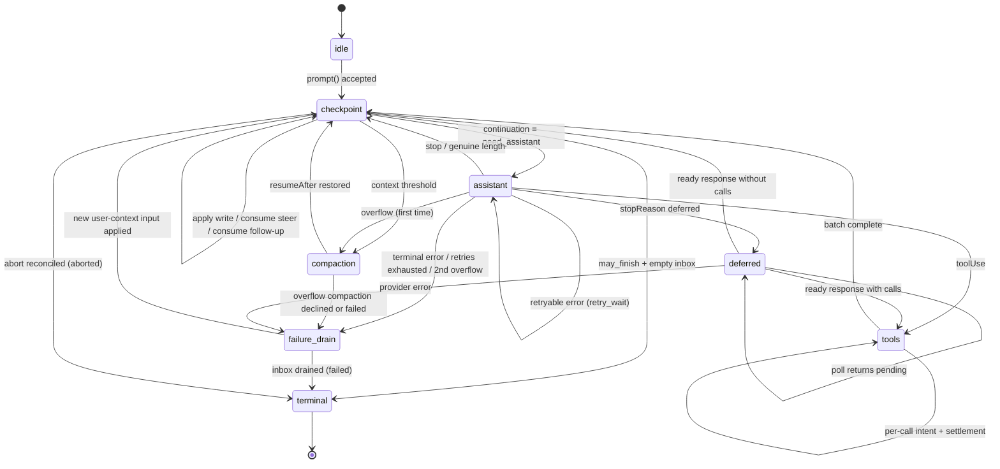

# AgentHarness v3 — implementation specification

**Status:** construction skeleton. When complete, this document supersedes `agent-harness-spec.md` in full, which itself superseded `harness-v2.md`. Until then, `agent-harness-spec.md` remains authoritative.

**Sources being merged:**

- `agent-harness-spec.md` — the audited base spec ("base" below). Its interpreter, effects boundary, hooks, events, classifier, abort/close, and race catalog carry over with mechanical renames only; do not rewrite them.
- The storage walkthrough jot ("jot" below, parts 1–9) — the three-store model, pending registers, terminal cleanup, recovery, retention/partitioning, schema evolution, backend stories, API deltas, and the binding decisions in jot part 9.
- The storage-redesign critique findings, as resolved by jot part 9.

**Global renames applied throughout v3:**

```text
node / Node*            → entry / *Entry          (continuity with coding-agent)
slot                    → register
"storage substrate"     → "Storage"
StoredValue / valueId   → gone (no values table)
```

**Section disposition markers used in this skeleton:**

- `[CARRY]` — take the base section verbatim, apply global renames.
- `[CARRY+]` — carry, plus the listed deltas.
- `[REWRITE]` — rewrite against the listed jot part / decision.
- `[NEW]` — no base equivalent; write from the listed jot part.

---

# Part 0 — Orientation

## 0.1 What this is

A durable runtime for agent conversations. You hand it a prompt; it talks to a language model, runs tools, and produces a response. The difference from an ordinary agent loop is that **the process can die at any instant** — mid-stream, between a tool call and its result, halfway through a summary — and a new process picks up exactly where the old one stopped, without repeating durable work and without losing anything that had committed.

It is a library, not a server. One process owns one session at a time.

## 0.2 Three concepts

### Session — the conversation

A session is one conversation, stored as a **tree** rather than a list.

```
a ── b ── c ── d
      └── e ── f
```

A tree, because three features need history that does not move: branching (explore an approach, back out, keep the record), compaction (replace a long prefix with a summary while the original stays queryable), and forking (copy a prefix into a new session). Entries are appended and never modified or deleted.

A session also holds **facts** (session name, entry labels, application key-value state — latest write wins, not part of the tree) and a **usage ledger** (every token and cost event, append-only).

### Lane — a cursor into the conversation

A lane is a **name plus a leaf**: the entry that new work extends. Every session has `main`. Applications create more.

A lane owns its leaf, its configuration (model, thinking level, active tools), its queues, and at most one operation in flight. Lanes run in parallel and share nothing except the tree beneath them.

Why lanes exist: a Slack channel is one session, and each thread is a lane. Threads share the channel's history but take turns independently. Two lanes can sit on the same entry and diverge on their next append — the tree handles that, and no coordination is needed.

**Lane vs fork:** a lane *shares* history; a fork *copies* it for isolation. Use a lane for a thread in a shared conversation, a fork for a subagent, an export, or a what-if.

### Harness — what runs a lane

The harness is the API surface. Per lane: `prompt`, `steer`, `followUp`, `nextRun`, `abort`, `resume`, `compact`, `navigateTree`, plus configuration getters and setters and a tree view. Harness-wide: lane management, tool and resource registries, hooks, events.

An **operation** is one accepted unit of work on a lane — a `run` (prompt to final answer, including all tool calls), a `compaction`, or a `navigation`. One per lane at a time.

## 0.3 Worked example — a Slack thread

A user posts in a channel that already has 400 entries of history. The application creates a lane for the thread, anchored at the channel's current leaf. Entry ids are UUIDv7s (§1.2); examples abbreviate them.

```
harness.createLane("slack:1719432.0021", at: "0195c8d1-4a2e-7b31-…")
lane.prompt("what changed in auth last week?")
```

What happens, in order:

1. **Acceptance.** The harness validates, runs the `before_run` hook, and commits one transaction: the user-message entry, the operation's `op.meta` register, and its first `op.state` — *"I am at a checkpoint, and I need an assistant response."*
2. **Intent.** It commits a second transaction: *"I am about to make a provider request. The response will be entry `0195c8d1-53a0-7c44-…` and the usage row will be `0195c8d1-53a0-7d18-…`."* Both ids are minted now; nothing has been sent yet.
3. **The request.** Streaming happens. This is the only part that is not durable.
4. **Settlement.** One transaction commits the response entry, its usage row, and the next state: *"the response has tool calls; here is the batch plan, with result ids already assigned."*
5. Tool calls follow the same intent → effect → settlement shape, one pair of commits each.
6. When the model stops without tool calls, a terminal transaction deletes the operation's registers, records the outcome in `lane.lastResult`, and leaves the lane idle.

Kill the process between any two of those transactions and restart. The harness reads the lane's registers, sees exactly which of those sentences was the last one committed, and continues. If it died in step 3, it knows a request may have been billed and may or may not have produced output — that is the one genuinely uncertain window in the whole system, and there is a stated policy for it.

Meanwhile a second thread in the same channel is running its own lane, over the same 400 entries of shared history, with no coordination between them.

## 0.4 Worked example — a crash mid-tool

```
lane.prompt("delete the stale migrations and run the test suite")
```

The model returns two tool calls. The harness commits the batch plan, then commits `call 0 is about to execute, with these exact arguments, and it declares itself unsafe to replay`. The tool starts deleting files. The process is killed.

On restart the harness reads one register and finds `calls[0].status = "effect_pending", replay = "never"`. It does not re-run the deletion. It appends a synthetic error result under the result id that was reserved before the effect started, marks the call complete, and continues to call 1. The conversation stays coherent — every tool call has a result — and nothing ran twice.

Had the tool declared `replay: "safe"` (a read, a query), the harness would have re-executed it with the persisted arguments instead.

## 0.5 The three stores

Everything in Parts 1–5 follows from these.

**1. Three stores, one invariant.** Everything durable is one of:

```text
entries        the conversation tree — write-once, append-only
registers      current mutable state — namespaced typed cells, overwrite or delete
usage ledger   cost history — append-only rows
```

*Every payload is in an entry, a register, or the ledger; there is no third place.* An entry is the complete conversation record — placement and payload in one row. A register holds its current typed value directly; overwriting discards the old value, and deletion removes the key. Content that durably exists before it has a place in the tree (queued input, deferred writes) waits in a `pending.entry` register and becomes an entry in the transaction that places it. Per-backend projections — branch index, full-text search, stats, partition inventory — are rebuildable from the three stores and carry no authority.

**2. Atomic transactions.** A transaction is a set of entry inserts, usage inserts, and register writes (set or delete), committed all-or-none with consecutive sequence numbers. There is no crash state inside a transaction. This is the only write primitive.

**3. The durable program counter.** After every step, the harness overwrites one register — `op.state/{operationId}` — with the *complete* current state of the operation. Recovery does not replay a journal or infer position from what is missing; it reads that register and switches on it. The state is *total* — it never depends on a previous state. Small captured values (configuration, stream options, retry policy) are inline; large stable payloads live in sibling `op.*` registers or are named by id. When the operation ends, the terminal transaction deletes its registers: a finished session holds exactly the conversation, the ledger, and a handful of lane and fact registers. There is no dead state to collect.

**4. The effect sandwich.** Provider requests and real tool calls are wrapped in two commits:

```
commit:  "about to do X; its output will use ids R and U"     ← intent
         do X                                                  ← the uncertain part
commit:  output + usage + next state                           ← settlement
```

Hooks follow their replay contract instead: a result becomes durable in the transaction that consumes it, and a crash before that transaction may rerun the hook. Thus every external effect can still happen without durable settlement. Provider/tool intents make that uncertainty explicit where replay policy depends on it; idempotent hooks accept it as a non-goal.

## 0.6 Non-goals

- **Exactly-once external effects.** See above. Hooks with their own side effects must be idempotent, keyed by operation id.
- **Provider stream resumption.** Partial streams are process-local, never persisted. A settled response is persisted *completely* before anything classifies it.
- **Multiple writers.** One process per session. The serving layer routes accordingly, and the SQLite backend enforces it with a fenced lease (§1.7). Lanes cover the workload that looks like multi-writer.
- **Replication.** A session lives in one place.
- **Durable write history.** Registers hold only current values: an overwritten register is gone, and there is no `getLog` or history table. Order-of-write assertions in tests use an instrumented storage decorator around `commit()` (Part 9); production auditing belongs to the telemetry layer (§5.8).
- **Compliance deletion through retention expiry.** Partition expiry is TTL and cost control, not erasure: `retainedTail` copies old messages forward into newer compaction entries, and summaries derive from old content. Compliance-grade "erase this" uses the precise-rewrite path (Part 6).

## 0.7 Notation and source types

- `TX[ a, b, c ]` — one atomic commit containing writes `a`, `b`, `c` in that order. The write vocabulary is `insert entry`, `insert usage`, `upsert namespace/key = value`, and `delete namespace/key`.
- Ids are UUIDv7s (§1.2). Examples abbreviate them: short tags — `e_*` entry ids, `u_*` usage ids, `op_*` operation ids — stand in for full ids where the time prefix is irrelevant; where the prefix matters, examples show it (`0195c8d1-4a2e-7b31-…`).
- `S(next)` — overwrite the `op.state/{operationId}` register with the next total operation state. `L(next)` — the same for `lane.state/{lane}`.
- **must / must not** are normative. Everything else is explanation.

Source type provenance:

- `AgentMessage`, `AgentTool`, `AgentToolResult`, `AgentEventSink`, `QueueMode`, and `ThinkingLevel`: `packages/agent/src/types.ts`.
- `Skill`, `PromptTemplate`, `AgentHarnessResources` (`Resources` below), `AgentHarnessTool`, `AgentHarnessStreamOptions`, and `AgentHarnessStreamOptionsPatch`: `packages/agent/src/harness/types.ts`.
- `Model`, `Models`, `Usage`, `RetryPolicy`, `StopReason`, `AssistantMessage`, `ImageContent`, provider messages, stream options, and deferred handles: `packages/ai`.
- `CompactionSettings`, `CompactionPreparation`, `CompactResult`, `BranchPreparation`, and `BranchSummaryResult`: `packages/agent/src/harness/compaction/`. Existing preparation and split-turn algorithms remain the implementation starting point unless this document explicitly changes them.
- `TelemetryContext` and typed schema helpers: `packages/telemetry`; the agent-owned schemas remain in `packages/agent/src/harness/telemetry.ts`.
- `TSchema` for durable custom-message registration: `typebox`.

The public `QueueMode` remains `"all" | "one-at-a-time"`. Public `RetryPolicy` remains the pi-ai shape `{ enabled, maxRetries, baseDelayMs }`; operation state stores its normalized `{ maxAttempts, baseDelayMs }` equivalent. `maxRetries` and `baseDelayMs` must be finite non-negative safe integers and `maxRetries + 1` must remain safe; disabled retry normalizes to one attempt. Exponential delay and `notBefore` arithmetic saturate at `Number.MAX_SAFE_INTEGER`. Public `CompactionSettings` remains `{ enabled, reserveTokens, keepRecentTokens }`; both token counts must be finite non-negative safe integers. Constructors and setters reject invalid settings before publication. This design adds `deferred?: boolean | { window?: "15m" | "1h" | "24h" }` to `AgentHarnessStreamOptions` and its patch type; structural requests always force it to false.

```ts
type SettledAssistantMessage = AssistantMessage & {
  stopReason: Exclude<StopReason, "pending">;
};

/** Added to packages/ai: a synchronous registry lease that captures the exact
    provider/model and Models auth resolver without resolving auth yet. */
interface ModelRequestLease {
  readonly model: Model;
  stream(context: Context, options?: ModelsApiStreamOptions<Api>):
    AssistantMessageEventStream;
  streamSimple(context: Context, options?: ModelsSimpleStreamOptions):
    AssistantMessageEventStream;
  fetchDeferred(handle: DeferredHandle, options?: ModelsDeferredFetchOptions):
    Promise<AssistantMessage>;
  cancelDeferred(handle: DeferredHandle, options?: ModelsDeferredCancelOptions):
    Promise<void>;
}
// Models.lease(provider: string, modelId: string): ModelRequestLease | undefined
```

There are no orchestration "records" in this system. Every durable thing is an **entry**, a **register**, or a **usage row**.

---

# Part 1 — Storage

Storage knows nothing about agents, lanes, or conversations. It stores entries and usage rows, updates registers, and answers a small fixed set of queries. Parts 2–4 are built entirely on this.

## 1.1 The model

```ts
type JsonValue = null | boolean | number | string | JsonValue[] | { [k: string]: JsonValue };

/** Write-once. The complete conversation record: placement and payload in one
    row. Created in exactly one transaction, never modified or deleted. The
    four concrete entry types extending this base are defined in §2.1. */
interface EntryBase {
  id: string;                // UUIDv7 (§1.2)
  parentId: string | null;
  seq: number;               // storage-assigned at commit
  timestamp: number;         // Unix ms, storage-assigned at commit
  type: EntryType;
  customType?: string;       // when type === "custom"
  // ...payload fields per entry type (§2.1)
}

type EntryType = "message" | "compaction" | "branch_summary" | "custom";

/** The only mutable store. A namespaced key holding its current typed value
    directly. Overwrite replaces the value; delete removes the key. */
interface Register<N extends RegisterNamespace = RegisterNamespace> {
  namespace: N;
  key: string;
  value: RegisterValues[N];
  seq: number;               // seq of the write that last set this register
}

/** Append-only cost ledger row. Never modified, never deleted (§1.6). */
interface UsageRow {
  id: string;                // UUIDv7 (§1.2)
  seq: number;               // storage-assigned at commit
  usage: Usage;
  entryId?: string;          // the entry this cost belongs to, when there is one
  adjustment: boolean;       // true = caller-supplied reconciliation, not a provider report
  details?: JsonValue;
}
```

**Why placement and payload are one row.** The superseded design split content ("values") from placement ("nodes") because they can have different birth times: queued input has content at enqueue and placement much later; an assistant response needs its id fixed *before* the content exists. The split is gone; the differing birth times remain, and two reservation regimes cover them (§2.2). Content that is durable before placement is *current mutable state* and waits in a `pending.entry` register keyed by its reserved entry id; the placement transaction writes the complete entry and deletes the register. An id that must exist before its content — an assistant response, a tool result — is just a minted string inside `op.state`, and settlement inserts the complete entry. Every read returns the whole entry with no join, no `valueId`, and no way for content to exist without an owner.

**Registers hold values, not pointers.** A register's value is the current typed state itself, never an id pointing at an immutable state value. Overwriting a register discards the previous value; nothing accumulates and there is no history to fold (§1.8). Deleting a register removes the key entirely and is a first-class write, distinct from storing JSON `null`, which remains a legal value where a namespace's type permits it (`lane.leaf` at the root, `fact.custom`).

## 1.2 Identity and partitions

Every id storage stores — entry ids, usage ids, and every reserved id that will become one — is a **UUIDv7**, minted through the session's id generator (§2.8). A UUIDv7 begins with 48 bits of Unix milliseconds: the first 12 hex characters of the id *are* a timestamp, and that timestamp, truncated to the partition period, *is* the id's partition assignment. There are no partition columns anywhere — not on entries, not on ledger rows, not in any register value. The period length (monthly in every example) is a deployment property of the partitioned backend; Memory, JSONL, and SQLite never partition.

What the embedded prefix buys:

- **Every reference is self-describing.** A `parentId`, a `lane.leaf` value, a `fact.label` key, an id inside `op.state` JSON — any of them can be classified against the partition retirement inventory by reading its prefix, with no lookup.
- **Native partition pruning.** Postgres compares `uuid` bytewise and UUIDv7 sorts in time order, so `PARTITION BY RANGE (id)` works directly, with period-boundary UUIDs (zeroed tails) as bounds. The primary key stays `(session_id, id)`, and a point lookup prunes to one partition from the id itself (§1.7).
- **The cost.** Ids leak their creation period to applications. Accepted: the alternative is a denormalized partition column on every row, plus no answer at all for references held inside register values.

Minting rules:

1. An id is minted with `now()` **at reservation**. For born-placed entries — the hot path — reservation and placement are the same transaction, so the prefix equals the placement date.
2. **Followers inherit the leader's timestamp.** Tool-result ids are minted with their assistant entry id's 48-bit timestamp (fresh random bits keep them unique), so an assistant and its tool results share a partition by construction, even across a midnight or month boundary. This is a deliberate, documented deviation from "UUID timestamp = wall clock". It exists because dropping a partition must never orphan half of a call/result exchange: a retained tool result whose assistant call is gone heads a context every provider rejects.
3. **Synthetic settlement needs no special case.** Crash recovery and force-expiry write under already-reserved ids (§4.5), so synthetic responses and results land in the partition their intent promised.
4. **Late placement pins.** A `nextRun` message minted in January and consumed in April is placed as a January-partition entry — exact, but it means unplaced reservations pin their partitions. All such reservations are enumerable from hot registers (`pending.entry` keys and the reserved ids inside open `op.state` values are UUIDv7s: decode, take the minimum), so drop preflight is a bounded register scan. Retention policy for abandoned reservations is Part 6.

Traversal discrimination is exact by construction:

```text
parent entry exists                               → continue
parent missing, id prefix in a retired period     → retention boundary — clean stop
parent missing, id prefix in a live period        → corruption — loud
```

Memory, JSONL, and SQLite never retire periods, so the middle case is unreachable there: a missing parent is always corruption. The rules are still core — branch scans and forks must implement the boundary stop (§2.5, §2.7) — but only the future Postgres backend (§1.7) and the conformance suite's abstract retired-range set (Part 9) exercise it.

## 1.3 Register namespaces

```ts
interface RegisterValues {
  "lane.leaf":       string | null;                // entry id; null = lane at the root
  "lane.config":     LaneConfiguration;            // §2.3
  "lane.state":      LaneState;                    // §3.3
  "lane.lastResult": LaneLastResult;               // §3.13
  "op.meta":         Operation;                    // §3.1
  "op.state":        OperationState;               // §3.2 — the program counter
  "op.tool_args":    Record<string, JsonValue>;    // effective tool arguments (§3.8)
  "op.preparation":  DurableStructuralPreparation; // §3.9
  "pending.entry":   PendingEntry;                 // §2.2
  "fact.name":       string;
  "fact.label":      string;
  "fact.custom":     JsonValue;                    // JSON null is a legal value
}
type RegisterNamespace = keyof RegisterValues;

/** Unplaced content: current mutable state until the placement transaction
    writes the complete entry and deletes this register (§2.2). */
interface PendingEntry {
  type: "message" | "custom";
  customType?: string;
  payload?: JsonValue;       // the content that becomes the entry's payload;
                             // absent = a custom entry with no data
}

interface DurableFileOperations {
  read: string[]; written: string[]; edited: string[];
}
type DurableStructuralPreparation =
  | { kind: "compaction"; messagesToSummarize: AgentMessage[];
      turnPrefixMessages: AgentMessage[]; retainedTail: AgentMessage[];
      isSplitTurn: boolean; tokensBefore: number; previousSummary?: string;
      fileOps: DurableFileOperations; settings: CompactionSettings }
  | { kind: "branch_summary"; messages: AgentMessage[];
      fileOps: DurableFileOperations; totalTokens: number };
```

| Namespace | Key | Value | Meaning |
|---|---|---|---|
| `lane.leaf` | lane name | entry id or `null` | where this lane appends next |
| `lane.config` | lane name | `LaneConfiguration` | total lane configuration |
| `lane.state` | lane name | `LaneState` (§3.3) | `currentOperationId`, `pendingNextRun` |
| `lane.lastResult` | lane name | `LaneLastResult` (§3.13) | terminal outcome of the lane's most recent operation |
| `op.meta` | operation id | `Operation` (§3.1) | acceptance data; written once, never overwritten |
| `op.state` | operation id | `OperationState` (§3.2) | total operation state — **the program counter** |
| `op.tool_args` | `{opId}:{sourceIndex}` | effective arguments | written once at tool clearance (§3.8) |
| `op.preparation` | `{opId}:{taskId}` | `DurableStructuralPreparation` | written once before the decision hook (§3.9) |
| `pending.entry` | reserved entry id | `PendingEntry` | queued content awaiting placement (§2.2) |
| `fact.name` | `""` | string | session name |
| `fact.label` | entry id | string | entry label |
| `fact.custom` | application key | `JsonValue` | application state |

That is the complete set. Two lifetimes are visible in the key shape:

```text
lane.*  fact.*     session-lived; facts are deleted only by explicit application action
op.*               operation-lived; deleted by the terminal transaction (§3.13)
pending.entry      lives until its content is placed or cancelled
```

- `op.meta` and `op.preparation` keys are written exactly once; `op.tool_args` keys are written once per key, keyed by the producing step so batches never collide. All are deleted no later than the terminal transaction; only `op.state` is overwritten during the operation.
- Operation-owned `pending.entry` registers still unconsumed at the end (remaining inbox items and abort-drained items) are deleted by the terminal transaction — a consumed item's register dies in its placement transaction; lane-owned ones (`pendingNextRun`) outlive operations and die when consumed or cancelled (§3.11).
- `lane.lastResult` is written only by terminal transactions and overwritten by the next one on its lane — one bounded register per lane, forever. Recovery never reads it; it exists so an application that accepted an operation, crashed, and reopened can still learn its outcome (§3.13).
- Deleting a fact removes its register. Storing JSON `null` in `fact.custom` is a different, legal state; there are no tombstones.
- There is no `queue.disposition` namespace. It existed solely so a repeated `cancelQueued` could answer `already_cleared`, at the cost of one immortal register per cancelled item. Triage is now: pending → `cancelled`; entry exists → `already_consumed`; else → `not_found` (§3.11). Clients that retry a lost cancel treat `not_found` as success.

## 1.4 Transactions

```ts
type Write =
  | { kind: "entry"; entry: Omit<Entry, "seq" | "timestamp"> }
  | { kind: "usage"; row: Omit<UsageRow, "seq"> }
  | { kind: "register"; op: "set"; namespace: RegisterNamespace; key: string;
      value: JsonValue }
  | { kind: "register"; op: "delete"; namespace: RegisterNamespace; key: string };

interface Transaction { writes: Write[] }

interface CommitResult { firstSeq: number; seqs: number[]; timestamp: number }
```

Rules:

1. A transaction commits **all-or-none**. There is no observable state in which some of its writes exist and others do not.
2. Writes receive **consecutive** `seq` values in the order given. `seq` is monotonic session-wide across all lanes and all write kinds. A register `set` stamps the register with its assigned `seq`.
3. Within a transaction, writes apply in order: an entry may name a parent created earlier in the same transaction; a register value may reference entry or usage ids created earlier in the same transaction. A placement transaction inserts the complete entry and deletes its `pending.entry` register together (§2.2) — there is never a moment where both exist.
4. Entry and usage ids share one session-wide id namespace. Writing either kind under any existing id is **corruption**, not an update.
5. A register `set` with the same `(namespace, key)` replaces the current value; `delete` removes the key; a later `set` recreates it. No history is retained. A `delete` naming an absent key is a no-op, so public deletions such as clearing an unset label stay legal.
6. Transactions on one session are **serialized**. There is one writer and one queue.

Session validates the complete transaction, including JSON serialization and runtime schemas, before storage admission. A failed admitted commit **faults the harness**: all effects stop, all calls reject, and the process must be restarted. A partially applied transaction is not tolerated.

## 1.5 Queries

One `Storage` instance serves one session. Repository discovery and lifecycle are outside this interface (§2.8).

```ts
interface Storage {
  commit(tx: Transaction): Promise<CommitResult>;

  getEntries(ids: string[]): Promise<ReadonlyMap<string, Entry>>;

  getRegister<N extends RegisterNamespace>(namespace: N, key: string):
    Promise<Register<N> | undefined>;
  listRegisters<N extends RegisterNamespace>(namespace: N): Promise<Register<N>[]>;

  scanBranch(q: BranchScan): Promise<Entry[]>;            // §2.5
  scanBranchStructure(q: BranchScan): Promise<EntryStructure[]>;
  scanEntries(q: EntryScan): Promise<Entry[]>;            // session-wide tree inventory
  getStats(): Promise<SessionStats>;                      // maintained projection (§1.6)

  close(): Promise<void>;
}

/** Placement metadata without payload fields. */
type EntryStructure = Pick<Entry, "id" | "parentId" | "seq" | "timestamp" | "type" | "customType">;

interface EntryScan {
  type?: EntryType; customType?: string;
  fromSeq?: number; toSeq?: number;
  order?: "asc" | "desc"; limit?: number;
}
```

There is deliberately no cross-namespace register scan, no ledger scan, and no durable write log. Restore, facts, forks, and execution follow exact ids and keys; entry inventory uses `scanEntries`; totals use the stats projection (§1.6); test-order assertions wrap `commit()` with the instrumented-storage decorator (Part 9); production auditing belongs to telemetry (§5.8).

Recovery and execution reads must be index-driven and bounded. They may not infer state from an absent value, and there is no register history to fold. Exact dereference is allowed: one current state may name a bounded set of entries and registers, fetched in one batch without order-dependent reduction. Public inventory and debugging APIs may intentionally read more than a hot path; their `limit`/pagination behavior is explicit at the `SessionTree` layer.

`close()` is idempotent. It seals admission, rejects later reads/commits on that instance, drains commits admitted before the seal, then releases resources and the writer claim. Durable data is reopened through the repository.

## 1.6 Usage ledger

Every settled provider attempt writes one `UsageRow` — successful, failed, retried, and synthetic attempts alike, including attempts whose operation later aborts. Settlement transactions write the response entry and its usage row together (§3.7); synthetic settlements write zero usage under the reserved usage id. Rows are append-only: terminal cleanup deletes an operation's registers but never its ledger rows, so billing survives everything that can happen to orchestration state.

```jsonc
{ "id": "u_7", "seq": 815, "entryId": "e_51", "adjustment": false,
  "usage": { "input": 12000, "output": 431, "cost": { ... } } }
```

- `entryId` names the entry the cost belongs to, when there is one. Structural (summary) attempts that fail before producing an entry, and standalone adjustments, have none.
- `adjustment: true` marks a caller-supplied reconciliation (`recordUsage`, §5.1) rather than a provider report. The format-3 import writes one aggregate adjustment row (Appendix C).
- Provider-attempt usage ids are UUIDv7s reserved in the intent commit (§1.2), so a settlement writes under exactly the id its intent promised. Adjustment rows, tool-reported usage rows, and import aggregates mint their ids at commit; nothing reserves them.
- `getStats()` is a maintained projection over the ledger and the entry count. After every commit it equals the ledger sum; the conformance suite asserts this (Part 9). There is no ledger scan: totals come from the projection, and individual rows reach the application through the `usage` event at commit time (§5.5).

## 1.7 Backends

Three encodings of one model ship now — Memory, JSONL, SQLite — and all three pass the same conformance suite (Part 9). Postgres is a planned fourth; it appears here because its native partitioning shapes the retention design (Part 6). Each backend records the session's `storageVersion` (Part 7): a JSONL header field, a SQLite/Postgres catalog column. Memory sessions are always current.

### Memory

```ts
entries:   Map<string, Entry>
registers: Map<string, Register>       // key: `${namespace}\u0000${key}`
usage:     Map<string, UsageRow>
children:  Map<string, string[]>       // parentId → entry ids, for tree walks
```

One queue serializes commits. A commit validates and applies writes to temporary transactional state, then publishes the maps together. A register delete is a map delete. Reads are map lookups; `scanBranch` walks `parentId` and filters in RAM. There is no log: Memory holds exactly the live state and nothing else.

### JSONL

The file is not the state; it is the **replay recipe** for the Memory maps above. One physical line per `commit()`. Storage assigns sequence/timestamp fields first, then encodes one committed write as a JSON object line or several as one **array line**.

```jsonl
{"v":4,"kind":"header","id":"s_1","storageVersion":1,"createdAt":1700000000000,"cwd":"..."}
[{"kind":"entry","seq":101,"timestamp":1700000000000,"id":"e_50","parentId":"e_41","type":"message","message":{"role":"user","content":[...]}},
 {"kind":"register","op":"set","seq":102,"namespace":"op.meta","key":"op_9","value":{...}},
 {"kind":"register","op":"set","seq":103,"namespace":"op.state","key":"op_9","value":{...}},
 {"kind":"register","op":"set","seq":104,"namespace":"lane.leaf","key":"main","value":"e_50"},
 {"kind":"register","op":"set","seq":105,"namespace":"lane.state","key":"main","value":{...}}]
{"kind":"usage","seq":110,"id":"u_7","entryId":"e_51","adjustment":false,"usage":{...}}
{"kind":"register","op":"delete","seq":131,"namespace":"op.state","key":"op_9"}
```

- This is format 4. The incompatible format-4 code currently in the source tree is unfinished and is replaced in place; no migration for it is required. Coding-agent format 3 remains supported (Appendix C).
- Open replays lines in order into the Memory maps: entries and usage rows accumulate; a later register `set` overwrites the key, `delete` removes it. That is *decoding*, not recovery logic. Open verifies persisted sequence continuity and timestamps and never regenerates committed timestamps. All queries then run in RAM.
- **A torn final line is discarded whole**, including every element of an array, and is truncated before new writes are admitted. This is what makes "no crash prefix inside a transaction" true here.
- A malformed *interior* line, or a complete-but-invalid transaction, is corruption. The one exception: superseded old-shape register lines from before a schema migration decode leniently as keyed raw JSON during replay (Part 7); compaction retires them.
- Durability is process-crash level: a resolved `commit()` survives process death. No fsync promise.
- Optional: retain `(offset, length)` per entry and load payloads lazily, keeping only structure and registers resident. Do this only if profiling demands it.

**Snapshot compaction.** In SQLite a register `set` is an in-place upsert — a 30-turn run leaves one `op.state` row and then zero. In JSONL every `set` appends, so the same run appends ~10 full `op.state` lines, all dead the moment the terminal `delete` line lands: the file grows with *write history* even though the logical state does not. The fix is rewriting the file as `header + current entries + current registers + usage rows`, via temp file + atomic rename. For a four-entry run:

```text
before compaction:  ~10 transaction lines, ~27 writes — op.state revisions,
                    tool args, pending payloads, all dead since the terminal line
after compaction:   header + 4 entry lines + 2 usage lines + 4 lane register lines
```

When to compact: on open when the dead-bytes ratio crosses a threshold; optionally after terminal transactions; always after a schema migration (Part 7). Between compactions, normal operation is append-only and O(1) per commit. One consequence worth stating: deleted pending payloads and superseded state revisions **linger as bytes** until compaction — logical deletion is immediate, physical deletion is deferred. A deployment that needs prompt physical removal of sensitive cancelled content compacts eagerly at terminal boundaries.

### SQLite

```sql
entries(session_id, id TEXT, parent_id TEXT, seq INTEGER, type TEXT, custom_type TEXT,
        timestamp INTEGER, payload TEXT, PRIMARY KEY (session_id, id)) WITHOUT ROWID;
CREATE INDEX ix_entry_parent ON entries(session_id, parent_id);
CREATE INDEX ix_entry_seq ON entries(session_id, seq, type);

registers(session_id, namespace TEXT, key TEXT, seq INTEGER, value TEXT,
          PRIMARY KEY (session_id, namespace, key));

usage_ledger(session_id, id TEXT, seq INTEGER, entry_id TEXT, adjustment INTEGER,
             usage TEXT, details TEXT, PRIMARY KEY (session_id, id)) WITHOUT ROWID;
CREATE INDEX ix_usage_seq ON usage_ledger(session_id, seq);

-- Private branch index (§2.6). Not registers; no equivalent in the other backends.
branch_entries(session_id, branch_id TEXT, entry_id TEXT, entry_seq INTEGER, entry_type TEXT,
               PRIMARY KEY (session_id, branch_id, entry_id)) WITHOUT ROWID;
-- Ordered scans. entry_seq must follow branch_id directly or ORDER BY needs a
-- temp b-tree; entry_id and entry_type trail so the index covers id-only reads.
CREATE INDEX ix_be_seq  ON branch_entries(session_id, branch_id, entry_seq, entry_id, entry_type);
-- Type-filtered scans.
CREATE INDEX ix_be_type ON branch_entries(session_id, branch_id, entry_type, entry_seq, entry_id);
CREATE INDEX ix_be_entry ON branch_entries(session_id, entry_id);
branch_meta(session_id, branch_id TEXT, tip_entry_id TEXT, tip_seq INTEGER,
            base_branch_id TEXT, base_seq INTEGER,
            PRIMARY KEY (session_id, branch_id));
CREATE UNIQUE INDEX ix_bm_tip ON branch_meta(session_id, tip_entry_id);

sessions(session_id, created_at, parent_session_id, storage_version, metadata);
session_stats(session_id, message_count, usage_payload);
session_sequences(session_id, next_seq);
writer_leases(session_id, owner_id TEXT, fence INTEGER, expires_at_ms INTEGER);
```

One `commit()` is one SQL transaction: insert entries, insert ledger rows, upsert or delete registers, maintain the branch index, bump `session_stats`. Never an UPDATE or DELETE on an entry or ledger row; mutability is confined to registers, the branch index (`branch_meta` tips and bases), stats, sequences, the session catalog row, and leases.

**Every transaction must open with `BEGIN IMMEDIATE`.** A deferred `BEGIN` that
reads before it writes takes a read snapshot and must later upgrade to the write
lock; if another writer committed in between, SQLite fails that upgrade — and
`busy_timeout` does **not** rescue it, because no amount of waiting can refresh a
stale snapshot. The only recovery is rollback and full retry.

Every commit has this shape, not just a few. Allocating the sequence range reads
`session_sequences.next_seq` and then writes it, so a read precedes a write in every
transaction the system performs. Branch creation (§2.6) adds a second instance,
reading the newest compaction before inserting. `BEGIN IMMEDIATE` takes the write
lock up front and avoids an unrecoverable stale-snapshot upgrade, so there is no case
where a deferred `BEGIN` is the right choice here.

**`writer_leases` enforces the single-writer rule.** Expiring fenced ownership:
`open()` acquires the claim, storage renews it on appends and while idle, and close
stops renewal after the queue drains and deletes only its matching `(owner_id,
fence)` pair — so a stale owner cannot release the replacement that succeeded it.
This is what makes "one process owns one session" an enforced property rather than
a convention the serving layer is trusted to uphold. Memory and JSONL have no
equivalent and rely on process ownership; a JSONL session opened twice is corrupt
and undetected.

**Writer scope is per database file, not per session.** WAL mode permits exactly one
writer per file. Because these tables are keyed by `session_id`, several sessions may
share a file, and the design's one-writer-per-session rule does not by itself make
writes uncontended. Choose deliberately:

- *One file per session* — the single-writer claim becomes literally true, and there
  is no cross-session contention. Preferred unless something forces otherwise.
- *One file for many sessions* — correct, but all sessions share SQLite's one-writer queue. Use only when that contention is acceptable.

Atomicity itself needs no special handling. A multi-write transaction is all-or-none
by the file format: WAL frames become visible only when the commit record lands, so a
concurrent reader observes either none of a transaction's writes or all of them.

Each physical segment of `scanBranch` uses one JOIN; §2.6 combines segment ranges:

```sql
SELECT e.id, e.parent_id, e.seq, e.type, e.custom_type, e.timestamp, e.payload
FROM branch_entries b
CROSS JOIN entries e ON e.session_id = b.session_id AND e.id = b.entry_id
WHERE b.session_id = ? AND b.branch_id = ? AND b.entry_seq > ? AND b.entry_seq <= ?
ORDER BY b.entry_seq;
```

`CROSS JOIN` is load-bearing: it forces `branch_entries` to be the outer loop. Left
to itself the planner may drive from `entries`, scan the table, and sort through a
temporary b-tree. Assert the plan in a test:

```
SEARCH b USING COVERING INDEX ix_be_seq (session_id=? AND branch_id=? AND entry_seq>?)
SEARCH e USING PRIMARY KEY (session_id=? AND id=?)
```

Any plan containing `USE TEMP B-TREE FOR ORDER BY` or a scan of `entries` is a
regression.

`scanBranchStructure` is the same query without the payload column. `getEntries` is a primary-key lookup keyed by `e.id IN (...)`.

The repository's existing `SessionSearch` surface remains. SQLite replaces its rowid-dependent index with an FTS projection keyed by stored `session_id` and `entry_id`; searchable text is the JSON serialization of the entry, matching the scanning fallback. The transaction that places an entry also inserts its projection after validation. Pending content is not searchable before placement. Fork import populates the same projection, and session deletion removes its rows. Search never depends on `entries.rowid`.

### Postgres — future fourth backend

Planned, not normative; named now because its native partitioning is what the identity design (§1.2) and the retention design (Part 6) are shaped for. The logical model is identical. Two temperature zones in one database:

```text
hot, unpartitioned catalog:        partitioned by entry-id range (period bounds):
  registers                          entries
  branch_meta                        usage_ledger
  partition inventory                branch index rows
  session_stats                      FTS projection
  writer leases, sessions
```

- `PARTITION BY RANGE (id)` on the uuid primary-key column, with period-boundary UUIDs (zeroed tails) as bounds. The primary key stays `(session_id, id)`; point lookups prune to one partition from the id's own time prefix, and no partition-key column exists.
- One database means **one transaction spans hot registers and partitioned entries**: an acceptance transaction — entry inserts plus several register writes — is a single Postgres transaction, exactly as on SQLite.
- Expiry is `seal period → write per-session aggregates into the inventory → DETACH CONCURRENTLY → DROP`. `DETACH CONCURRENTLY` is not transactional, so expiry is a small recoverable protocol driven by inventory state, not one atomic step; a crash between steps redoes the step the inventory names. Retention semantics — pins, preflight, boundaries — are Part 6.

## 1.8 Why write-once plus registers

- **Recovery is a read.** Five register point-lookups per lane, then exact-id dereference (§4.4). No reducer exists to have a bug.
- **Crash states are enumerable.** Between transactions, never inside one.
- **Cleanup is deletion, not collection.** A 30-turn run overwrites one `op.state` register ~30 times and then deletes it. What remains is exactly the conversation, the ledger, and a handful of lane and fact registers — no dead state values, no history rows, nothing to garbage-collect. (JSONL defers *physical* reclamation to snapshot compaction; the logical state is identical.)
- **No repair-by-rewrite.** Recovery appends entries and overwrites only the registers it owns, with the same transitions normal execution would commit; interrupt it and rerun it and you get the same result.
- **Concurrency is trivial.** Readers never see partial state; there is nothing to lock.
- **The one deliberate double-write.** Queued content is serialized twice: into its `pending.entry` register at enqueue and into its entry at placement. Only queued items pay it — assistant and tool settlements, the hot path, write their entries once. In exchange every queue item is one id, cancellation deletes content outright, and no payload ever exists without an owner.

---

# Part 2 — The conversation tree

## 2.1 Entries

An **entry** is the complete stored row (§1.1): placement fields and payload together. What `getEntries` and the scans return is exactly what was committed — there is no materialization step and no join.

```ts
interface MessageEntry       extends EntryBase { type: "message"; message: AgentMessage;
                                                 terminate?: true }
interface CompactionEntry    extends EntryBase { type: "compaction"; summary: string;
                                                 retainedTail: AgentMessage[]; tokensBefore: number;
                                                 details?: JsonValue; usage?: Usage; fromHook: boolean }
interface BranchSummaryEntry extends EntryBase { type: "branch_summary"; fromId: string;
                                                 summary: string; details?: JsonValue;
                                                 usage?: Usage; fromHook: boolean }
interface CustomEntry        extends EntryBase { type: "custom"; customType: string; data?: JsonValue }

type Entry = MessageEntry | CompactionEntry | BranchSummaryEntry | CustomEntry;
```

Rules:

- `type` and `customType` are structural fields: branch queries filter on them and the branch index denormalizes them (§2.6). `customType` is set exactly on custom entries; payload fields never drive structure.
- Assistant entries always contain a `SettledAssistantMessage`. Reject `pending` before writing.
- Tool-result entries carry `terminate?: true`. It is orchestration state that `ToolResultMessage` has no field for.
- Every compaction and branch summary carries `fromHook`: `true` for hook output, `false` for generated.
- Every compaction stores a complete `retainedTail` (`[]` when empty). **Context never reads past a compaction.** This is what makes a compaction a self-contained checkpoint rather than a pointer into history.
- A custom entry may carry no `data`. There is no payload-compatibility table to check: an entry either decodes against its type's runtime schema or is corruption.
- Payloads are inline, so two entries never share stored content; there is no deduplication layer.

## 2.2 Placement

The tree's central rule:

> An **entry** is created, complete, when placement happens. Content that is durable *before* placement is current mutable state and waits in a `pending.entry` register; the placement transaction writes the entry and deletes the register. Neither is ever modified after that.

Three cases, all mechanical:

**Born placed** — assistant responses, tool results, direct appends to an idle lane. Content and placement arrive together; one transaction:

```
TX[ insert e_a4 = { parent: e_q1, type: "message", message: <assistant response> },
    upsert lane.leaf/main = "e_a4" ]
```

**Content first, placement later** — queued input (`steer`, `followUp`, `nextRun`) and deferred tree writes. The entry id is minted at enqueue and doubles as the register key; queue state references content by that one id — the old `{ nodeId, valueId }` pair collapses to a single string. Two transactions, possibly far apart:

```
t0  TX[ upsert pending.entry/e_q1 = { type: "message", payload: <200KB message> },
        S(next){ ...inbox.steer += "e_q1" } ]

t1  TX[ insert e_q1 = { parent: e_a3, type: "message", message: <from the register> },
        delete pending.entry/e_q1,
        upsert lane.leaf/main = "e_q1",
        S(next){ ...inbox.steer -= "e_q1" } ]
```

The register dies in the transaction that places the entry. Crash before `t1`: the item is still queued. Crash after: it is placed and the register is gone. **There is no third state** — until placement or cancellation, exactly one of register and entry exists at every commit boundary, never both and never neither. Cancellation is the other exit: `cancelQueued` deletes the register, and the content is simply gone, never having touched the tree (§3.11). Because the id was minted at enqueue, a late-placed entry lands in the partition of its mint date (§1.2).

**Id reserved before content exists** — assistant responses and tool results. The reserved id is a plain minted string inside `op.state`; no register and no row exist until settlement inserts the complete entry. Reserving costs nothing.

These are the **two reservation regimes**: settlement-family ids (responses, tool results, usage rows) are strings in operation state; queued-content ids are `pending.entry` registers. "A reserved id is just a string" is true only of the first family.

Consequences to rely on:

- A pending item is **invisible to tree queries** (no entry) but **visible in snapshots**: the owning state lists its id, and the payload is dereferenced from its register.
- "Has this been placed yet?" is answered by the owning queue list and the register's existence — never by the absence of an entry.
- The double write is the model's one deliberate redundancy (§1.8). SQLite and Postgres can implement placement as `INSERT … SELECT` from the register row inside the placement transaction; in JSONL both copies persist as bytes until snapshot compaction (§1.7). Only queued items pay it; settlement never does.

## 2.3 Lanes

A configured lane is three registers — plus `lane.lastResult` once its first operation has ended (§3.13). Fresh or normalized-v3 `main` may temporarily lack `lane.config` until first harness attachment:

```
lane.leaf/{name}    = entry id or null
lane.config/{name}  = LaneConfiguration      // absent only for unconfigured main
lane.state/{name}   = LaneState
```

```ts
interface LaneConfiguration {
  model: { provider: string; modelId: string };
  thinkingLevel: ThinkingLevel;
  activeToolNames: string[];
}
```

- A lane's leaf moves in exactly two ways: the lane appends an entry (leaf becomes that entry), or the lane navigates (leaf jumps to an existing entry).
- `LaneConfiguration` is **total**. A setter overwrites the whole register; it is never a patch and never a tree entry.
- Creating a lane copies no tree content, no history, and no configuration from its anchor:

```
TX[ upsert lane.config/{name} = <seed configuration>,
    upsert lane.leaf/{name}   = anchorEntryId,
    upsert lane.state/{name}  = { currentOperationId: null, pendingNextRun: [] } ]
```

- Lanes are never deleted or renamed. Names are permanent application keys.
- `main` exists in every session.
- Two lanes at the same leaf simply diverge on their next append.

## 2.4 Facts

Session-scoped, latest-wins, not part of the tree.

```
fact.name/""          = string
fact.label/{entryId}  = string
fact.custom/{key}     = JsonValue
```

Setting a fact to `undefined` deletes its register — real deletion, not a tombstone; deleting an unset fact is a no-op (§1.4). JSON `null` is a legitimate custom value, stored directly, and is distinguishable from deletion because the register itself exists or does not. The built-in and custom namespaces never overlap. Fact writes commit immediately and never move a leaf.

## 2.5 Branch queries and context

```ts
interface BranchScan {
  start?: string;               // default: the view's lane leaf
  stopAtType?: EntryType;       // scan ends after the first match, inclusive
  stopAtId?: string;
  type?: EntryType;
  customType?: string;
  order?: "newestFirst" | "oldestFirst";   // default newestFirst
  limit?: number;
  cursor?: EntryCursor;
}
type EntryCursor = { seq: number };
```

Semantics: take the path from `start` toward the root, order it (default `newestFirst`), stop **inclusively** at the first `stopAt` match, filter by `type`/`customType`, apply the exclusive cursor, then apply `limit`. For `newestFirst`, a cursor retains `seq < cursor.seq`; for `oldestFirst`, it retains `seq > cursor.seq`. A `stopAt` entry is returned only if it also passes the filter.

**Retention boundaries.** On a backend with retired partitions, a scan that reaches an entry whose `parentId` decodes to a retired period stops there cleanly, as if at a root (§1.2). The stop must be explicit at public surfaces: branch finders report a truncation marker — `truncatedAt: { parentId }`, the partition being the id's own time prefix — never a silently short result, because extension-state lookups walk past compactions by design (§5.3) and must distinguish "never set" from "expired". Storage itself needs no extra channel: the marker derives from the last returned entry's `parentId`. The three shipping backends never truncate.

**Context projection** — how a provider request is built:

1. `scanBranch({ start: leaf, order: "newestFirst", stopAtType: "compaction" })`.
2. Reverse to oldest-first. If a compaction terminated the scan, the context is: its `summary`, then its `retainedTail`, then every entry after it. **Nothing earlier is read.**
3. Drop assistant responses whose stop reason is `error`, `aborted`, or `deferred`. Retain genuine output-limit `length`.
4. Run custom entries through `entryProjectors`. An unprojected custom entry never enters context.
5. Run `transform_context`, then `toProviderMessages`.

There is no rule for omitting an overflow response, and no link anywhere pointing at one. An overflow response is committed with stop reason `error` (§3.7) and is therefore dropped by rule 3 like any other error, and by any downstream `transformMessages` that filters the same way.

**Append-only context invariant.** Across the requests of one lane, provider context must only grow at the tail. An insertion before the previous request's tail invalidates the provider's KV cache and multiplies cost. This is *why* mid-run writes defer to checkpoints, where they append at the tail. Compaction is the one deliberate cache invalidation, and it trades that for a smaller context.

## 2.6 The branch index

Memory and JSONL walk parent pointers in RAM. SQLite — and the future Postgres backend — maintain a private segmented branch cache so a diverging append does not copy an unbounded root prefix.

`branch_entries` stores the entries physically present in one segment. `branch_meta` stores its tip and optional `{ baseBranchId, baseSeq }`. A segment logically contains its own rows above `baseSeq` plus the referenced base prefix through `baseSeq`.

Append:

1. If a branch tip equals the lane leaf, append one row and move that tip.
2. Otherwise resolve a branch that actually covers the leaf, find the newest compaction at or below the leaf through the complete segment chain, copy only rows after that compaction through the leaf, and set the older prefix as the new segment's base.
3. Append the new entry and make it the new segment tip.

Read newest segment first. If the requested range crosses `baseSeq`, continue through the base chain with the upper bound capped at that boundary. Merge segment results into the requested order before filtering/limiting.

Two correctness rules are mandatory:

- The base branch must itself cover the leaf within its logical range; merely containing the leaf in an ancestor is insufficient.
- The newest compaction search must traverse the base chain; checking only the newest physical segment can miss it.

**Partition purity** — two additional rules on a partitioned backend, vacuous on SQLite:

- **Append rule.** Appending an entry whose partition differs from the current segment's closes the segment: the old segment becomes the base of a fresh one. Segments are single-partition by construction, so index rows live in the same partition as the entries they index and die with it (§1.7).
- **Diverge rule.** Copy-on-diverge caps at partition boundaries. Never copy older-partition index rows forward into a newer segment; chain a base reference into the older partition's own segments instead — otherwise new partitions accumulate rows referencing droppable ones, and a drop silently gaps retained scans.

Traversal stepping into a base whose partition is retired is a retention boundary (§2.5): terminate the scan and report it. Truncate the chain lazily on first access; no eager `branch_meta` rebuild happens at drop time. `branch_meta` — tips and base pointers, hot, mutable, globally unique — always stays in the unpartitioned catalog.

```text
S1 (2027-01): e1…e19  ←base─ S2 (2027-02): e20…e29  ←base─ S3 (2027-03): e30…e42
drop 2027-01 → a scan via S3→S2 stops after e20 and reports the boundary; S2/S3 untouched
```

The cache must preserve:

- following a segment chain yields the exact root path with no gaps or duplicates — up to a retention boundary, where it stops cleanly;
- all chains containing an entry agree below it;
- runtime reads never fall back to a table scan or parent walk;
- stale branches remain valid cache history;
- only an explicit repair operation rebuilds the cache from entries.

Tests assert these invariants and the required query plans. No wall-clock threshold is normative.

## 2.7 Forks

A fork is a repository operation over one coherent source-session snapshot. It copies selected entries, latest facts, lane leaves, and total configuration; it never copies `op.*`, `pending.entry`, or `lane.lastResult` registers or ledger rows — destination lanes start with a fresh empty `LaneState`.

```ts
type ForkOptions =
  | { scope?: "branch"; entryId?: string; position?: "before" | "at" }
  | { scope: "tree" };
```

- Memory and JSONL obtain the snapshot as one job on the source storage queue. SQLite uses one read transaction.
- Branch scope copies one path and creates only destination `main`. Tree scope copies the whole tree and every lane leaf/configuration.
- The destination is idle and its token/cost ledger starts at zero. Entry-local display usage remains on copied entries.
- Facts follow the selected scope: name/custom facts always copy; labels copy only when their target copies unless tree scope copies all targets.
- Any message may be the fork point. Request construction heals orphaned tool calls.
- Copied entries keep their ids, so they keep their partitions. Where the source path crosses a retention boundary, the copy stops there exactly as a scan does (§2.5): the boundary entry becomes a retained root in the destination, keeping its original `parentId`. How a fork destination classifies the dangling references it inherits — including on backends that never retire periods themselves — is defined with the rest of the retired-boundary semantics in Part 6.
- The destination metadata records `parentSessionId`.

A source with only fresh/unconfigured `main`—new format 4 or read-only normalized v3—may have no configuration. Either fork scope then creates one unconfigured destination `main`, which first harness attachment seeds normally. Every configured format-4 lane copied by a fork keeps its current total configuration.

## 2.8 Session and repository boundary

`Storage` is deliberately one-session only. `Session` supplies typed validation, lane-bound views, and typed entry/register decoding. `SessionRepo` owns discovery and storage-instance lifecycle:

```ts
interface SessionMetadata {
  id: string;
  createdAt: number;
  /** Current storage schema version (Part 7). */
  storageVersion: number;
  parentSessionId?: string;
  /** Only when a v3 parent path cannot be resolved to an available header id. */
  legacyParentSessionPath?: string;
}

interface SessionCodecOptions {
  /** Built-in provider-message roles are registered by default. */
  customMessageSchemas?: Record<string, TSchema>;  // keyed by custom `role`
}

interface SessionSearchOptions { text: string; cwd?: string }
interface SessionSearchHit<M extends SessionMetadata = SessionMetadata> {
  metadata: M; entryId: string; timestamp: string; snippet?: string; score?: number;
}
interface SessionSearch<M extends SessionMetadata = SessionMetadata> {
  search(options: SessionSearchOptions): Promise<SessionSearchHit<M>[]>;
}

interface SessionRepo<M extends SessionMetadata = SessionMetadata,
                      C extends { id?: string; parentSessionId?: string } =
                        { id?: string; parentSessionId?: string },
                      L = void> {
  create(options: C): Promise<Session<M>>;
  open(metadata: M): Promise<Session<M>>;
  list(options?: L): Promise<M[]>;
  delete(metadata: M): Promise<void>;
  fork(source: M, options: ForkOptions & C): Promise<Session<M>>;
}

interface Session<M extends SessionMetadata = SessionMetadata> extends SessionTree {
  readonly metadata: M;
  /** Mints UUIDv7 ids; a supplied timestamp mints a follower id (§1.2). */
  readonly idGenerator: { next(timestampMs?: number): string };
  view(lane: string): SessionTree;

  /** Package-internal harness substrate; validates before delegating to Storage. */
  commit(tx: Transaction): Promise<CommitResult>;
  getEntries(ids: string[]): Promise<ReadonlyMap<string, Entry>>;
  getRegister<N extends RegisterNamespace>(namespace: N, key: string):
    Promise<Register<N> | undefined>;
  listRegisters<N extends RegisterNamespace>(namespace: N): Promise<Register<N>[]>;

  close(): Promise<void>;
}
```

Repository constructors accept `SessionCodecOptions`. Every declaration-merged custom `AgentMessage` must have a string `role` and a registered runtime schema; unknown custom roles are rejected before persistence and on decode. A new repository session creates `main` with null leaf and an empty `LaneState`, but no configuration; first harness attachment writes its seed configuration.

`open()` compares the stored `storageVersion` with the binary's: equal proceeds; older runs chained migrations under the writer lease before returning (Part 7); newer refuses to open. Old coding-agent v3 JSONL sessions open through the same repository and normalize on load (Appendix C — "v3" there names the legacy JSONL session format, not this document).

Repository implementations resolve `fork(source, ...)` to the source's serialized snapshot boundary: an active Memory/JSONL storage queues the snapshot with commits; an inactive JSONL file is read as one immutable prefix; SQLite uses one read transaction. Repositories may keep an active-storage registry by session id for this purpose. This is repository coordination, not part of the one-session `Storage` contract.

# Part 3 — The operation state machine

## 3.1 Operations

```ts
interface Operation {
  operationId: string;
  lane: string;
  sourceLeafId: string | null;
  startedAt: number;
  intent:
    | { kind: "run"; promptEntryIds: string[];
        systemPromptOverride?: string; resumeData?: Record<string, JsonValue> }
    | { kind: "compaction"; customInstructions?: string }
    | { kind: "navigation"; targetId: string | null; summarize: boolean;
        label?: string; customInstructions?: string };
}
```

Acceptance data lives in the `op.meta/{operationId}` register: written once at acceptance, never overwritten, and deleted by the terminal transaction (§3.13). `sourceLeafId` is the lane's leaf *before* the operation; entries the operation itself appends come after it. `promptEntryIds` name the caller's normalized prompt entries, born placed in the acceptance transaction (§3.6).

## 3.2 Operation state — the program counter

`op.state/{operationId}` holds one total `OperationState` directly. Every transition overwrites the whole register; the terminal transaction deletes it (§3.13). There is no finished member of the union — an ended operation has no state at all, and its outcome lives in `lane.lastResult`.

```ts
type OperationState = RunState | CompactionState | NavigationState;

type Control =
  | { status: "running" }
  | { status: "cancel_requested"; requestedAt: number;
      /** Drained queue ids. Their pending.entry registers survive the drain
          and are deleted only by the terminal transaction (§3.11, §3.13). */
      drainedSteer: string[]; drainedFollowUp: string[] };

interface RunState {
  kind: "run";
  control: Control;
  /** Captured atomically at acceptance; setters affect later operations. */
  settings: {
    compaction: CompactionSettings;
    steeringMode: QueueMode;
    followUpMode: QueueMode;
    toolExecution: "sequential" | "parallel";
  };
  phase: RunPhase;
  inbox: Inbox;
  /** Newest durable assistant generation/fetch response in this operation. */
  latestAssistantEntryId: string | null;
}

interface CheckpointPhase {
  kind: "checkpoint";
  continuation: Continuation;
  /** Durable correlation source for the next generation step. */
  triggerEntryId: string;
  /** Threshold compaction is attempted at most once per trigger boundary. */
  thresholdCheckedTriggerEntryId?: string;
  /** Generate before draining another queued input after one-at-a-time drain. */
  skipInboxOnce?: boolean;
}

type RunPhase =
  | CheckpointPhase
  | { kind: "assistant"; generation: Generation }
  | { kind: "tools"; batch: ToolBatch }
  | { kind: "compaction"; reason: "threshold" | "overflow";
      structural: StructuralDecision; resumeAfter: CheckpointPhase }
  | { kind: "deferred"; deferred: Deferred }
  | { kind: "failure_drain"; error: OperationError; provenance:
      | { kind: "response"; entryId: string }
      | { kind: "structural"; taskId: string } };

type Continuation =
  | { kind: "need_assistant"; overflowRecoveryUsed: boolean }
  | { kind: "may_finish"; includeFinalAssistant: boolean };

interface Inbox {
  /** Reserved entry ids. Payloads — and, for writes, the entry type and
      customType — live in each id's pending.entry register (§1.3, §2.2). */
  steer: string[];
  followUp: string[];
  writes: string[];
}

interface OperationError { code: string; message: string; details?: JsonValue }
```

The old `QueuedInput { nodeId, valueId }` and `PendingWrite` pairs are gone: a queue item is one entry id, and everything else about it — payload, write type, `customType` — is dereferenced from its `pending.entry` register.

`latestAssistantEntryId` updates in the same settlement transaction as every assistant generation or deferred-fetch response. It lets finish and resume construct results/events without a branch scan. A tool batch retains its producing turn id while tool work remains active.

Any transition that appends conversational input or tool results and requires another assistant writes a checkpoint with `need_assistant(false)` and the appended entry as `triggerEntryId`. An unprojected custom write preserves the current checkpoint, including trigger and overflow flag. Entering threshold compaction first copies the checkpoint to `resumeAfter` with `thresholdCheckedTriggerEntryId = triggerEntryId`; decline, empty preparation, success, and crash therefore cannot recheck the same boundary.

### Generation

```ts
interface NormalizedRetryPolicy { maxAttempts: number; baseDelayMs: number }

interface GenerationContext {
  stepId: string;
  triggerEntryId: string;
  /** Inline snapshot of the lane configuration at step start. */
  configuration: LaneConfiguration;
  streamOptions: AgentHarnessStreamOptions;
  retryPolicy: NormalizedRetryPolicy;
}

type Generation =
  | { status: "ready"; context: GenerationContext; nextAttempt: number }
  | { status: "effect_pending"; context: GenerationContext; attempt: number;
      responseEntryId: string; usageId: string;
      intendedOutputLimit: number; contextWindow: number }
  | { status: "retry_wait"; context: GenerationContext; nextAttempt: number;
      notBefore: number; errorMessage: string };
```

The context snapshots configuration, stream options, and retry policy **inline** — there is no configuration value to point at, and `LaneConfiguration` is small. Recovery can therefore report exactly what is missing without resolving anything (§4.4). For each attempt, `before_request` runs from generation `ready` (an elapsed retry wait first returns to `ready`). Its curated patch is composed with the context's captured base stream options, then `intendedOutputLimit` and `contextWindow` are calculated and persisted in the `effect_pending` intent before dispatch. A pre-intent crash may rerun the hook. Harness-owned `before_payload`/`after_response` callbacks are mounted only after intent and cannot be replaced through stream options.

### Tool batch

```ts
interface ToolBatch {
  assistantEntryId: string;
  /** Producing generation/fetch snapshot; active tool names come from here. */
  configuration: LaneConfiguration;
  /** The assistant generation step id; recovered tool events use it as turnId. */
  turnId: string;
  calls: ToolCall[];
}

type ToolCall =
  | { status: "planned"; sourceIndex: number; resultEntryId: string }
  | { status: "effect_pending"; sourceIndex: number; resultEntryId: string;
      replay: "never" | "safe" }
  | { status: "completed"; sourceIndex: number; resultEntryId: string;
      terminate: boolean };
```

The source call comes from `assistantEntryId` plus `sourceIndex`; large effective arguments live once in the `op.tool_args/{operationId}:{stepId}:{sourceIndex}` register — the producing generation's `stepId` disambiguates batches across turns — written at clearance (§3.8) and located by that deterministic key — the state carries no per-call argument reference. Persist them unconditionally because `prepareArguments`, not only `before_tool`, may change them. Parallel calls may be effect-pending together; result entries commit in source order.

### Deferred

```ts
type Deferred =
  | { status: "suspended"; stepId: string; sourceEntryId: string; poll: number;
      configuration: LaneConfiguration; streamOptions: AgentHarnessStreamOptions }
  | { status: "effect_pending"; stepId: string; sourceEntryId: string; poll: number;
      responseEntryId: string; usageId: string;
      configuration: LaneConfiguration; streamOptions: AgentHarnessStreamOptions };
```

One `resume()` performs at most one `fetchDeferred(handle, { wait: 0 })`. Suspended `poll` is the number of completed polls; a fresh intent uses `poll + 1`, and that 1-based value is `before_request.attempt` and the poll turn-id suffix. A poll starts from the original generation's copied base stream options, forces `deferred:false`, runs `before_request`, mounts `before_payload`/`after_response`, then commits its fresh intent and dispatches like assistant generation. Current global stream settings do not affect it. There is no polling retry cap, backoff, or internal loop. A pending response must have a completely equal handle and becomes the next source. A mismatched pending handle is normalized to a durable `error` response explaining the mismatch; response, usage, `latestAssistantEntryId`, and response-provenance `failure_drain` commit atomically.

### Structural work

```ts
type StructuralDecision = { taskId: string } & (
  | { status: "deciding" }
  | { status: "generating"; generation: SummaryGeneration }
);

interface SummaryContext {
  taskId: string;
  resultEntryId: string;
  kind: "compaction" | "branch_summary";
  configuration: LaneConfiguration;
  streamOptions: AgentHarnessStreamOptions;
  retryPolicy: NormalizedRetryPolicy;
  reason?: "manual" | "threshold" | "overflow";
}

type SummaryGeneration =
  | { status: "ready"; context: SummaryContext; nextAttempt: number }
  | { status: "effect_pending"; context: SummaryContext; attempt: number;
      /** Current nested request intent; absent between requests. */
      request?: { index: number; usageId: string };
      usageIds: string[] }
  | { status: "retry_wait"; context: SummaryContext; nextAttempt: number;
      notBefore: number; errorMessage: string };

interface CompactionState {
  kind: "compaction";
  control: Control;
  customInstructions?: string;
  structural: StructuralDecision;
}

type NavigationState =
  | { kind: "navigation"; control: Control; targetId: string | null; label?: string;
      summarize: false; phase: { kind: "ready_to_commit" } }
  | { kind: "navigation"; control: Control; targetId: string; label?: string;
      customInstructions?: string; summarize: true;
      phase: { kind: "summary"; structural: StructuralDecision } };
```

Structural preparation is built from the reserved source leaf and settings snapshot, normalized (`Set<string>` file-operation fields become sorted arrays), and written once to the `op.preparation/{operationId}:{taskId}` register before the decision hook, in the same transaction as the `deciding` state (§3.9). State carries only `taskId`; the deterministic key locates the register, and hooks/generators hydrate arrays back to the source preparation types. Reopen never rebuilds it from current settings, so the provider sees the same summary input the hook approved.

One structural attempt may make one or two provider requests using the existing compaction implementation. Its request callback first commits `request:{index,usageId}`, then performs that provider request through a nested Effects action, then atomically writes usage and clears/advances the request field. Intermediate content remains process-local; any restored `effect_pending` attempt is treated as wholly uncertain and starts a later attempt under the captured policy rather than continuing request two. A durable `generating` decision prevents its decision hook from rerunning.

## 3.3 Lane state and current-state validity

```ts
interface LaneState {
  currentOperationId: string | null;
  /** Reserved entry ids; payloads in pending.entry registers (§2.2). */
  pendingNextRun: string[];
}
```

Restore validates only the current lane and operation registers and the entries/registers they directly name; there is no history to audit and none exists. Required checks:

- `lane.state/{lane}` holds a `LaneState`; when it names operation O, `op.meta/O` holds an `Operation` for that lane, and `op.state/O` holds an `OperationState` compatible with O's intent kind;
- every entry id the current state names — trigger, latest assistant, batch assistant, deferred source, completed results, prompt entries, the lane leaf — resolves to an existing entry of the expected type;
- reserved response/result/usage ids, if materialized, contain the intended kind and identity; an unmaterialized reserved id resolves to nothing, which is the expected pre-settlement condition, never an error;
- every id in `inbox.*`, `control.drained*`, and `pendingNextRun` has a `pending.entry` register with a valid payload; every effect-pending call has its `op.tool_args` register; every structural decision has its `op.preparation` register;
- tool source indices are complete, ordered, unique, in range, and use unique result ids; completed result entries match their source calls;
- cancellation, navigation source/target, and structural-source combinations satisfy the state discriminants.

Runtime schemas validate every decoded register value before publication. `lane.lastResult` is validated on its public read path — outcome/error/`runCompletion` combinations must be legal for the operation kind, and a completed run omits its final assistant only with `runCompletion: "terminated_tools"` — but it is never a recovery input (§3.13). These bounded checks reject corrupted/imported state that TypeScript transition functions could not have produced.

## 3.4 The atomic transition rule

> Compute the next total state in memory, then atomically commit every entry insert, usage insert, and register write that makes that state true.

A transaction writing total `LaneState` rereads the latest register value inside the lane mutation line and changes only the fields owned by that transition. In particular, the terminal transaction clears `currentOperationId` while preserving concurrently accepted `pendingNextRun`. Conditional transitions identify the state they extend by register `seq` — the `op.state` seq, the `lane.state` seq, and, where a transition snapshots configuration, the expected `lane.config` seq (§4.1) — never by a value id; the CAS token changed, the linearization did not. Every edge below is exactly one `commit()`.

## 3.5 The graph



`terminal` is not a state. It is the terminal transaction (§3.13): after it commits, the operation has no `op.state` register at all.

Standalone operations:

```
compaction:  deciding ──hook declines───────────→ terminal TX (declined)
                      ──hook supplies result────→ terminal TX (completed)
                      ──hook selects generation─→ generating ──→ terminal TX (completed|failed)

navigation:  ready_to_commit ───────────────────→ terminal TX (completed)
             summary.deciding ──→ generating ───→ terminal TX (completed)
```

## 3.6 Acceptance

| From | Trigger | Transaction |
|---|---|---|
| idle lane | `prompt()` after `before_run` | `TX[ insert entries for captured nextRun items (payloads from their pending.entry registers) and the new messages (caller prompt, hook injections) in order, delete the captured pending.entry registers, upsert lane.leaf = newest entry, upsert op.meta/O, S(run{captured settings, checkpoint need_assistant(false), trigger = newest entry, skipInboxOnce, empty inbox}), L({currentOperationId: O, captured ids removed from pendingNextRun}) ]` |
| reserved idle lane | `compact()` with non-empty preparation | `TX[ upsert op.preparation/O:{taskId} = P, upsert op.meta/O, S(compaction{deciding, taskId}), L({currentOperationId: O}) ]` |
| idle lane | unsummarized `navigateTree()` after validation | `TX[ upsert op.meta/O, S(navigation{ready_to_commit}), L ]` |
| reserved idle lane | summarized `navigateTree()` with preparation | `TX[ upsert op.preparation/O:{taskId} = P, upsert op.meta/O, S(navigation{summary.deciding, taskId}), L ]` |

Captured `nextRun` items already have their payloads in `pending.entry` registers; acceptance inserts their entries from those payloads, deletes the registers, and removes the ids from `pendingNextRun` — the placement half of the one deliberate double write (§1.8). A late-captured item keeps its enqueue-minted id and lands in that id's partition (§1.2).

Manual compaction first allocates its operation id and takes a process-local lane admission reservation, then reads preparation. Summarized navigation uses the same reservation while collecting/building branch preparation; unsummarized navigation needs none because validation and acceptance share one lane-line job. While reserved, competing operations receive `LaneBusy` naming that provisional id/kind and idle tree writes wait; `nextRun` and configuration changes may still commit because they do not move the leaf. Empty compaction preparation releases the reservation and returns `NothingToCompact` with no operation write. Non-empty preparation is accepted only against the unchanged reserved source leaf. Process death drops the reservation and leaves the lane idle.

Pre-acceptance rejections write **nothing**: `LaneBusy`, `NothingToCompact`, `InvalidNavigation` (target is the current leaf, label on the root target, or summarize from root), `UnknownTarget` (non-null target missing), `MissingIdentities` (model, provider, or an active tool name does not resolve). Prompt allocates its operation id before `before_run` so hook idempotency keys are stable. The hook still runs before acceptance; if a concurrent caller wins the lane, its output and provisional id are discarded and no operation exists.

**Acceptance must observe `currentOperationId === null`.** Because acceptance is on the lane mutation line, this is validation, not compare-and-swap.

## 3.7 Assistant generation

| From | Trigger | Transaction | To |
|---|---|---|---|
| checkpoint `need_assistant` | drive | conditionally snapshot current lane config, stream options, and normalized retry policy inline into the context in `TX[ S(assistant{ready, nextAttempt:1}) ]` | ready |
| assistant `ready` | `before_request` aggregate completes | mint R and U, then `TX[ S(assistant{effect_pending, attempt=nextAttempt, responseEntryId R, usageId U, intendedOutputLimit, contextWindow}) ]` | effect_pending |
| effect_pending | settles with tool calls | `TX[ insert response entry R, upsert lane.leaf = R, insert usage U, S(latestAssistantEntryId=R, tools{plan with reserved result ids}) ]` | tools |
| effect_pending | retryable error, attempts remain | `TX[ insert response entry R, upsert lane.leaf = R, insert usage U, S(latestAssistantEntryId=R, assistant{retry_wait, nextAttempt k+1, notBefore}) ]` | retry_wait |
| effect_pending | first overflow, preparation non-empty | `TX[ insert response entry R **normalized to error**, upsert lane.leaf = R, insert usage U, upsert op.preparation/O:{taskId} = P, S(latestAssistantEntryId=R, compaction{reason:overflow, structural:{deciding, taskId}, resumeAfter:{checkpoint, prior trigger, need_assistant(true)}}) ]` | compaction |
| effect_pending | first overflow, preparation empty | `TX[ insert normalized response entry R, upsert lane.leaf = R, insert usage U, S(latestAssistantEntryId=R, failure_drain{error, provenance:response R}) ]` | failure_drain |
| effect_pending | `stopReason: "deferred"` | `TX[ insert response entry R, upsert lane.leaf = R, insert usage U, S(latestAssistantEntryId=R, deferred{suspended, sourceEntryId R, poll 0, configuration/options copied}) ]` | deferred |
| effect_pending | `stop` or genuine `length` | `TX[ insert response entry R, upsert lane.leaf = R, insert usage U, S(latestAssistantEntryId=R, checkpoint{may_finish, includeFinalAssistant:true}) ]` | checkpoint |
| effect_pending | terminal error, retries exhausted, or 2nd overflow | `TX[ insert response entry R, upsert lane.leaf = R, insert usage U, S(latestAssistantEntryId=R, failure_drain{error, provenance:response R}) ]` | failure_drain |
| retry_wait | `notBefore` elapsed | `TX[ S(assistant{ready, nextAttempt:k+1}) ]` | ready |

**There is never a durable "response without usage" or "response and usage without a decision."** All three land together or none do. `R` and `U` are minted at intent and exist only as strings in the state until settlement inserts the complete rows (§2.2). A settlement that plans tools mints each `resultEntryId` as a follower of `R`, inheriting its 48-bit timestamp (§1.2), so the assistant and its results share a partition by construction.

### Classification order

Pure, computed in memory before the settlement transaction. First match wins.

| Condition | Result |
|---|---|
| `control.status === "cancel_requested"` | normalize stop reason to `aborted`; commit `checkpoint{may_finish, includeFinalAssistant:true}` under cancelled control, then reconcile writes/finish |
| overflow: adapter-reported, or `error` whose message matches the context-limit patterns, or `length` with output below `intendedOutputLimit` | **normalize stop reason to `error`**; compact (first time) or `failure_drain` (second) |
| `deferred` with a valid handle | deferred suspended |
| retryable `error`, attempts remain / otherwise | retry_wait / failure_drain |
| `toolUse`, or an accepted response carrying calls | tools |
| `stop` or genuine output-limit `length` | checkpoint `may_finish` |

Two normalizations happen at commit, and both are deliberate. A cancelled response commits as `aborted`. An overflow-classified response commits as `error`. In both cases the original stop reason is overwritten and the reason is preserved in human-readable form in `errorMessage`.

The overflow normalization is what removes every link from this design. Because the committed response is `error`, §2.5 rule 3 drops it from context automatically — no superseded-response id on the compaction, none in the operation state, and no omission rule of its own. The response stays in the tree as durable history, because a provider request happened and was billed.

**Overflow detection is a heuristic and must be labelled as one.** Three sources, in decreasing reliability:

1. **Adapter-reported.** A provider adapter that can compute `usage.input + usage.cacheRead > contextWindow` at settlement sets `stopReason: "error"` with a message matching the context-limit patterns. This requires no new stop reason and no change to any adapter's stop-reason mapping, which matters because those mappings typically throw on unknown values. An adapter doing this should also require negligible output, so a substantive answer that merely trips a counter is not discarded.
2. **Error-message matching.** Providers usually return a context-limit failure as an HTTP error, which arrives as `error` with a message. Matching it is string matching, and it is brittle wherever it lives.
3. **`length` below `intendedOutputLimit`.** Harness-side only. An adapter must not apply this rule, because it cannot distinguish an oversized request from a response truncated mid-thinking — and those need opposite treatment, since a genuine truncation must stay in context.

Overflow is checked before retryable error, so an oversized request compacts rather than retrying unchanged.

**`aborted` is not a classification input.** It means the harness's own abort signal fired (§4.6), and `abort()` commits `control` before signalling — so a settled `aborted` response always has `control.status === "cancel_requested"` and is caught by the first row. An `aborted` response with `control.status === "running"` is unreachable and is corruption (Part 9).

An overflow classification never produces a tool plan. A *genuine* `length` that carries tool calls does produce the full plan, executes nothing, and appends one `isError: true` result per call explaining that truncation may have corrupted the arguments — those results then require another assistant turn.

## 3.8 Tools

| From | Trigger | Transaction | To |
|---|---|---|---|
| call *i* `planned` | clearance passed (`before_tool`, lookup, arg validation) | `TX[ upsert op.tool_args/O:{i} = effective args, S(call i = effect_pending, replay) ]` | dispatch |
| call *i* `effect_pending` | effect settled, `after_tool` applied | `TX[ insert result entry, upsert lane.leaf, insert tool usage row (if reported), S(call i = completed, terminate) ]` | tools or checkpoint |
| call *i* `planned` | unknown tool / invalid args / `before_tool` blocks or throws / control cancelled | `TX[ insert synthetic error result entry, upsert lane.leaf, S(call i = completed, terminate from an intentional block, otherwise false) ]` | tools |
| all calls completed | — | folded into the last settlement, which also deletes the batch's `op.tool_args/{O}:{stepId}:*` registers | checkpoint |

The batch's completion transition is:

- **every** completed call set `terminate: true` → `checkpoint{may_finish, includeFinalAssistant: false}`
- otherwise → `checkpoint{need_assistant(overflowRecoveryUsed: false)}`

`terminate` exists so a tool can end the run without another provider turn. The motivating case is a "submit final result" tool used in place of structured output: the model calls it, the harness commits the result, and the run finishes with those tool results as its final entries — `run_end` then carries no `finalMessage`. Without this, every such run would pay for one more model turn whose only job is to stop.

Modes:

- **Sequential** (option, or any called tool declares `executionMode: "sequential"`): clear → intent → execute → finalize → commit, one call at a time.
- **Parallel** (default): clearance and intent commits happen in source order; dispatch does not await earlier calls; effects settle concurrently; phase 3, result-message lifecycle, and result commits are awaited and finalized in source order.

Blocked and invalid calls skip the intent commit and the effect, but still commit a result at their source position. Their `op.tool_args` register is never written.

Calls are tracked internally by `sourceIndex`. Hooks, events, and tool context see the provider `toolCallId` and tool name — never the index.

## 3.9 Summary generation — compaction and navigation summaries

Both operations generate a summary through the same `deciding → generating → result` machinery, which is why they are specified together. The axes:

| | compaction | navigation |
|---|---|---|
| **standalone operation** | `lane.compact()` — reason `manual` | `lane.navigateTree(target)` |
| **phase inside a run** | reasons `threshold`, `overflow` | — |

| reason | who asked | on hook decline |
|---|---|---|
| `manual` | the caller | operation finishes `declined` |
| `threshold` | context-size check at a checkpoint | back to the stored `resumeAfter` |
| `overflow` | a request that did not fit | `failure_drain` |

"Auto compaction" is the in-run row: `threshold` and `overflow`. Non-empty preparation and the transition into `deciding` commit together (`upsert op.preparation/O:{taskId}` plus the structural state and, for threshold, marked `resumeAfter`). Preparation returning `undefined` never creates `StructuralDecision`: threshold atomically marks the checkpoint checked and continues; overflow atomically enters response-provenance `failure_drain` using the normalized overflow response. Neither path emits structural lifecycle. Empty standalone preparation is rejected before acceptance.

| From | Trigger | Transaction |
|---|---|---|
| deciding | hook declines | standalone: the terminal transaction (§3.13) with outcome `declined` · threshold: `TX[ S(restore marked resumeAfter) ]` · overflow: `TX[ S(failure_drain{error, provenance:structural taskId}) ]` |
| deciding | hook supplies compaction | standalone: `TX[ insert hook usage row?, insert compaction entry, upsert lane.leaf, terminal writes (§3.13) ]`; in-run: same result-publication writes plus `S(resumeAfter)` |
| deciding | hook supplies navigation summary | use §3.10's final transaction with the hook usage/result |
| deciding | hook selects generation | conditionally snapshot current config/policy inline in `TX[ S(generating{ready}) ]` — **the decision hook will never run again** |
| generating ready / retry elapsed | drive | `TX[ S(effect_pending, attempt k) ]` |
| generating effect_pending | one nested request returns | `TX[ insert usage row under request.usageId, S(effect_pending, request cleared, usageIds += id) ]`; commit another request intent before request two |
| generating effect_pending | retryable attempt outcome | usage is already durable; `TX[ S(retry_wait) ]` |
| generating effect_pending | terminal or attempts exhausted | standalone: the terminal transaction (§3.13) with outcome `failed` · in-run: `TX[ S(failure_drain{provenance:structural taskId}) ]` |
| generating effect_pending | compaction succeeded | standalone: `TX[ insert result entry, upsert lane.leaf, terminal writes (§3.13) ]`; in-run: result-publication writes plus `S(resumeAfter)` |

Structural provider streams are internal: they emit **no** public assistant-message lifecycle. The existing summary generator is retained, but its one/two request callback uses the nested request intent/effect/usage boundaries from §3.2 and §4.2. Intermediate content is not persisted; a crash before the final transaction makes the whole attempt unknown, and a later numbered attempt starts only under the captured retry policy. Failed-attempt usage stays in the ledger regardless — terminal cleanup deletes registers, never ledger rows (§1.6).

### Worked example — overflow

`e_40` is a tool result awaiting an assistant turn. The request does not fit.

```
… e_38 ── e_39 ── e_40                     phase: assistant, effect_pending
                                           continuation was need_assistant(false)
```

**1. Settlement.** Classification says overflow. Preparation is built against the would-be branch; because the known response is normalized to `error`, ordinary projection excludes it. Response and preparation then commit together:

```
TX[ insert e_41 = { …assistant response, stopReason: "error",
                    errorMessage: "context window exceeded: …" },
    upsert lane.leaf/main = "e_41", insert usage u_41,
    upsert op.preparation/op_9:t_1 = <structural preparation>,
    S(compaction{ reason: overflow,
                  structural: { deciding, taskId: "t_1" },
                  resumeAfter: { checkpoint, triggerEntryId: "e_40",
                                 continuation: need_assistant(true) } }) ]

… e_38 ── e_39 ── e_40 ── e_41
```

**2. Compaction.** The durable preparation was built by the ordinary rules in §2.5. `e_41` is an `error` response, so rule 3 dropped it — from the summary input and from `retainedTail` alike, with no special case:

```
… e_40 ── e_41 ── e_42 (compaction)
                  retainedTail: [e_39, e_40]        ← e_41 absent by rule 3
```

The tail ends on `e_40`, a tool result, which is the correct shape for a request that is about to ask for an assistant turn.

**3. Resume.** `resumeAfter` restores `need_assistant(overflowRecoveryUsed: true)`. Context is now summary + tail + anything after `e_42`, which is small:

```
… e_41 ── e_42 ── e_43        the answer to e_40
   ✗ (error, out of context)
```

`e_41` remains in the tree forever as durable history — a request was made and billed. If the retry overflows *again*, `overflowRecoveryUsed` is already `true` and the run goes to `failure_drain` rather than compacting in a loop. Consuming new user input appends to the tree and resets the flag to `false`.

## 3.10 Navigation

Unsummarized and summarized both finish in **one** transaction — navigation's terminal transaction (§3.13) with its result-publication writes inline:

```
TX[ insert hook-reported usage row (only for a hook-supplied summary),
    upsert lane.leaf = target,
    insert summary entry with its display usage snapshot (when summarize;
      parent is the target),
    upsert lane.leaf = summary entry (when summarize),
    upsert fact.label (when a label is present),
    delete the operation's op.* registers,
    upsert lane.lastResult = { kind: "navigation", outcome: "completed", leafId },
    L({ currentOperationId: null }) ]
```

Writes apply in order inside the transaction. Generated provider usage was already written per request in §3.9 and is not written again here; the summary payload only snapshots its producing attempt's usage. The summary entry explicitly names the target as parent, and the following register write makes that summary the completed lane leaf. A crash sees either an untouched navigation still at its source, or a fully completed one. **No prepared-summary state and no post-move recovery state exist.** Abort before this transaction ends in an aborted terminal transaction with no entry appended; abort after it means the operation completed.

## 3.11 Inbox, queues, deferred writes

Every queued admission mints the item's entry id (§1.2) and writes its payload once into `pending.entry/{id}`; queue lists carry only the id.

| Public input | Admitted when | Transaction |
|---|---|---|
| `nextRun(msg)` | any state, including idle | `TX[ upsert pending.entry/{id} = payload, L(pendingNextRun += id) ]` — never starts a run |
| `steer(msg)` | active running run | `TX[ upsert pending.entry/{id} = payload, S(inbox.steer += id) ]` |
| `followUp(msg)` | active running run | `TX[ upsert pending.entry/{id} = payload, S(inbox.followUp += id) ]` |
| tree write, run active | including suspended and cancelling | `TX[ upsert pending.entry/{id} = payload, S(inbox.writes += id) ]` — survives abort |
| tree write, lane idle | idle | `TX[ insert entry, upsert lane.leaf ]` |
| tree write, structural op open | — | wait for the operation to end, then re-evaluate |
| `cancelQueued(id)` | item still pending | `TX[ S or L with the id removed, delete pending.entry/{id} ]` |
| checkpoint consumes input | eligible | `TX[ insert entries from the register payloads, delete their pending.entry registers, upsert lane.leaf, S(ids removed, continuation → need_assistant(false), triggerEntryId = newest entry, skipInboxOnce = true) ]` |
| first `abort()` | run active | `TX[ S(control = cancel_requested, requestedAt, drainedSteer, drainedFollowUp, steer/followUp emptied) ]` — drained pending.entry registers are **not** deleted |
| finish | inbox empty, no required continuation | the terminal transaction (§3.13) |

`cancelQueued` triage, in order: the id is still pending in a queue list → remove it and delete its `pending.entry` register in one transaction; the content is gone, never having touched the tree, and the call returns `cancelled`. An entry under that id exists → `already_consumed`. Neither → `not_found` — previously cancelled, cleared by abort, or never existed. A client retrying a lost cancel treats `not_found` as success. There are no disposition registers, and nothing here is ever a recovery input.

The first `abort()` moves steer/follow-up ids into `control.drainedSteer`/`control.drainedFollowUp` but deletes none of their `pending.entry` registers: `AbortResult` and a post-crash `SuspendedOperation.aborting` dereference the drained payloads from those registers. They die in the terminal transaction (§3.13), never earlier. Deferred writes stay in `inbox.writes` and are applied during reconciliation.

Because acceptance, cancellation, consumption, abort, and finish all serialize on the lane mutation line, every race has exactly two possible histories, and **no item can be both pending and applied** in durable state: at every commit boundary a queued id has its register (pending or drained), its entry (consumed), or neither (cancelled) — never both.

## 3.12 The checkpoint procedure

Order matters. At each queue drain point, `"all"` consumes every currently eligible item in acceptance order; `"one-at-a-time"` consumes only the oldest and leaves the rest pending. Any projecting drain sets durable `skipInboxOnce`; on that next pass the planner skips steps 1–2, starts generation, and clears the flag in the ready-state transition. Thus a crash cannot turn one-at-a-time into an all-item drain.

1. Unless `skipInboxOnce`, atomically apply accepted deferred writes.
2. Unless `skipInboxOnce`, atomically consume eligible steering, per the steering mode.
3. Run threshold compaction only when `thresholdCheckedTriggerEntryId !== triggerEntryId`, preserving the marked checkpoint in `resumeAfter`.
4. If the continuation is `need_assistant`, start generation and clear `skipInboxOnce`.
5. Once assistant and tool continuation are exhausted, atomically consume eligible follow-up.
6. If the continuation is `may_finish` and the inbox is empty, invoke `before_run_end`.
7. Conditionally finish — the terminal transaction (§3.13).

Consumed steer/follow-up and projecting message writes enter `need_assistant(false)`, set `triggerEntryId` to the newest appended entry, and set `skipInboxOnce`. Tool results do the same unless every result terminates. An unprojected custom write is appended and removed from the inbox but preserves the prior continuation, failure provenance, and overflow flag. Under cancelled control, every deferred write is appended and removed without changing phase/continuation or starting work; reconciliation ends in an aborted terminal transaction after writes drain.

`before_run_end` may return a follow-up. It commits **only** if control is still running and the operation is still at the same finish boundary; otherwise the stale hook result is dropped. The follow-up is born placed — its entry and the `need_assistant` state commit together, with no pending register.

`failure_drain` applies accepted writes, then eligible steer and follow-up input in the same order. Projecting user-context input atomically enters `checkpoint{need_assistant(false)}` and clears the failure. Unprojected custom writes do not. With no such input, it finishes failed without `before_run_end` or another provider request.

## 3.13 Terminal transactions

There is no finished state. An operation ends by ceasing to exist: one **terminal transaction** deletes every register the operation owns, records the outcome in `lane.lastResult`, and clears the lane's `currentOperationId`. After it commits, the operation's only durable footprint is the conversation entries and ledger rows it produced.

The result is computed in memory, pre-commit, from the final operation state — the same value the caller's promise resolves with. What lands durably is its register form:

```ts
type LaneLastResult = {
  operationId: string;
  kind: "run" | "compaction" | "navigation";
  leafId: string | null;
  /** Newest settled assistant, when the outcome includes one (runs only). */
  finalAssistantEntryId?: string;
} & (
  | { outcome: "failed"; error: OperationError; runCompletion?: never }
  | { outcome: "completed"; error?: never;
      runCompletion?: "assistant" | "terminated_tools" }
  | { outcome: "declined" | "aborted"; error?: never; runCompletion?: never }
);
```

A normal run finish copies `RunState.latestAssistantEntryId` and records `runCompletion: "assistant"` when `may_finish.includeFinalAssistant` is true. An all-terminating tool batch records `runCompletion: "terminated_tools"` and omits the final assistant. Failed and aborted run outcomes include the newest settled assistant when non-null and omit the field otherwise. Structural operations omit `runCompletion` and the final assistant. Only terminal transitions construct a `LaneLastResult`.

Every terminal transaction, for every operation kind and outcome, has one shape:

```
TX[ <result-publication writes, when the terminal transition also publishes
     content: §3.9's standalone summary entry and leaf move, §3.10's
     navigation writes>,
    delete op.meta/{O},
    delete op.state/{O},
    delete op.tool_args/{O}:*        prefix scan; catches keys leaked by a crash
                                     between batch completion and cleanup,
    delete op.preparation/{O}:*      prefix scan, same reason,
    delete pending.entry/{id}        for every operation-owned pending id,
    upsert lane.lastResult/{lane} = <computed result>,
    L({ currentOperationId: null }) ]
```

Operation-owned pending ids are the remaining `inbox.steer ∪ inbox.followUp ∪ inbox.writes` plus `control.drainedSteer ∪ control.drainedFollowUp` — registers that survived an abort drain die here (§3.11). **Never `lane.state.pendingNextRun`**: those registers are lane-owned, outlive operations, and die only when consumed or cancelled. Ledger rows are never deleted (§1.6). The `L` write rereads the latest `LaneState` on the lane mutation line and clears only `currentOperationId`, preserving concurrently accepted `pendingNextRun` (§3.4).

For the completed run of §0.3's shape — prompt `e_50`, tool call `e_51`/`e_52`, final answer `e_53`:

```
TX[ delete op.meta/op_9,
    delete op.state/op_9,
    delete op.tool_args/op_9:0,
    upsert lane.lastResult/main = { operationId: "op_9", kind: "run",
                                    outcome: "completed", leafId: "e_53",
                                    finalAssistantEntryId: "e_53",
                                    runCompletion: "assistant" },
    upsert lane.state/main = { currentOperationId: null, pendingNextRun: [] } ]
```

After it, the session holds exactly the conversation entries, the ledger rows, and the lane's registers (`lane.leaf`, `lane.config`, `lane.state`, `lane.lastResult`). The run's ~10 `op.state` revisions, its tool-args register, and any pending payloads existed only as register overwrites and are gone — nothing to collect (§1.8).

**The observation contract.** A terminal outcome is observable once through the live caller's promise (and the corresponding `run_end`/`compaction_end`/`navigation_end` event), which carries the full in-memory result, and thereafter through `lane.lastResult` until the next terminal transaction on the same lane overwrites it. `lane.lastResult` is written only by terminal transactions — one bounded register per lane, forever. Recovery never reads it: restore treats a lane with `currentOperationId: null` as idle regardless of the register's content. It exists so an application that accepted an operation, lost its process, and reopened can still answer "what happened to `op_9`?" — including outcomes the tree alone cannot reconstruct: a structural failure's error, `declined`, and the `aborted`-versus-`completed` ambiguity of a leaf that moved.

The invariant this section carries (restated in Part 9): `op.*` registers and operation-owned `pending.entry` registers exist **iff** their operation is open, because the terminal transaction deletes them atomically with clearing `currentOperationId`. There is no partial-cleanup state to observe or repair.

# Part 4 — Execution, recovery, abort, close

- **4.1 The interpreter** `[CARRY+]` — CAS tokens become register `seq` (`operationStateSeq`, `laneStateSeq`, expected `lane.config` seq).
- **4.2 The effects boundary** `[CARRY]`
- **4.3 The lane mutation line** `[CARRY]`
- **4.4 Restore** `[REWRITE: jot 4]` — the five register reads; bounded hydration of named entries/registers; worked crash example; per-backend notes; missing identities.
- **4.5 Crash positions and recovery policy** `[CARRY]`
- **4.6 Abort** `[CARRY+]` — drained pending registers survive until terminal.
- **4.7 Close** `[CARRY]`
- **4.8 Faults** `[CARRY]`

# Part 5 — Public surface

- **5.1–5.8** `[CARRY+ deltas from jot 8]` — `RecordUsageResult { usageId }`; usage event carries the ledger row; `lane.lastResult` read path; `cancelQueued` `not_found`; expired-lane condition and truncation markers (only meaningful on partitioned backends); everything else — lane surface, results/errors, harness, SessionTree, snapshots/watch, events, hooks, agent-loop building blocks, telemetry — verbatim with renames.

# Part 6 — Retention and partitioning `[NEW: jot 5, 9]`

- Three lifecycles (operation cleanup / context compaction / retention) and why they never couple.
- Postgres layout, hot catalog vs partitions, expiry protocol (seal → inventory aggregates → detach → drop; recoverable).
- Placement via id minting; follower inheritance; late-placement pins; drop preflight = bounded register scan (pending + open-op reserved ids) + per-lane compaction horizon.
- Retired-boundary semantics for traversal, lanes (expired-lane condition), labels, forks.
- Yes/no-dialog worked example (jot 9).
- Expiry ≠ deletion (`retainedTail` copies forward); compliance deletion = precise rewrite.
- Precise rewrite mechanism (copy-retained-and-swap; JSONL snapshot compaction with a keep-predicate is the same operation).
- Lease constraint: retention daemon does lease-free DDL/inventory only; all per-session repair is lazy, owner-executed.

# Part 7 — Schema evolution `[NEW: jot 6]`

- `storageVersion`, migrate-on-open under the writer lease, chained migrations.
- The settlement kernel (stable minimal fragment of `op.state`); migrate-or-force-settle rule for open operations.
- The three strata: entries/usage stable forever; lane/fact registers migrate mechanically; `op.*`/`pending.*` may churn.
- JSONL lenient replay of superseded shapes; compaction after migration.

# Part 8 — Build order `[REWRITE]`

- Rewrite slices 1–3 (storage substrate, JSONL, tree/repos) for the three-store model; carry slices 4–13, 15 with renames; SQLite slice drops values/history machinery; add slices: schema-version/migration scaffold, retention/partition inventory (design-complete, Postgres-deferred). Keep the stop-and-report rule.

# Part 9 — Invariants and tests `[REWRITE: jot 8]`

- The six restated invariants (write-once entries/usage; one home per payload; op registers ⇔ open operation; two reservation regimes; observation contract; prefix-retired = boundary vs prefix-live = corruption).
- Race catalog `[CARRY]`.
- Test tiers `[CARRY+]` — Tier B oracle is the instrumented-storage decorator recording `commit(tx)`; backend conformance drops `getLog` equality; add retention-boundary tier exercised via the abstract retired-range set on Memory/JSONL.

# Appendices

- **A Glossary** `[REWRITE]` — entry, register, usage row, pending entry, partition, retention boundary, settlement kernel.
- **B Changes from agent-harness-spec.md** `[NEW]` — the jot part 8 delta table plus part 9 decisions, each with its reason.
- **C Coding-agent v3-format compatibility** `[CARRY]` — unchanged normalization rules (note: "v3" there names the old JSONL session format, not this document).
- **D Open questions** `[NEW]` — whatever survives: per-session retention length vs shared partitions; expired-lane product semantics; usage rows with no entry (partition of structural-failure usage); Postgres partition count/ops limits; pending-payload write-amplification measurement.
