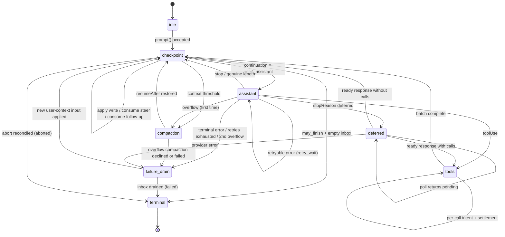

# AgentHarness v3 — implementation specification

**Status:** complete, pending final audit. Once that audit passes, this document supersedes `agent-harness-spec.md` in full, which itself superseded `harness-v2.md`. Until then, `agent-harness-spec.md` remains authoritative.

**Sources being merged:**

- `agent-harness-spec.md` — the audited base spec ("base" below). Its interpreter, effects boundary, hooks, events, classifier, abort/close, and race catalog carry over with mechanical renames only; do not rewrite them.
- The storage walkthrough jot ("jot" below, parts 1–9) — the three-store model, pending registers, terminal cleanup, recovery, retention/partitioning, schema evolution, backend stories, API deltas, and the binding decisions in jot part 9.
- The storage-redesign critique findings, as resolved by jot part 9.

**Global renames applied throughout v3:**

```text
node / Node*            → entry / *Entry          (continuity with coding-agent)
slot                    → register
"storage substrate"     → "Storage"
StoredValue / valueId   → gone (no values table)
```

---

# Part 0 — Orientation

## 0.1 What this is

A durable runtime for agent conversations. You hand it a prompt; it talks to a language model, runs tools, and produces a response. The difference from an ordinary agent loop is that **the process can die at any instant** — mid-stream, between a tool call and its result, halfway through a summary — and a new process picks up exactly where the old one stopped, without repeating durable work and without losing anything that had committed.

It is a library, not a server. One process owns one session at a time.

## 0.2 Three concepts

### Session — the conversation

A session is one conversation, stored as a **tree** rather than a list.

```
a ── b ── c ── d
      └── e ── f
```

A tree, because three features need history that does not move: branching (explore an approach, back out, keep the record), compaction (replace a long prefix with a summary while the original stays queryable), and forking (copy a prefix into a new session). Entries are appended and never modified or deleted.

A session also holds **facts** (session name, entry labels, application key-value state — latest write wins, not part of the tree) and a **usage ledger** (every token and cost event, append-only).

### Lane — a cursor into the conversation

A lane is a **name plus a leaf**: the entry that new work extends. Every session has `main`. Applications create more.

A lane owns its leaf, its configuration (model, thinking level, active tools), its queues, and at most one operation in flight. Lanes run in parallel and share nothing except the tree beneath them.

Why lanes exist: a Slack channel is one session, and each thread is a lane. Threads share the channel's history but take turns independently. Two lanes can sit on the same entry and diverge on their next append — the tree handles that, and no coordination is needed.

**Lane vs fork:** a lane *shares* history; a fork *copies* it for isolation. Use a lane for a thread in a shared conversation, a fork for a subagent, an export, or a what-if.

### Harness — what runs a lane

The harness is the API surface. Per lane: `prompt`, `steer`, `followUp`, `nextRun`, `abort`, `resume`, `compact`, `navigateTree`, plus configuration getters and setters and a tree view. Harness-wide: lane management, tool and resource registries, hooks, events.

An **operation** is one accepted unit of work on a lane — a `run` (prompt to final answer, including all tool calls), a `compaction`, or a `navigation`. One per lane at a time.

## 0.3 Worked example — a Slack thread

A user posts in a channel that already has 400 entries of history. The application creates a lane for the thread, anchored at the channel's current leaf. Entry ids are UUIDv7s (§1.2); examples abbreviate them.

```
harness.createLane("slack:1719432.0021", at: "0195c8d1-4a2e-7b31-…")
lane.prompt("what changed in auth last week?")
```

What happens, in order:

1. **Acceptance.** The harness validates, runs the `before_run` hook, and commits one transaction: the user-message entry, the operation's `op.meta` register, and its first `op.state` — *"I am at a checkpoint, and I need an assistant response."*
2. **Intent.** It commits a second transaction: *"I am about to make a provider request. The response will be entry `0195c8d1-53a0-7c44-…` and the usage row will be `0195c8d1-53a0-7d18-…`."* Both ids are minted now; nothing has been sent yet.
3. **The request.** Streaming happens. This is the only part that is not durable.
4. **Settlement.** One transaction commits the response entry, its usage row, and the next state: *"the response has tool calls; here is the batch plan, with result ids already assigned."*
5. Tool calls follow the same intent → effect → settlement shape, one pair of commits each.
6. When the model stops without tool calls, a terminal transaction deletes the operation's registers, records the outcome in `lane.lastResult`, and leaves the lane idle.

Kill the process between any two of those transactions and restart. The harness reads the lane's registers, sees exactly which of those sentences was the last one committed, and continues. If it died in step 3, it knows a request may have been billed and may or may not have produced output — that is the one genuinely uncertain window in the whole system, and there is a stated policy for it.

Meanwhile a second thread in the same channel is running its own lane, over the same 400 entries of shared history, with no coordination between them.

## 0.4 Worked example — a crash mid-tool

```
lane.prompt("delete the stale migrations and run the test suite")
```

The model returns two tool calls. The harness commits the batch plan, then commits `call 0 is about to execute, with these exact arguments, and it declares itself unsafe to replay`. The tool starts deleting files. The process is killed.

On restart the harness reads one register and finds `calls[0].status = "effect_pending", replay = "never"`. It does not re-run the deletion. It appends a synthetic error result under the result id that was reserved before the effect started, marks the call complete, and continues to call 1. The conversation stays coherent — every tool call has a result — and nothing ran twice.

Had the tool declared `replay: "safe"` (a read, a query), the harness would have re-executed it with the persisted arguments instead.

## 0.5 The three stores

Everything in Parts 1–5 follows from these.

**1. Three stores, one invariant.** Everything durable is one of:

```text
entries        the conversation tree — write-once, append-only
registers      current mutable state — namespaced typed cells, overwrite or delete
usage ledger   cost history — append-only rows
```

*Every payload is in an entry, a register, or the ledger; there is no third place.* An entry is the complete conversation record — placement and payload in one row. A register holds its current typed value directly; overwriting discards the old value, and deletion removes the key. Content that durably exists before it has a place in the tree (queued input, deferred writes) waits in a `pending.entry` register and becomes an entry in the transaction that places it. Per-backend projections — branch index, full-text search, stats, partition inventory — are rebuildable from the three stores and carry no authority.

**2. Atomic transactions.** A transaction is a set of entry inserts, usage inserts, and register writes (set or delete), committed all-or-none with consecutive sequence numbers. There is no crash state inside a transaction. This is the only write primitive.

**3. The durable program counter.** After every step, the harness overwrites one register — `op.state/{operationId}` — with the *complete* current state of the operation. Recovery does not replay a journal or infer position from what is missing; it reads that register and switches on it. The state is *total* — it never depends on a previous state. Small captured values (configuration, stream options, retry policy) are inline; large stable payloads live in sibling `op.*` registers or are named by id. When the operation ends, the terminal transaction deletes its registers: a finished session holds exactly the conversation, the ledger, and a handful of lane and fact registers. There is no dead state to collect.

**4. The effect sandwich.** Provider requests and real tool calls are wrapped in two commits:

```
commit:  "about to do X; its output will use ids R and U"     ← intent
         do X                                                  ← the uncertain part
commit:  output + usage + next state                           ← settlement
```

Hooks follow their replay contract instead: a result becomes durable in the transaction that consumes it, and a crash before that transaction may rerun the hook. Thus every external effect can still happen without durable settlement. Provider/tool intents make that uncertainty explicit where replay policy depends on it; idempotent hooks accept it as a non-goal.

## 0.6 Non-goals

- **Exactly-once external effects.** See above. Hooks with their own side effects must be idempotent, keyed by operation id.
- **Provider stream resumption.** Partial streams are process-local, never persisted. A settled response is persisted *completely* before anything classifies it.
- **Multiple writers.** One process per session. The serving layer routes accordingly, and the SQLite backend enforces it with a fenced lease (§1.7). Lanes cover the workload that looks like multi-writer.
- **Replication.** A session lives in one place.
- **Durable write history.** Registers hold only current values: an overwritten register is gone, and there is no `getLog` or history table. Order-of-write assertions in tests use an instrumented storage decorator around `commit()` (Part 9); production auditing belongs to the telemetry layer (§5.8).
- **Compliance deletion through retention expiry.** Partition expiry is TTL and cost control, not erasure: `retainedTail` copies old messages forward into newer compaction entries, and summaries derive from old content. Compliance-grade "erase this" uses the precise-rewrite path (Part 6).

## 0.7 Notation and source types

- `TX[ a, b, c ]` — one atomic commit containing writes `a`, `b`, `c` in that order. The write vocabulary is `insert entry`, `insert usage`, `upsert namespace/key = value`, and `delete namespace/key`.
- Ids are UUIDv7s (§1.2). Examples abbreviate them: short tags — `e_*` entry ids, `u_*` usage ids, `op_*` operation ids — stand in for full ids where the time prefix is irrelevant; where the prefix matters, examples show it (`0195c8d1-4a2e-7b31-…`).
- `S(next)` — overwrite the `op.state/{operationId}` register with the next total operation state. `L(next)` — the same for `lane.state/{lane}`.
- **must / must not** are normative. Everything else is explanation.

Source type provenance:

- `AgentMessage`, `AgentTool`, `AgentToolResult`, `AgentEventSink`, `QueueMode`, and `ThinkingLevel`: `packages/agent/src/types.ts`.
- `Skill`, `PromptTemplate`, `AgentHarnessResources` (`Resources` below), `AgentHarnessTool`, `AgentHarnessStreamOptions`, and `AgentHarnessStreamOptionsPatch`: `packages/agent/src/harness/types.ts`.
- `Model`, `Models`, `Usage`, `RetryPolicy`, `StopReason`, `AssistantMessage`, `ImageContent`, provider messages, stream options, and deferred handles: `packages/ai`.
- `CompactionSettings`, `CompactionPreparation`, `CompactResult`, `BranchPreparation`, and `BranchSummaryResult`: `packages/agent/src/harness/compaction/`. Existing preparation and split-turn algorithms remain the implementation starting point unless this document explicitly changes them.
- `TelemetryContext` and typed schema helpers: `packages/telemetry`; the agent-owned schemas remain in `packages/agent/src/harness/telemetry.ts`.
- `TSchema` for durable custom-message registration: `typebox`.

The public `QueueMode` remains `"all" | "one-at-a-time"`. Public `RetryPolicy` remains the pi-ai shape `{ enabled, maxRetries, baseDelayMs }`; operation state stores its normalized `{ maxAttempts, baseDelayMs }` equivalent. `maxRetries` and `baseDelayMs` must be finite non-negative safe integers and `maxRetries + 1` must remain safe; disabled retry normalizes to one attempt. Exponential delay and `notBefore` arithmetic saturate at `Number.MAX_SAFE_INTEGER`. Public `CompactionSettings` remains `{ enabled, reserveTokens, keepRecentTokens }`; both token counts must be finite non-negative safe integers. Constructors and setters reject invalid settings before publication. This design adds `deferred?: boolean | { window?: "15m" | "1h" | "24h" }` to `AgentHarnessStreamOptions` and its patch type; structural requests always force it to false.

```ts
type SettledAssistantMessage = AssistantMessage & {
  stopReason: Exclude<StopReason, "pending">;
};

/** Added to packages/ai: a synchronous registry lease that captures the exact
    provider/model and Models auth resolver without resolving auth yet. */
interface ModelRequestLease {
  readonly model: Model;
  stream(context: Context, options?: ModelsApiStreamOptions<Api>):
    AssistantMessageEventStream;
  streamSimple(context: Context, options?: ModelsSimpleStreamOptions):
    AssistantMessageEventStream;
  fetchDeferred(handle: DeferredHandle, options?: ModelsDeferredFetchOptions):
    Promise<AssistantMessage>;
  cancelDeferred(handle: DeferredHandle, options?: ModelsDeferredCancelOptions):
    Promise<void>;
}
// Models.lease(provider: string, modelId: string): ModelRequestLease | undefined
```

There are no orchestration "records" in this system. Every durable thing is an **entry**, a **register**, or a **usage row**.

---

# Part 1 — Storage

Storage knows nothing about agents, lanes, or conversations. It stores entries and usage rows, updates registers, and answers a small fixed set of queries. Parts 2–4 are built entirely on this.

## 1.1 The model

```ts
type JsonValue = null | boolean | number | string | JsonValue[] | { [k: string]: JsonValue };

/** Write-once. The complete conversation record: placement and payload in one
    row. Created in exactly one transaction, never modified or deleted. The
    four concrete entry types extending this base are defined in §2.1. */
interface EntryBase {
  id: string;                // UUIDv7 (§1.2)
  parentId: string | null;
  seq: number;               // storage-assigned at commit
  timestamp: number;         // Unix ms, storage-assigned at commit
  type: EntryType;
  customType?: string;       // when type === "custom"
  // ...payload fields per entry type (§2.1)
}

type EntryType = "message" | "compaction" | "branch_summary" | "custom";

/** The only mutable store. A namespaced key holding its current typed value
    directly. Overwrite replaces the value; delete removes the key. */
interface Register<N extends RegisterNamespace = RegisterNamespace> {
  namespace: N;
  key: string;
  value: RegisterValues[N];
  seq: number;               // seq of the write that last set this register
}

/** Append-only cost ledger row. Never modified, never deleted (§1.6). */
interface UsageRow {
  id: string;                // UUIDv7 (§1.2)
  seq: number;               // storage-assigned at commit
  usage: Usage;
  entryId?: string;          // the entry this cost belongs to, when there is one
  adjustment: boolean;       // true = caller-supplied reconciliation, not a provider report
  details?: JsonValue;
}
```

**Why placement and payload are one row.** The superseded design split content ("values") from placement ("nodes") because they can have different birth times: queued input has content at enqueue and placement much later; an assistant response needs its id fixed *before* the content exists. The split is gone; the differing birth times remain, and two reservation regimes cover them (§2.2). Content that is durable before placement is *current mutable state* and waits in a `pending.entry` register keyed by its reserved entry id; the placement transaction writes the complete entry and deletes the register. An id that must exist before its content — an assistant response, a tool result — is just a minted string inside `op.state`, and settlement inserts the complete entry. Every read returns the whole entry with no join, no `valueId`, and no way for content to exist without an owner.

**Registers hold values, not pointers.** A register's value is the current typed state itself, never an id pointing at an immutable state value. Overwriting a register discards the previous value; nothing accumulates and there is no history to fold (§1.8). Deleting a register removes the key entirely and is a first-class write, distinct from storing JSON `null`, which remains a legal value where a namespace's type permits it (`lane.leaf` at the root, `fact.custom`).

## 1.2 Identity and partitions

Every id storage stores — entry ids, usage ids, and every reserved id that will become one — is a **UUIDv7**, minted through the session's id generator (§2.8); the sole exception is imported legacy-format ids, preserved verbatim (Appendix C). A UUIDv7 begins with 48 bits of Unix milliseconds: the first 12 hex characters of the id *are* a timestamp, and that timestamp, truncated to the partition period, *is* the id's partition assignment. There are no partition columns anywhere — not on entries, not on ledger rows, not in any register value. The period length (monthly in every example) is a deployment property of the partitioned backend; Memory, JSONL, and SQLite never partition.

What the embedded prefix buys:

- **Every reference is self-describing.** A `parentId`, a `lane.leaf` value, a `fact.label` key, an id inside `op.state` JSON — any of them can be classified against the partition retirement inventory by reading its prefix, with no lookup.
- **Native partition pruning.** Postgres compares `uuid` bytewise and UUIDv7 sorts in time order, so `PARTITION BY RANGE (id)` works directly, with period-boundary UUIDs (zeroed tails) as bounds. The primary key stays `(session_id, id)`, and a point lookup prunes to one partition from the id itself (§1.7).
- **The cost.** Ids leak their creation period to applications. Accepted: the alternative is a denormalized partition column on every row, plus no answer at all for references held inside register values.

Minting rules:

1. An id is minted with `now()` **at reservation**. For born-placed entries — the hot path — reservation and placement are the same transaction, so the prefix equals the placement date.
2. **Followers inherit the leader's timestamp.** Tool-result ids are minted with their assistant entry id's 48-bit timestamp (fresh random bits keep them unique), so an assistant and its tool results share a partition by construction, even across a midnight or month boundary. This is a deliberate, documented deviation from "UUID timestamp = wall clock". It exists because dropping a partition must never orphan half of a call/result exchange: a retained tool result whose assistant call is gone heads a context every provider rejects.
3. **Synthetic settlement needs no special case.** Crash recovery and force-expiry write under already-reserved ids (§4.5), so synthetic responses and results land in the partition their intent promised.
4. **Late placement pins.** A `nextRun` message minted in January and consumed in April is placed as a January-partition entry — exact, but it means unplaced reservations pin their partitions. All such reservations are enumerable from hot registers (`pending.entry` keys and the reserved ids inside open `op.state` values are UUIDv7s: decode, take the minimum), so drop preflight is a bounded register scan. Retention policy for abandoned reservations is Part 6.

Traversal discrimination is exact by construction:

```text
parent entry exists                               → continue
parent missing, id prefix in a retired period     → retention boundary — clean stop
parent missing, id prefix in a live period        → corruption — loud
```

Memory, JSONL, and SQLite never retire periods themselves, so with an empty retired-range set — the default — the middle case is unreachable there and a missing parent is always corruption. The rules are still core — branch scans and forks must implement the boundary stop (§2.5, §2.7) — but the middle case is exercised only where the retired-range inventory (§6.4) is non-empty: the future Postgres backend (§1.7), sessions truncated by retention compaction or fork import, and the conformance suite's abstract retired-range set (Part 9).

## 1.3 Register namespaces

```ts
interface RegisterValues {
  "lane.leaf":       string | null;                // entry id; null = lane at the root
  "lane.config":     LaneConfiguration;            // §2.3
  "lane.state":      LaneState;                    // §3.3
  "lane.lastResult": LaneLastResult;               // §3.13
  "op.meta":         Operation;                    // §3.1
  "op.state":        OperationState;               // §3.2 — the program counter
  "op.tool_args":    Record<string, JsonValue>;    // effective tool arguments (§3.8)
  "op.preparation":  DurableStructuralPreparation; // §3.9
  "pending.entry":   PendingEntry;                 // §2.2
  "fact.name":       string;
  "fact.label":      string;
  "fact.custom":     JsonValue;                    // JSON null is a legal value
}
type RegisterNamespace = keyof RegisterValues;

/** Unplaced content: current mutable state until the placement transaction
    writes the complete entry and deletes this register (§2.2). */
interface PendingEntry {
  type: "message" | "custom";
  customType?: string;
  payload?: JsonValue;       // the content that becomes the entry's payload;
                             // absent = a custom entry with no data
}

interface DurableFileOperations {
  read: string[]; written: string[]; edited: string[];
}
type DurableStructuralPreparation =
  | { kind: "compaction"; messagesToSummarize: AgentMessage[];
      turnPrefixMessages: AgentMessage[]; retainedTail: AgentMessage[];
      isSplitTurn: boolean; tokensBefore: number; previousSummary?: string;
      fileOps: DurableFileOperations; settings: CompactionSettings }
  | { kind: "branch_summary"; messages: AgentMessage[];
      fileOps: DurableFileOperations; totalTokens: number };
```

| Namespace | Key | Value | Meaning |
|---|---|---|---|
| `lane.leaf` | lane name | entry id or `null` | where this lane appends next |
| `lane.config` | lane name | `LaneConfiguration` | total lane configuration |
| `lane.state` | lane name | `LaneState` (§3.3) | `currentOperationId`, `pendingNextRun` |
| `lane.lastResult` | lane name | `LaneLastResult` (§3.13) | terminal outcome of the lane's most recent operation |
| `op.meta` | operation id | `Operation` (§3.1) | acceptance data; written once, never overwritten |
| `op.state` | operation id | `OperationState` (§3.2) | total operation state — **the program counter** |
| `op.tool_args` | `{opId}:{stepId}:{sourceIndex}` | effective arguments | written once at tool clearance (§3.8) |
| `op.preparation` | `{opId}:{taskId}` | `DurableStructuralPreparation` | written once before the decision hook (§3.9) |
| `pending.entry` | reserved entry id | `PendingEntry` | queued content awaiting placement (§2.2) |
| `fact.name` | `""` | string | session name |
| `fact.label` | entry id | string | entry label |
| `fact.custom` | application key | `JsonValue` | application state |

That is the complete set. Two lifetimes are visible in the key shape:

```text
lane.*  fact.*     session-lived; facts are deleted only by explicit application action
op.*               operation-lived; deleted by the terminal transaction (§3.13)
pending.entry      lives until its content is placed or cancelled
```

- `op.meta` and `op.preparation` keys are written exactly once; `op.tool_args` keys are written once per key, keyed by the producing step so batches never collide. All are deleted no later than the terminal transaction; only `op.state` is overwritten during the operation.
- Operation-owned `pending.entry` registers still unconsumed at the end (remaining inbox items and abort-drained items) are deleted by the terminal transaction — a consumed item's register dies in its placement transaction; lane-owned ones (`pendingNextRun`) outlive operations and die when consumed or cancelled (§3.11).
- `lane.lastResult` is written only by terminal transactions and overwritten by the next one on its lane — one bounded register per lane, forever. Recovery never reads it; it exists so an application that accepted an operation, crashed, and reopened can still learn its outcome (§3.13).
- Deleting a fact removes its register. Storing JSON `null` in `fact.custom` is a different, legal state; there are no tombstones.
- There is no `queue.disposition` namespace. It existed solely so a repeated `cancelQueued` could answer `already_cleared`, at the cost of one immortal register per cancelled item. Triage is now: pending → `cancelled`; entry exists → `already_consumed`; else → `not_found` (§3.11). Clients that retry a lost cancel treat `not_found` as success.

## 1.4 Transactions

```ts
type Write =
  | { kind: "entry"; entry: Omit<Entry, "seq" | "timestamp"> }
  | { kind: "usage"; row: Omit<UsageRow, "seq"> }
  | { kind: "register"; op: "set"; namespace: RegisterNamespace; key: string;
      value: JsonValue }
  | { kind: "register"; op: "delete"; namespace: RegisterNamespace; key: string };

interface Transaction { writes: Write[] }

interface CommitResult { firstSeq: number; seqs: number[]; timestamp: number }
```

Rules:

1. A transaction commits **all-or-none**. There is no observable state in which some of its writes exist and others do not.
2. Writes receive **consecutive** `seq` values in the order given. `seq` is monotonic session-wide across all lanes and all write kinds. A register `set` stamps the register with its assigned `seq`.
3. Within a transaction, writes apply in order: an entry may name a parent created earlier in the same transaction; a register value may reference entry or usage ids created earlier in the same transaction. A placement transaction inserts the complete entry and deletes its `pending.entry` register together (§2.2) — there is never a moment where both exist.
4. Entry and usage ids share one session-wide id namespace. Writing either kind under any existing id is **corruption**, not an update.
5. A register `set` with the same `(namespace, key)` replaces the current value; `delete` removes the key; a later `set` recreates it. No history is retained. A `delete` naming an absent key is a no-op, so public deletions such as clearing an unset label stay legal.
6. Transactions on one session are **serialized**. There is one writer and one queue.

Session validates the complete transaction, including JSON serialization and runtime schemas, before storage admission. A failed admitted commit **faults the harness**: all effects stop, all calls reject, and the process must be restarted. A partially applied transaction is not tolerated.

## 1.5 Queries

One `Storage` instance serves one session. Repository discovery and lifecycle are outside this interface (§2.8).

```ts
interface Storage {
  commit(tx: Transaction): Promise<CommitResult>;

  getEntries(ids: string[]): Promise<ReadonlyMap<string, Entry>>;

  getRegister<N extends RegisterNamespace>(namespace: N, key: string):
    Promise<Register<N> | undefined>;
  listRegisters<N extends RegisterNamespace>(namespace: N): Promise<Register<N>[]>;

  scanBranch(q: BranchScan): Promise<Entry[]>;            // §2.5
  scanBranchStructure(q: BranchScan): Promise<EntryStructure[]>;
  scanEntries(q: EntryScan): Promise<Entry[]>;            // session-wide tree inventory
  getStats(): Promise<SessionStats>;                      // maintained projection (§1.6)

  close(): Promise<void>;
}

/** Placement metadata without payload fields. */
type EntryStructure = Pick<Entry, "id" | "parentId" | "seq" | "timestamp" | "type" | "customType">;

interface EntryScan {
  type?: EntryType; customType?: string;
  fromSeq?: number; toSeq?: number;
  order?: "asc" | "desc"; limit?: number;
}
```

There is deliberately no cross-namespace register scan, no ledger scan, and no durable write log. Restore, facts, forks, and execution follow exact ids and keys; entry inventory uses `scanEntries`; totals use the stats projection (§1.6); test-order assertions wrap `commit()` with the instrumented-storage decorator (Part 9); production auditing belongs to telemetry (§5.8).

Recovery and execution reads must be index-driven and bounded. They may not infer state from an absent value, and there is no register history to fold. Exact dereference is allowed: one current state may name a bounded set of entries and registers, fetched in one batch without order-dependent reduction. Public inventory and debugging APIs may intentionally read more than a hot path; their `limit`/pagination behavior is explicit at the `SessionTree` layer.

`close()` is idempotent. It seals admission, rejects later reads/commits on that instance, drains commits admitted before the seal, then releases resources and the writer claim. Durable data is reopened through the repository.

## 1.6 Usage ledger

Every settled provider attempt writes one `UsageRow` — successful, failed, retried, and synthetic attempts alike, including attempts whose operation later aborts. Settlement transactions write the response entry and its usage row together (§3.7); synthetic settlements write zero usage under the reserved usage id. Rows are append-only: terminal cleanup deletes an operation's registers but never its ledger rows, so billing survives everything that can happen to orchestration state.

```jsonc
{ "id": "u_7", "seq": 815, "entryId": "e_51", "adjustment": false,
  "usage": { "input": 12000, "output": 431, "cost": { ... } } }
```

- `entryId` names the entry the cost belongs to, when there is one. Structural (summary) attempts that fail before producing an entry, and standalone adjustments, have none.
- `adjustment: true` marks a caller-supplied reconciliation (`recordUsage`, §5.1) rather than a provider report. The format-3 import writes one aggregate adjustment row (Appendix C).
- Provider-attempt usage ids are UUIDv7s reserved in the intent commit (§1.2), so a settlement writes under exactly the id its intent promised. Adjustment rows, tool-reported usage rows, and import aggregates mint their ids at commit; nothing reserves them.
- `getStats()` is a maintained projection over the ledger and the entry count. After every commit it equals the ledger sum; the conformance suite asserts this (Part 9). There is no ledger scan: totals come from the projection, and individual rows reach the application through the `usage` event at commit time (§5.5).

## 1.7 Backends

Three encodings of one model ship now — Memory, JSONL, SQLite — and all three pass the same conformance suite (Part 9). Postgres is a planned fourth; it appears here because its native partitioning shapes the retention design (Part 6). Each backend records the session's `storageVersion` (Part 7): a JSONL header field, a SQLite/Postgres catalog column. Memory sessions are always current.

### Memory

```ts
entries:   Map<string, Entry>
registers: Map<string, Register>       // key: `${namespace}\u0000${key}`
usage:     Map<string, UsageRow>
children:  Map<string, string[]>       // parentId → entry ids, for tree walks
```

One queue serializes commits. A commit validates and applies writes to temporary transactional state, then publishes the maps together. A register delete is a map delete. Reads are map lookups; `scanBranch` walks `parentId` and filters in RAM. There is no log: Memory holds exactly the live state and nothing else.

### JSONL

The file is not the state; it is the **replay recipe** for the Memory maps above. One physical line per `commit()`. Storage assigns sequence/timestamp fields first, then encodes one committed write as a JSON object line or several as one **array line**.

```jsonl
{"v":4,"kind":"header","id":"s_1","storageVersion":1,"createdAt":1700000000000,"cwd":"..."}
[{"kind":"entry","seq":101,"timestamp":1700000000000,"id":"e_50","parentId":"e_41","type":"message","message":{"role":"user","content":[...]}},
 {"kind":"register","op":"set","seq":102,"namespace":"op.meta","key":"op_9","value":{...}},
 {"kind":"register","op":"set","seq":103,"namespace":"op.state","key":"op_9","value":{...}},
 {"kind":"register","op":"set","seq":104,"namespace":"lane.leaf","key":"main","value":"e_50"},
 {"kind":"register","op":"set","seq":105,"namespace":"lane.state","key":"main","value":{...}}]
{"kind":"usage","seq":110,"id":"u_7","entryId":"e_51","adjustment":false,"usage":{...}}
{"kind":"register","op":"delete","seq":131,"namespace":"op.state","key":"op_9"}
```

- This is format 4. The incompatible format-4 code currently in the source tree is unfinished and is replaced in place; no migration for it is required. Coding-agent format 3 remains supported (Appendix C).
- Open replays lines in order into the Memory maps: entries and usage rows accumulate; a later register `set` overwrites the key, `delete` removes it. That is *decoding*, not recovery logic. Open verifies persisted sequence continuity and timestamps and never regenerates committed timestamps. All queries then run in RAM.
- **A torn final line is discarded whole**, including every element of an array, and is truncated before new writes are admitted. This is what makes "no crash prefix inside a transaction" true here.
- A malformed *interior* line, or a complete-but-invalid transaction, is corruption. The one exception: superseded old-shape register lines from before a schema migration decode leniently as keyed raw JSON during replay (Part 7); compaction retires them.
- Durability is process-crash level: a resolved `commit()` survives process death. No fsync promise.
- Optional: retain `(offset, length)` per entry and load payloads lazily, keeping only structure and registers resident. Do this only if profiling demands it.

**Snapshot compaction.** In SQLite a register `set` is an in-place upsert — a 30-turn run leaves one `op.state` row and then zero. In JSONL every `set` appends, so the same run appends ~10 full `op.state` lines, all dead the moment the terminal `delete` line lands: the file grows with *write history* even though the logical state does not. The fix is rewriting the file as `header + current entries + current registers + usage rows`, via temp file + atomic rename. For a four-entry run:

```text
before compaction:  ~10 transaction lines, ~27 writes — op.state revisions,
                    tool args, pending payloads, all dead since the terminal line
after compaction:   header + 4 entry lines + 2 usage lines + 4 lane register lines
```

When to compact: on open when the dead-bytes ratio crosses a threshold; optionally after terminal transactions; always after a schema migration (Part 7). Between compactions, normal operation is append-only and O(1) per commit. One consequence worth stating: deleted pending payloads and superseded state revisions **linger as bytes** until compaction — logical deletion is immediate, physical deletion is deferred. A deployment that needs prompt physical removal of sensitive cancelled content compacts eagerly at terminal boundaries.

### SQLite

```sql
entries(session_id, id TEXT, parent_id TEXT, seq INTEGER, type TEXT, custom_type TEXT,
        timestamp INTEGER, payload TEXT, PRIMARY KEY (session_id, id)) WITHOUT ROWID;
CREATE INDEX ix_entry_parent ON entries(session_id, parent_id);
CREATE INDEX ix_entry_seq ON entries(session_id, seq, type);

registers(session_id, namespace TEXT, key TEXT, seq INTEGER, value TEXT,
          PRIMARY KEY (session_id, namespace, key));

usage_ledger(session_id, id TEXT, seq INTEGER, entry_id TEXT, adjustment INTEGER,
             usage TEXT, details TEXT, PRIMARY KEY (session_id, id)) WITHOUT ROWID;
CREATE INDEX ix_usage_seq ON usage_ledger(session_id, seq);

-- Private branch index (§2.6). Not registers; no equivalent in the other backends.
branch_entries(session_id, branch_id TEXT, entry_id TEXT, entry_seq INTEGER, entry_type TEXT,
               PRIMARY KEY (session_id, branch_id, entry_id)) WITHOUT ROWID;
-- Ordered scans. entry_seq must follow branch_id directly or ORDER BY needs a
-- temp b-tree; entry_id and entry_type trail so the index covers id-only reads.
CREATE INDEX ix_be_seq  ON branch_entries(session_id, branch_id, entry_seq, entry_id, entry_type);
-- Type-filtered scans.
CREATE INDEX ix_be_type ON branch_entries(session_id, branch_id, entry_type, entry_seq, entry_id);
CREATE INDEX ix_be_entry ON branch_entries(session_id, entry_id);
branch_meta(session_id, branch_id TEXT, tip_entry_id TEXT, tip_seq INTEGER,
            base_branch_id TEXT, base_seq INTEGER,
            PRIMARY KEY (session_id, branch_id));
CREATE UNIQUE INDEX ix_bm_tip ON branch_meta(session_id, tip_entry_id);

sessions(session_id, created_at, parent_session_id, storage_version, metadata);
session_stats(session_id, message_count, usage_payload);
session_sequences(session_id, next_seq);
writer_leases(session_id, owner_id TEXT, fence INTEGER, expires_at_ms INTEGER);
```

One `commit()` is one SQL transaction: insert entries, insert ledger rows, upsert or delete registers, maintain the branch index, bump `session_stats`. Never an UPDATE or DELETE on an entry or ledger row; mutability is confined to registers, the branch index (`branch_meta` tips and bases), stats, sequences, the session catalog row, and leases.

**Every transaction must open with `BEGIN IMMEDIATE`.** A deferred `BEGIN` that
reads before it writes takes a read snapshot and must later upgrade to the write
lock; if another writer committed in between, SQLite fails that upgrade — and
`busy_timeout` does **not** rescue it, because no amount of waiting can refresh a
stale snapshot. The only recovery is rollback and full retry.

Every commit has this shape, not just a few. Allocating the sequence range reads
`session_sequences.next_seq` and then writes it, so a read precedes a write in every
transaction the system performs. Branch creation (§2.6) adds a second instance,
reading the newest compaction before inserting. `BEGIN IMMEDIATE` takes the write
lock up front and avoids an unrecoverable stale-snapshot upgrade, so there is no case
where a deferred `BEGIN` is the right choice here.

**`writer_leases` enforces the single-writer rule.** Expiring fenced ownership:
`open()` acquires the claim, storage renews it on appends and while idle, and close
stops renewal after the queue drains and deletes only its matching `(owner_id,
fence)` pair — so a stale owner cannot release the replacement that succeeded it.
This is what makes "one process owns one session" an enforced property rather than
a convention the serving layer is trusted to uphold. Memory and JSONL have no
equivalent and rely on process ownership; a JSONL session opened twice is corrupt
and undetected.

**Writer scope is per database file, not per session.** WAL mode permits exactly one
writer per file. Because these tables are keyed by `session_id`, several sessions may
share a file, and the design's one-writer-per-session rule does not by itself make
writes uncontended. Choose deliberately:

- *One file per session* — the single-writer claim becomes literally true, and there
  is no cross-session contention. Preferred unless something forces otherwise.
- *One file for many sessions* — correct, but all sessions share SQLite's one-writer queue. Use only when that contention is acceptable.

Atomicity itself needs no special handling. A multi-write transaction is all-or-none
by the file format: WAL frames become visible only when the commit record lands, so a
concurrent reader observes either none of a transaction's writes or all of them.

Each physical segment of `scanBranch` uses one JOIN; §2.6 combines segment ranges:

```sql
SELECT e.id, e.parent_id, e.seq, e.type, e.custom_type, e.timestamp, e.payload
FROM branch_entries b
CROSS JOIN entries e ON e.session_id = b.session_id AND e.id = b.entry_id
WHERE b.session_id = ? AND b.branch_id = ? AND b.entry_seq > ? AND b.entry_seq <= ?
ORDER BY b.entry_seq;
```

`CROSS JOIN` is load-bearing: it forces `branch_entries` to be the outer loop. Left
to itself the planner may drive from `entries`, scan the table, and sort through a
temporary b-tree. Assert the plan in a test:

```
SEARCH b USING COVERING INDEX ix_be_seq (session_id=? AND branch_id=? AND entry_seq>?)
SEARCH e USING PRIMARY KEY (session_id=? AND id=?)
```

Any plan containing `USE TEMP B-TREE FOR ORDER BY` or a scan of `entries` is a
regression.

`scanBranchStructure` is the same query without the payload column. `getEntries` is a primary-key lookup keyed by `e.id IN (...)`.

The repository's existing `SessionSearch` surface remains. SQLite replaces its rowid-dependent index with an FTS projection keyed by stored `session_id` and `entry_id`; searchable text is the JSON serialization of the entry, matching the scanning fallback. The transaction that places an entry also inserts its projection after validation. Pending content is not searchable before placement. Fork import populates the same projection, and session deletion removes its rows. Search never depends on `entries.rowid`.

### Postgres — future fourth backend

Planned, not normative; named now because its native partitioning is what the identity design (§1.2) and the retention design (Part 6) are shaped for. The logical model is identical. Two temperature zones in one database:

```text
hot, unpartitioned catalog:        partitioned by entry-id range (period bounds):
  registers                          entries
  branch_meta                        usage_ledger
  partition inventory                branch index rows
  session_stats                      FTS projection
  writer leases, sessions
```

- `PARTITION BY RANGE (id)` on the uuid primary-key column, with period-boundary UUIDs (zeroed tails) as bounds. The primary key stays `(session_id, id)`; point lookups prune to one partition from the id's own time prefix, and no partition-key column exists.
- One database means **one transaction spans hot registers and partitioned entries**: an acceptance transaction — entry inserts plus several register writes — is a single Postgres transaction, exactly as on SQLite.
- Expiry is `seal period → write per-session aggregates into the inventory → DETACH CONCURRENTLY → DROP`. `DETACH CONCURRENTLY` is not transactional, so expiry is a small recoverable protocol driven by inventory state, not one atomic step; a crash between steps redoes the step the inventory names. Retention semantics — pins, preflight, boundaries — are Part 6.

## 1.8 Why write-once plus registers

- **Recovery is a read.** Five register point-lookups per lane, then exact-id dereference (§4.4). No reducer exists to have a bug.
- **Crash states are enumerable.** Between transactions, never inside one.
- **Cleanup is deletion, not collection.** A 30-turn run overwrites one `op.state` register ~30 times and then deletes it. What remains is exactly the conversation, the ledger, and a handful of lane and fact registers — no dead state values, no history rows, nothing to garbage-collect. (JSONL defers *physical* reclamation to snapshot compaction; the logical state is identical.)
- **No repair-by-rewrite.** Recovery appends entries and overwrites only the registers it owns, with the same transitions normal execution would commit; interrupt it and rerun it and you get the same result.
- **Concurrency is trivial.** Readers never see partial state; there is nothing to lock.
- **The one deliberate double-write.** Queued content is serialized twice: into its `pending.entry` register at enqueue and into its entry at placement. Only queued items pay it — assistant and tool settlements, the hot path, write their entries once. In exchange every queue item is one id, cancellation deletes content outright, and no payload ever exists without an owner.

---

# Part 2 — The conversation tree

## 2.1 Entries

An **entry** is the complete stored row (§1.1): placement fields and payload together. What `getEntries` and the scans return is exactly what was committed — there is no materialization step and no join.

```ts
interface MessageEntry       extends EntryBase { type: "message"; message: AgentMessage;
                                                 terminate?: true }
interface CompactionEntry    extends EntryBase { type: "compaction"; summary: string;
                                                 retainedTail: AgentMessage[]; tokensBefore: number;
                                                 details?: JsonValue; usage?: Usage; fromHook: boolean }
interface BranchSummaryEntry extends EntryBase { type: "branch_summary"; fromId: string;
                                                 summary: string; details?: JsonValue;
                                                 usage?: Usage; fromHook: boolean }
interface CustomEntry        extends EntryBase { type: "custom"; customType: string; data?: JsonValue }

type Entry = MessageEntry | CompactionEntry | BranchSummaryEntry | CustomEntry;
```

Rules:

- `type` and `customType` are structural fields: branch queries filter on them and the branch index denormalizes them (§2.6). `customType` is set exactly on custom entries; payload fields never drive structure.
- Assistant entries always contain a `SettledAssistantMessage`. Reject `pending` before writing.
- Tool-result entries carry `terminate?: true`. It is orchestration state that `ToolResultMessage` has no field for.
- Every compaction and branch summary carries `fromHook`: `true` for hook output, `false` for generated.
- Every compaction stores a complete `retainedTail` (`[]` when empty). **Context never reads past a compaction.** This is what makes a compaction a self-contained checkpoint rather than a pointer into history.
- A custom entry may carry no `data`. There is no payload-compatibility table to check: an entry either decodes against its type's runtime schema or is corruption.
- Payloads are inline, so two entries never share stored content; there is no deduplication layer.

## 2.2 Placement

The tree's central rule:

> An **entry** is created, complete, when placement happens. Content that is durable *before* placement is current mutable state and waits in a `pending.entry` register; the placement transaction writes the entry and deletes the register. Neither is ever modified after that.

Three cases, all mechanical:

**Born placed** — assistant responses, tool results, direct appends to an idle lane. Content and placement arrive together; one transaction:

```
TX[ insert e_a4 = { parent: e_q1, type: "message", message: <assistant response> },
    upsert lane.leaf/main = "e_a4" ]
```

**Content first, placement later** — queued input (`steer`, `followUp`, `nextRun`) and deferred tree writes. The entry id is minted at enqueue and doubles as the register key; queue state references content by that one id — the old `{ nodeId, valueId }` pair collapses to a single string. Two transactions, possibly far apart:

```
t0  TX[ upsert pending.entry/e_q1 = { type: "message", payload: <200KB message> },
        S(next){ ...inbox.steer += "e_q1" } ]

t1  TX[ insert e_q1 = { parent: e_a3, type: "message", message: <from the register> },
        delete pending.entry/e_q1,
        upsert lane.leaf/main = "e_q1",
        S(next){ ...inbox.steer -= "e_q1" } ]
```

The register dies in the transaction that places the entry. Crash before `t1`: the item is still queued. Crash after: it is placed and the register is gone. **There is no third state** — until placement or cancellation, exactly one of register and entry exists at every commit boundary, never both and never neither. Cancellation is the other exit: `cancelQueued` deletes the register, and the content is simply gone, never having touched the tree (§3.11). Because the id was minted at enqueue, a late-placed entry lands in the partition of its mint date (§1.2).

**Id reserved before content exists** — assistant responses and tool results. The reserved id is a plain minted string inside `op.state`; no register and no row exist until settlement inserts the complete entry. Reserving costs nothing.

These are the **two reservation regimes**: settlement-family ids (responses, tool results, usage rows) are strings in operation state; queued-content ids are `pending.entry` registers. "A reserved id is just a string" is true only of the first family.

Consequences to rely on:

- A pending item is **invisible to tree queries** (no entry) but **visible in snapshots**: the owning state lists its id, and the payload is dereferenced from its register.
- "Has this been placed yet?" is answered by the owning queue list and the register's existence — never by the absence of an entry.
- The double write is the model's one deliberate redundancy (§1.8). SQLite and Postgres can implement placement as `INSERT … SELECT` from the register row inside the placement transaction; in JSONL both copies persist as bytes until snapshot compaction (§1.7). Only queued items pay it; settlement never does.

## 2.3 Lanes

A configured lane is three registers — plus `lane.lastResult` once its first operation has ended (§3.13). Fresh or normalized-v3 `main` may temporarily lack `lane.config` until first harness attachment:

```
lane.leaf/{name}    = entry id or null
lane.config/{name}  = LaneConfiguration      // absent only for unconfigured main
lane.state/{name}   = LaneState
```

```ts
interface LaneConfiguration {
  model: { provider: string; modelId: string };
  thinkingLevel: ThinkingLevel;
  activeToolNames: string[];
}
```

- A lane's leaf moves in exactly two ways: the lane appends an entry (leaf becomes that entry), or the lane navigates (leaf jumps to an existing entry).
- `LaneConfiguration` is **total**. A setter overwrites the whole register; it is never a patch and never a tree entry.
- Creating a lane copies no tree content, no history, and no configuration from its anchor:

```
TX[ upsert lane.config/{name} = <seed configuration>,
    upsert lane.leaf/{name}   = anchorEntryId,
    upsert lane.state/{name}  = { currentOperationId: null, pendingNextRun: [] } ]
```

- Lanes are never deleted or renamed. Names are permanent application keys.
- `main` exists in every session.
- Two lanes at the same leaf simply diverge on their next append.

## 2.4 Facts

Session-scoped, latest-wins, not part of the tree.

```
fact.name/""          = string
fact.label/{entryId}  = string
fact.custom/{key}     = JsonValue
```

Setting a fact to `undefined` deletes its register — real deletion, not a tombstone; deleting an unset fact is a no-op (§1.4). JSON `null` is a legitimate custom value, stored directly, and is distinguishable from deletion because the register itself exists or does not. The built-in and custom namespaces never overlap. Fact writes commit immediately and never move a leaf.

## 2.5 Branch queries and context

```ts
interface BranchScan {
  start?: string;               // default: the view's lane leaf
  stopAtType?: EntryType;       // scan ends after the first match, inclusive
  stopAtId?: string;
  type?: EntryType;
  customType?: string;
  order?: "newestFirst" | "oldestFirst";   // default newestFirst
  limit?: number;
  cursor?: EntryCursor;
}
type EntryCursor = { seq: number };
```

Semantics: take the path from `start` toward the root, order it (default `newestFirst`), stop **inclusively** at the first `stopAt` match, filter by `type`/`customType`, apply the exclusive cursor, then apply `limit`. For `newestFirst`, a cursor retains `seq < cursor.seq`; for `oldestFirst`, it retains `seq > cursor.seq`. A `stopAt` entry is returned only if it also passes the filter.

**Retention boundaries.** On a backend with retired partitions, a scan that reaches an entry whose `parentId` decodes to a retired period stops there cleanly, as if at a root (§1.2). The stop must be explicit at public surfaces: branch finders report a truncation marker — `truncatedAt: { parentId }`, the partition being the id's own time prefix — never a silently short result, because extension-state lookups walk past compactions by design (§5.3) and must distinguish "never set" from "expired". Storage itself needs no extra channel: the marker derives from the last returned entry's `parentId`. The three shipping backends never truncate while their per-session retired-range set is empty, which is the default (§6.4).

**Context projection** — how a provider request is built:

1. `scanBranch({ start: leaf, order: "newestFirst", stopAtType: "compaction" })`.
2. Reverse to oldest-first. If a compaction terminated the scan, the context is: its `summary`, then its `retainedTail`, then every entry after it. **Nothing earlier is read.**
3. Drop assistant responses whose stop reason is `error`, `aborted`, or `deferred`. Retain genuine output-limit `length`.
4. Run custom entries through `entryProjectors`. An unprojected custom entry never enters context.
5. Run `transform_context`, then `toProviderMessages`.

There is no rule for omitting an overflow response, and no link anywhere pointing at one. An overflow response is committed with stop reason `error` (§3.7) and is therefore dropped by rule 3 like any other error, and by any downstream `transformMessages` that filters the same way.

**Append-only context invariant.** Across the requests of one lane, provider context must only grow at the tail. An insertion before the previous request's tail invalidates the provider's KV cache and multiplies cost. This is *why* mid-run writes defer to checkpoints, where they append at the tail. Compaction is the one deliberate cache invalidation, and it trades that for a smaller context.

## 2.6 The branch index

Memory and JSONL walk parent pointers in RAM. SQLite — and the future Postgres backend — maintain a private segmented branch cache so a diverging append does not copy an unbounded root prefix.

`branch_entries` stores the entries physically present in one segment. `branch_meta` stores its tip and optional `{ baseBranchId, baseSeq }`. A segment logically contains its own rows above `baseSeq` plus the referenced base prefix through `baseSeq`.

Append:

1. If a branch tip equals the lane leaf, append one row and move that tip.
2. Otherwise resolve a branch that actually covers the leaf, find the newest compaction at or below the leaf through the complete segment chain, copy only rows after that compaction through the leaf, and set the older prefix as the new segment's base.
3. Append the new entry and make it the new segment tip.

Read newest segment first. If the requested range crosses `baseSeq`, continue through the base chain with the upper bound capped at that boundary. Merge segment results into the requested order before filtering/limiting.

Two correctness rules are mandatory:

- The base branch must itself cover the leaf within its logical range; merely containing the leaf in an ancestor is insufficient.
- The newest compaction search must traverse the base chain; checking only the newest physical segment can miss it.

**Partition purity** — two additional rules on a partitioned backend, vacuous on SQLite:

- **Append rule.** Appending an entry whose partition differs from the current segment's closes the segment: the old segment becomes the base of a fresh one. Segments are single-partition by construction, so index rows live in the same partition as the entries they index and die with it (§1.7).
- **Diverge rule.** Copy-on-diverge caps at partition boundaries. Never copy older-partition index rows forward into a newer segment; chain a base reference into the older partition's own segments instead — otherwise new partitions accumulate rows referencing droppable ones, and a drop silently gaps retained scans.

Traversal stepping into a base whose partition is retired is a retention boundary (§2.5): terminate the scan and report it. Truncate the chain lazily on first access; no eager `branch_meta` rebuild happens at drop time. `branch_meta` — tips and base pointers, hot, mutable, globally unique — always stays in the unpartitioned catalog.

```text
S1 (2027-01): e1…e19  ←base─ S2 (2027-02): e20…e29  ←base─ S3 (2027-03): e30…e42
drop 2027-01 → a scan via S3→S2 stops after e20 and reports the boundary; S2/S3 untouched
```

The cache must preserve:

- following a segment chain yields the exact root path with no gaps or duplicates — up to a retention boundary, where it stops cleanly;
- all chains containing an entry agree below it;
- runtime reads never fall back to a table scan or parent walk;
- stale branches remain valid cache history;
- only an explicit repair operation rebuilds the cache from entries.

Tests assert these invariants and the required query plans. No wall-clock threshold is normative.

## 2.7 Forks

A fork is a repository operation over one coherent source-session snapshot. It copies selected entries, latest facts, lane leaves, and total configuration; it never copies `op.*`, `pending.entry`, or `lane.lastResult` registers or ledger rows — destination lanes start with a fresh empty `LaneState`.

```ts
type ForkOptions =
  | { scope?: "branch"; entryId?: string; position?: "before" | "at" }
  | { scope: "tree" };
```

- Memory and JSONL obtain the snapshot as one job on the source storage queue. SQLite uses one read transaction.
- Branch scope copies one path and creates only destination `main`. Tree scope copies the whole tree and every lane leaf/configuration.
- The destination is idle and its token/cost ledger starts at zero. Entry-local display usage remains on copied entries.
- Facts follow the selected scope: name/custom facts always copy; labels copy only when their target copies unless tree scope copies all targets.
- Any message may be the fork point. Request construction heals orphaned tool calls.
- Copied entries keep their ids, so they keep their partitions. Where the source path crosses a retention boundary, the copy stops there exactly as a scan does (§2.5): the boundary entry becomes a retained root in the destination, keeping its original `parentId`. How a fork destination classifies the dangling references it inherits — including on backends that never retire periods themselves — is defined with the rest of the retired-boundary semantics in Part 6.
- The destination metadata records `parentSessionId`.

A source with only fresh/unconfigured `main`—new format 4 or read-only normalized v3—may have no configuration. Either fork scope then creates one unconfigured destination `main`, which first harness attachment seeds normally. Every configured format-4 lane copied by a fork keeps its current total configuration.

## 2.8 Session and repository boundary

`Storage` is deliberately one-session only. `Session` supplies typed validation, lane-bound views, and typed entry/register decoding. `SessionRepo` owns discovery and storage-instance lifecycle:

```ts
interface SessionMetadata {
  id: string;
  createdAt: number;
  /** Current storage schema version (Part 7). */
  storageVersion: number;
  parentSessionId?: string;
  /** Only when a v3 parent path cannot be resolved to an available header id. */
  legacyParentSessionPath?: string;
}

interface SessionCodecOptions {
  /** Built-in provider-message roles are registered by default. */
  customMessageSchemas?: Record<string, TSchema>;  // keyed by custom `role`
}

interface SessionSearchOptions { text: string; cwd?: string }
interface SessionSearchHit<M extends SessionMetadata = SessionMetadata> {
  metadata: M; entryId: string; timestamp: string; snippet?: string; score?: number;
}
interface SessionSearch<M extends SessionMetadata = SessionMetadata> {
  search(options: SessionSearchOptions): Promise<SessionSearchHit<M>[]>;
}

interface SessionRepo<M extends SessionMetadata = SessionMetadata,
                      C extends { id?: string; parentSessionId?: string } =
                        { id?: string; parentSessionId?: string },
                      L = void> {
  create(options: C): Promise<Session<M>>;
  open(metadata: M): Promise<Session<M>>;
  list(options?: L): Promise<M[]>;
  delete(metadata: M): Promise<void>;
  fork(source: M, options: ForkOptions & C): Promise<Session<M>>;
}

interface Session<M extends SessionMetadata = SessionMetadata> extends SessionTree {
  readonly metadata: M;
  /** Mints UUIDv7 ids; a supplied timestamp mints a follower id (§1.2). */
  readonly idGenerator: { next(timestampMs?: number): string };
  view(lane: string): SessionTree;

  /** Package-internal harness storage surface; validates before delegating to Storage. */
  commit(tx: Transaction): Promise<CommitResult>;
  getEntries(ids: string[]): Promise<ReadonlyMap<string, Entry>>;
  getRegister<N extends RegisterNamespace>(namespace: N, key: string):
    Promise<Register<N> | undefined>;
  listRegisters<N extends RegisterNamespace>(namespace: N): Promise<Register<N>[]>;

  close(): Promise<void>;
}
```

Repository constructors accept `SessionCodecOptions`. Every declaration-merged custom `AgentMessage` must have a string `role` and a registered runtime schema; unknown custom roles are rejected before persistence and on decode. A new repository session creates `main` with null leaf and an empty `LaneState`, but no configuration; first harness attachment writes its seed configuration.

`open()` compares the stored `storageVersion` with the binary's: equal proceeds; older runs chained migrations under the writer lease before returning (Part 7); newer refuses to open. Old coding-agent v3 JSONL sessions open through the same repository and normalize on load (Appendix C — "v3" there names the legacy JSONL session format, not this document).

Repository implementations resolve `fork(source, ...)` to the source's serialized snapshot boundary: an active Memory/JSONL storage queues the snapshot with commits; an inactive JSONL file is read as one immutable prefix; SQLite uses one read transaction. Repositories may keep an active-storage registry by session id for this purpose. This is repository coordination, not part of the one-session `Storage` contract.

# Part 3 — The operation state machine

## 3.1 Operations

```ts
interface Operation {
  operationId: string;
  lane: string;
  sourceLeafId: string | null;
  startedAt: number;
  intent:
    | { kind: "run"; promptEntryIds: string[];
        systemPromptOverride?: string; resumeData?: Record<string, JsonValue> }
    | { kind: "compaction"; customInstructions?: string }
    | { kind: "navigation"; targetId: string | null; summarize: boolean;
        label?: string; customInstructions?: string };
}
```

Acceptance data lives in the `op.meta/{operationId}` register: written once at acceptance, never overwritten, and deleted by the terminal transaction (§3.13). `sourceLeafId` is the lane's leaf *before* the operation; entries the operation itself appends come after it. `promptEntryIds` name the caller's normalized prompt entries, born placed in the acceptance transaction (§3.6).

## 3.2 Operation state — the program counter

`op.state/{operationId}` holds one total `OperationState` directly. Every transition overwrites the whole register; the terminal transaction deletes it (§3.13). There is no finished member of the union — an ended operation has no state at all, and its outcome lives in `lane.lastResult`.

```ts
type OperationState = RunState | CompactionState | NavigationState;

type Control =
  | { status: "running" }
  | { status: "cancel_requested"; requestedAt: number;
      /** Drained queue ids. Their pending.entry registers survive the drain
          and are deleted only by the terminal transaction (§3.11, §3.13). */
      drainedSteer: string[]; drainedFollowUp: string[] };

interface RunState {
  kind: "run";
  control: Control;
  /** Captured atomically at acceptance; setters affect later operations. */
  settings: {
    compaction: CompactionSettings;
    steeringMode: QueueMode;
    followUpMode: QueueMode;
    toolExecution: "sequential" | "parallel";
  };
  phase: RunPhase;
  inbox: Inbox;
  /** Newest durable assistant generation/fetch response in this operation. */
  latestAssistantEntryId: string | null;
}

interface CheckpointPhase {
  kind: "checkpoint";
  continuation: Continuation;
  /** Durable correlation source for the next generation step. */
  triggerEntryId: string;
  /** Threshold compaction is attempted at most once per trigger boundary. */
  thresholdCheckedTriggerEntryId?: string;
  /** Generate before draining another queued input after one-at-a-time drain. */
  skipInboxOnce?: boolean;
}

type RunPhase =
  | CheckpointPhase
  | { kind: "assistant"; generation: Generation }
  | { kind: "tools"; batch: ToolBatch }
  | { kind: "compaction"; reason: "threshold" | "overflow";
      structural: StructuralDecision; resumeAfter: CheckpointPhase }
  | { kind: "deferred"; deferred: Deferred }
  | { kind: "failure_drain"; error: OperationError; provenance:
      | { kind: "response"; entryId: string }
      | { kind: "structural"; taskId: string } };

type Continuation =
  | { kind: "need_assistant"; overflowRecoveryUsed: boolean }
  | { kind: "may_finish"; includeFinalAssistant: boolean };

interface Inbox {
  /** Reserved entry ids. Payloads — and, for writes, the entry type and
      customType — live in each id's pending.entry register (§1.3, §2.2). */
  steer: string[];
  followUp: string[];
  writes: string[];
}

interface OperationError { code: string; message: string; details?: JsonValue }
```

The old `QueuedInput { nodeId, valueId }` and `PendingWrite` pairs are gone: a queue item is one entry id, and everything else about it — payload, write type, `customType` — is dereferenced from its `pending.entry` register.

`latestAssistantEntryId` updates in the same settlement transaction as every assistant generation or deferred-fetch response. It lets finish and resume construct results/events without a branch scan. A tool batch retains its producing turn id while tool work remains active.

Any transition that appends conversational input or tool results and requires another assistant writes a checkpoint with `need_assistant(false)` and the appended entry as `triggerEntryId`. An unprojected custom write preserves the current checkpoint, including trigger and overflow flag. Entering threshold compaction first copies the checkpoint to `resumeAfter` with `thresholdCheckedTriggerEntryId = triggerEntryId`; decline, empty preparation, success, and crash therefore cannot recheck the same boundary.

### Generation

```ts
interface NormalizedRetryPolicy { maxAttempts: number; baseDelayMs: number }

interface GenerationContext {
  stepId: string;
  triggerEntryId: string;
  /** Inline snapshot of the lane configuration at step start. */
  configuration: LaneConfiguration;
  streamOptions: AgentHarnessStreamOptions;
  retryPolicy: NormalizedRetryPolicy;
}

type Generation =
  | { status: "ready"; context: GenerationContext; nextAttempt: number }
  | { status: "effect_pending"; context: GenerationContext; attempt: number;
      responseEntryId: string; usageId: string;
      intendedOutputLimit: number; contextWindow: number }
  | { status: "retry_wait"; context: GenerationContext; nextAttempt: number;
      notBefore: number; errorMessage: string };
```

The context snapshots configuration, stream options, and retry policy **inline** — there is no configuration value to point at, and `LaneConfiguration` is small. Recovery can therefore report exactly what is missing without resolving anything (§4.4). For each attempt, `before_request` runs from generation `ready` (an elapsed retry wait first returns to `ready`). Its curated patch is composed with the context's captured base stream options, then `intendedOutputLimit` and `contextWindow` are calculated and persisted in the `effect_pending` intent before dispatch. A pre-intent crash may rerun the hook. Harness-owned `before_payload`/`after_response` callbacks are mounted only after intent and cannot be replaced through stream options.

### Tool batch

```ts
interface ToolBatch {
  assistantEntryId: string;
  /** Producing generation/fetch snapshot; active tool names come from here. */
  configuration: LaneConfiguration;
  /** The assistant generation step id; recovered tool events use it as turnId. */
  turnId: string;
  calls: ToolCall[];
}

type ToolCall =
  | { status: "planned"; sourceIndex: number; resultEntryId: string }
  | { status: "effect_pending"; sourceIndex: number; resultEntryId: string;
      replay: "never" | "safe" }
  | { status: "completed"; sourceIndex: number; resultEntryId: string;
      terminate: boolean };
```

The source call comes from `assistantEntryId` plus `sourceIndex`; large effective arguments live once in the `op.tool_args/{operationId}:{stepId}:{sourceIndex}` register — the producing generation's `stepId` disambiguates batches across turns — written at clearance (§3.8) and located by that deterministic key — the state carries no per-call argument reference. Persist them unconditionally because `prepareArguments`, not only `before_tool`, may change them. Parallel calls may be effect-pending together; result entries commit in source order.

### Deferred

```ts
type Deferred =
  | { status: "suspended"; stepId: string; sourceEntryId: string; poll: number;
      configuration: LaneConfiguration; streamOptions: AgentHarnessStreamOptions }
  | { status: "effect_pending"; stepId: string; sourceEntryId: string; poll: number;
      responseEntryId: string; usageId: string;
      configuration: LaneConfiguration; streamOptions: AgentHarnessStreamOptions };
```

One `resume()` performs at most one `fetchDeferred(handle, { wait: 0 })`. Suspended `poll` is the number of completed polls; a fresh intent uses `poll + 1`, and that 1-based value is `before_request.attempt` and the poll turn-id suffix. A poll starts from the original generation's copied base stream options, forces `deferred:false`, runs `before_request`, mounts `before_payload`/`after_response`, then commits its fresh intent and dispatches like assistant generation. Current global stream settings do not affect it. There is no polling retry cap, backoff, or internal loop. A pending response must have a completely equal handle and becomes the next source. A mismatched pending handle is normalized to a durable `error` response explaining the mismatch; response, usage, `latestAssistantEntryId`, and response-provenance `failure_drain` commit atomically.

### Structural work

```ts
type StructuralDecision = { taskId: string } & (
  | { status: "deciding" }
  | { status: "generating"; generation: SummaryGeneration }
);

interface SummaryContext {
  taskId: string;
  resultEntryId: string;
  kind: "compaction" | "branch_summary";
  configuration: LaneConfiguration;
  streamOptions: AgentHarnessStreamOptions;
  retryPolicy: NormalizedRetryPolicy;
  reason?: "manual" | "threshold" | "overflow";
}

type SummaryGeneration =
  | { status: "ready"; context: SummaryContext; nextAttempt: number }
  | { status: "effect_pending"; context: SummaryContext; attempt: number;
      /** Current nested request intent; absent between requests. */
      request?: { index: number; usageId: string };
      usageIds: string[] }
  | { status: "retry_wait"; context: SummaryContext; nextAttempt: number;
      notBefore: number; errorMessage: string };

interface CompactionState {
  kind: "compaction";
  control: Control;
  customInstructions?: string;
  structural: StructuralDecision;
}

type NavigationState =
  | { kind: "navigation"; control: Control; targetId: string | null; label?: string;
      summarize: false; phase: { kind: "ready_to_commit" } }
  | { kind: "navigation"; control: Control; targetId: string; label?: string;
      customInstructions?: string; summarize: true;
      phase: { kind: "summary"; structural: StructuralDecision } };
```

Structural preparation is built from the reserved source leaf and settings snapshot, normalized (`Set<string>` file-operation fields become sorted arrays), and written once to the `op.preparation/{operationId}:{taskId}` register before the decision hook, in the same transaction as the `deciding` state (§3.9). State carries only `taskId`; the deterministic key locates the register, and hooks/generators hydrate arrays back to the source preparation types. Reopen never rebuilds it from current settings, so the provider sees the same summary input the hook approved.

One structural attempt may make one or two provider requests using the existing compaction implementation. Its request callback first commits `request:{index,usageId}`, then performs that provider request through a nested Effects action, then atomically writes usage and clears/advances the request field. Intermediate content remains process-local; any restored `effect_pending` attempt is treated as wholly uncertain and starts a later attempt under the captured policy rather than continuing request two. A durable `generating` decision prevents its decision hook from rerunning.

## 3.3 Lane state and current-state validity

```ts
interface LaneState {
  currentOperationId: string | null;
  /** Reserved entry ids; payloads in pending.entry registers (§2.2). */
  pendingNextRun: string[];
}
```

Restore validates only the current lane and operation registers and the entries/registers they directly name; there is no history to audit and none exists. Required checks:

- `lane.state/{lane}` holds a `LaneState`; when it names operation O, `op.meta/O` holds an `Operation` for that lane, and `op.state/O` holds an `OperationState` compatible with O's intent kind;
- every entry id the current state names — trigger, latest assistant, batch assistant, deferred source, completed results, prompt entries, the lane leaf — resolves to an existing entry of the expected type;
- reserved response/result/usage ids, if materialized, contain the intended kind and identity; an unmaterialized reserved id resolves to nothing, which is the expected pre-settlement condition, never an error;
- every id in `inbox.*`, `control.drained*`, and `pendingNextRun` has a `pending.entry` register with a valid payload; every effect-pending call has its `op.tool_args` register; every structural decision has its `op.preparation` register;
- tool source indices are complete, ordered, unique, in range, and use unique result ids; completed result entries match their source calls;
- cancellation, navigation source/target, and structural-source combinations satisfy the state discriminants.

Runtime schemas validate every decoded register value before publication. `lane.lastResult` is validated on its public read path — outcome/error/`runCompletion` combinations must be legal for the operation kind, and a completed run omits its final assistant only with `runCompletion: "terminated_tools"` — but it is never a recovery input (§3.13). These bounded checks reject corrupted/imported state that TypeScript transition functions could not have produced.

## 3.4 The atomic transition rule

> Compute the next total state in memory, then atomically commit every entry insert, usage insert, and register write that makes that state true.

A transaction writing total `LaneState` rereads the latest register value inside the lane mutation line and changes only the fields owned by that transition. In particular, the terminal transaction clears `currentOperationId` while preserving concurrently accepted `pendingNextRun`. Conditional transitions identify the state they extend by register `seq` — the `op.state` seq, the `lane.state` seq, and, where a transition snapshots configuration, the expected `lane.config` seq (§4.1) — never by a value id; the CAS token changed, the linearization did not. Every edge below is exactly one `commit()`.

## 3.5 The graph



`terminal` is not a state. It is the terminal transaction (§3.13): after it commits, the operation has no `op.state` register at all.

Standalone operations:

```
compaction:  deciding ──hook declines───────────→ terminal TX (declined)
                      ──hook supplies result────→ terminal TX (completed)
                      ──hook selects generation─→ generating ──→ terminal TX (completed|failed)

navigation:  ready_to_commit ───────────────────→ terminal TX (completed)
             summary.deciding ──→ generating ───→ terminal TX (completed)
```

## 3.6 Acceptance

| From | Trigger | Transaction |
|---|---|---|
| idle lane | `prompt()` after `before_run` | `TX[ insert entries for captured nextRun items (payloads from their pending.entry registers) and the new messages (caller prompt, hook injections) in order, delete the captured pending.entry registers, upsert lane.leaf = newest entry, upsert op.meta/O, S(run{captured settings, checkpoint need_assistant(false), trigger = newest entry, skipInboxOnce, empty inbox}), L({currentOperationId: O, captured ids removed from pendingNextRun}) ]` |
| reserved idle lane | `compact()` with non-empty preparation | `TX[ upsert op.preparation/O:{taskId} = P, upsert op.meta/O, S(compaction{deciding, taskId}), L({currentOperationId: O}) ]` |
| idle lane | unsummarized `navigateTree()` after validation | `TX[ upsert op.meta/O, S(navigation{ready_to_commit}), L ]` |
| reserved idle lane | summarized `navigateTree()` with preparation | `TX[ upsert op.preparation/O:{taskId} = P, upsert op.meta/O, S(navigation{summary.deciding, taskId}), L ]` |

Captured `nextRun` items already have their payloads in `pending.entry` registers; acceptance inserts their entries from those payloads, deletes the registers, and removes the ids from `pendingNextRun` — the placement half of the one deliberate double write (§1.8). A late-captured item keeps its enqueue-minted id and lands in that id's partition (§1.2).

Manual compaction first allocates its operation id and takes a process-local lane admission reservation, then reads preparation. Summarized navigation uses the same reservation while collecting/building branch preparation; unsummarized navigation needs none because validation and acceptance share one lane-line job. While reserved, competing operations receive `LaneBusy` naming that provisional id/kind and idle tree writes wait; `nextRun` and configuration changes may still commit because they do not move the leaf. Empty compaction preparation releases the reservation and returns `NothingToCompact` with no operation write. Non-empty preparation is accepted only against the unchanged reserved source leaf. Process death drops the reservation and leaves the lane idle.

Pre-acceptance rejections write **nothing**: `LaneBusy`, `NothingToCompact`, `InvalidNavigation` (target is the current leaf, label on the root target, or summarize from root), `UnknownTarget` (non-null target missing), `MissingIdentities` (model, provider, or an active tool name does not resolve). Prompt allocates its operation id before `before_run` so hook idempotency keys are stable. The hook still runs before acceptance; if a concurrent caller wins the lane, its output and provisional id are discarded and no operation exists.

**Acceptance must observe `currentOperationId === null`.** Because acceptance is on the lane mutation line, this is validation, not compare-and-swap.

## 3.7 Assistant generation

| From | Trigger | Transaction | To |
|---|---|---|---|
| checkpoint `need_assistant` | drive | conditionally snapshot current lane config, stream options, and normalized retry policy inline into the context in `TX[ S(assistant{ready, nextAttempt:1}) ]` | ready |
| assistant `ready` | `before_request` aggregate completes | mint R and U, then `TX[ S(assistant{effect_pending, attempt=nextAttempt, responseEntryId R, usageId U, intendedOutputLimit, contextWindow}) ]` | effect_pending |
| effect_pending | settles with tool calls | `TX[ insert response entry R, upsert lane.leaf = R, insert usage U, S(latestAssistantEntryId=R, tools{plan with reserved result ids}) ]` | tools |
| effect_pending | retryable error, attempts remain | `TX[ insert response entry R, upsert lane.leaf = R, insert usage U, S(latestAssistantEntryId=R, assistant{retry_wait, nextAttempt k+1, notBefore}) ]` | retry_wait |
| effect_pending | first overflow, preparation non-empty | `TX[ insert response entry R **normalized to error**, upsert lane.leaf = R, insert usage U, upsert op.preparation/O:{taskId} = P, S(latestAssistantEntryId=R, compaction{reason:overflow, structural:{deciding, taskId}, resumeAfter:{checkpoint, prior trigger, need_assistant(true)}}) ]` | compaction |
| effect_pending | first overflow, preparation empty | `TX[ insert normalized response entry R, upsert lane.leaf = R, insert usage U, S(latestAssistantEntryId=R, failure_drain{error, provenance:response R}) ]` | failure_drain |
| effect_pending | `stopReason: "deferred"` | `TX[ insert response entry R, upsert lane.leaf = R, insert usage U, S(latestAssistantEntryId=R, deferred{suspended, sourceEntryId R, poll 0, configuration/options copied}) ]` | deferred |
| effect_pending | `stop` or genuine `length` | `TX[ insert response entry R, upsert lane.leaf = R, insert usage U, S(latestAssistantEntryId=R, checkpoint{may_finish, includeFinalAssistant:true}) ]` | checkpoint |
| effect_pending | terminal error, retries exhausted, or 2nd overflow | `TX[ insert response entry R, upsert lane.leaf = R, insert usage U, S(latestAssistantEntryId=R, failure_drain{error, provenance:response R}) ]` | failure_drain |
| retry_wait | `notBefore` elapsed | `TX[ S(assistant{ready, nextAttempt:k+1}) ]` | ready |

**There is never a durable "response without usage" or "response and usage without a decision."** All three land together or none do. `R` and `U` are minted at intent and exist only as strings in the state until settlement inserts the complete rows (§2.2). A settlement that plans tools mints each `resultEntryId` as a follower of `R`, inheriting its 48-bit timestamp (§1.2), so the assistant and its results share a partition by construction.

### Classification order

Pure, computed in memory before the settlement transaction. First match wins.

| Condition | Result |
|---|---|
| `control.status === "cancel_requested"` | normalize stop reason to `aborted`; commit `checkpoint{may_finish, includeFinalAssistant:true}` under cancelled control, then reconcile writes/finish |
| overflow: adapter-reported, or `error` whose message matches the context-limit patterns, or `length` with output below `intendedOutputLimit` | **normalize stop reason to `error`**; compact (first time) or `failure_drain` (second) |
| `deferred` with a valid handle | deferred suspended |
| retryable `error`, attempts remain / otherwise | retry_wait / failure_drain |
| `toolUse`, or an accepted response carrying calls | tools |
| `stop` or genuine output-limit `length` | checkpoint `may_finish` |

Two normalizations happen at commit, and both are deliberate. A cancelled response commits as `aborted`. An overflow-classified response commits as `error`. In both cases the original stop reason is overwritten and the reason is preserved in human-readable form in `errorMessage`.

The overflow normalization is what removes every link from this design. Because the committed response is `error`, §2.5 rule 3 drops it from context automatically — no superseded-response id on the compaction, none in the operation state, and no omission rule of its own. The response stays in the tree as durable history, because a provider request happened and was billed.

**Overflow detection is a heuristic and must be labelled as one.** Three sources, in decreasing reliability:

1. **Adapter-reported.** A provider adapter that can compute `usage.input + usage.cacheRead > contextWindow` at settlement sets `stopReason: "error"` with a message matching the context-limit patterns. This requires no new stop reason and no change to any adapter's stop-reason mapping, which matters because those mappings typically throw on unknown values. An adapter doing this should also require negligible output, so a substantive answer that merely trips a counter is not discarded.
2. **Error-message matching.** Providers usually return a context-limit failure as an HTTP error, which arrives as `error` with a message. Matching it is string matching, and it is brittle wherever it lives.
3. **`length` below `intendedOutputLimit`.** Harness-side only. An adapter must not apply this rule, because it cannot distinguish an oversized request from a response truncated mid-thinking — and those need opposite treatment, since a genuine truncation must stay in context.

Overflow is checked before retryable error, so an oversized request compacts rather than retrying unchanged.

**`aborted` is not a classification input.** It means the harness's own abort signal fired (§4.6), and `abort()` commits `control` before signalling — so a settled `aborted` response always has `control.status === "cancel_requested"` and is caught by the first row. An `aborted` response with `control.status === "running"` is unreachable and is corruption (Part 9).

An overflow classification never produces a tool plan. A *genuine* `length` that carries tool calls does produce the full plan, executes nothing, and appends one `isError: true` result per call explaining that truncation may have corrupted the arguments — those results then require another assistant turn.

## 3.8 Tools

| From | Trigger | Transaction | To |
|---|---|---|---|
| call *i* `planned` | clearance passed (`before_tool`, lookup, arg validation) | `TX[ upsert op.tool_args/O:{stepId}:{i} = effective args, S(call i = effect_pending, replay) ]` | dispatch |
| call *i* `effect_pending` | effect settled, `after_tool` applied | `TX[ insert result entry, upsert lane.leaf, insert tool usage row (if reported), S(call i = completed, terminate) ]` | tools or checkpoint |
| call *i* `planned` | unknown tool / invalid args / `before_tool` blocks or throws / control cancelled | `TX[ insert synthetic error result entry, upsert lane.leaf, S(call i = completed, terminate from an intentional block, otherwise false) ]` | tools |
| all calls completed | — | folded into the last settlement, which also deletes the batch's `op.tool_args/{O}:{stepId}:*` registers | checkpoint |

The batch's completion transition is:

- **every** completed call set `terminate: true` → `checkpoint{may_finish, includeFinalAssistant: false}`
- otherwise → `checkpoint{need_assistant(overflowRecoveryUsed: false)}`

`terminate` exists so a tool can end the run without another provider turn. The motivating case is a "submit final result" tool used in place of structured output: the model calls it, the harness commits the result, and the run finishes with those tool results as its final entries — `run_end` then carries no `finalMessage`. Without this, every such run would pay for one more model turn whose only job is to stop.

Modes:

- **Sequential** (option, or any called tool declares `executionMode: "sequential"`): clear → intent → execute → finalize → commit, one call at a time.
- **Parallel** (default): clearance and intent commits happen in source order; dispatch does not await earlier calls; effects settle concurrently; phase 3, result-message lifecycle, and result commits are awaited and finalized in source order.

Blocked and invalid calls skip the intent commit and the effect, but still commit a result at their source position. Their `op.tool_args` register is never written.

Calls are tracked internally by `sourceIndex`. Hooks, events, and tool context see the provider `toolCallId` and tool name — never the index.

## 3.9 Summary generation — compaction and navigation summaries

Both operations generate a summary through the same `deciding → generating → result` machinery, which is why they are specified together. The axes:

| | compaction | navigation |
|---|---|---|
| **standalone operation** | `lane.compact()` — reason `manual` | `lane.navigateTree(target)` |
| **phase inside a run** | reasons `threshold`, `overflow` | — |

| reason | who asked | on hook decline |
|---|---|---|
| `manual` | the caller | operation finishes `declined` |
| `threshold` | context-size check at a checkpoint | back to the stored `resumeAfter` |
| `overflow` | a request that did not fit | `failure_drain` |

"Auto compaction" is the in-run row: `threshold` and `overflow`. Non-empty preparation and the transition into `deciding` commit together (`upsert op.preparation/O:{taskId}` plus the structural state and, for threshold, marked `resumeAfter`). Preparation returning `undefined` never creates `StructuralDecision`: threshold atomically marks the checkpoint checked and continues; overflow atomically enters response-provenance `failure_drain` using the normalized overflow response. Neither path emits structural lifecycle. Empty standalone preparation is rejected before acceptance.

| From | Trigger | Transaction |
|---|---|---|
| deciding | hook declines | standalone: the terminal transaction (§3.13) with outcome `declined` · threshold: `TX[ S(restore marked resumeAfter) ]` · overflow: `TX[ S(failure_drain{error, provenance:structural taskId}) ]` |
| deciding | hook supplies compaction | standalone: `TX[ insert hook usage row?, insert compaction entry, upsert lane.leaf, terminal writes (§3.13) ]`; in-run: same result-publication writes plus `S(resumeAfter)` |
| deciding | hook supplies navigation summary | use §3.10's final transaction with the hook usage/result |
| deciding | hook selects generation | conditionally snapshot current config/policy inline in `TX[ S(generating{ready}) ]` — **the decision hook will never run again** |
| generating ready / retry elapsed | drive | `TX[ S(effect_pending, attempt k) ]` |
| generating effect_pending | one nested request returns | `TX[ insert usage row under request.usageId, S(effect_pending, request cleared, usageIds += id) ]`; commit another request intent before request two |
| generating effect_pending | retryable attempt outcome | usage is already durable; `TX[ S(retry_wait) ]` |
| generating effect_pending | terminal or attempts exhausted | standalone: the terminal transaction (§3.13) with outcome `failed` · in-run: `TX[ S(failure_drain{provenance:structural taskId}) ]` |
| generating effect_pending | compaction succeeded | standalone: `TX[ insert result entry, upsert lane.leaf, terminal writes (§3.13) ]`; in-run: result-publication writes plus `S(resumeAfter)` |

Structural provider streams are internal: they emit **no** public assistant-message lifecycle. The existing summary generator is retained, but its one/two request callback uses the nested request intent/effect/usage boundaries from §3.2 and §4.2. Intermediate content is not persisted; a crash before the final transaction makes the whole attempt unknown, and a later numbered attempt starts only under the captured retry policy. Failed-attempt usage stays in the ledger regardless — terminal cleanup deletes registers, never ledger rows (§1.6).

### Worked example — overflow

`e_40` is a tool result awaiting an assistant turn. The request does not fit.

```
… e_38 ── e_39 ── e_40                     phase: assistant, effect_pending
                                           continuation was need_assistant(false)
```

**1. Settlement.** Classification says overflow. Preparation is built against the would-be branch; because the known response is normalized to `error`, ordinary projection excludes it. Response and preparation then commit together:

```
TX[ insert e_41 = { …assistant response, stopReason: "error",
                    errorMessage: "context window exceeded: …" },
    upsert lane.leaf/main = "e_41", insert usage u_41,
    upsert op.preparation/op_9:t_1 = <structural preparation>,
    S(compaction{ reason: overflow,
                  structural: { deciding, taskId: "t_1" },
                  resumeAfter: { checkpoint, triggerEntryId: "e_40",
                                 continuation: need_assistant(true) } }) ]

… e_38 ── e_39 ── e_40 ── e_41
```

**2. Compaction.** The durable preparation was built by the ordinary rules in §2.5. `e_41` is an `error` response, so rule 3 dropped it — from the summary input and from `retainedTail` alike, with no special case:

```
… e_40 ── e_41 ── e_42 (compaction)
                  retainedTail: [e_39, e_40]        ← e_41 absent by rule 3
```

The tail ends on `e_40`, a tool result, which is the correct shape for a request that is about to ask for an assistant turn.

**3. Resume.** `resumeAfter` restores `need_assistant(overflowRecoveryUsed: true)`. Context is now summary + tail + anything after `e_42`, which is small:

```
… e_41 ── e_42 ── e_43        the answer to e_40
   ✗ (error, out of context)
```

`e_41` remains in the tree forever as durable history — a request was made and billed. If the retry overflows *again*, `overflowRecoveryUsed` is already `true` and the run goes to `failure_drain` rather than compacting in a loop. Consuming new user input appends to the tree and resets the flag to `false`.

## 3.10 Navigation

Unsummarized and summarized both finish in **one** transaction — navigation's terminal transaction (§3.13) with its result-publication writes inline:

```
TX[ insert hook-reported usage row (only for a hook-supplied summary),
    upsert lane.leaf = target,
    insert summary entry with its display usage snapshot (when summarize;
      parent is the target),
    upsert lane.leaf = summary entry (when summarize),
    upsert fact.label (when a label is present),
    delete the operation's op.* registers,
    upsert lane.lastResult = { kind: "navigation", outcome: "completed", leafId },
    L({ currentOperationId: null }) ]
```

Writes apply in order inside the transaction. Generated provider usage was already written per request in §3.9 and is not written again here; the summary payload only snapshots its producing attempt's usage. The summary entry explicitly names the target as parent, and the following register write makes that summary the completed lane leaf. A crash sees either an untouched navigation still at its source, or a fully completed one. **No prepared-summary state and no post-move recovery state exist.** Abort before this transaction ends in an aborted terminal transaction with no entry appended; abort after it means the operation completed.

## 3.11 Inbox, queues, deferred writes

Every queued admission mints the item's entry id (§1.2) and writes its payload once into `pending.entry/{id}`; queue lists carry only the id.

| Public input | Admitted when | Transaction |
|---|---|---|
| `nextRun(msg)` | any state, including idle | `TX[ upsert pending.entry/{id} = payload, L(pendingNextRun += id) ]` — never starts a run |
| `steer(msg)` | active running run | `TX[ upsert pending.entry/{id} = payload, S(inbox.steer += id) ]` |
| `followUp(msg)` | active running run | `TX[ upsert pending.entry/{id} = payload, S(inbox.followUp += id) ]` |
| tree write, run active | including suspended and cancelling | `TX[ upsert pending.entry/{id} = payload, S(inbox.writes += id) ]` — survives abort |
| tree write, lane idle | idle | `TX[ insert entry, upsert lane.leaf ]` |
| tree write, structural op open | — | wait for the operation to end, then re-evaluate |
| `cancelQueued(id)` | item still pending | `TX[ S or L with the id removed, delete pending.entry/{id} ]` |
| checkpoint consumes input | eligible | `TX[ insert entries from the register payloads, delete their pending.entry registers, upsert lane.leaf, S(ids removed, continuation → need_assistant(false), triggerEntryId = newest entry, skipInboxOnce = true) ]` |
| first `abort()` | run active | `TX[ S(control = cancel_requested, requestedAt, drainedSteer, drainedFollowUp, steer/followUp emptied) ]` — drained pending.entry registers are **not** deleted |
| finish | inbox empty, no required continuation | the terminal transaction (§3.13) |

`cancelQueued` triage, in order: the id is still pending in a queue list → remove it and delete its `pending.entry` register in one transaction; the content is gone, never having touched the tree, and the call returns `cancelled`. An entry under that id exists → `already_consumed`. Neither → `not_found` — previously cancelled, cleared by abort, or never existed. A client retrying a lost cancel treats `not_found` as success. There are no disposition registers, and nothing here is ever a recovery input.

The first `abort()` moves steer/follow-up ids into `control.drainedSteer`/`control.drainedFollowUp` but deletes none of their `pending.entry` registers: `AbortResult` and a post-crash `SuspendedOperation.aborting` dereference the drained payloads from those registers. They die in the terminal transaction (§3.13), never earlier. Deferred writes stay in `inbox.writes` and are applied during reconciliation.

Because acceptance, cancellation, consumption, abort, and finish all serialize on the lane mutation line, every race has exactly two possible histories, and **no item can be both pending and applied** in durable state: at every commit boundary a queued id has its register (pending or drained), its entry (consumed), or neither (cancelled) — never both.

## 3.12 The checkpoint procedure

Order matters. At each queue drain point, `"all"` consumes every currently eligible item in acceptance order; `"one-at-a-time"` consumes only the oldest and leaves the rest pending. Any projecting drain sets durable `skipInboxOnce`; on that next pass the planner skips steps 1–2, starts generation, and clears the flag in the ready-state transition. Thus a crash cannot turn one-at-a-time into an all-item drain.

1. Unless `skipInboxOnce`, atomically apply accepted deferred writes.
2. Unless `skipInboxOnce`, atomically consume eligible steering, per the steering mode.
3. Run threshold compaction only when `thresholdCheckedTriggerEntryId !== triggerEntryId`, preserving the marked checkpoint in `resumeAfter`.
4. If the continuation is `need_assistant`, start generation and clear `skipInboxOnce`.
5. Once assistant and tool continuation are exhausted, atomically consume eligible follow-up.
6. If the continuation is `may_finish` and the inbox is empty, invoke `before_run_end`.
7. Conditionally finish — the terminal transaction (§3.13).

Consumed steer/follow-up and projecting message writes enter `need_assistant(false)`, set `triggerEntryId` to the newest appended entry, and set `skipInboxOnce`. Tool results do the same unless every result terminates. An unprojected custom write is appended and removed from the inbox but preserves the prior continuation, failure provenance, and overflow flag. Under cancelled control, every deferred write is appended and removed without changing phase/continuation or starting work; reconciliation ends in an aborted terminal transaction after writes drain.

`before_run_end` may return a follow-up. It commits **only** if control is still running and the operation is still at the same finish boundary; otherwise the stale hook result is dropped. The follow-up is born placed — its entry and the `need_assistant` state commit together, with no pending register.

`failure_drain` applies accepted writes, then eligible steer and follow-up input in the same order. Projecting user-context input atomically enters `checkpoint{need_assistant(false)}` and clears the failure. Unprojected custom writes do not. With no such input, it finishes failed without `before_run_end` or another provider request.

## 3.13 Terminal transactions

There is no finished state. An operation ends by ceasing to exist: one **terminal transaction** deletes every register the operation owns, records the outcome in `lane.lastResult`, and clears the lane's `currentOperationId`. After it commits, the operation's only durable footprint is the conversation entries and ledger rows it produced.

The result is computed in memory, pre-commit, from the final operation state — the same value the caller's promise resolves with. What lands durably is its register form:

```ts
type LaneLastResult = {
  operationId: string;
  kind: "run" | "compaction" | "navigation";
  leafId: string | null;
  /** Newest settled assistant, when the outcome includes one (runs only). */
  finalAssistantEntryId?: string;
} & (
  | { outcome: "failed"; error: OperationError; runCompletion?: never }
  | { outcome: "completed"; error?: never;
      runCompletion?: "assistant" | "terminated_tools" }
  | { outcome: "declined" | "aborted"; error?: never; runCompletion?: never }
);
```

A normal run finish copies `RunState.latestAssistantEntryId` and records `runCompletion: "assistant"` when `may_finish.includeFinalAssistant` is true. An all-terminating tool batch records `runCompletion: "terminated_tools"` and omits the final assistant. Failed and aborted run outcomes include the newest settled assistant when non-null and omit the field otherwise. Structural operations omit `runCompletion` and the final assistant. Only terminal transitions construct a `LaneLastResult`.

Every terminal transaction, for every operation kind and outcome, has one shape:

```
TX[ <result-publication writes, when the terminal transition also publishes
     content: §3.9's standalone summary entry and leaf move, §3.10's
     navigation writes>,
    delete op.meta/{O},
    delete op.state/{O},
    delete op.tool_args/{O}:*        defensive prefix scan; batch completion
                                     already deletes these atomically (§3.8),
    delete op.preparation/{O}:*      prefix scan; in-run compactions leave their
                                     preparation after resume,
    delete pending.entry/{id}        for every operation-owned pending id,
    upsert lane.lastResult/{lane} = <computed result>,
    L({ currentOperationId: null }) ]
```

Operation-owned pending ids are the remaining `inbox.steer ∪ inbox.followUp ∪ inbox.writes` plus `control.drainedSteer ∪ control.drainedFollowUp` — registers that survived an abort drain die here (§3.11). **Never `lane.state.pendingNextRun`**: those registers are lane-owned, outlive operations, and die only when consumed or cancelled. Ledger rows are never deleted (§1.6). The `L` write rereads the latest `LaneState` on the lane mutation line and clears only `currentOperationId`, preserving concurrently accepted `pendingNextRun` (§3.4).

For the completed run of §0.3's shape — prompt `e_50`, tool call `e_51`/`e_52`, final answer `e_53`:

```
TX[ delete op.meta/op_9,
    delete op.state/op_9,
    delete op.tool_args/op_9:s_1:0,   ← usually already gone at batch completion
    upsert lane.lastResult/main = { operationId: "op_9", kind: "run",
                                    outcome: "completed", leafId: "e_53",
                                    finalAssistantEntryId: "e_53",
                                    runCompletion: "assistant" },
    upsert lane.state/main = { currentOperationId: null, pendingNextRun: [] } ]
```

After it, the session holds exactly the conversation entries, the ledger rows, and the lane's registers (`lane.leaf`, `lane.config`, `lane.state`, `lane.lastResult`). The run's ~10 `op.state` revisions, its tool-args register, and any pending payloads existed only as register overwrites and are gone — nothing to collect (§1.8).

**The observation contract.** A terminal outcome is observable once through the live caller's promise (and the corresponding `run_end`/`compaction_end`/`navigation_end` event), which carries the full in-memory result, and thereafter through `lane.lastResult` until the next terminal transaction on the same lane overwrites it. `lane.lastResult` is written only by terminal transactions — one bounded register per lane, forever. Recovery never reads it: restore treats a lane with `currentOperationId: null` as idle regardless of the register's content. It exists so an application that accepted an operation, lost its process, and reopened can still answer "what happened to `op_9`?" — including outcomes the tree alone cannot reconstruct: a structural failure's error, `declined`, and the `aborted`-versus-`completed` ambiguity of a leaf that moved.

The invariant this section carries (restated in Part 9): `op.*` registers and operation-owned `pending.entry` registers exist **iff** their operation is open, because the terminal transaction deletes them atomically with clearing `currentOperationId`. There is no partial-cleanup state to observe or repair.

# Part 4 — Execution, recovery, abort, close

## 4.1 The interpreter

The runtime plans from total durable state plus a small process-local scheduler. Entries and stable register values named by the state are batch-loaded before planning. The driver also snapshots current settings revision and registry leases (`Models.lease` and active tool definitions) into `RuntimeSnapshot`; this performs no provider request. When a tool batch first becomes current, the driver resolves `toolContext` once, binds the batch's definitions, and retains them in `DriveState.toolBatches` for every sequential/parallel call in that batch. `nextAction` is then pure over those inputs. Pre-intent hook plans retain the exact lease used for lookup, preparation, schema validation, and eventual dispatch.

```ts
interface CurrentOperation {
  operation: Operation;
  state: OperationState;
  /** Register seqs at load time; conditional commits compare these (§3.4). */
  operationStateSeq: number;
  laneState: LaneState;
  laneStateSeq: number;
  leafId: string | null;
  configuration: LaneConfiguration;
  configurationSeq: number;
}

type EffectKey = string; // deterministic from durable step/attempt or assistant/sourceIndex

/** Process-local leases captured before intent; never persisted or exposed. */
type RuntimeProviderLease = ModelRequestLease;
interface RuntimeToolLease { tool: AgentTool }
interface RuntimeAssistantLease {
  provider: RuntimeProviderLease;
  activeTools: AgentTool[];
}

interface LiveEffect { plan: EffectPlan; promise: Promise<EffectOutput> }

interface DriveState {
  deferredPollsRemaining: 0 | 1;
  running: Map<EffectKey, LiveEffect>;
  /** One context/tool-definition snapshot per live or restored batch. */
  toolBatches: Map<string, ReadonlyMap<string, RuntimeToolLease>>;
  /** Process-local best-effort attempts; reopen may attempt again. */
  deferredCancellations: Set<string>;
}

type EffectPlan = { telemetryContext: TelemetryContext } & (
  | { kind: "assistant"; key: EffectKey;
      generation: Extract<Generation, { status: "effect_pending" }>;
      streamOptions: AgentHarnessStreamOptions; identity: RuntimeAssistantLease }
  | { kind: "summary"; key: EffectKey;
      generation: Extract<SummaryGeneration, { status: "effect_pending" }>;
      identity: RuntimeProviderLease }
  | { kind: "tool"; key: EffectKey; assistantEntryId: string;
      sourceIndex: number;
      /** Full op.tool_args register key: {opId}:{stepId}:{sourceIndex} (§3.8). */
      argsKey: string; identity: RuntimeToolLease }
  | { kind: "deferred"; key: EffectKey;
      deferred: Extract<Deferred, { status: "effect_pending" }>;
      streamOptions: AgentHarnessStreamOptions; identity: RuntimeProviderLease }
  | { kind: "cancel_deferred"; key: EffectKey; sourceEntryId: string;
      handle: DeferredHandle; identity: RuntimeProviderLease }
  | { kind: "hook"; key: EffectKey; name: keyof HookMap; event: unknown;
      /** Pre-intent hooks carry the exact lease used to prepare their event. */
      identity?: RuntimeProviderLease | RuntimeAssistantLease | RuntimeToolLease }
);

type SummaryAttemptOutcome =
  | { kind: "success"; result: CompactResult | BranchSummaryResult }
  | { kind: "retry" | "failure"; error: OperationError };

type EffectOutput =
  | { kind: "not_started"; key: EffectKey }
  | { kind: "assistant" | "deferred"; key: EffectKey;
      message: SettledAssistantMessage }
  | { kind: "summary"; key: EffectKey; outcome: SummaryAttemptOutcome }
  | { kind: "tool_raw"; key: EffectKey;
      result: AgentToolResult<unknown>; isError: boolean }
  | { kind: "hook"; key: EffectKey; result: unknown }
  | { kind: "cancel_deferred"; key: EffectKey };

type SettlementOutput = Exclude<EffectOutput, { kind: "tool_raw" }> |
  { kind: "tool"; key: EffectKey; result: AgentToolResult<unknown>;
    isError: boolean; terminate: boolean };

interface SettlementResult {
  current: CurrentOperation;
  /** Immediate live dispatch prepared by a successful pre-intent hook. */
  dispatch?: EffectPlan;
  /** Identity resolution failed while durable state was still safely dispatchable. */
  suspend?: OperationResult;
  /** Poll intent committed; consume this resume invocation's sole permit. */
  consumeDeferredPoll?: true;
}

interface RuntimeSnapshot {
  settingsRevision: number;
  streamOptions: AgentHarnessStreamOptions;
  retryPolicy: NormalizedRetryPolicy;
  providerLeases: ReadonlyMap<string, RuntimeProviderLease>;
  toolLeases: ReadonlyMap<string, RuntimeToolLease>;
}

type PlannerInputs = {
  /** Exact process-local plans; never reconstruct a live plan from durable ids. */
  running: ReadonlyMap<EffectKey, EffectPlan>;
  deferredPollsRemaining: 0 | 1;
  deferredCancellations: ReadonlySet<string>;
  /** Entries plus loaded op.tool_args/op.preparation/pending.entry register
      values — written once per key or stable until consumed, so safe as
      immutable planner inputs. Keyed by entry id or register key. */
  loaded: ReadonlyMap<string, Entry | Register>;
  runtime: RuntimeSnapshot;
  context?: AgentMessage[];
  now: number;
};

type OperationResult = RunOutcome | CompactionOutcome | NavigationOutcome;

type Action =
  | { kind: "transition"; next: OperationState; telemetryContext: TelemetryContext;
      /** Required when this transition snapshots current mutable request state. */
      expectedConfigurationSeq?: number;
      expectedSettingsRevision?: number }
  | { kind: "dispatch"; intent?: OperationState; effect: EffectPlan;
      consumeDeferredPoll?: true }
  | { kind: "await_effect"; key: EffectKey }
  | { kind: "wait"; until: number; telemetryContext: TelemetryContext }
  | { kind: "suspend"; result: OperationResult }
  | { kind: "done"; result: OperationResult };

async function drive(current: CurrentOperation, live: DriveState): Promise<OperationResult> {
  while (true) {
    const inputs = await loadPlannerInputs(current, live); // bounded entry/register reads
    const action = nextAction(current.state, inputs);       // pure and exhaustive

    switch (action.kind) {
      case "transition": {
        const committed = await commitTransitionIfCurrent(
          current, action.next, action.telemetryContext,
          action.expectedConfigurationSeq, action.expectedSettingsRevision);
        current = committed ?? await reloadCurrent(current.operation.operationId);
        break;
      }

      case "dispatch": {
        if (action.intent) {
          const committed = await commitTransitionIfCurrent(
            current, action.intent, action.effect.telemetryContext);
          if (!committed) {
            current = await reloadCurrent(current.operation.operationId);
            break;                         // a lane mutation won; do not dispatch
          }
          current = committed;
        }
        if (action.consumeDeferredPoll) live.deferredPollsRemaining = 0;
        if (action.effect.kind === "cancel_deferred")
          live.deferredCancellations.add(action.effect.sourceEntryId);
        live.running.set(action.effect.key,
          { plan: action.effect, promise: fx.run(action.effect) });
        break;                             // permits source-ordered parallel dispatch
      }

      case "await_effect": {
        const liveEffect = live.running.get(action.key);
        if (!liveEffect) throw new Error("planned effect is not running");
        const { plan } = liveEffect;
        const output = await liveEffect.promise;
        live.running.delete(action.key);
        if (plan.kind === "cancel_deferred") {
          current = await reloadCurrent(current.operation.operationId); // no durable write
          break;
        }
        let settlement: SettlementOutput;
        if (output.kind === "tool_raw") {
          if (plan.kind !== "tool") throw new Error("tool output/plan mismatch");
          settlement = await fx.finalizeTool(plan, output); // source-ordered after_tool
        } else {
          settlement = output; // not_started settles synthetically without hooks
        }
        const settled = await commitEffectSettlement(
          current, plan, settlement, plan.telemetryContext);
        current = settled.current;
        if (settled.suspend) return settled.suspend;
        if (settled.consumeDeferredPoll) live.deferredPollsRemaining = 0;
        if (settled.dispatch)
          live.running.set(settled.dispatch.key,
            { plan: settled.dispatch, promise: fx.run(settled.dispatch) });
        break;
      }

      case "wait":
        await fx.sleep(
          Math.max(0, action.until - Date.now()), action.telemetryContext);
        current = await reloadCurrent(current.operation.operationId);
        break;

      case "suspend":
      case "done":
        return action.result;
    }
  }
}
```

An intent/ordinary transition requires the `op.state` register still to carry its expected `operationStateSeq`; otherwise it returns `undefined` and the loop replans without dispatch. A successful `before_request`/`before_tool` hook settlement uses its retained identities, atomically commits the effect intent (and the effective `op.tool_args` register), and returns the complete process-local dispatch plan; the drive installs that promise immediately. A crash in the remaining process-only gap is conservatively the ordinary unknown-effect case. A transition that creates a generation/summary `ready` state also supplies the `lane.config` register seq and harness-settings revision it read; the settings/lane commit requires both still match, giving setter-first or step-start-first ordering. The resulting context durably captures the inline configuration, normalized retry policy, and base stream options. Immediately before ordinary external execution, `fx.run` enters the lane mutation line once more: cancellation-first returns `not_started`, while start-first registers the live effect/controller so a later abort signals it. This check uses the already captured identity lease and never re-resolves the registry. Thus no effect starts in the gap after intent without belonging to one of the two serialized orders. Settlement reloads latest total state, verifies the same effect key remains pending, merges the output into that state, and applies current cancellation control. Thus steer/write acceptance, abort, and other parallel-tool intents cannot erase a live result or overwrite newer inbox/control state.

Parallel tool calls dispatch phase two in source order into `DriveState.running`. The planner may dispatch later calls while earlier promises run, but it emits `await_effect` only for the first incomplete source position. That raw result then crosses source-ordered `fx.finalizeTool`/`after_tool` before settlement. A later settled raw promise remains process-local until its turn. After restart `running` is empty, so durable `effect_pending` follows recovery policy rather than being mistaken for a live effect.

Recovery rules:

- `not_started` under cancelled control settles assistant/fetch under reserved ids as `aborted`, settles a tool with its planned aborted result without `after_tool`, drops an uncommitted hook decision, discards structural work before finishing aborted, and drops a stale deferred-cancel action without settlement;
- ready generation/summary and cleared tools commit `effect_pending` before `dispatch`;
- restored generation/summary pending with no live key advances under captured retry policy or settles synthetically at the cap;
- restored tools replay only when persisted and current declarations are `safe`, otherwise settle interrupted;
- restored deferred pending normally suspends until an application `resume()` replaces it with one fresh poll intent; cancelled control instead settles the existing reserved response/usage ids synthetically as `aborted` before finishing;
- committing a deferred intent through its `before_request` settlement returns `consumeDeferredPoll:true`; the drive clears the invocation's sole permit before installing dispatch, so a pending response re-suspends rather than polling again;
- retry wait crosses `fx.sleep`, which is visible to manual drive and reloads cancellation afterward;
- structural decision hooks run from `deciding`; their consumer transaction either finishes the structure or records `generating`, so only a pre-commit crash reruns them.

A fresh operation drive starts with zero deferred permits; `resume()` starts with one. Repairs and non-poll work do not consume it.

## 4.2 The effects boundary

Every operation-procedure commit, provider request, tool invocation, hook call, and timer crosses exactly one injected `Effects` (`fx`) method. Procedures receive `fx`, their telemetry context, and a read-only runtime view — never `Session`, `Models`, the tool registry, or the hook runner directly. Ungated lane-surface commits—acceptance, queue/configuration calls, facts, lane creation, and idle writes—use the same lane mutation line and typed `Session` transaction API directly.

```ts
type SummaryRequestOutput =
  | { kind: "response"; message: SettledAssistantMessage }
  | { kind: "not_started" };

interface Effects {
  commitTransition(current: CurrentOperation, next: OperationState,
                   telemetry: TelemetryContext,
                   expectedConfigurationSeq?: number,
                   expectedSettingsRevision?: number):
    Promise<CurrentOperation | undefined>;
  commitEffectSettlement(current: CurrentOperation, plan: EffectPlan,
                         output: SettlementOutput, telemetry: TelemetryContext):
    Promise<SettlementResult>;
  /** Runs after_tool for the raw phase-two result selected in source order. */
  finalizeTool(plan: Extract<EffectPlan, { kind: "tool" }>,
               output: Extract<EffectOutput, { kind: "tool_raw" }>):
    Promise<Extract<SettlementOutput, { kind: "tool" }>>;
  /** Composite summary plans use this reentrantly for each provider request. */
  runSummaryRequest(plan: { taskId: string; attempt: number; requestIndex: number;
                            usageId: string; configuration: LaneConfiguration;
                            messages: AgentMessage[]; identity: RuntimeProviderLease;
                            telemetryContext: TelemetryContext }):
    Promise<SummaryRequestOutput>;
  settleSummaryRequest(current: CurrentOperation,
                       plan: { taskId: string; attempt: number; requestIndex: number;
                               usageId: string },
                       response: SettledAssistantMessage,
                       telemetry: TelemetryContext): Promise<CurrentOperation>;
  /** Revalidates/registers effect start on the lane mutation line before execution. */
  run(plan: EffectPlan): Promise<EffectOutput>;
  sleep(delayMs: number, telemetry: TelemetryContext): Promise<void>;
}
```

The commit helpers shown in §4.1 delegate to these methods. Expected provider, tool, structural, and deferred-cancel failures return in-band `EffectOutput` variants; `run` rejects only for close, harness fault, or invariant defects. `cancel_deferred` is the explicit exception to ordinary start/settlement: its start check requires the same open cancelled operation and the process-local source target registered by `abort()` (the durable phase may already have advanced), uses a close-only signal rather than the already-pulled operation signal, and its awaited output bypasses `commitEffectSettlement` with no durable write. Automatic effects execute directly; manual effects gate the same calls. Passive event-listener delivery is observation, not an interpreter effect: it is isolated and telemetry-wrapped after publication but never parked by manual drive. `sleep` resolves early when the harness signal is pulled, after which the loop reloads cancellation control. For split-turn summary work, request-intent `commitTransition`, `runSummaryRequest`, and usage/state `settleSummaryRequest` are three distinct nested gated actions. `runSummaryRequest` performs the same serialized start check as `run`; abort-first returns `not_started`, leaves no usage, and makes the outer summary plan return its own `not_started` settlement, which discards structural work under cancelled control. The outer summary orchestration action is only process-local composition; manual drive and crash tests still stop between each nested boundary. These methods are the complete procedure crash-site catalog; ungated public mutations are the race boundaries in Part 9.

**The provider signal is harness-owned.** `fx` supplies the `AbortSignal` passed to every provider request. No caller can supply one: `signal` is absent from the options type at every public surface (§5.2), and the harness strips any signal from a `streamOptions` patch before dispatch. Only `abort()` and `close()` can pull it. This is what makes §4.6's guarantee hold.

**Manual drive.** With `drive: "manual"` the harness parks before each effect and exposes one JSON-safe action at a time:

```ts
peekAction(): Promise<ActionInfo | undefined>;      // stable, side-effect free
executeAction(): Promise<ActionInfo | undefined>;   // release exactly one
runToCompletion(): Promise<void>;
```

Lane-surface calls—including operation acceptance, `steer`, `abort`, config setters, and tree writes—stay **ungated**, so a test can drive both orders of any race. In manual mode a `before_run` handler parks before acceptance; with no handler, acceptance commits immediately and the first parked action is the run's first procedure transition. The gate is reentrant: nested `fx` calls (notably request hooks inside a stream) park independently, and the driver releases them before their parent continues. Closing while an action is parked rejects it unexecuted; durable state is exactly the committed prefix.

Enforced by construction and by a test: an operation driven in manual mode performs zero storage writes and zero provider or tool calls while parked.

## 4.3 The lane mutation line

Every state-dependent mutation on a lane is linearized: validate, at most one atomic commit, and the in-memory update complete before the next mutation starts. Provider, tool, hook, and retry work never occupies the line.

What serializes here: operation acceptance, queue enqueue and cancel, queue consumption, deferred-write acceptance and application, abort, lane-configuration setters, finish, lane creation. Harness-global stream/retry/compaction/queue settings use a second mutation line with a monotonically increasing process revision. Operation acceptance and generation/summary starts snapshot settings by taking the settings line before the lane line and conditionally committing both expected tokens; global setters take only the settings line. No code acquires them in the reverse order.

Consequence: every race between two public calls has exactly **two** possible durable histories, and both must be tested (Part 9).

## 4.4 Restore

Recovery is point lookups against registers. No history, no folding, no journal replay, no tree walk. Per lane:

```ts
async function restore(lane: string): Promise<
  { kind: "idle"; lane: string } | { kind: "suspended"; current: CurrentOperation }
> {
  const config = await storage.getRegister("lane.config", lane);
  const state  = await storage.getRegister("lane.state", lane);
  const leaf   = await storage.getRegister("lane.leaf", lane);

  const opId = state.value.currentOperationId;
  const meta    = opId ? await storage.getRegister("op.meta", opId) : undefined;
  const opState = opId ? await storage.getRegister("op.state", opId) : undefined;

  // Idle lanes are validated too: leaf existence and every pendingNextRun
  // id's pending.entry register (§3.3). Only the operation checks are
  // conditional on an open operation.
  const entryIds     = directEntryIds(opState?.value, state.value, leaf.value);
  const registerKeys = directRegisterKeys(opState?.value, state.value);
  const [entries, registers] = await Promise.all([
    storage.getEntries(entryIds), getRegisters(registerKeys),
  ]);
  validateCurrent({ config, state, leaf, meta, opState }, entries, registers); // §3.3

  if (!opId) {
    // lane.lastResult is there if the application wants to reconcile a
    // pre-crash outcome; restore itself never reads it.
    return { kind: "idle", lane };
  }

  return { kind: "suspended", current: {
    operation: meta.value, state: opState.value,
    operationStateSeq: opState.seq,
    laneState: state.value, laneStateSeq: state.seq,
    leafId: leaf.value,
    configuration: config.value, configurationSeq: config.seq,
  } };
}
```

Five register point-lookups: three lane registers, then — only when an operation is open — `op.meta` and `op.state`. `op.state` **is** the program counter: everything the interpreter needs to pick the next action is either in it or reachable from it by exact entry id or deterministic register key.

**Bounded hydration and validation.** From the loaded state, collect what it names directly and fetch it in one batch:

- **entries:** `triggerEntryId`, `latestAssistantEntryId`, `batch.assistantEntryId`, deferred `sourceEntryId`, completed `resultEntryId`s, prompt entries, the lane leaf;
- **registers:** `op.tool_args/…` for effect-pending calls, `op.preparation/…` for structural work, `pending.entry/…` for every `inbox.*`, `control.drained*`, and `pendingNextRun` id.

Then §3.3's bounded validation over exactly that set: every named thing exists and has the right shape; reserved ids that *are* materialized contain what the intent promised; tool call indices are complete and unique. Configuration, stream options, and retry policy need no lookups at all — they are inline in the state itself.

What restore never does: read register history (none exists), fold anything, scan tables, build provider context, probe for missing planned entries, audit completed operations, or infer state from what is absent.

Restore already fetched the directly named entries and registers for validation. The driver reuses/caches them and lazily builds only derived provider context or additional branch projections needed by the next action; `nextAction` itself switches on scalars and the supplied loaded map (§4.1).

### Worked example — crash in the uncertain window

The process died mid-stream after an assistant intent (§3.7's `effect_pending` row; the §0.3 run). Reopen:

```
lane.state/main -> { currentOperationId: "op_9" }
op.meta/op_9    -> { intent: run, sourceLeafId: "e_41" }
op.state/op_9   -> { phase: assistant effect_pending, attempt: 1,
                     responseEntryId: "e_51", usageId: "u_7",
                     context: { configuration: { model: {...}, ... },
                                retryPolicy: { maxAttempts: 3, ... } } }

getEntries(["e_50"]) -> exists ✓        the placed prompt
getEntries(["e_51"]) -> absent          reserved, unsettled — expected
```

The harness restores without starting any effect and reports the operation as suspended. When the application calls `resume()`, the interpreter sees `effect_pending` with no live key (the process-local `running` map died with the process) and applies the §4.5 uncertain-window policy — from the captured state itself:

- attempt 1 < `maxAttempts` 3 → a fresh attempt 2 under the **captured** configuration and policy, even if the user changed the model yesterday;
- at the cap → synthesize an error response: insert entry `e_51` `{ stopReason: "error", … }`, insert zero usage `u_7`, enter failure drain — using exactly the ids reserved in the intent;
- control was `cancel_requested` → synthesize `aborted` under `e_51` instead, and never retry.

Same shape for tools (replay only if the captured **and** current declarations say `safe`, else a synthetic interrupted result under the reserved result id) and deferred (wait for the application's next `resume()`; each poll reserves fresh ids).

### Per backend

- **Memory:** the maps are the state; nothing to do.
- **JSONL:** replay the file into the entry/register/usage maps — that is *decoding*, not recovery logic (§1.7); a torn final line is discarded whole. After decoding, restore is the same register reads.
- **SQLite** (and future Postgres): literally the point lookups above.

### Missing identities

Admission resolves configured identities and returns `Err(MissingIdentities)` before writing when any are absent. Each later assistant, deferred, tool, or whole-summary-attempt preparation snapshots process-local provider/tool leases before its pre-intent hook. That registry/settings-line snapshot is the step-start order: lookup, `prepareArguments`, schema validation, hook event, intent, and dispatch all retain the same lease even if the registry is replaced while the hook runs. Both split-summary requests share the attempt's lease. If resolution fails while state is still safely dispatchable (`ready`, `planned`, or between summary requests), the accepted call resolves `Ok({kind:"suspended", reason:"missing_identities", ...})`; state is unchanged and the operation stays open. A later `resume()` precheck returns `Err(MissingIdentities)` on the same condition. Registering missing pieces does not auto-drive. Because the captured configuration is inline, restore reports exactly what is missing without resolving anything. Restored `effect_pending` has no lease and follows unknown-effect recovery rather than claiming the effect never started. Synthetic settlement, usage repair, queue application, finish, and non-replay reconciliation need no identities.

## 4.5 Crash positions and recovery policy

Atomic transactions have no internal prefix, so for any repeat-sensitive effect there are exactly these durable positions:

| Crash point | What is durable | Recovery |
|---|---|---|
| before the intent commit | the previous state | plan the effect normally, as if nothing happened |
| after intent, before dispatch | `effect_pending`; the effect did not run, or you cannot tell | apply the policy below |
| during or after the effect, before settlement | `effect_pending`; the outcome is unknown | same |
| after the settlement commit | output + usage + next state | continue; never re-settle |
| before / after a queue-application commit | the item is fully pending / the entry exists and its register is gone | apply later / never apply twice |
| before the final structural commit | source leaf intact, generated work uncommitted | recompute per the current state and policy |
| after the final structural commit | move + summary entry + label + usage + terminal cleanup | done |
| after the first abort commit | cancellation and drained ids durable; drained payloads still in their pending registers | start no new ordinary effects; reconcile |
| after the terminal commit | op registers deleted, `lane.lastResult` written, `currentOperationId` null | the lane is idle |

**The one uncertain interval in the entire system is: intent durable, settlement absent.** Three policies cover it:

| Restored state | Policy |
|---|---|
| generation `effect_pending` | start a later numbered attempt only if the **captured** retry policy allows. Otherwise persist a synthetic error under the already-reserved response id. If cancellation is durable, persist synthetic `aborted` under that id instead, and never retry. |
| tool `effect_pending` | re-execute the persisted `op.tool_args` arguments only if the stored declaration **and** the current tool declaration both say `safe`. Otherwise append a synthetic `interrupted` error under the reserved result id. |
| deferred `effect_pending` | with running control, wait for the application's next `resume()`, which reserves fresh poll/response/usage ids; with cancelled control, synthetically settle the existing reserved response/usage ids as `aborted`. No cap. |

## 4.6 Abort

Abort is not a phase. It is `control`.

- **First `abort()`**: one commit sets `control = cancel_requested`, records `requestedAt`, moves the exact drained steer and follow-up ids into `control.drained*`, and leaves `phase` untouched. The drained items' `pending.entry` registers are **not** deleted: `AbortResult` and a post-crash `SuspendedOperation.aborting` dereference the exact payloads from them, and they survive until the terminal transaction (§3.11, §3.13). After the commit, the harness pulls the signal and cancels unreleased gated effects. The call resolves once the marker is durable; reconciliation runs in the background (automatic drive) or parks at its next action (manual drive).
- **Later `abort()`** while the operation is open: appends nothing, signals nothing, returns the same drained payloads. After the terminal state: `NoActiveOperation`.
- **Still allowed after cancellation**: settling effects that were already intended, writing their usage, applying accepted deferred writes, committing configuration changes, and completing the cancellation.
- **Forbidden**: starting any new provider request, tool, decision hook, or retry.
- **Post-effect hooks**: abort and a not-yet-started `after_response`/`after_tool` serialize on the effect-start check. Abort-first skips the hook; assistant/fetch settlement uses the raw response then normalizes it to `aborted`, while a live tool keeps its raw result with `terminate:false`. Hook-first lets it finish and uses its transformed value. A hook already running is not forcibly interrupted.
- **Per-output reconciliation**: planned tool calls get an aborted error result; restored started calls get `interrupted`; live started calls keep their finalized or raw result as above; an assistant or fetch settlement after cancellation is stored under the reserved response id with stop reason `aborted` and moves to cancelled checkpoint state.

**Signal ownership makes `aborted` unambiguous.** Provider implementations must set `stopReason: "aborted"` if and only if the signal they were given was pulled, and the harness owns that signal exclusively (§4.2). Since `abort()` commits `control` before pulling it, a settled `aborted` response always has cancellation already durable. Timeouts, transport failures, malformed streams, and provider-side refusals all settle as `error` and take the ordinary retry path — which is correct, because those should retry and a user abort should not. An `aborted` response with `control.status === "running"` is unreachable; if one exists, the session is corrupt (Part 9).

On a deferred source, the `abort()` lane job registers the newest persisted handle/lease as a process-local cancellation target and immediately installs `EffectPlan{kind:"cancel_deferred"}` in `DriveState.running`, even when the drive is awaiting a live fetch. It is the one external action permitted to start under cancelled control, remains valid if fetch settlement advances the durable phase, crosses normal manual gating and `pi.ai.request`, calls the leased `cancelDeferred`, converts success/failure to an in-band output, and never writes operation state. Cancellation reconciliation awaits/removes that live plan before terminal finish. Failure is telemetry only and never blocks finish. `deferredCancellations` prevents repetition in one process; crash/reopen during reconciliation may retry. Missing provider identity skips cancellation but not durable reconciliation.

There is no universal assistant closure. The harness never starts a request or appends an assistant message solely to manufacture one. An abort between steps, during tool work, or while suspended can therefore produce no abort-specific assistant event at all.

For structural operations the commit point decides the race: a marker committed first discards in-memory generated work and finishes `aborted`; if the structural commit won, the procedure completes that already-committed compaction or navigation and finishes `completed`.

## 4.7 Close — a controlled crash

**Close is not abort.** Close writes nothing: no cancellation, no terminal state, no settlement.

```
close()
  → stop admitting new work
  → pull the signal, so in-flight provider requests and cooperative tools stop
  → reject parked manual actions and unresolved local promises
  → let commits already accepted by storage drain
  → close storage, release the writer lease (§1.7)
```

A harness-wide admission barrier linearizes close against every operation and surface commit. A commit that acquires admission first is allowed to finish and close waits for it; close that seals admission first prevents the commit from entering storage. A stream cut after sealing settles locally as `aborted`, but its settlement transaction is never admitted. Durable state therefore stops at `effect_pending`, exactly as after process death.

So close needs no recovery machinery of its own: reopening finds `effect_pending` and applies the §4.5 policy — a later numbered attempt under the captured retry policy, or a synthetic error at the cap. Open operations remain open and resumable.

This also keeps the aborted-implies-cancelled invariant (Part 9) true. Close pulls the same signal as abort, but the sealed admission barrier prevents that locally aborted response from committing with running control.

## 4.8 Faults

A failed storage commit faults the whole harness. A faulted harness stops all effects and rejects pending and future calls with `HarnessFault`; it is never an `Err` result. `faulted: true` appears in snapshots obtained before the fault closes observation. After the cause is fixed, reopening restores each lane from its registers. Close likewise rejects already-accepted local operation promises with `HarnessClosed`; calls not yet accepted return `Err(Closed)`. Provider, tool, and isolated hook failures remain per-lane and in-band. A throw/rejection from a trusted deterministic application computation (`systemPrompt`, `toolContext`, `toProviderMessages`, or an `entryProjector`) is an application defect and faults the harness; it never escapes as an undeclared operation error. `AgentTool.prepareArguments` is the deliberate exception handled by the tool pipeline as a synthetic tool error.

---

# Part 5 — Public surface

## 5.1 The lane surface

Expected rejection returns `Result.err`. Accepted operations return `Result.ok`, including failed, aborted, and suspended outcomes. Storage faults, close during accepted work, and invariant defects reject the promise.

```ts
interface AgentLane {
  readonly name: string;
  getLeafId(): Promise<string | null>;
  /** The lane's most recent terminal outcome (§3.13); undefined before the
      first terminal transaction. Never consulted by recovery. */
  getLastResult(): Promise<LaneLastResult | undefined>;

  prompt(text: string, images?: ImageContent[]): Promise<RunResult>;
  prompt(message: AgentMessage | AgentMessage[]): Promise<RunResult>;
  skill(name: string, additionalInstructions?: string): Promise<RunResult>;
  promptFromTemplate(name: string, args?: string[]): Promise<RunResult>;
  compact(options?: { customInstructions?: string }): Promise<CompactionResult>;
  navigateTree(targetId: string | null, options?: NavigateOptions): Promise<NavigationResult>;
  resume(): Promise<ResumeResult>;
  abort(): Promise<AbortResult>;

  steer(message: string | AgentMessage, images?: ImageContent[]): Promise<QueueResult>;
  followUp(message: string | AgentMessage, images?: ImageContent[]): Promise<QueueResult>;
  nextRun(message: string | AgentMessage, images?: ImageContent[]): Promise<NextRunResult>;
  cancelQueued(entryId: string): Promise<CancelQueuedResult>;

  recordUsage(usage: Usage, options?: { entryId?: string; details?: JsonValue }):
    Promise<RecordUsageResult>;
  waitForIdle(): Promise<void>;
  runWhenIdle(callback: () => void | Promise<void>): Promise<void>;

  peekAction(): Promise<ActionInfo | undefined>;
  executeAction(): Promise<ActionInfo | undefined>;
  runToCompletion(): Promise<void>;

  /** Undefined when the durable provider/model identity is not registered. */
  getModel(): Promise<Model | undefined>;
  setModel(model: Model): Promise<void>;
  getThinkingLevel(): Promise<ThinkingLevel>; setThinkingLevel(l: ThinkingLevel): Promise<void>;
  getActiveTools(): Promise<string[]>;        setActiveTools(names: string[]): Promise<void>;

  session: SessionTree;
  watch(): Promise<WatchHandle<LaneSnapshot>>;
}

interface NavigateOptions { summarize?: boolean; label?: string; customInstructions?: string }
interface ActionInfo { kind: string; description: string; details?: JsonValue }
interface WatchHandle<T> { snapshot: T; start(listener: EventListener): void; unsubscribe(): void }
```

Skill/template expansion precedes storage. Prompt intent names only normalized caller messages, excluding captured `nextRun` and hook injections.

`getLastResult()` is the post-crash reconciliation path: an application that accepted an operation, lost its process, and reopened reads the `lane.lastResult` register for the outcome its promise never delivered (§3.13). On a partitioned backend, a dormant lane whose leaf id decodes to a retired period enters an explicit **expired-lane** condition on next access rather than failing obscurely; its semantics — surfacing, rebase-to-boundary policy — are defined in Part 6. The three shipping backends never produce it.

`waitForIdle()` registers on the lane mutation line and resolves when all earlier admitted lane jobs have settled, `currentOperationId` is null, and no process-local operation/admission reservation is held. Later operations may start immediately after it resolves. Multiple waiters resolve together; close/fault rejects pending waiters.

`runWhenIdle(callback)` waits by the same rule, then takes a process-local lane admission reservation for the callback. The reservation is released on return or throw; callback rejection propagates. The callback must not invoke a state-mutating method on the same lane, which would deadlock behind its own reservation. Close rejects callbacks not yet started and waits for an already-running callback, which cannot be forcibly interrupted.

### Results and errors

```ts
type Result<T, E> = { ok: true; value: T } | { ok: false; error: E };
type Tagged<Tag extends string, P extends object = Record<never, never>> =
  Error & { readonly _tag: Tag } & Readonly<P>;

type OptionalFinalAssistant =
  | { finalEntryId: string; finalMessage: AssistantMessage }
  | { finalEntryId?: never; finalMessage?: never };

type MissingIdentitySuspension = {
  kind: "suspended"; reason: "missing_identities";
  missing: { tools: string[]; models: string[] };
};

type RunOutcome =
  | ({ kind: "completed"; leafId: string } & OptionalFinalAssistant)
  | ({ kind: "aborted"; leafId: string } & OptionalFinalAssistant)
  | ({ kind: "failed"; leafId: string; error: OperationError } & OptionalFinalAssistant)
  | { kind: "suspended"; reason: "deferred"; leafId: string;
      finalEntryId: string; deferred: DeferredHandle }
  | (MissingIdentitySuspension & { leafId: string });

type CompactionOutcome =
  | { kind: "completed"; leafId: string; entry: CompactionEntry }
  | { kind: "declined" | "aborted"; leafId: string }
  | { kind: "failed"; leafId: string; error: OperationError }
  | (MissingIdentitySuspension & { leafId: string });

type NavigationOutcome =
  | { kind: "completed"; oldLeafId: string | null; newLeafId: string | null;
      summaryEntry?: BranchSummaryEntry }
  | { kind: "declined" | "aborted"; leafId: string | null }
  | { kind: "failed"; leafId: string | null; error: OperationError }
  | (MissingIdentitySuspension & { leafId: string | null });

type ResumeOutcome =
  | ({ operation: "run"; runId: string } & RunOutcome)
  | ({ operation: "compaction"; runId: string } & CompactionOutcome)
  | ({ operation: "navigation"; runId: string } & NavigationOutcome);
```

A completed run may omit final assistant fields when every finalized tool result terminates. The two fields are always both present or both absent.

Expected errors use the existing `TaggedError` implementation in `harness/result.ts`:

| tag | fields beyond `message` |
|---|---|
| `LaneBusy` | `lane`, `operationId`, `operationKind` |
| `MissingIdentities` | `lane`, `tools`, `models` |
| `NoActiveRun`, `NoActiveOperation`, `NothingToResume`, `NothingToCompact` | `lane` |
| `InvalidMessage`, `InvalidNavigation` | `lane`, `reason` |
| `UnknownSkill`, `UnknownTemplate` | `name` |
| `UnknownTarget` | `targetId` |
| `LaneExists`, `InvalidLane` | `lane` (`InvalidLane` also has `reason`) |
| `LaneExpired` | `lane`, `leafId` — partitioned-backend expired-lane condition (§6.4) |
| `Closed` | none |

```ts
type RunResult = Result<{ runId: string } & RunOutcome,
  LaneBusy | MissingIdentities | InvalidMessage | UnknownSkill | UnknownTemplate | Closed>;
type CompactionResult = Result<{ runId: string } & CompactionOutcome,
  LaneBusy | MissingIdentities | NothingToCompact | Closed>;
type NavigationResult = Result<{ runId: string } & NavigationOutcome,
  LaneBusy | MissingIdentities | InvalidNavigation | UnknownTarget | Closed>;
type ResumeResult = Result<ResumeOutcome,
  LaneBusy | NothingToResume | MissingIdentities | Closed>;
type QueueResult = Result<{ entryId: string }, NoActiveRun | InvalidMessage | Closed>;
type NextRunResult = Result<{ entryId: string }, InvalidMessage | Closed>;
type CancelQueuedResult = Result<
  { kind: "cancelled" | "already_consumed" | "not_found" }, Closed>;
type AbortResult = Result<{ runId: string; steer: AgentMessage[]; followUp: AgentMessage[] },
  NoActiveOperation | Closed>;
type RecordUsageResult = Result<{ usageId: string }, Closed>;

class HarnessFault extends Error {
  readonly cause: unknown;
  constructor(message: string, cause: unknown) { super(message); this.cause = cause; }
}
class HarnessClosed extends Error {}
```

`cancelQueued` has no unknown-item error: an id that is neither pending nor materialized returns `not_found` (§3.11) — previously cancelled, cleared by abort, or never existed — and a client retrying a lost cancel treats it as success. `AbortResult`'s steer/follow-up payloads are dereferenced from the drained items' surviving `pending.entry` registers (§4.6). `recordUsage` mints its ledger row id at commit (§1.6) and returns it.

`runId` is the operation's durable `operationId`; the public name remains for compatibility. `HarnessFault` and `HarnessClosed` reject promises; they are not tagged expected errors and not members of these unions.

## 5.2 The harness

```ts
class AgentHarness<TContext extends object | undefined = object | undefined>
  implements AgentLane {
  /** Initializes an unconfigured main when needed, then restores every lane
      without starting provider, tool, hook, or timer effects. One suspension
      descriptor per lane with an open operation. */
  static create<TContext extends object | undefined>(options: AgentHarnessOptions<TContext>): Promise<{
    harness: AgentHarness<TContext>;
    suspended: SuspendedOperation[];
  }>;

  lane(name: string): Promise<AgentLane | undefined>;      // lookup, never creates
  createLane(name: string, at: string | null): Promise<Result<AgentLane, LaneExists | InvalidLane | UnknownTarget | Closed>>;
  lanes(): Promise<LaneInfo[]>;                            // always includes "main"

  // Harness-global. Tool implementations are code and cannot persist; active
  // names live in each lane's configuration. setTools replaces only the registry.
  getTools(): Promise<AgentHarnessTool<TContext>[]>;
  setTools(t: AgentHarnessTool<TContext>[]): Promise<void>;
  getResources(): Promise<Resources>;            setResources(r: Resources): Promise<void>;
  getStreamOptions(): Promise<AgentHarnessStreamOptions>;
  setStreamOptions(o: AgentHarnessStreamOptions): Promise<void>;
  getRetryPolicy(): Promise<RetryPolicy>;        setRetryPolicy(p: RetryPolicy): Promise<void>;
  getCompactionSettings(): Promise<CompactionSettings>;
                                                 setCompactionSettings(s: CompactionSettings): Promise<void>;
  getSteeringMode(): Promise<QueueMode>;         setSteeringMode(m: QueueMode): Promise<void>;
  getFollowUpMode(): Promise<QueueMode>;         setFollowUpMode(m: QueueMode): Promise<void>;

  watchSession(): Promise<{ snapshot: SessionSnapshot;
                            start: (l: EventListener) => void; unsubscribe: () => void }>;

  hooks: Hooks;
  events: Events;

  /** Detach cleanly (§4.7). Open operations stay resumable. */
  close(): Promise<void>;
}

interface LaneInfo {
  name: string;
  leafId: string | null;
  operation: null | { id: string; kind: "run" | "compaction" | "navigation";
                      status: "running" | "suspended" | "aborting" };
}

interface SuspendedOperation {
  lane: string; operationId: string;
  kind: "run" | "compaction" | "navigation";
  reason: "crash" | "deferred" | "missing_identities";
  startedAt: number;
  prompt?: AgentMessage[];
  deferred?: DeferredHandle;
  /** Payloads dereferenced from the drained items' surviving pending.entry
      registers (§4.6). */
  aborting?: { steer: AgentMessage[]; followUp: AgentMessage[] };
  missing: { tools: string[]; models: string[] };
}

// QueueMode, RetryPolicy, and CompactionSettings use the source types named in §0.7.
```

### Options

```ts
/** AgentHarnessStreamOptions is the curated source type from §0.7. It excludes
    signal and provider lifecycle callbacks, which the harness owns. */
interface AgentHarnessOptions<TContext extends object | undefined = object | undefined> {
  session: Session;
  models: Models;

  // Immutable lane seed captured at create(). Initializes main when the session
  // is first attached, and every lane later created by this harness. Never a
  // fallback for a lane that already has a configuration.
  model: Model;
  thinkingLevel?: ThinkingLevel;          // default "off"
  activeToolNames?: string[];             // default: initial tool names

  tools?: AgentHarnessTool<TContext>[];
  toolContext?: TContext | (() => TContext | Promise<TContext>);
  systemPrompt?: string | ((ctx: TContext) => string | Promise<string>);  // per request
  resources?: Resources;                  // skills, prompt templates

  streamOptions?: AgentHarnessStreamOptions;
  retry?: RetryPolicy;
  compaction?: CompactionSettings;
  steeringMode?: QueueMode;
  followUpMode?: QueueMode;
  toolExecution?: "sequential" | "parallel";   // default parallel
  drive?: "automatic" | "manual";              // default automatic

  toProviderMessages?: (m: AgentMessage[]) => Message[] | Promise<Message[]>;
  entryProjectors?: Record<string, EntryProjector>;
  /** Existing typed telemetry contract; defaults to no-op. */
  telemetryContext?: TelemetryContext;
}

type Resources = AgentHarnessResources<Skill, PromptTemplate>;
type EntryProjector = (entry: CustomEntry) =>
  AgentMessage[] | undefined | Promise<AgentMessage[] | undefined>;
```

`create()` copies the three seed fields into one immutable `LaneConfiguration`, storing the model as `{ provider, modelId }`. Before restore, it commits that seed as the first `lane.config` for a fresh or normalized-v3 `main`. Existing lanes use only their current config; the seed never overrides them. A configuration-less lane in a format-4 session is corrupt.

`createLane(name, at)` atomically writes its registers and the original captured seed, regardless of later changes. Setters replace only their lane's register value. Reopen options can seed new lanes but cannot alter existing ones without a setter. Applications opt into deferred generation through `setStreamOptions({ deferred: ... })` or initial `streamOptions`; `before_request` may patch the same curated field per attempt.

Initial, replacement, and hook-patched stream options are normalized to detached JSON-safe values before publication because ready states persist them. Functions, symbols, bigint values, cycles, non-finite numbers, and unsupported prototypes in metadata reject construction/the setter without changing settings; an invalid hook patch is isolated as `handler_error` and ignored without changing operation state. Patch deletion semantics are applied before this validation.

`systemPrompt`, `toolContext`, `toProviderMessages`, and `entryProjectors` are deterministic/idempotent computation callbacks and may repeat after a crash; effectful interception belongs in hooks. `before_run` receives one preview evaluation of `systemPrompt`. A hook override is fixed in `Operation`; without one, the callback is evaluated again per provider request.

## 5.3 SessionTree

```ts
interface SessionTree {
  getLeafId(): Promise<string | null>;
  getEntry(id: string): Promise<Entry | undefined>;
  getStats(): Promise<SessionStats>;

  // Global facts. Latest wins; not branch-scoped. undefined deletes the
  // register; JSON null is a legitimate custom value. Custom keys cannot
  // collide with name or labels.
  getName(): Promise<string | undefined>;
  setName(name: string | undefined): Promise<void>;
  getLabel(targetId: string): Promise<string | undefined>;
  setLabel(targetId: string, label: string | undefined): Promise<void>;
  getCustomFact(key: string): Promise<JsonValue | undefined>;
  setCustomFact(key: string, value: JsonValue | undefined): Promise<void>;

  /** Session-wide, all branches, sequence order. */
  findEntries(query?: EntryQuery): Promise<Entry[]>;
  findEntry(query?: EntryQuery): Promise<Entry | undefined>;

  /** Branch-scoped: the path from start toward root (§2.5). */
  findEntriesOnBranch(query?: BranchScan): Promise<Entry[]>;
  findEntryOnBranch(query?: BranchScan): Promise<Entry | undefined>;

  // Writes resolve on durable acceptance; the returned id is the entry id,
  // reserved when the write defers.
  appendMessage(message: AgentMessage): Promise<string>;
  appendCustomEntry(customType: string, data?: JsonValue): Promise<string>;
}

interface EntryQuery { type?: EntryType; customType?: string;
                       order?: "asc" | "desc"; limit?: number; cursor?: EntryCursor }
interface SessionStats { messageCount: number; usage: Usage }
```

Global queries filter first, then apply the exclusive cursor, then `limit`; default order is `"desc"`. A descending cursor retains `seq < cursor.seq`, and an ascending cursor retains `seq > cursor.seq`.

Useful patterns: effective extension state is `findEntryOnBranch({ type: "custom", customType })`; a collection is `findEntriesOnBranch(...)`; a global inventory is `findEntries(...)`. Note that extension-state lookups have **no** `stopAt` and therefore walk past compactions — which is exactly why §2.6 segments rather than truncates. On a partitioned backend, such walks can reach a retention boundary; branch finders then surface the §2.5 truncation marker instead of returning a silently short path, so "never set" stays distinguishable from "expired". The marker's exact API shape is defined with the rest of the retired-boundary semantics in Part 6; the three shipping backends never truncate while their retired-range set is empty (§6.4).

`SessionTree` has no navigation; moving a lane is `navigateTree()` on the lane. Finders and `getEntry` return only committed entries: a deferred write is invisible here until applied, but appears in snapshots by its reserved id.

## 5.4 Snapshots and subscription

```ts
const { snapshot, start, unsubscribe } = await lane.watch();
await send(client, { kind: "snapshot", snapshot });   // snapshot on the wire first
start((event) => send(client, event));                // flush buffer in order, then live
```

`watch()` atomically snapshots and begins buffering. `start(listener)` flushes in order, then delivers live; each event arrives once, in order, without sequence numbers or registration races. `unsubscribe()` drops the watcher and its buffer. A never-started watcher buffers without bound.

```ts
interface QueuedItem { entryId: string; message: AgentMessage }

interface LaneSnapshot {
  lane: string;
  transcript: Entry[];       // this lane's context window plus its compaction entry
  leafId: string | null;

  operation: null | {
    id: string;
    kind: "run" | "compaction" | "navigation";
    status: "running" | "suspended" | "aborting";
    startedAt: number;
    suspended?: SuspendedOperation;
    streamingMessage?: AssistantMessage;     // message_start until entry commit
    runningTools: { toolCallId: string; toolName: string; args: unknown;
                    partialResult?: AgentToolResult<unknown> }[];
    retry?: { attempt: number; maxAttempts: number; nextAttemptAt: number };
  };

  queues: { steer: QueuedItem[]; followUp: QueuedItem[]; nextRun: QueuedItem[] };
  pendingWrites: { entryId: string; type: EntryType; customType?: string;
                   message?: AgentMessage; data?: JsonValue }[];
  faulted: boolean;
}

interface SessionSnapshot {
  lanes: (LaneInfo & { suspended?: SuspendedOperation })[];
  faulted: boolean;
}
```

`operation.status` derives from durable state plus a process-local suspension marker: `suspended` for deferred, restored, or missing-identity suspension; `aborting` when `control.status === "cancel_requested"`; otherwise `running`. The missing-identity marker stores the exact `SuspendedOperation`, survives until a successful resume attempt or abort in this process, and is reconstructed as `reason:"crash"` after reopen. It changes snapshots but never durable recovery state. `queues` and `pendingWrites` derive from `inbox` and `pendingNextRun`, with content dereferenced from each id's `pending.entry` register; abort-drained items are exposed only through `AbortResult` and `SuspendedOperation.aborting`, never as still-queued. `streamingMessage` and `runningTools` are process-local extras layered on top.

Rules:

- Configuration is **not** in snapshots. Getters return current values; `config_update` events tell a UI when to re-read. One source of truth.
- `streamingMessage` is not part of `transcript`. `message_end` replaces it with the final post-hook value but does not clear it; the matching `entry_added` confirms the append, adds the entry to `transcript`, and clears the draft.
- Direct messages and finalized tool results use the same immediate `message_start` → `message_end` lifecycle and enter `transcript` only on `entry_added`. They never populate `streamingMessage`.
- An `aborting` snapshot reports only state that actually exists. It never synthesizes a streaming assistant message.
- Reconnect means a new `watch()`. Only process death loses stream state; a restored harness shows the suspended operation instead. Every entry in the durable transcript is complete — a lost draft was never an entry.
- A lane watcher receives events whose `lane` matches, plus events with no lane. The harness-global `usage` event is the explicit exception: it carries its originating lane but reaches every watcher, because its totals are session-wide.

## 5.5 Events

One flat stream. `events.on(type, listener)` matches across the harness; lane watchers filter as above. Events are **passive**: listeners cannot mutate execution, payloads are isolated from procedure state, and a throw produces `handler_error` plus telemetry without affecting execution. Only hooks intercept.

Durable-fact events fire **after** commit — `entry_added` means queryable. Multi-write events wait for full success, then follow mutation order. Process-local lifecycle events need not be durable: `message_end` precedes the entry insert.

```ts
type HarnessEventPayload =
  // Run lifecycle
  | { type: "run_start"; runId: string }
  | { type: "run_resume"; runId: string }
  | { type: "run_suspend"; runId: string; reason: "deferred";
      deferred: DeferredHandle }
  | { type: "run_suspend"; runId: string; reason: "missing_identities";
      missing: { tools: string[]; models: string[] } }
  | { type: "run_abort"; runId: string; steer: AgentMessage[]; followUp: AgentMessage[] }
  | ({ type: "run_end"; runId: string; leafId: string | null } & (
      | ({ outcome: "completed" | "aborted" } & OptionalFinalAssistant)
      | ({ outcome: "failed"; error: OperationError } & OptionalFinalAssistant)))
  | { type: "fault"; code: string; message: string }
  | ({ type: "handler_error"; error: string; stack?: string } &
     ({ kind: "hook"; hook: string } | { kind: "event"; event: string }))

  // Steps and retries. First-try success emits no retry events.
  | { type: "turn_start"; runId: string; turnId: string }
  | { type: "turn_end"; runId: string; turnId: string;
      message: AssistantMessage; toolResults: ToolResultMessage[] }
  | { type: "retry_scheduled"; runId: string; step: string; attempt: number;
      maxAttempts: number; delayMs: number; errorMessage: string }
  | { type: "retry_start"; runId: string; step: string; attempt: number }
  | { type: "retry_end"; runId: string; step: string; attempt: number;
      success: boolean; finalError?: string }

  // Messages
  | { type: "message_start"; runId?: string; message: AgentMessage }
  | { type: "message_update"; runId: string; message: AgentMessage;
      event: AssistantMessageEvent }
  | { type: "message_end"; runId?: string; message: AgentMessage; entryId?: string }

  // Tools
  | { type: "tool_start"; runId: string; turnId: string; toolCallId: string;
      toolName: string; args: unknown }
  | { type: "tool_update"; runId: string; turnId: string; toolCallId: string;
      toolName: string; partialResult: AgentToolResult<unknown> }
  | { type: "tool_end"; runId: string; turnId: string; toolCallId: string;
      toolName: string; result: AgentToolResult<unknown>; isError: boolean; terminate: boolean }

  // Tree, queues, facts
  | { type: "entry_added"; entry: Entry }
  | { type: "write_pending"; runId: string; entryId: string; entryType: EntryType }
  | { type: "queue_update"; steer: QueuedItem[]; followUp: QueuedItem[];
      nextRun: QueuedItem[] }
  | ({ type: "fact_update" } & (
      | { fact: "name"; name: string | undefined }
      | { fact: "label"; targetId: string; label: string | undefined }
      | { fact: "custom"; key: string; value: JsonValue | undefined }))

  // Configuration
  | ({ type: "config_update" } & (
      | { property: "model"; value: { provider: string; modelId: string }; previous: unknown }
      | { property: "thinkingLevel"; value: ThinkingLevel; previous: ThinkingLevel }
      | { property: "activeTools"; value: string[]; previous: string[] }
      | { property: "tools" | "resources" | "streamOptions" | "retryPolicy"
                  | "compactionSettings" | "steeringMode" | "followUpMode" }))

  // Structural
  | { type: "compaction_start"; runId: string; reason: "manual" | "threshold" | "overflow" }
  | ({ type: "compaction_end"; runId: string; reason: "manual" | "threshold" | "overflow" } & (
      | { outcome: "completed"; entry: CompactionEntry; fromHook: boolean }
      | { outcome: "declined" | "aborted" }
      | { outcome: "failed"; error: OperationError }))
  | { type: "navigation_start"; runId: string; targetId: string | null }
  | ({ type: "navigation_end"; runId: string;
       oldLeafId: string | null; newLeafId: string | null } & (
      | { outcome: "completed"; summaryEntry?: BranchSummaryEntry }
      | { outcome: "declined" | "aborted"; summaryEntry?: never; error?: never }
      | { outcome: "failed"; error: OperationError; summaryEntry?: never }))

  // Lanes and cost
  | { type: "lane_created"; at: string | null }
  | { type: "usage"; lane: string; row: UsageRow; totals: Usage };

type SpecialEventPayload = Extract<HarnessEventPayload,
  { type: "fault" | "fact_update" | "usage" | "config_update" | "handler_error" }>;
type LaneEventPayload = Exclude<HarnessEventPayload, SpecialEventPayload>;
type ConfigEventPayload = Extract<HarnessEventPayload, { type: "config_update" }>;
type LaneConfigEventPayload = Extract<ConfigEventPayload,
  { property: "model" | "thinkingLevel" | "activeTools" }>;
type GlobalConfigEventPayload = Exclude<ConfigEventPayload, LaneConfigEventPayload>;
type HandlerErrorPayload = Extract<HarnessEventPayload, { type: "handler_error" }>;

type HarnessEvent =
  | (LaneEventPayload & { lane: string; recovery?: true })
  | (LaneConfigEventPayload & { lane: string; recovery?: true })
  | (Extract<HarnessEventPayload, { type: "fault" | "fact_update" }> &
      { lane?: never; recovery?: never })
  | (Extract<HarnessEventPayload, { type: "usage" }> & { recovery?: never })
  | (GlobalConfigEventPayload & { lane?: never; recovery?: never })
  | (HandlerErrorPayload & (
      | { lane: string; recovery?: true }
      | { lane?: never; recovery?: never }
    ));

type HarnessEventType = HarnessEvent["type"];
type EventListener<E extends HarnessEvent = HarnessEvent> =
  (event: E) => void | Promise<void>;

interface Events {
  on<T extends HarnessEventType>(
    type: T,
    listener: EventListener<Extract<HarnessEvent, { type: T }>>,
  ): () => void;
}
```

`lane` is required on run/turn/retry/message/tool, entry/write/queue, lane model/thinking/active-tool configuration, structural, and lane-created events. It is absent on facts, faults, and harness-global configuration. `handler_error` follows the failed handler's scope. `usage` is the global-delivery exception: base `lane` is absent, while its payload carries the origin lane and the complete ledger row, including its durable `seq` (§1.6). `recovery: true` appears on process-local lifecycle re-emitted by `resume()`, never on events for already-existing durable entries. Cross-lane events are process ordered, not globally sequence ordered. A totals consumer keeps the greatest usage `row.seq` it has applied, preventing a late older event from regressing totals.

Ordering for a streamed assistant response, asserted exactly by the conformance tests:

```
message_start → message_update* → after_response hook → message_end (final value,
optional reserved id) → atomic response + usage + classified-state commit
→ entry_added → usage
```

Only `entry_added` proves durability. Classification is computed before the transaction and becomes durable with it; it is not a separate event. Abort and overflow classification may normalize the committed response after `message_end`, so `entry_added` is authoritative for those two cases. A synthetic settlement performs no provider effect, update, or response hook: `message_start → message_end → atomic commit → entry_added → usage`.

Nesting:

```
run_start
  message_start / message_end / entry_added         consumed prompt and queue messages
  turn_start
    message_start / message_update* / message_end    assistant stream finished
    entry_added                                     response committed
    tool_start / tool_update* / tool_end             per real call
    message_start / message_end                      tool results, source order
    entry_added                                     each result committed
  turn_end
  compaction_start … entry_added … compaction_end   auto, at a checkpoint
  turn_start … turn_end                              until nothing is pending
run_end
```

Deferred and recovery brackets are deterministic:

- initial assistant generation uses `turnId = stepId`; a durable deferred response ends that turn, then emits `run_suspend`;
- every application `resume()` emits `run_resume`; `recovery:true` is present only when this harness restored the operation after process loss, not for same-process deferred resume;
- one deferred poll opens a turn whose durable id is `${stepId}:poll:${poll}`. Pending/error/ready settlement and any ready tool batch complete inside that turn, followed by `turn_end` and then suspend/failure/checkpoint;
- restored unresolved tools re-open their persisted `ToolBatch.turnId` with `recovery:true`, emit only new replay/interruption tool lifecycle, then close that recovery turn. Existing message/entry events are never replayed;
- resumed structural work re-emits its structural start with `recovery:true`; structural streams emit no message lifecycle and their typed result alone emits `entry_added`.

Deferred polls emit no retry lifecycle. Events may contain sensitive conversation and tool content. Serving layers own authorization and redaction. Event payloads are isolated from mutable procedure state. Telemetry alone is content- and secret-free by default.

## 5.6 Hooks

Hooks are awaited interception points. Registration is harness-global; every payload carries `lane`.

```ts
type BeforeResumePrepared =
  | { kind: "run"; prompt: AgentMessage[]; systemPromptOverride?: string }
  | { kind: "compaction"; sourceLeafId: string | null;
      customInstructions?: string }
  | { kind: "navigation"; sourceLeafId: string | null; targetId: string | null;
      summarize: boolean; label?: string; customInstructions?: string };

interface HookMap {
  before_run: {
    event: { prompt: AgentMessage[]; systemPrompt: string; resources: Resources };
    result: { messages?: AgentMessage[]; systemPrompt?: string; resumeData?: JsonValue } | undefined;
  };
  before_resume: {
    event: BeforeResumePrepared & { resumeData?: JsonValue };
    result: void;
  };
  before_run_end: {
    event: { runId: string; messages: AgentMessage[] };
    result: { followUp?: string } | undefined;
  };
  transform_context: {
    event: { messages: AgentMessage[] };
    result: { messages: AgentMessage[] } | undefined;
  };
  before_request: {
    event: { model: Model;
             step: "assistant" | "deferred" | "compaction" | "branch_summary";
             attempt: number; streamOptions: AgentHarnessStreamOptions };
    result: { streamOptions?: AgentHarnessStreamOptionsPatch } | undefined;
  };
  before_payload: {
    event: { model: Model; payload: unknown };
    result: { payload: unknown } | undefined;
  };
  after_response: {
    event: { status?: number; headers?: Record<string, string>;
             message: SettledAssistantMessage };
    result: { message?: SettledAssistantMessage } | undefined;
  };
  before_tool: {
    event: { toolCallId: string; toolName: string; args: Record<string, JsonValue> };
    result: { args?: Record<string, JsonValue>;
              block?: { reason: string; terminate?: boolean } } | undefined;
  };
  after_tool: {
    event: { toolCallId: string; toolName: string; args: Record<string, JsonValue>;
             content: AgentToolResult<unknown>["content"]; details?: JsonValue;
             isError: boolean; usage?: Usage };
    result: { content?: AgentToolResult<unknown>["content"]; details?: JsonValue;
              isError?: boolean; usage?: Usage; terminate?: boolean } | undefined;
  };
  before_compaction: {
    event: { reason: "manual" | "threshold" | "overflow";
             preparation: CompactionPreparation; customInstructions?: string };
    result: { decline?: boolean; compaction?: CompactResult } | undefined;
  };
  before_navigation: {
    event: { targetId: string; preparation: BranchPreparation;
             customInstructions?: string };
    result: { decline?: boolean; summary?: BranchSummaryResult } | undefined;
  };
}

type HookName = keyof HookMap;
type HookInvocation<K extends HookName> = HookMap[K]["event"] & {
  lane: string;
  /** Durable operation id, provisional for pre-acceptance before_run. */
  runId: string;
};
type HookHandler<K extends HookName> =
  (event: HookInvocation<K>) => Promise<HookMap[K]["result"]> | HookMap[K]["result"];

interface Hooks {
  on<K extends HookName>(name: K, handler: HookHandler<K>,
                         options?: { id?: string }): () => void;
}
```

Uniform semantics:

- `before_run` and `before_resume` require a stable `id`, unique within each hook name; duplicates reject synchronously. An extension reuses its id across both hooks and across restarts; the runner stores `resumeData` by id and gives each resume handler only its own value.
- Handlers run in registration order, each seeing the prior output. `messages` append; `systemPrompt` replaces.
- A throw emits `handler_error`, skips that handler, and lets the rest continue. **`before_tool` instead fails closed and blocks the tool.**
- Durable hook outputs commit before execution continues. A return alone is not durable; a pre-commit crash may rerun the hook.
- Events expose post-hook values. Passive listeners cannot transform them.

One `EffectPlan{kind:"hook"}` runs the complete registered pipeline for that hook name and returns its final aggregate; individual handlers are not separate durable/manual actions. The runner still isolates and telemetry-wraps each handler internally. Aggregation is deterministic:

- `before_run` appends messages and lets the latest defined system prompt replace the prior one; resume data is stored under each handler id.
- context/request/payload/response and `after_tool` transformations run in registration order, each seeing the prior transformed value; option/result patches merge field by field.
- `before_tool` argument replacements chain and are revalidated; the first block is terminal and later handlers do not run.
- `before_compaction`/`before_navigation` stop at the first decline or supplied result; if all handlers return neither, generation is selected. Returning decline plus a result is a handler error and is ignored like a throw.
- `before_run_end` uses the latest defined follow-up.

| Hook | When | Event | Result |
|---|---|---|---|
| `before_run` | once, before acceptance, outside the mutation line | `{ prompt, systemPrompt, resources }` | `{ messages?, systemPrompt?, resumeData? }` |
| `before_resume` | on `resume()`, before any effect; must be idempotent | `BeforeResumePrepared + { lane, runId, resumeData? }` | `void` |
| `before_run_end` | at a normal finish boundary | `{ runId, messages }` | `{ followUp? }` |
| `transform_context` | per request, `AgentMessage` level, before `toProviderMessages` | `{ messages }` | `{ messages }` |
| `before_request` | per request, provider-neutral options | `{ model, step, attempt, streamOptions }` | `{ streamOptions? }` |
| `before_payload` | per request, provider-specific wire payload | `{ model, payload }` | `{ payload }` |
| `after_response` | per response, after streaming settles, before `message_end` and the commit | `{ status, headers, message }` | `{ message? }` (must keep role) |
| `before_tool` | after validation, before execution | `{ toolCallId, toolName, args }` | `{ args?, block?: { reason: string; terminate?: boolean } }` |
| `after_tool` | after execution, before the result commits; patch semantics | `{ toolCallId, toolName, args, content, details, isError, usage? }` | `{ content?, details?, isError?, usage?, terminate? }` |
| `before_compaction` | in `deciding` | `{ reason, preparation, customInstructions? }` | `{ decline?, compaction? }` |
| `before_navigation` | in `deciding` | `{ targetId, preparation, customInstructions? }` | `{ decline?, summary? }` |

`before_request` receives `AgentHarnessStreamOptions` and returns `AgentHarnessStreamOptionsPatch`; neither can contain a signal or provider lifecycle callback. `after_response` must preserve the assistant role and may return `aborted` only when the harness signal is already aborted. `before_navigation` runs only for summarized navigation; unsummarized navigation cannot decline.

Replay across retry and resume:

| Hook | fresh | retry | resume |
|---|---|---|---|
| `before_run` | once | no | no (persisted in `Operation`) |
| `before_resume` | no | no | yes, idempotent |
| `transform_context`, `before_request`, `before_payload` | per request | yes | yes |
| `after_response` | per response unless abort wins before it starts | per response | same rule |
| `before_tool` | per call | — | not when the call is already `effect_pending` |
| `after_tool` | per executed result unless abort wins before it starts | — | on safe replay only, with the same abort rule |
| `before_compaction`, `before_navigation` | once, until a structural source commits | no | never once `generating` is durable |
| `before_run_end` | per normal finish boundary | — | at the boundary resume reaches (may repeat); never for abort, terminal failure, or exhausted auto-compaction |

`before_run_end` may fire again after a crash at the same boundary. Handlers that must not double-fire keep their own durable marker. This is the exactly-once non-goal (§0.6) surfacing in the hook layer.

## 5.7 Agent-loop building blocks

The existing `agent-loop.ts` remains behavior-compatible and is refactored into these exported phases. Existing fields on `AgentTool`, `AgentToolResult`, and provider messages are retained. Add recovery declaration `replay?: "never" | "safe"` to `AgentTool`; omission means `"never"`. `AgentHarnessTool` inherits it. The `AgentEventSink` below is the existing agent-loop sink, not the harness event listener; the harness adapts agent events into §5.5 events.

```ts
interface StreamAssistantConfig {
  model: Model;
  thinkingLevel: ThinkingLevel;
  systemPrompt?: string;
  tools?: AgentTool[];
  transformContext?: (messages: AgentMessage[], signal: AbortSignal) =>
    Promise<AgentMessage[]>;
  toProviderMessages: (messages: AgentMessage[]) => Message[] | Promise<Message[]>;
  requests: ModelRequestLease;              // no registry re-resolution
  streamOptions?: AgentHarnessStreamOptions;
  /** Harness-owned before_payload adapter; undefined keeps the payload. */
  transformPayload?: (payload: unknown, model: Model) =>
    unknown | undefined | Promise<unknown | undefined>;
  /** Final settled-message transform used by after_response, before message_end. */
  transformResponse?: (message: SettledAssistantMessage,
                       metadata: { status?: number; headers?: Record<string, string> }) =>
    Promise<SettledAssistantMessage>;
  telemetryContext: TelemetryContext;
  signal: AbortSignal;
}

function streamAssistant(messages: AgentMessage[], config: StreamAssistantConfig,
                         emit: AgentEventSink): Promise<SettledAssistantMessage>;
// The implementation converts curated streamOptions to provider options and
// installs harness-owned payload/response callbacks; callers cannot replace them.
// Existing summary helpers gain ModelRequestLease overloads and use the same
// bound request path for every split request.

type PreparedToolCall = { kind: "prepared"; toolCall: AgentToolCall;
  tool: AgentTool; args: Record<string, JsonValue> };
type ImmediateOutcome = { kind: "immediate"; result: AgentToolResult<unknown>;
  isError: true; terminate: boolean };
type FinalizedToolCall = { toolCall: AgentToolCall; result: AgentToolResult<unknown>;
  isError: boolean; terminate: boolean };

interface ToolCallbacks {
  beforeToolCall?(call: AgentToolCall, args: Record<string, JsonValue>):
    Promise<HookMap["before_tool"]["result"]>;
  afterToolCall?(call: AgentToolCall, args: Record<string, JsonValue>,
                 result: AgentToolResult<unknown>, isError: boolean):
    Promise<HookMap["after_tool"]["result"]>;
  executeTool?(call: PreparedToolCall):
    Promise<{ result: AgentToolResult<unknown>; isError: boolean }>;
  onToolStart?(call: AgentToolCall, effectiveArgs: Record<string, JsonValue>): Promise<void>;
  onToolResult?(call: AgentToolCall, message: ToolResultMessage,
                terminate: boolean): Promise<void>;
}

function prepareToolCall(call: AgentToolCall, tools: AgentTool[], callbacks: ToolCallbacks,
                         telemetry: TelemetryContext, signal: AbortSignal):
  Promise<PreparedToolCall | ImmediateOutcome>;
function executeToolCall(call: PreparedToolCall, emit: AgentEventSink,
                         telemetry: TelemetryContext, signal: AbortSignal):
  Promise<{ result: AgentToolResult<unknown>; isError: boolean }>;
function finalizeToolCall(call: PreparedToolCall,
                          executed: { result: AgentToolResult<unknown>; isError: boolean },
                          callbacks: ToolCallbacks, telemetry: TelemetryContext,
                          signal: AbortSignal): Promise<FinalizedToolCall>;
```

External output that violates durable JSON/schema contracts is converted before settlement: an invalid provider message becomes a synthetic assistant `error` under the reserved response id; an invalid tool result becomes a synthetic error under its planned result id. Valid reported usage is retained when it can be validated independently, otherwise the synthetic entry reports zero. Invalid hook output is handled like a throwing handler (`before_tool` still fails closed); invalid caller input returns `InvalidMessage` before acceptance. No invalid payload reaches `Storage.commit()`.

`AgentTool.prepareArguments` is deterministic/idempotent computation and may repeat before intent; effectful policy belongs in `before_tool`. `ToolCallbacks` contains the existing before/after callbacks plus `executeTool`, `onToolStart`, and `onToolResult` durability callbacks described in §3.8. `onToolStart` receives effective arguments after `prepareArguments`, validation, and `before_tool`; `onToolResult` receives the finalized message and terminate decision. Blocked calls may terminate when `before_tool.block.terminate` is true. Replacement arguments are validated again.

For each live tool batch, the harness resolves `toolContext` exactly once, caches bound `AgentHarnessTool<TContext>` adapters in `DriveState.toolBatches`, and passes that same context as the fifth execute argument for every call. Safe replay after restart creates one new batch snapshot; context is environmental and never persisted.

`executeToolBatch` preserves the existing sequential/parallel behavior: source-ordered preparation and dispatch, concurrent effects in parallel mode, source-ordered finalization/results, no effect for blocked/invalid/genuine-length calls, and `terminate: true` only when every finalized outcome terminates. Compatibility wrappers keep existing public loop signatures and events.

## 5.8 Telemetry

Use the existing callback-based `TelemetryContext`, no-op/reference implementations, typed schema machinery, and agent-owned schemas. Do not invent a second contract. Context is passed explicitly; no core `AsyncLocalStorage` or global active span.

Required spans remain:

```text
pi.harness.run | compaction | navigation
pi.harness.checkpoint | turn | step | tool | hook | sleep | event_handler
pi.session.write
pi.ai.request
```

Operation, step, tool, hook, event, and write parents follow the actual interpreter/effect nesting. Sleep spans permit run, compaction, navigation, turn, and checkpoint parents. `stepId`/`taskId` correlate retries and recovery. Every provider request/fetch/cancel uses `pi.ai.request`; each real or safely replayed phase-two tool effect uses one tool span.

Every storage transaction uses one `pi.session.write`. Its start attributes include `pi.session.item_count` and `pi.session.item_kinds` (`entry`, `usage`, `register`). A calling procedure may supply its lane/operation ids; storage never infers them from payloads. End attributes include first and last committed sequence. Update the existing schema from old single-mutation vocabulary to this transaction shape; no span is emitted for a conditional no-write result. Synthetic settlements and blocked/invalid tools emit no provider/tool-effect span.

Telemetry attributes may contain declared ids, names, counts, durations, statuses, and usage. They must never contain prompts, completions, tool arguments/results, file contents, provider payloads, headers, handles, or credentials. Events and hooks may contain such content. The existing generated schema document and adapter/runtime conformance tests remain authoritative; implementation slices extend instrumentation only through those schemas.

# Part 6 — Retention and partitioning

This part exists for one backend — the planned Postgres deployment (§1.7) — but its rules are core: identity (§1.2), branch segments (§2.6), scans (§2.5), and forks (§2.7) all carry obligations that only make sense against the retention design stated here. Memory, JSONL, and SQLite never retire periods; they meet this part through the retired-range inventory (§6.4), which for them is normally empty.

## 6.1 Three lifecycles, three mechanisms

```text
operation cleanup      register deletion at the terminal TX     continuous, invisible (§3.13)
context compaction     provider-context only, never deletion    an ordinary entry (§2.5)
conversation retention
  ├─ partition expiry     drop whole retired periods            fast, routine TTL (§6.2)
  └─ precise rewrite      copy-retained-and-swap                surgical, administrative (§6.6)
```

They never couple. Operation cleanup is orchestration hygiene: it deletes registers, never entries or ledger rows, and finishes inside the terminal transaction. Compaction changes what a provider sees, never what storage holds: a compaction entry is one more append, and everything before it stays queryable. Retention alone removes rows — and it consults orchestration state only through the bounded pin scan in §6.3, never through any per-entry lifecycle marker. There are no such markers to maintain, which is why the first two mechanisms can run forever without creating retention work.

## 6.2 Physical layout and the expiry protocol

The §1.7 sketch splits the Postgres database into a hot unpartitioned catalog — registers, `branch_meta`, the partition inventory, stats, leases, sessions — and period-partitioned bulk tables: entries, the usage ledger, branch index rows, the FTS projection. The bulk DDL follows directly from §1.2, because the id *is* the partition key:

```sql
CREATE TABLE entries (
  session_id  text,
  id          uuid,       -- UUIDv7; the time prefix is the partition assignment
  parent_id   uuid,
  seq         bigint,
  type        text,
  custom_type text,
  timestamp   bigint,
  payload     jsonb,
  PRIMARY KEY (session_id, id)
) PARTITION BY RANGE (id);

-- Bounds are period-boundary UUIDv7s: the boundary timestamp, zeroed tail.
CREATE TABLE entries_2027_01 PARTITION OF entries
  FOR VALUES FROM ('<uuid7 2027-01-01T00:00Z, zero tail>')
              TO   ('<uuid7 2027-02-01T00:00Z, zero tail>');
```

Two classic partitioning taxes disappear because the key lives inside the id. First, no partition column invades the schema or the primary key: `PRIMARY KEY (session_id, id)` covers the partition key, and because an id determines its partition, per-partition uniqueness is global uniqueness. Second, no global-index fan-out: `getEntries` prunes to one partition from each id's own prefix instead of probing every partition's index after years of monthly partitions — the hottest read path stays one index visit per id. The ledger, branch index rows, and FTS projection partition the same way and die with their entries; §2.6's partition-purity rules keep segment rows in the partitions of the entries they index, so this holds for the branch index by construction.

One database also means one transaction spans hot registers and partitioned entries (§1.7): acceptance, settlement, and terminal transactions keep exactly the shapes Part 3 specifies.

**The expiry protocol.** Dropping period P is not one atomic step, because `DETACH CONCURRENTLY` is not transactional. It is a small recoverable protocol driven by P's inventory row:

```text
1. preflight   §6.3: refuse while any pin or compaction horizon covers P
2. seal        mark P frozen in the inventory
3. aggregate   fold P's per-session usage totals into the inventory
4. detach      DETACH PARTITION CONCURRENTLY
5. drop        DROP TABLE; record P's range as retired in the inventory
```

A crash between steps redoes the step the inventory names; every step is idempotent. Sealing is safe because a passed preflight implies nothing can write into P again: new ids mint with `now()`, and follower ids mint only inside open operations, which preflight already enumerated. The aggregates exist because ledger rows are about to disappear: `session_stats` stays valid (it is already an aggregate), but rebuildability — the rule that projections can always be recomputed from the three stores — now needs the inventory to stand in for the dropped rows, and per-period accounting survives only there.

## 6.3 Pins, preflight, and the compaction horizon

What must block a drop is exactly what retained state still needs. All of it is enumerable from hot registers — nothing requires scanning partitioned data:

- **Unplaced reservations.** Every `pending.entry` key is a UUIDv7; a queued January message not yet consumed pins January (§1.2). `listRegisters("pending.entry")`, decode the keys, take the minimum.
- **Open-operation reservations.** Reserved response/result/usage ids inside open `op.state` values pin their partitions. Open operations are reachable through `lane.state` registers, so this scan is bounded by lane count.
- **The compaction horizon.** An open operation must be able to rebuild its provider context, and every lane must stay projectable: context reads the newest compaction at or below the leaf plus everything after it (§2.5). So the hard rule: **a drop may never remove a lane's newest compaction.** Partition P is droppable only if every lane's branch has a compaction — or its root — in a retained partition newer than P. The leaf needs its own check: a late-placed entry (§1.2 rule 4) can put a leaf's prefix *behind* the newest compaction's partition, so preflight also scans every `lane.leaf` register — one hot register per lane — and refuses to drop a partition any leaf decodes into.

Preflight is those three checks. A deployment where they pass drops P with no per-entry bookkeeping, no reference counting, and no scan of P itself.

**Abandoned pins.** A crashed operation nobody resumes, or a queued item nobody consumes or cancels, pins its partitions forever. Policy must therefore include an administrative **force-expiry** for over-age pins, built from machinery that already exists: force-settling an open operation is §4.5's synthetic settlement — interrupted/aborted results under exactly the reserved ids, inbox drained, terminal cleanup, `lane.lastResult` recording the outcome (Part 7 reuses the same mechanism for upgrades). Stale-queue expiry deletes an abandoned `pending.entry` register through the cancellation path (§3.11); a later `cancelQueued` answers `not_found`, which retrying clients already treat as success. Dormant never-compacted lanes either pin storage or fall under an explicit expired-lane policy (§6.4) — a product decision, not a storage decision (Appendix D).

### Worked example — the yes/no dialog

An assistant turn settles in January with one ask-the-user tool call. The result id is minted at settlement as a follower (§1.2), so it carries January's timestamp. The user answers in April; the result entry inserts into the January partition — which the open operation pinned the whole time.

- While the operation is open: January is undroppable, so nothing is ever lost. The cost is retention lag on one partition.
- If policy force-expires the abandoned operation instead: a synthetic interrupted result lands under the already-reserved January id, beside its assistant. January's pins clear, the partition becomes droppable, and the exchange later disappears **as a unit** — never half of it. That is the follower rule doing its job: at every moment, the assistant and its results are either both retained or both gone.

## 6.4 Retired-boundary semantics

**The retired-range inventory.** Classification needs one datum: which id-prefix ranges are retired. It is the union of two sources — the deployment's partition inventory (partitioned backends only, hot catalog, shared because partitions are shared across sessions) and a per-session retired-range set in the catalog or header (all backends, normally empty). Memory, JSONL, and SQLite never run expiry, so their per-session set becomes non-empty in exactly three ways: a JSONL retention compaction records the ranges it pruned (§6.6), a fork import inherits ranges from a truncated source (below), and the conformance suite populates it directly to make boundary states testable on every backend (Part 9). Classification is then uniform everywhere, exactly as §1.2 states: parent present → continue; parent missing with a retired prefix → boundary; parent missing with a live prefix → corruption.

**Traversal.** Scans stop cleanly at a boundary (§2.5); segment chains truncate lazily on first access, with no eager `branch_meta` rebuild at drop time (§2.6). The public marker whose shape §5.3 defers here is one `SessionTree` method, present on all backends and trivially null wherever the inventory is empty:

```ts
/** Non-null when the path from start (default: the view's lane leaf) toward
    the root ends at a retention boundary rather than a true root (§2.5). The
    partition is the parentId's own time prefix. */
getRetentionBoundary(start?: string): Promise<{ parentId: string } | null>;
```

Bulk finders stay `Entry[]`-shaped; a serving layer that pages branch scans attaches `truncatedAt: { parentId }` by reading the last returned entry's `parentId` against the inventory, or by calling this method — the two always agree. What makes the marker sufficient: after `findEntryOnBranch({ customType })` returns `undefined`, one `getRetentionBoundary()` call distinguishes "never set" from "possibly expired".

**Expired lanes.** Under the default preflight an expired lane cannot exist — the compaction horizon and the leaf scan keep every lane's leaf retained (§6.3). The condition arises only when a deployment adopts a policy that expires dormant never-compacted lanes rather than letting them pin storage. When adopted: a lane whose leaf id decodes to a retired period enters an explicit **expired** condition on first access — detected lazily by the owning harness, never marked by the daemon (§6.7). Reads report the condition; state-mutating calls fail with the expected error `LaneExpired` — with one exemption: `navigateTree` to a retained entry is the rebase operation and is always admitted — after which the lane is ordinary again. Whether a deployment also auto-rebases to the boundary is the open product question (Appendix D).

**Labels.** A `fact.label` register whose key decodes to a retired period reads as absent. The owning harness may delete it lazily on that access; an eager pre-drop sweep by each owning harness — never the daemon (§6.7) — is a legal optimization (the keys are ids and classify with no lookup) but never required, because a stale label register is harmless.

**Forks — resolving §2.7.** A fork whose source path crosses a boundary copies exactly what a scan returns: the boundary entry becomes a retained root in the destination, keeping its original `parentId`. The same import copies the source's relevant retired ranges into the destination's per-session set. That single rule closes the question §2.7 deferred: the destination classifies its inherited dangling references by the ordinary §1.2 rules, on every backend — a Memory, JSONL, or SQLite destination never *retires* anything itself, but it can *hold* a session whose inventory says some ranges are gone, and that is all classification needs. Without the inventory copy, the dangling parent would carry a live-looking prefix and the destination would be indistinguishable from corruption.

## 6.5 What expiry does not do

`retainedTail` copies old messages verbatim into newer compaction entries; branch summaries derive from old content; the FTS projection still indexes retained compactions. **Partition expiry is cost and TTL retention, not erasure** (§0.6). Content originating in a dropped period can survive indefinitely in derived form. A compliance-grade "erase this" must use the precise rewrite, which can apply a content predicate to everything — including copied-forward tails and summaries. This is a contract statement for the serving layer, not an implementation detail.

## 6.6 The precise rewrite

The second mechanism, for everything expiry cannot express: per-branch policies, redacting copied-forward content, pruning abandoned branches, compliance erasure, migrating never-partitioned legacy sessions.

```text
snapshot  → copy the retained set into a fresh store     O(retained), online
          → keep recording live writes against the old
freeze    → seal commit admission briefly
swap      → apply the small tail, swap, unlink the old
```

Never `DELETE … NOT IN (keep_set)` over years of rows while holding a write freeze — that stop-the-world is what this design exists to avoid. The copy runs against a coherent snapshot exactly as forks do (§2.8), the freeze covers only the tail replay, and the swap is atomic per backend: a rename, a catalog switch.

On JSONL the operation already exists: snapshot compaction (§1.7) is the same rewrite with a different keep-predicate:

```text
GC compaction:         keep = live state             drop dead lines
retention compaction:  keep = live state ∩ policy    also drop pruned entries and
                                                     usage rows; fold pruned usage
                                                     into a header aggregate so
                                                     getStats() totals survive
                                                     (§1.6); record the pruned
                                                     ranges in the retired-range
                                                     inventory (§6.4)
```

One rewrite path, two filters. Partition expiry remains the partitioned-backend fast path; a JSONL session that wants TTL retention pays O(retained) at compaction time, which is fine at JSONL's scale — coding-agent sessions, not seven-year Slack channels.

## 6.7 Who runs retention

Sessions are owned by one fenced writer (§1.7); date partitions are shared by hundreds of sessions; the retention daemon owns none of them. So the daemon performs **only lease-free global actions** — preflight reads, inventory updates, and DDL. It never takes a session's writer lease and never writes a session's registers. Every per-session consequence is executed lazily by the owning harness on next access: expired-lane detection, label cleanup, branch-chain truncation, usage-aggregate visibility. That single constraint decides the lazy-versus-eager questions in favor of lazy — an eager design would require the daemon to acquire every affected session's lease, turning routine TTL into a coordination problem with every live harness.

Force-expiry (§6.3) is the one retention action that must write session state, so it is not the daemon's: it runs through an owning harness — opened administratively if need be — under the ordinary lease, using the ordinary synthetic-settlement machinery.

What stays open — per-session retention length versus shared date partitions, expired-lane product semantics, the partition of entry-less usage rows, Postgres partition-count operational limits, and measuring the pending-payload double write — is collected in Appendix D.

# Part 7 — Schema evolution

## 7.1 The problem

Full durability means snapshotting in-flight state, and in-flight state has the shape of *today's* state machine. Ship a new version with a different machine and the durable state written by the old one still exists — mid-run, mid-batch, mid-drain. Most durable-execution systems answer this badly or not at all. This design cannot: sessions are long-lived by intent, and Part 6 plans for years of them.

## 7.2 Why this design shrinks the problem

Migration cost is proportional to what must be converted. The superseded value/history design would have had to convert — or version-read forever — years of dead operation-state values and history rows. This design deleted all of that (§1.8):

```text
what exists at upgrade time            migration burden
────────────────────────────       ────────────────
entries, usage rows (years)            cannot rewrite — must stay read-compatible
lane/fact registers (a few per lane)   trivial: a for-loop at open
op.* registers                         only for OPEN operations — usually zero
pending.entry registers                open-operation inbox items plus
                                       lane-owned queued nextRun items
```

Deleting history is what makes migrate-on-open tractable at all: the entire mutable surface is a few dozen current registers. And the fenced single-writer lease (§1.7) means the opening process owns the session exclusively — migration has no concurrency story to solve.

## 7.3 The mechanism: storage version plus migrate-on-open

One session-level `storageVersion` lives in the catalog or header (§1.7, §2.8). A version number is preferable to versioned namespace suffixes (`lane.state.v2`): one number to check, chained `v1→v2→v3` migrations, no probing of historical namespace names, and register keys stay stable for point lookups.

```text
open session:
  version == current → proceed
  version  < current → run migrations in order, each one transaction:
                         convert lane/fact/pending register values
                         handle open operations (§7.4)
                         bump the version
  version  > current → refuse to open (older binary, newer session)
```

Chained migrations run under the writer lease before `open()` returns (§2.8). Each step commits its conversions and version bump atomically, so a crash mid-chain resumes at the recorded version; conversions must be idempotent over already-converted values, which field mappings are by construction.

JSONL has one wrinkle in each direction. Replay must decode superseded old-shape register lines leniently — as keyed raw JSON, overwrite-by-key only — because pre-migration bytes remain in the file (§1.7). And a migration must trigger snapshot compaction, whose temp-file-and-rename both persists the new header version atomically and retires the old-shape bytes. Between crash and compaction, lenient replay plus idempotent conversion make the intermediate state harmless.

Legacy coding-agent format 3 predates `storageVersion` entirely; it normalizes through Appendix C on load and receives the current version with its first format-4 write.

## 7.4 What the version cannot do — and the settlement kernel

Register conversion is a field mapping. A state-machine shape change is not. If the next version removes `failure_drain`, or restructures the tool-batch lifecycle, an old `op.state` sitting mid-`failure_drain` has no equivalent in the new machine — "convert the record" is simply not a defined operation, and no encoding trick answers "where does this in-flight operation land?"

The escape hatch already exists. §4.5's crash recovery can force-settle any open operation from a tiny fragment of its state: the reserved ids awaiting settlement, the pending-entry ids, and the control status — synthetic interrupted or aborted results under exactly those reserved ids, inbox drained, terminal cleanup, lane idle. Entries and the ledger are untouched. Freeze that fragment as the **settlement kernel**: a minimal, versioned-never projection of the lane's open-operation state that every future version must keep decodable:

```ts
interface SettlementKernel {
  operationId: string;
  kind: "run" | "compaction" | "navigation";
  control: "running" | "cancel_requested";
  reservedEntryIds: string[];    // response/result ids awaiting settlement
  reservedUsageIds: string[];
  pendingEntryIds: string[];     // inbox + drained + pendingNextRun refs
}
```

The kernel is drawn from `op.state` plus the lane's queue refs. `pendingEntryIds` includes `pendingNextRun` so a migration can locate every `pending.entry` register whose payload shape it may need to convert; force-settlement itself still deletes only the operation-owned subset — inbox and drained items, never `pendingNextRun` (§3.13).

The upgrade rule then covers every case:

```text
per open operation at migration time:
  semantic migration defined for this transition?  → convert op.state
  otherwise                                        → force-settle via the kernel:
                                                     synthetic "interrupted by upgrade"
                                                     under the reserved ids,
                                                     terminal cleanup;
                                                     lane.lastResult records the outcome
```

Worst case, an in-flight run ends "interrupted" — indistinguishable from a crash, which the application already handles through the ordinary reconciliation path (§3.13, §5.1). No session is ever bricked by a state-machine redesign, and no version ever carries old-machine semantics forward. This is the same machinery Part 6 uses for force-expiry: one synthetic-settlement kernel, two administrative callers.

## 7.5 The three strata, restated as policy

```text
entries + usage      the stability budget goes HERE. Payloads are provider-shaped
                     messages plus three simple structural types; changes must be
                     read-compatible forever, because partitions cannot be
                     rewritten at open time — the precise rewrite (§6.6) exists,
                     but it is administrative, not an open-time step. Custom
                     entry payloads are the application's contract.

lane / fact          migrate on open, mechanically. A few registers per lane,
registers            cheap forever.

op.* / pending.*     ephemeral by construction. Migrate when convenient,
                     force-settle when not. This is where the state machine is
                     allowed to churn freely between versions.
```

The design conclusion: the volatile part of the system — orchestration — was made ephemeral, and the durable part — the conversation — was made structurally boring. Schema evolution is exactly as hard as the boring part, which is the best available outcome.

# Part 8 — Build order

Build the following vertical slices in order, except SQLite work may proceed after the tree contract stabilizes. Each slice implements the named behavior end to end and adds focused tests for its normal path, every state it introduces, every owned crash boundary, and both orders of owned races. Passing those tests and `npm run check` is its acceptance criterion.

The current source tree is a work-in-progress implementation of the superseded record-log design. Replace its durable shapes rather than supporting both. Each slice updates or removes incompatible consumers/tests immediately so the repository compiles and `npm run check` passes after every merge; there is no compile-only legacy quarantine. Reuse existing behavior and tests where still valid: compaction preparation/split-turn generation, agent-loop streaming/tool behavior, event buffering, telemetry contracts, repository lifecycle, `BEGIN IMMEDIATE`, and fenced SQLite leases.

If implementation exposes a design contradiction, missing transition, or materially simpler design, stop and send it to the user for review. Do not silently improvise a new durable contract inside a slice.

| # | Slice | Implement | Required focused tests |
|---|---|---|---|
| 1 | **Single-session Storage** | Write-once entries/usage, registers with first-class set/delete, atomic transactions, UUIDv7 id generator with follower minting, runtime entry/register/custom-message schemas, stats projection, per-session retired-range set plumbing (empty default), Memory backend, shared conformance helpers, and the instrumented-storage decorator (Part 9). | Rollback, sequence order, duplicate ids, register set/delete/recreate, delete-of-absent-key no-op, fact deletion vs JSON `null`, schema validation, unknown custom roles, immutable reads, stats-equals-ledger, follower minting, close. |
| 2 | **JSONL v4 and format 3** | Single-item/array transaction lines, register set/delete replay, header `storageVersion`, torn-tail handling, snapshot compaction (GC keep-predicate), format-3 read normalization and first-write temp/rename conversion. Replace unfinished current v4 without migration. | Backend conformance, corrupt interior/final lines, whole-array tear, compaction logical-equivalence, every format-3 rule, resolved/unresolved parent paths, aggregate imported usage adjustment. |
| 3 | **Tree and repositories** | Entries with inline payloads, lane/config/state registers, facts, branch/global queries, context projection, `SessionTree`, repository lifecycle with the `storageVersion` gate at open, coherent branch/tree forks. | Placement, divergence, filters/cursors/stops, custom entries with and without data, context, fork before first attachment, configured fork snapshots/facts/zero ledger. |
| 4 | **Runtime shell** | Lane/settings mutation lines, total-state validation (idle lanes included), register-seq CAS tokens, `Models.lease` and runtime snapshots, `Effects`, manual scheduler/gate, hook/event primitives, restore inventory (five register reads plus bounded hydration), identity leases, fault/close plumbing. Public operations may still report not implemented. | State/action exhaustiveness, seq-token settlement, parallel scheduler order, hook aggregation, event buffering, gate nesting, zero effects while parked, restore without history reads, idle-lane validation. |
| 5 | **Minimal no-tool run** | Prompt expansion, `before_run`, atomic acceptance with pending-capture placement, captured request lease/options/thinking inline, payload/response hooks, one generation intent/effect/settlement, usage, the terminal transaction (register cleanup plus `lane.lastResult`), results, basic events/telemetry. | Successful run with final assistant fields, invalid caller/provider/hook output, exact transaction/event order, terminal cleanup completeness and `lastResult`, automatic/manual identical state, close at every boundary. |
| 6 | **Generation recovery and retry** | Retry waits, unknown-effect recovery, synthetic cap settlement, ordinary stop/error/deferred classification, provider-compliant `aborted`, and failure-drain foundation. Overflow classification remains explicitly unimplemented until slice 12. | Every generation state before/after reopen, caps/backoff, stop/error/aborted/deferred classification, missing identities. |
| 7 | **Tools** | Refactor existing loop into three phases, bind `AgentHarnessTool` context, durable complete plans, `op.tool_args/{opId}:{stepId}:{i}` registers with batch-completion deletion, replay, sequential/parallel modes, blocked terminate, genuine-length results, tool events/hooks/usage. | Existing loop compatibility plus a built-in context-bound tool, invalid args/results, every planned/pending/completed state, tool-args register lifecycle including crash-leak prefix cleanup, safe/unsafe replay, ordering, termination, abort-ready states. |
| 8 | **Inbox, configuration, and writes** | `nextRun`/steer/follow-up via `pending.entry` registers, `cancelQueued` triage (`not_found`), durable drain markers, checkpoint consumption with register deletion, immediate total config setters, deferred tree writes, adjustments. | Capture/cancel/consume races, repeated cancellation answering `not_found`, one-at-a-time crash after one drain, register/entry exclusivity at every boundary, custom-write continuation, config-step race, writes surviving reopen. |
| 9 | **Abort, close, and failure drain** | Orthogonal control, drained ids in control with surviving pending registers, signalling, per-phase reconciliation, best-effort cancellation of the current deferred source, waiters/run-when-idle, controlled-crash close, terminal deletion of inbox-and-drained registers. | Abort at every existing state, repeated abort, deferred cancellation, live/restore tool outcomes, writes before finish, drained-register survival and terminal deletion, close races, failure revived only by projecting input. |
| 10 | **Deferred provider redemption** | One poll per resume, copied configuration/options inline, leased request hooks, exact source lineage/equality, fresh intent after unknown poll, mismatch-to-error, ready tools, and advancement of slice 9 cancellation to each newest source. | Repeated pending, ready/error/aborted/mismatch, crash positions, no cap/backoff/loop, newest-handle cancellation. |
| 11 | **Manual compaction** | Adapt existing compaction implementation to reserved-lane admission, the `op.preparation/{opId}:{taskId}` register, total structural state, hook/generated sources, leased nested request intents/usage, retained tail, retry/recovery/abort. | Empty/reservation race, hook decline/result, crash after request one of split-turn generation, every state/crash, no public summary-stream messages. |
| 12 | **Threshold and overflow compaction** | In-run structural decision, durable once-per-trigger threshold marker, continuation preservation, all overflow predicates, atomic response/preparation publication, specified normalization/projection, one overflow recovery flag, bounded second failure. | Threshold decline/empty across reopen, all overflow classifier/preparation inputs, no overflow tool plan, genuine length, crash/reopen at every transition. |
| 13 | **Navigation** | Validation, summarized decision/generation, and one final transaction combining move/summary/leaf/label with the terminal writes; summary-only navigation hook. | Root/current/unknown rejection, summarized/unsummarized paths, final leaf at summary, abort race, exact atomic publication including register cleanup. |
| 14 | **SQLite** | Rework the current unfinished schema/backend directly to entries/registers/usage-ledger tables, transactions, stats, leases, catalog `storageVersion`, repository operations, segmented branch cache, entry-id-keyed FTS search projection, and explicit repair. No values table, no `slot_history`, no `getLog`, no migration. | Shared conformance, `BEGIN IMMEDIATE`, fencing, query plans, segment-chain soundness, register upsert/delete, placed-only search, forks/search/stats/repair. |
| 15 | **Schema version and migrations** | Chained migrate-on-open under the writer lease, migration registry, settlement-kernel decode and the force-settle path, JSONL lenient old-shape replay and mandatory post-migration compaction, refuse-newer. | Version gate (equal/older/newer), chained idempotent migrations across crash, kernel force-settle leaving a valid idle lane plus `lastResult`, lenient replay of superseded shapes, compaction retiring old bytes. |
| 16 | **Retention scaffold** | Retired-range inventory on all backends (empty default), boundary classification in scans/segments/forks, `getRetentionBoundary` and truncation markers, fork range inheritance, expired-lane condition with `LaneExpired` and the `navigateTree` rebase exemption, lazy label handling, JSONL retention compaction with the pruned-usage header aggregate, pin-enumeration preflight helpers. Design-complete; the Postgres backend, partition DDL, and the retention daemon are deferred. | Boundary vs corruption discrimination, truncation markers, boundary-crossing forks including inherited ranges on never-retiring destinations, expired-lane surfacing and rebase, retention-compaction keep-predicate and stats aggregate, preflight pin enumeration including the `lane.leaf` scan. |
| 17 | **Surface completion** | Complete snapshots/watch, event catalog/order/filtering, telemetry instrumentation/schema freshness, public exports, backend parity, and remove any remaining dead scaffold code. | Snapshot/event gap, attach during every live state, sensitive-event/content-free-telemetry assertions, full race/crash matrix on all backends. |

Existing source guidance:

- `packages/agent/src/harness/session/**` and the old record reducer/tests: slices 1–3. Remove incompatible reducer code as soon as slice 1 replaces its inputs; do not preserve both durable models.
- `packages/agent/src/harness/agent-harness.ts` and new small transition/effects modules: slices 4–13 and 15–17.
- `packages/agent/src/agent-loop.ts`: preserve behavior while slice 7 extracts phases.
- `packages/agent/src/harness/compaction/**`: adapt, do not rewrite gratuitously, in slices 11–13.
- `packages/session-backends/sqlite-node`: slice 14; retain working transaction and lease primitives.
- Existing tests are evidence, not authority. Keep those that assert unchanged behavior and replace those tied to the record-log format.

# Part 9 — Invariants and tests

## 9.1 Invariants

Storage:

1. Entries and usage rows are **write-once** and share one session-wide id namespace. Writing either kind under any existing id is corruption.
2. Transactions are all-or-none, with consecutive `seq`. `seq` is monotonic session-wide.
3. Registers are the only mutable state. A register delete removes the key; there are no tombstones, and JSON `null` is a legal value only where a namespace's type permits it.
4. **Every payload lives in exactly one place**: an entry, a register, or the ledger. There is no third place data can hide.
5. No read on a hot path may fold history or infer state from an absent value — no history exists to fold — and no query may be a table scan.

Tree:

6. An entry's parent chain never changes. Branches share prefixes; nothing is copied.
7. An entry either decodes against its type's runtime schema or is corruption. Only a custom entry may omit payload data.
8. Configuration and orchestration never enter the tree. Deleting every `op.*` and `pending.entry` register must leave a complete, valid conversation and ledger.
9. A lane's leaf moves only by append or navigation.
10. A branch segment chain, followed to its end, yields the full root path — up to a retention boundary, where it stops cleanly (§2.6).
11. A missing parent whose id prefix is in a retired range is a retention boundary; a missing parent with a live prefix is corruption (§1.2, §6.4).

Operations:

12. `lane.state/{lane}` confers lane ownership, and `op.state/{operationId}` confers operation-state ownership. An open lane names operation O, `op.meta/O` holds that lane's compatible `Operation`, and `op.state/O` holds an `OperationState` compatible with O's intent kind; state values carry no duplicate owner metadata.
13. `op.*` registers and operation-owned `pending.entry` registers exist **iff** their operation is open: the terminal transaction deletes them atomically with clearing `currentOperationId` (§3.13). Lane-owned `pendingNextRun` registers are never deleted by it.
14. Acceptance must observe `currentOperationId === null`.
15. A reserved id may exist only with the content its intent named. There are exactly two reservation regimes (§2.2): settlement-family ids are strings in `op.state`; queued-content ids are `pending.entry` registers — until placement or cancellation, exactly one of register and entry exists.
16. Only terminal transitions construct a `LaneLastResult`. A terminal outcome is observable once through the live promise and thereafter through `lane.lastResult` until the next terminal transaction on that lane; recovery never reads it.
17. At most one operation is open per lane. Two is corruption.
18. `overflowRecoveryUsed` is `true` only after overflow compaction. A transition that adds projecting conversational input or tool results and requires an assistant writes `false`; an unprojected custom write preserves it.
19. **A committed response with `stopReason: "aborted"` must have `control.status === "cancel_requested"` in the same operation state.** Providers must comply with the harness-owned signal contract; violation is corruption.
20. Current-state validation (§3.3) runs on every decoded latest lane/operation state before execution — idle lanes included (§4.4). `lane.lastResult` never determines an open operation's next action, and the retired-range inventory's sole recovery role is boundary classification of missing entries (invariant 11).

Everything that used to require a bounded historical validity audit is now either unrepresentable in the types, deleted by the terminal transaction, or covered by one of the above.

## 9.2 Race catalog

Each race has exactly two durable histories. Test both, in manual drive, in both orders.

| Race | Orders |
|---|---|
| `prompt` vs `prompt` on one lane | one accepts, one gets `LaneBusy` |
| `abort` vs response settlement | marker first → normalized `aborted`; response first → stop reason preserved |
| `abort` vs tool result commit | planned result synthesized; or the real result stands |
| `abort` vs `before_run_end` follow-up | follow-up dropped; or committed and the run continues |
| `cancelQueued` vs checkpoint consumption | `cancelled`; or `already_consumed` |
| `setModel` vs generation step start | old snapshot used; or new snapshot used |
| `abort` vs structural commit | `aborted` with no entry; or `completed` |
| `nextRun` vs acceptance | captured by this run; or stays for the next |
| manual-compaction reservation vs idle tree write | reservation first → write waits; write first → preparation uses the new leaf |
| deferred write vs abort | write survives abort either way |
| `close` vs parked manual action | action rejected unexecuted; durable state is the committed prefix |
| `close` vs settlement | settlement abandoned, state stays `effect_pending`; or it committed before the flag was set |

## 9.3 Test tiers

**Tier A — state and resume.** For every state in Part 3, construct it durably, close, reopen, and assert the next action. Coverage must include: restore with no branch walk and no configuration dereference; assistant intent with no settlement, below and at the retry cap; settlement followed by each classification branch; every settled stop reason surviving except the two deliberate normalizations; a self-contained deferred step with copied configuration, consecutive polls, repeated equal-handle pending responses, ready and terminal responses, and handle-mismatch normalization into durable failure; every tool state including planned, effect_pending safe and unsafe, and completed; a batch where every call sets `terminate` finishing the run with no further request; genuine-`length` batches proving no execution and one explanatory result per call; every overflow crash position, including that the compacted `retainedTail` omits the normalized-`error` response by the ordinary projection rule; every navigation state with no post-move generation; abort at every position; missing identities on accept and on resume; every terminal transaction proving complete register deletion (including tool-args prefix-scan cleanup of crash-leaked keys), `lane.lastResult` correctness, and preserved `pendingNextRun`; register/entry exclusivity for every queued id at every crash boundary; and every half-completed recovery prefix.

For each recovery prefix: close, reopen, resume, and compare against uninterrupted recovery. Invoking recovery twice from the initial prefix is **not** sufficient.

One corruption assertion constructs an `aborted` response with running control directly and requires load rejection. Provider conformance separately proves implementations emit `aborted` only for the supplied signal.

**Tier B — writer conformance.** Run the public harness against the instrumented-storage decorator: a spy wrapping `Storage.commit()` that records every transaction's writes in order. Assert exact write order and content against the Part 3 transaction tables and the §5.5 ordering rules. There is no durable log to compare against; the decorator is the oracle. Faux provider/tool/hook spies interleave their start events with the decorator's commit record, so effect timing is observable. This tier catches the critical regression classes: an effect starting before its intent commit, a response omitted for one stop reason, classification starting before usage is durable, a result id reserved after clearance began, or a terminal transaction leaking a register.

**Tier C — deterministic interleavings.** Every race in §9.2, both orders, manual drive.

**Cross-cutting:**

- **Backend conformance.** One suite, three backends, identical results — identical query results, register states, and stats after every scenario, including register set/delete/recreate semantics and torn-transaction handling. Write-order assertions use the instrumented decorator, never a durable log.
- **Retention boundaries.** Exercised via the per-session retired-range set (§6.4) on all three backends: boundary-versus-corruption discrimination, clean scan stops with truncation markers, `getRetentionBoundary`, segment-chain boundary stops, boundary-crossing forks with inherited ranges on never-retiring destinations, expired-lane surfacing with the `navigateTree` rebase exemption, and labels reading as absent.
- **Drive equivalence.** The same scenario in automatic and manual drive must produce byte-identical durable state.
- **Signal ownership.** No public surface accepts a signal; a `before_request` patch carrying one has it stripped. Assert by type and by test.
- **Ledger completeness.** Every settled attempt commits its response and its usage. Failed structural attempts retain their cost. `getStats()` equals the ledger sum after every commit — and, after a JSONL retention compaction, the header aggregate plus surviving rows. A fork starts at zero.
- **Query-plan guards.** `EXPLAIN QUERY PLAN` for `scanBranch` matches §1.7 exactly — no `entries` scan or temporary ordering b-tree. Segment tests assert copied rows are bounded by the newest compaction interval.
- **Transaction discipline.** Assert every SQLite transaction opens with `BEGIN IMMEDIATE`. Add a regression test that reads, lets a second connection commit, then writes — it must succeed, and would fail with `database is locked` under a deferred `BEGIN`.
- **Segment chain soundness.** Build a chain by alternating branch-and-append across several compactions, then assert that a full-to-root scan through the chain returns exactly the entries a flat branch would, with no duplicates and no gaps — and, with a retired range recorded, that the scan stops cleanly at the boundary. Both §2.6 rules — resolve-through-base coverage and the chain-searched newest compaction — fail this test when violated, and fail silently without it.

---

# Appendix A — Glossary

| Term | Meaning |
|---|---|
| **Entry** | Write-once conversation record: placement and payload in one row. Its id is the public entry id. |
| **Register** | Namespaced mutable cell holding its current typed value directly. Overwrite replaces; delete removes the key. |
| **Usage row** | Append-only cost ledger row. Never modified, never deleted. |
| **Pending entry** | Unplaced content in a `pending.entry` register keyed by its reserved entry id, until placement or cancellation. |
| **Session** | One conversation: tree, facts, ledger, lanes. |
| **Lane** | Named cursor into the tree with its own config, queues, and one operation. |
| **Operation** | One accepted unit of work: run, compaction, or navigation. |
| **Effect** | Anything not pure computation: commit, provider request, tool, hook, timer. |
| **Repeat-sensitive effect** | One whose repetition is observable outside the harness. |
| **Operation state** | The complete state of one operation at one moment — the `op.state` register, the program counter. |
| **Reserved id** | An id minted before its content exists: a string in `op.state` (settlement family) or a `pending.entry` key (queued content). |
| **Follower id** | An id minted with its leader's 48-bit timestamp so a call/result group shares a partition. |
| **Lane mutation line** | Per-lane serialization point where all state-dependent mutations queue. |
| **Control** | Orthogonal cancellation flag: `running` or `cancel_requested`. |
| **Checkpoint** | The state between turns where queues, writes, and finishing are decided. |
| **Continuation** | Durable answer to "does this run still owe an assistant turn?" |
| **Terminal transaction** | The commit that deletes an operation's registers, writes `lane.lastResult`, and clears `currentOperationId`. |
| **Segment** | A branch-index range that references an older branch instead of copying it. |
| **Partition** | The period a row belongs to on a partitioned backend, read from its id's time prefix. |
| **Retention boundary** | A missing parent whose id prefix is in a retired range; a clean traversal stop, not corruption. |
| **Retired-range inventory** | The deployment partition inventory united with a per-session retired-range set; the classification input for boundaries. |
| **Settlement kernel** | The versioned-never fragment of open-operation state sufficient to force-settle it in any future version. |

# Appendix B — Changes from agent-harness-spec.md

| Change | Reason |
|---|---|
| Entries replace the value/node split; placement and payload are one row | The differing birth times that motivated the split are covered by two reservation regimes (§2.2); removes the join, `valueId`, value GC, and the old-value-under-new-partition hazard |
| Registers hold values directly, with first-class delete; `slot_history` and `getLog` removed | Recovery reads only current state; durable write history was pure overhead. Tier B's oracle is an instrumented-storage decorator |
| `FinishedState` removed; terminal transactions delete `op.*` and operation-owned pending registers; `lane.lastResult` added | A finished session holds exactly the conversation, the ledger, and lane/fact registers — nothing to collect — while outcomes stay observable after a crash |
| Queue items are single entry ids; `pending.entry` registers hold unplaced payloads | `{ nodeId, valueId }` collapses to one string; cancellation deletes content outright; the one deliberate double write is paid only by queued items |
| Usage is a first-class append-only store (`UsageRow`) | Billing is decoupled from orchestration and survives terminal cleanup and aborts |
| Ids are UUIDv7; the partition is the id's time prefix; follower minting; `PARTITION BY RANGE (id)` | Every reference is self-describing with no partition columns; native pruning; call/result groups stay atomic under expiry |
| Partition-pure branch segments (append and diverge rules) | Index rows live and die with their partition; drops never gap retained scans |
| `queue.disposition` removed; `cancelQueued` triage is `cancelled`/`already_consumed`/`not_found`; `UnknownQueueItem` and `already_cleared` dropped | One immortal register per cancelled item bought only a rarely needed distinction; `not_found` is retry-safe |
| Fact deletion is real register deletion; no tombstones | Delete is a first-class write; JSON `null` stays a legal custom value |
| CAS tokens are register seqs (`operationStateSeq`, `laneStateSeq`, expected `lane.config` seq) | State values no longer exist; the linearization is unchanged, only the token |
| Configuration, stream options, and retry policy are inline in operation-state contexts | No values table to point into; restore reports missing identities without resolving anything |
| `op.tool_args/{opId}:{stepId}:{i}` and `op.preparation/{opId}:{taskId}` registers replace args/preparation value ids | Deterministic keys; deleted at batch completion and by the terminal prefix scan, which also catches crash-leaked keys |
| Abort-drained pending registers survive until the terminal transaction | `AbortResult` and post-crash `SuspendedOperation.aborting` dereference the drained payloads; snapshot queues exclude them |
| `RecordUsageResult { usageId }`; the `usage` event carries the ledger row | Value ids are gone; the row already carries its durable `seq` |
| `entry_added`, `findEntries`, `getEntry`, `appendCustomEntry`, `EntryProjector` renames | jot part 9 nomenclature: one concept, one continuity name |
| `getLastResult()` and the `lane.lastResult` read path | Post-crash outcome reconciliation, including outcomes the tree cannot reconstruct |
| Restore validates idle lanes too (leaf plus `pendingNextRun` registers) | Idle lane state is current state; corruption there must not wait for the next operation to surface |
| `PendingEntry.payload` optional; tool-reported usage ids mint at commit | Custom entries may carry no data; nothing reserves a tool usage id |
| Retention and partitioning specified (Part 6): recoverable expiry protocol, pins/preflight including the `lane.leaf` scan, retired-range inventory, expired lanes with `LaneExpired` and the `navigateTree` rebase exemption, truncation markers, precise rewrite | Long-lived deployments need routine TTL cost control that never touches orchestration correctness, plus a surgical path for what TTL cannot express |
| Schema evolution specified (Part 7): `storageVersion`, migrate-on-open, settlement kernel | In-flight state must never brick a session across state-machine redesigns |
| JSONL snapshot compaction | Register overwrites append in a log-structured file; physical reclamation is a rewrite, shared with retention compaction |

The interpreter, effects boundary, hooks, events, classifier, abort/close semantics, context projection, race catalog, and format-3 normalization carry from the base spec with mechanical renames; they are restated in full so this specification is self-contained with the named source types.

# Appendix C — Coding-agent v3-format compatibility

"v3" in this appendix names the legacy coding-agent JSONL session format, not this document. Old coding-agent v3 JSONL files must open unchanged and restore idle. Normalization on load:

- `custom_message` becomes a custom agent message.
- `label` and `session_info` become facts (latest by file position wins) and leave the tree. A label targets its nearest retained parent.
- Legacy `model_change`, `thinking_level_change`, and `active_tools_change` nodes disappear. They do **not** initialize or alter `LaneConfiguration`; a normalized `main` uses the immutable options seed.
- Each retained child of a discarded node is reparented to its nearest retained ancestor.
- `main`'s leaf is the final physical node resolved through discarded nodes to its nearest retained ancestor.
- An old compaction resolves its legacy `firstKeptEntryId` field against its own branch and materializes that range as `retainedTail`. Format 4 never exposes or persists that field.
- Existing `details`, `usage`, and `fromHook` are preserved; an absent `fromHook` normalizes to `false`.
- v3 ISO timestamps convert to Unix milliseconds.
- A v3 `parentSession` path resolves to an available parent header id; otherwise metadata and first-write conversion preserve it as `legacyParentSessionPath`.
- On first format-4 write, append one aggregate adjustment usage row with `details: { source: "v3-import" }`, summing v3 node usage so ledger-derived totals remain unchanged.
- Legacy v3 ids are preserved verbatim and are not UUIDv7s. This is sound on the shipping backends: prefix classification is consulted only against the retired-range inventory, which is empty for imported sessions (§6.4), and §6.6 retention compaction is prohibited on sessions containing legacy ids — they must go through the precise rewrite first. Moving such a session onto a partitioned backend goes through the precise rewrite (§6.6), which is where legacy sessions acquire partitionable ids.

Read-only open leaves the file unchanged and computes stats from normalized entry snapshots. The first format-4 write persists normalization through a temporary file and atomic rename over the original path, including the aggregate adjustment so subsequent stats are ledger-derived, and stamps the current `storageVersion` (§7.3). A fork from an unconfigured read-only v3 session follows §2.7 and leaves destination `main` for first harness attachment to seed.

# Appendix D — Open questions

1. **Repairing a missing model captured inside an open operation.** Registering the same provider/model identity unblocks it without changing state. Replacing it with a different durable identity needs an explicit repair API and is not silently performed by `setModel`.
2. **Overflow detection remains heuristic.** The normalization specified in §3.7 is authoritative. Preserve the original reason in `errorMessage` for diagnosis.
3. **Per-session retention length versus shared date partitions.** Retention-class table families versus one policy per deployment (§6.7).
4. **Expired-lane product semantics.** The mechanism — `LaneExpired`, the `navigateTree` rebase exemption — is specified (§6.4); whether a deployment auto-rebases to the boundary, exposes an explicit expiry state, or both is a product decision.
5. **Usage rows with no entry.** Failed structural attempts and adjustments partition by mint date like everything else; whether they belong there or in the hot catalog (epoch-of-operation versus hot) is unresolved (§6.7).
6. **Postgres partition count and operational limits.** Period length, partition maintenance at scale, and inventory growth need operational validation before the fourth backend ships.
7. **Pending-payload write amplification.** The deliberate double write (§1.8) is paid only by queued items; measure it for pathological payloads before optimizing (`INSERT … SELECT` placement exists on SQL backends, eager compaction on JSONL).
